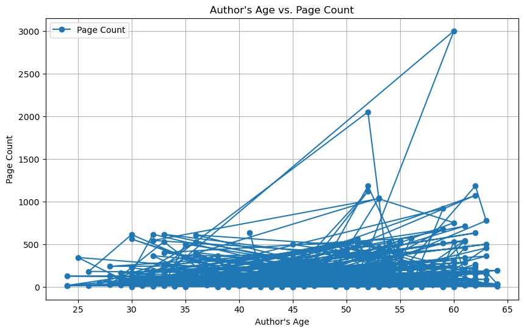

# Data 200: Data Systems for Data Analytics


# Name: Rahma Semma

# Take Home Final Exam
<font color='red'>**Due Date:** Dec 20, 5p (T-F 1:30p section) </font> <br>
<font color='red' style="margin-left: 1.85cm; display: inline-block;">Dec 21, 11:59a (T-F 3p section)</font>

---

### **Task**: Scrape data from Goodreads.com 📚

---

### **Objective**
For this exam, you will scrape and analyze data from Goodreads.com. The work is split into two parts, each focusing on different aspects of the data
1. **"Best Books" Analysis**: Explore Goodreads' "Best Books" lists for a specific year.
2. **Author-Level Analysis**: Study the trends and patterns in the works of a specific author.

---

### **Instructions**

#### **Task 1: Best Books**
You are tasked with analyzing Goodreads' "Best Books" lists for a specific year based on the **first letter of your first name**. For example, if your first name starts with **A–E**, you are assigned to the year **2023**; if it starts with **F–J**, you are assigned to **2022**, and so on:

| Initials | Assigned Year | URL                                              |
|----------|---------------|---------------------------------------------------------|
| A–E      | 2023          | [Best Books of 2023](https://www.goodreads.com/list/best_of_year/2023) |
| F–J      | 2022          | [Best Books of 2022](https://www.goodreads.com/list/best_of_year/2022) |
| K–O      | 2021          | [Best Books of 2021](https://www.goodreads.com/list/best_of_year/2021) |
| P–T      | 2020          | [Best Books of 2020](https://www.goodreads.com/list/best_of_year/2020) |
| U–Z      | 2019          | [Best Books of 2019](https://www.goodreads.com/list/best_of_year/2019) |


**Your Tasks**:
1. Scrape data from the Goodreads "Best Books of [Year]" list:
   - **URL**: https://www.goodreads.com/list/best_of_year/2023 (replace the year with your assigned year). You can also use the table above.
2. Collect the following data for each book:
   - Title
   - Publication date (first published)
   - Author
   - Genre (if available, and feel free to pick the first genre listed)
   - Average rating
   - Number of ratings
   - Number of pages
   - Rank
   - Language (if available)
   - Number of people who are currently reading (if available)
   - Number of people who want to read (if available)
3. Perform the following analyses:
   - **Genre ratings**:
       - Compare average ratings across genres. Which 2-3 genres tends to have the highest ratings? Create a table showing average rating score, and average rank by genre.
   - **Popularity and ratings**:
       - Examine whether books with more ratings tend to have higher or lower average scores. Create a scatterplot showing the relationship between the number of ratings and average rating. On the x-axis, you should have **number of ratings**; on the y-axis, you should have **average rating**.

---

#### **Task 2: Author-Level Analysis**
You are now tasked with analyzing books by a specific author based on the **first letter of your first name**:

| Your first name initial | Author              | Author Goodreads link                               | Birthday       |
|----------|---------------------|--------------------------------------------------------------------|----------------|
| A–E      | Stephen King        | [Stephen King](https://www.goodreads.com/author/list/3389)         | Sep 21, 1947   |
| F–J      | George R.R. Martin  | [George R.R. Martin](https://www.goodreads.com/author/list/346732) | Sep 20, 1948   |
| K–O      | Ernest Hemingway    | [Ernest Hemingway](https://www.goodreads.com/author/list/1455)     | Jul 21, 1899   |
| P–T      | Neil Gaiman         | [Neil Gaiman](https://www.goodreads.com/author/list/1221698)       | Nov 10, 1960   |
| U–Z      | Nora Roberts        | [Nora Roberts](https://www.goodreads.com/author/list/625)          | Oct 10, 1950   |


**Your Tasks**:
1. Scrape all books by your assigned author:
   - Use the link provided for your author.
2. Collect the following data for each book:
   - Title
   - Publication date (first published)
   - Author
   - Genre (if available, and feel free to pick the first genre listed)
   - Average rating
   - Number of ratings
   - Number of pages
   - Rank (from the books written by the author)
   - Language (if available)
   - Number of people who are currently reading (if available)
   - Number of people who want to read (if available)
3. Perform the following analyses:
   - **Language Distribution**:
     - How many books has the author published in English? In other languages? Create a table showing the count of books by language.
   - **Author's Age and Page Count**:
     - Do authors tend to write longer books as they age? Use the author's birthday to calculate their age at the time of each book's publication. Create a line plot with **author's age** on the x-axis and **page count** on the y-axis.
   - **Author's Age and Rating**:
     - For English-only books, create a line plot with **author's age** on the x-axis and **average rating** on the y-axis.
     - Repeat the analysis including books in languages other than English. Does your interpretation change?
   - **Pages vs. Ratings**:
     - Is there a relationship between the number of pages and a book's average rating? Create a scatterplot with **page count** on the x-axis and **average rating** on the y-axis.
   - **Interest on a book**:
     - Is there a relationship between the number of people who are currently reading the book and the number of people who left a rating? Create a scatterplot with **number of people who are currently reading** on the x-axis and **number of ratings** on the y-axis. Create a second scatterplot with **average rating** on the y-axis. Do books with more interest tend to receive higher ratings?

---

### **Submission Requirements**
Submit your work as a single `.ipynb` file, along with a copy of it as a `.md` file. The notebook should include:
1. **Code**:
   - Well-documented python code using Selenium for web scraping.
   - Proper error handling and strategies for dynamic content.
2. **Cleaned Data**:
   - Include the cleaned datasets from both tasks as .csv files. You can upload them in your github repo.
3. **Analysis and Report**:
   - Present your findings using markdown cells, tables, and visualizations you make in python.
   - Address all questions posed for your assigned tasks.
4. **Visualizations**:
   - Include relevant charts (e.g., bar charts, line plots, scatterplots) to support your conclusions.

---

### **Rubric**

| Item                        | Weight |
|-----------------------------|--------|
| Code accuracy               | 25%    |
| Code clarity and annotation | 25%    |
| Exploratory data analysis   | 25%    |
| Discussion of findings      | 25%    |

---

### **Tips**
- Make sure to insert time.sleep() right after you request driver to go to a link (before requesting elements). Make sure to wait at least 0.7 second, or even slightly higher if you run into issues.
- Try-except blocks will be your friend because xpath positions on a page may differ depending on the book and content availability.

---

### **Resources**
- Course notes on Github
- Selenium documentation: https://www.selenium.dev/documentation/
- Pandas documentation: https://pandas.pydata.org/docs/
- Matplotlib documentation: https://matplotlib.org/stable/contents.html

Good luck! 🏁


```python
import requests

url = "https://example.com"
headers = {"User-Agent": "Mozilla/5.0"} 

response = requests.get(url, headers=headers)
print(response.status_code) 
```

    200


```python
pip install selenium
```

    Collecting selenium
      Obtaining dependency information for selenium from https://files.pythonhosted.org/packages/a6/1e/5f1a5dd2a28528c4b3ec6e076b58e4c035810c805328f9936123283ca14e/selenium-4.27.1-py3-none-any.whl.metadata
      Downloading selenium-4.27.1-py3-none-any.whl.metadata (7.1 kB)
    Requirement already satisfied: urllib3[socks]<3,>=1.26 in /Users/rahmasemma/anaconda3/lib/python3.11/site-packages (from selenium) (1.26.16)
    Collecting trio~=0.17 (from selenium)
      Obtaining dependency information for trio~=0.17 from https://files.pythonhosted.org/packages/3c/83/ec3196c360afffbc5b342ead48d1eb7393dd74fa70bca75d33905a86f211/trio-0.27.0-py3-none-any.whl.metadata
      Downloading trio-0.27.0-py3-none-any.whl.metadata (8.6 kB)
    Collecting trio-websocket~=0.9 (from selenium)
      Obtaining dependency information for trio-websocket~=0.9 from https://files.pythonhosted.org/packages/48/be/a9ae5f50cad5b6f85bd2574c2c923730098530096e170c1ce7452394d7aa/trio_websocket-0.11.1-py3-none-any.whl.metadata
      Downloading trio_websocket-0.11.1-py3-none-any.whl.metadata (4.7 kB)
    Requirement already satisfied: certifi>=2021.10.8 in /Users/rahmasemma/anaconda3/lib/python3.11/site-packages (from selenium) (2023.7.22)
    Collecting typing_extensions~=4.9 (from selenium)
      Obtaining dependency information for typing_extensions~=4.9 from https://files.pythonhosted.org/packages/26/9f/ad63fc0248c5379346306f8668cda6e2e2e9c95e01216d2b8ffd9ff037d0/typing_extensions-4.12.2-py3-none-any.whl.metadata
      Downloading typing_extensions-4.12.2-py3-none-any.whl.metadata (3.0 kB)
    Collecting websocket-client~=1.8 (from selenium)
      Obtaining dependency information for websocket-client~=1.8 from https://files.pythonhosted.org/packages/5a/84/44687a29792a70e111c5c477230a72c4b957d88d16141199bf9acb7537a3/websocket_client-1.8.0-py3-none-any.whl.metadata
      Downloading websocket_client-1.8.0-py3-none-any.whl.metadata (8.0 kB)
    Collecting attrs>=23.2.0 (from trio~=0.17->selenium)
      Obtaining dependency information for attrs>=23.2.0 from https://files.pythonhosted.org/packages/89/aa/ab0f7891a01eeb2d2e338ae8fecbe57fcebea1a24dbb64d45801bfab481d/attrs-24.3.0-py3-none-any.whl.metadata
      Downloading attrs-24.3.0-py3-none-any.whl.metadata (11 kB)
    Requirement already satisfied: sortedcontainers in /Users/rahmasemma/anaconda3/lib/python3.11/site-packages (from trio~=0.17->selenium) (2.4.0)
    Requirement already satisfied: idna in /Users/rahmasemma/anaconda3/lib/python3.11/site-packages (from trio~=0.17->selenium) (3.4)
    Collecting outcome (from trio~=0.17->selenium)
      Obtaining dependency information for outcome from https://files.pythonhosted.org/packages/55/8b/5ab7257531a5d830fc8000c476e63c935488d74609b50f9384a643ec0a62/outcome-1.3.0.post0-py2.py3-none-any.whl.metadata
      Downloading outcome-1.3.0.post0-py2.py3-none-any.whl.metadata (2.6 kB)
    Collecting sniffio>=1.3.0 (from trio~=0.17->selenium)
      Obtaining dependency information for sniffio>=1.3.0 from https://files.pythonhosted.org/packages/e9/44/75a9c9421471a6c4805dbf2356f7c181a29c1879239abab1ea2cc8f38b40/sniffio-1.3.1-py3-none-any.whl.metadata
      Downloading sniffio-1.3.1-py3-none-any.whl.metadata (3.9 kB)
    Collecting wsproto>=0.14 (from trio-websocket~=0.9->selenium)
      Obtaining dependency information for wsproto>=0.14 from https://files.pythonhosted.org/packages/78/58/e860788190eba3bcce367f74d29c4675466ce8dddfba85f7827588416f01/wsproto-1.2.0-py3-none-any.whl.metadata
      Downloading wsproto-1.2.0-py3-none-any.whl.metadata (5.6 kB)
    Requirement already satisfied: PySocks!=1.5.7,<2.0,>=1.5.6 in /Users/rahmasemma/anaconda3/lib/python3.11/site-packages (from urllib3[socks]<3,>=1.26->selenium) (1.7.1)
    Collecting h11<1,>=0.9.0 (from wsproto>=0.14->trio-websocket~=0.9->selenium)
      Obtaining dependency information for h11<1,>=0.9.0 from https://files.pythonhosted.org/packages/95/04/ff642e65ad6b90db43e668d70ffb6736436c7ce41fcc549f4e9472234127/h11-0.14.0-py3-none-any.whl.metadata
      Downloading h11-0.14.0-py3-none-any.whl.metadata (8.2 kB)
    Downloading selenium-4.27.1-py3-none-any.whl (9.7 MB)
       ━━━━━━━━━━━━━━━━━━━━━━━━━━━━━━━━━━━━━━━━ 9.7/9.7 MB 21.4 MB/s eta 0:00:0000:0100:01
    [?25hDownloading trio-0.27.0-py3-none-any.whl (481 kB)
       ━━━━━━━━━━━━━━━━━━━━━━━━━━━━━━━━━━━━━━━━ 481.7/481.7 kB 15.5 MB/s eta 0:00:00
    [?25hDownloading trio_websocket-0.11.1-py3-none-any.whl (17 kB)
    Downloading typing_extensions-4.12.2-py3-none-any.whl (37 kB)
    Downloading websocket_client-1.8.0-py3-none-any.whl (58 kB)
       ━━━━━━━━━━━━━━━━━━━━━━━━━━━━━━━━━━━━━━━━ 58.8/58.8 kB 8.3 MB/s eta 0:00:00
    [?25hDownloading attrs-24.3.0-py3-none-any.whl (63 kB)
       ━━━━━━━━━━━━━━━━━━━━━━━━━━━━━━━━━━━━━━━━ 63.4/63.4 kB 6.7 MB/s eta 0:00:00
    [?25hDownloading sniffio-1.3.1-py3-none-any.whl (10 kB)
    Downloading wsproto-1.2.0-py3-none-any.whl (24 kB)
    Downloading outcome-1.3.0.post0-py2.py3-none-any.whl (10 kB)
    Downloading h11-0.14.0-py3-none-any.whl (58 kB)
       ━━━━━━━━━━━━━━━━━━━━━━━━━━━━━━━━━━━━━━━━ 58.3/58.3 kB 5.8 MB/s eta 0:00:00
    [?25hInstalling collected packages: websocket-client, typing_extensions, sniffio, h11, attrs, wsproto, outcome, trio, trio-websocket, selenium
      Attempting uninstall: websocket-client
        Found existing installation: websocket-client 0.58.0
        Uninstalling websocket-client-0.58.0:
          Successfully uninstalled websocket-client-0.58.0
      Attempting uninstall: typing_extensions
        Found existing installation: typing_extensions 4.7.1
        Uninstalling typing_extensions-4.7.1:
          Successfully uninstalled typing_extensions-4.7.1
      Attempting uninstall: sniffio
        Found existing installation: sniffio 1.2.0
        Uninstalling sniffio-1.2.0:
          Successfully uninstalled sniffio-1.2.0
      Attempting uninstall: attrs
        Found existing installation: attrs 22.1.0
        Uninstalling attrs-22.1.0:
          Successfully uninstalled attrs-22.1.0
    Successfully installed attrs-24.3.0 h11-0.14.0 outcome-1.3.0.post0 selenium-4.27.1 sniffio-1.3.1 trio-0.27.0 trio-websocket-0.11.1 typing_extensions-4.12.2 websocket-client-1.8.0 wsproto-1.2.0
    Note: you may need to restart the kernel to use updated packages.


# ## Web Scraping Goodreads Data

This script automates the process of extracting detailed book data from Goodreads using Selenium. The data includes fields such as title, author, average rating, publication date, genres, language, and reader statistics. 

Key measures taken in the script include:
- **Dynamic Content Handling**: The script uses `WebDriverWait` to ensure all elements are fully loaded before extraction.
- **Error Handling**: `try-except` blocks handle missing elements, timeouts, and other potential issues gracefully, assigning default values like `"Not Found"` for unavailable fields.
- **Data Structuring**: Extracted data is stored in a dictionary format and appended to a list for easy conversion to a CSV file.
- **Scalability**: The script processes multiple book URLs from an input CSV file and saves the enriched data to an output CSV file.

The final dataset includes fields such as:
- Title
- Author
- Average Rating
- Publication Date
- First Genre
- Language
- Number of Ratings
- Pages
- Reader Statistics (e.g., "Currently Reading" and "Want to Read").

The use of Selenium allows for robust automation and scraping of dynamic webpages, making the script suitable for extracting detailed data from Goodreads.


```python
import time
import pandas as pd
from selenium import webdriver
from selenium.webdriver.common.by import By
from selenium.webdriver.support.ui import WebDriverWait
from selenium.webdriver.support import expected_conditions as EC
from selenium.common.exceptions import TimeoutException, NoSuchElementException

# Initialize Selenium WebDriver
driver = webdriver.Chrome()

# Input and Output File Names
input_file = "book_urls.csv"  # Your CSV with book URLs
output_file = "goodreads_enriched_data.csv"

# Read the CSV File with URLs
books_df = pd.read_csv(input_file)

# Prepare a List to Store the Results
extracted_data = []

# Initialize the ranking counter
ranking = 1

# Start extracting data
print("Extracting enhanced data for all book URLs...")

for index, row in books_df.iterrows():
    url = row['URL']
    print(f"Extracting data for Ranking {ranking}: {url}")

    try:
        # Open the book's page
        driver.get(url)
        print(f"Successfully loaded: {url}")

        # Extract Title
        try:
            title = WebDriverWait(driver, 15).until(
                EC.presence_of_element_located((By.CSS_SELECTOR, "h1[data-testid='bookTitle']"))
            ).text
        except TimeoutException:
            title = "Not Found"

        # Extract Author
        try:
            author = WebDriverWait(driver, 15).until(
                EC.presence_of_element_located((By.CSS_SELECTOR, "span.ContributorLink__name"))
            ).text
        except TimeoutException:
            author = "Not Found"

        # Extract Average Rating
        try:
            avg_rating = WebDriverWait(driver, 15).until(
                EC.presence_of_element_located((By.CSS_SELECTOR, "div.RatingStatistics__rating"))
            ).text
        except TimeoutException:
            avg_rating = "Not Found"

        # Extract Publication Date
        try:
            pub_date = WebDriverWait(driver, 15).until(
                EC.presence_of_element_located((By.CSS_SELECTOR, "p[data-testid='publicationInfo']"))
            ).text
        except TimeoutException:
            pub_date = "Not Found"

        # Extract Genre
        try:
            genres_element = WebDriverWait(driver, 15).until(
                EC.presence_of_element_located((By.XPATH, '//*[@id="__next"]/div[2]/main/div[1]/div[2]/div[2]/div[2]/div[6]/ul'))
            )
            raw_genres = genres_element.text.split("\n")  # Split by newline
            cleaned_genres = [genre for genre in raw_genres if genre not in ["Genres", "...more"]]  # Filter unwanted text
            genre = cleaned_genres[0] if cleaned_genres else "Not Found"  # Extract the first genre
        except TimeoutException:
            genre = "Not Found"

        # Extract Language
        try:
            details_button = WebDriverWait(driver, 10).until(
                EC.element_to_be_clickable((By.XPATH, '//button[@aria-label="Book details and editions"]'))
            )
            driver.execute_script("arguments[0].click();", details_button)
            time.sleep(2)
            language = WebDriverWait(driver, 10).until(
                EC.presence_of_element_located((By.XPATH, '//dt[text()="Language"]/following-sibling::dd'))
            ).text
        except Exception:
            language = "Not Found"

        # Extract Number of People Currently Reading
        try:
            people_currentlyReading = driver.find_element(
                By.XPATH, '//*[@id="__next"]/div[2]/main/div[1]/div[2]/div[2]/div[2]/div[8]/div/div[1]/span/div[2]/div'
            ).text
        except NoSuchElementException:
            try:
                people_currentlyReading = driver.find_element(
                    By.XPATH, '//*[@id="__next"]/div[2]/main/div[1]/div[2]/div[2]/div[2]/div[7]/div/div[1]/span/div[2]/div'
                ).text
            except NoSuchElementException:
                people_currentlyReading = "Not Found"

        if people_currentlyReading != "Not Found":
            people_currentlyReading = people_currentlyReading.split(" ")[0]

        # Extract Number of People Who Want to Read
        try:
            people_WantRead = driver.find_element(
                By.XPATH, '//*[@id="__next"]/div[2]/main/div[1]/div[2]/div[2]/div[2]/div[8]/div/div[2]/span/div[2]/div'
            ).text
        except NoSuchElementException:
            try:
                people_WantRead = driver.find_element(
                    By.XPATH, '//*[@id="__next"]/div[2]/main/div[1]/div[2]/div[2]/div[2]/div[7]/div/div[2]/span/div[2]/div'
                ).text
            except NoSuchElementException:
                people_WantRead = "Not Found"

        if people_WantRead != "Not Found":
            people_WantRead = people_WantRead.split(" ")[0]

        # Extract Number of Ratings
        try:
            num_ratings = WebDriverWait(driver, 15).until(
                EC.presence_of_element_located((By.CSS_SELECTOR, "div.RatingStatistics__meta > span"))
            ).text
        except TimeoutException:
            num_ratings = "Not Found"

        # Extract Number of Pages
        try:
            pages = WebDriverWait(driver, 15).until(
                EC.presence_of_element_located((By.CSS_SELECTOR, "p[data-testid='pagesFormat']"))
            ).text
        except TimeoutException:
            pages = "Not Found"

        # Store the Extracted Data
        extracted_data.append({
            "Ranking": ranking,
            "URL": url,
            "Title": title,
            "Author": author,
            "Average Rating": avg_rating,
            "Publication Date": pub_date,
            "First Genre": genre,
            "Language": language,
            "Currently Reading": people_currentlyReading,
            "Want to Read": people_WantRead,
            "Number of Ratings": num_ratings,
            "Pages": pages
        })
        
        print(f"Extracted: Ranking {ranking}, {title}, {author}, {avg_rating}, {pub_date}, {genre}, {language}, {people_currentlyReading}, {people_WantRead}, {num_ratings}, {pages}")

        # Increment the ranking counter
        ranking += 1

    except Exception as e:
        print(f"An error occurred for {url}: {e}")

# Save the extracted data to a CSV file
output_df = pd.DataFrame(extracted_data)
output_df.to_csv(output_file, index=False)
print(f"Data saved to {output_file}")

# Close the browser
driver.quit()
print("WebDriver closed.")

```

    Extracting enhanced data for all book URLs...
    Extracting data for Ranking 1: https://www.goodreads.com/book/show/45047384-the-house-in-the-cerulean-sea?from_search=true&from_srp=true&qid=fb2xFor0tp&rank=1
    Successfully loaded: https://www.goodreads.com/book/show/45047384-the-house-in-the-cerulean-sea?from_search=true&from_srp=true&qid=fb2xFor0tp&rank=1
    Extracted: Ranking 1, The House in the Cerulean Sea, T.J. Klune, 4.39, First published March 16, 2020, Fantasy, English, 40.2k, 871k, 748,641 ratings, 394 pages, Kindle Edition
    Extracting data for Ranking 2: https://www.goodreads.com/book/show/44778083-house-of-earth-and-blood?from_search=true&from_srp=true&qid=cHfVNHbYW1&rank=1
    Successfully loaded: https://www.goodreads.com/book/show/44778083-house-of-earth-and-blood?from_search=true&from_srp=true&qid=cHfVNHbYW1&rank=1
    Extracted: Ranking 2, House of Earth and Blood, Sarah J. Maas, 4.47, First published March 3, 2020, Romance, Not Found, 71.6k, 961k, 860,116 ratings, 803 pages, Hardcover
    Extracting data for Ranking 3: https://www.goodreads.com/book/show/50623864-the-invisible-life-of-addie-larue?from_search=true&from_srp=true&qid=uVAPeKRkGR&rank=1
    Successfully loaded: https://www.goodreads.com/book/show/50623864-the-invisible-life-of-addie-larue?from_search=true&from_srp=true&qid=uVAPeKRkGR&rank=1
    Extracted: Ranking 3, The Invisible Life of Addie LaRue, Victoria E. Schwab, 4.18, First published October 6, 2020, Fantasy, English, 112k, 2m, 1,229,537 ratings, 448 pages, Hardcover
    Extracting data for Ranking 4: https://www.goodreads.com/book/show/45046527-american-dirt?from_search=true&from_srp=true&qid=0uvIVVoCHC&rank=1
    Successfully loaded: https://www.goodreads.com/book/show/45046527-american-dirt?from_search=true&from_srp=true&qid=0uvIVVoCHC&rank=1
    Extracted: Ranking 4, American Dirt, Jeanine Cummins, 4.37, First published January 21, 2020, Fiction, English, 66.7k, 417k, 617,309 ratings, 459 pages, Hardcover
    Extracting data for Ranking 5: https://www.goodreads.com/book/show/52578297-the-midnight-library?from_search=true&from_srp=true&qid=7EWdc5mEvJ&rank=1
    Successfully loaded: https://www.goodreads.com/book/show/52578297-the-midnight-library?from_search=true&from_srp=true&qid=7EWdc5mEvJ&rank=1
    Extracted: Ranking 5, The Midnight Library, Matt Haig, 3.99, First published August 13, 2020, Fiction, English, 106k, 2m, 2,030,225 ratings, 288 pages, Hardcover
    Extracting data for Ranking 6: https://www.goodreads.com/book/show/51791252-the-vanishing-half?from_search=true&from_srp=true&qid=aoJpQmHVWL&rank=1
    Successfully loaded: https://www.goodreads.com/book/show/51791252-the-vanishing-half?from_search=true&from_srp=true&qid=aoJpQmHVWL&rank=1
    Extracted: Ranking 6, The Vanishing Half, Brit Bennett, 4.14, First published June 2, 2020, Fiction, English, 47.8k, 782k, 794,515 ratings, 343 pages, Hardcover
    Extracting data for Ranking 7: https://www.goodreads.com/book/show/52867387-beach-read?from_search=true&from_srp=true&qid=2y9YB82AEU&rank=1
    Successfully loaded: https://www.goodreads.com/book/show/52867387-beach-read?from_search=true&from_srp=true&qid=2y9YB82AEU&rank=1
    Extracted: Ranking 7, Beach Read, Emily Henry, 3.99, First published May 19, 2020, Romance, English, 49.9k, 1m, 1,344,550 ratings, 400 pages, Paperback
    Extracting data for Ranking 8: https://www.goodreads.com/book/show/44890081-my-dark-vanessa?from_search=true&from_srp=true&qid=SFiqh4cCfe&rank=1
    Successfully loaded: https://www.goodreads.com/book/show/44890081-my-dark-vanessa?from_search=true&from_srp=true&qid=SFiqh4cCfe&rank=1
    Extracted: Ranking 8, My Dark Vanessa, Kate Elizabeth Russell, 4.10, First published March 10, 2020, Fiction, English, 17.8k, 467k, 368,275 ratings, 373 pages, Hardcover
    Extracting data for Ranking 9: https://www.goodreads.com/book/show/51901147-the-ballad-of-songbirds-and-snakes?from_search=true&from_srp=true&qid=B87aKSYcBt&rank=1
    Successfully loaded: https://www.goodreads.com/book/show/51901147-the-ballad-of-songbirds-and-snakes?from_search=true&from_srp=true&qid=B87aKSYcBt&rank=1
    Extracted: Ranking 9, The Ballad of Songbirds and Snakes, Suzanne Collins, 3.97, First published May 19, 2020, Dystopia, English, 75.2k, 581k, 878,628 ratings, 541 pages, Kindle Edition
    Extracting data for Ranking 10: https://www.goodreads.com/book/show/53152636-mexican-gothic?from_search=true&from_srp=true&qid=f0t7VNw5Ly&rank=1
    Successfully loaded: https://www.goodreads.com/book/show/53152636-mexican-gothic?from_search=true&from_srp=true&qid=f0t7VNw5Ly&rank=1
    Extracted: Ranking 10, Mexican Gothic, Silvia Moreno-Garcia, 3.68, First published June 30, 2020, Horror, English, 20.4k, 534k, 439,514 ratings, 320 pages, Hardcover
    Extracting data for Ranking 11: https://www.goodreads.com/book/show/17699853-chain-of-gold?from_search=true&from_srp=true&qid=dgEF4iy91v&rank=1
    Successfully loaded: https://www.goodreads.com/book/show/17699853-chain-of-gold?from_search=true&from_srp=true&qid=dgEF4iy91v&rank=1
    Extracted: Ranking 11, Chain of Gold, Cassandra Clare, 4.38, First published March 3, 2020, Fantasy, English, 7,181, 225k, 111,976 ratings, 582 pages, Hardcover
    Extracting data for Ranking 12: https://www.goodreads.com/book/show/45294613-dear-edward?from_search=true&from_srp=true&qid=bG0Z3zugVb&rank=1
    Successfully loaded: https://www.goodreads.com/book/show/45294613-dear-edward?from_search=true&from_srp=true&qid=bG0Z3zugVb&rank=1
    Extracted: Ranking 12, Dear Edward, Ann Napolitano, 4.08, First published January 6, 2020, Fiction, English, 14.9k, 208k, 196,810 ratings, 340 pages, Hardcover
    Extracting data for Ranking 13: https://www.goodreads.com/book/show/52656911-the-guest-list?from_search=true&from_srp=true&qid=CpUtu5TRR3&rank=1
    Successfully loaded: https://www.goodreads.com/book/show/52656911-the-guest-list?from_search=true&from_srp=true&qid=CpUtu5TRR3&rank=1
    Extracted: Ranking 13, The Guest List, Lucy Foley, 3.81, First published February 20, 2020, Mystery, English, 56.5k, 888k, 1,118,016 ratings, 319 pages, Kindle Edition
    Extracting data for Ranking 14: https://www.goodreads.com/book/show/50202953-piranesi?from_search=true&from_srp=true&qid=q3L5FpdhSB&rank=1
    Successfully loaded: https://www.goodreads.com/book/show/50202953-piranesi?from_search=true&from_srp=true&qid=q3L5FpdhSB&rank=1
    Extracted: Ranking 14, Piranesi, Susanna Clarke, 4.22, First published September 15, 2020, Fantasy, English, 16.8k, 479k, 338,423 ratings, 272 pages, Hardcover
    Extracting data for Ranking 15: https://www.goodreads.com/book/show/50663965-reign?from_search=true&from_srp=true&qid=dqO1clYzvF&rank=1
    Successfully loaded: https://www.goodreads.com/book/show/50663965-reign?from_search=true&from_srp=true&qid=dqO1clYzvF&rank=1
    Extracted: Ranking 15, Reign, Siobhan Davis ™, 4.27, First published July 30, 2020, Not Found, English, 2,922, 5,691, 12,513 ratings, 479 pages, Kindle Edition
    Extracting data for Ranking 16: https://www.goodreads.com/book/show/44074800-the-southern-book-club-s-guide-to-slaying-vampires?from_search=true&from_srp=true&qid=ry3tQpOder&rank=1
    Successfully loaded: https://www.goodreads.com/book/show/44074800-the-southern-book-club-s-guide-to-slaying-vampires?from_search=true&from_srp=true&qid=ry3tQpOder&rank=1
    Extracted: Ranking 16, The Southern Book Club's Guide to Slaying Vampires, Grady Hendrix, 3.80, First published April 7, 2020, Horror, English, 12.2k, 309k, 253,839 ratings, 410 pages, Kindle Edition
    Extracting data for Ranking 17: https://www.goodreads.com/book/show/45885644-the-sun-down-motel?from_search=true&from_srp=true&qid=lEWZBBtQ5O&rank=1
    Successfully loaded: https://www.goodreads.com/book/show/45885644-the-sun-down-motel?from_search=true&from_srp=true&qid=lEWZBBtQ5O&rank=1
    Extracted: Ranking 17, The Sun Down Motel, Simone St. James, 4.01, First published February 18, 2020, Mystery, English, 5,503, 182k, 167,140 ratings, 327 pages, Hardcover
    Extracting data for Ranking 18: https://www.goodreads.com/book/show/52129515-untamed?from_search=true&from_srp=true&qid=O3YgCfGfGZ&rank=1
    Successfully loaded: https://www.goodreads.com/book/show/52129515-untamed?from_search=true&from_srp=true&qid=O3YgCfGfGZ&rank=1
    Extracted: Ranking 18, Untamed, Glennon Doyle, 3.99, First published March 10, 2020, Nonfiction, English, 47.9k, 406k, 471,695 ratings, 333 pages, Hardcover
    Extracting data for Ranking 19: https://www.goodreads.com/book/show/50925874-rebellion?from_search=true&from_srp=true&qid=VBRnIOol56&rank=1
    Successfully loaded: https://www.goodreads.com/book/show/50925874-rebellion?from_search=true&from_srp=true&qid=VBRnIOol56&rank=1
    Extracted: Ranking 19, Rebellion, Siobhan Davis ™, 4.29, First published April 10, 2020, Not Found, English, 3,275, 5,800, 15,130 ratings, 333 pages, Kindle Edition
    Extracting data for Ranking 20: https://www.goodreads.com/book/show/48731251-bell-hammers?from_search=true&from_srp=true&qid=po4qwQdt7f&rank=1
    Successfully loaded: https://www.goodreads.com/book/show/48731251-bell-hammers?from_search=true&from_srp=true&qid=po4qwQdt7f&rank=1
    Extracted: Ranking 20, Bell Hammers, Lancelot Schaubert, 4.16, First published October 12, 2020, Not Found, English, 55, 16.4k, 693 ratings, 334 pages, Hardcover
    Extracting data for Ranking 21: https://www.goodreads.com/book/show/50214741-the-girl-with-the-louding-voice?from_search=true&from_srp=true&qid=8A2ml1CisQ&rank=1
    Successfully loaded: https://www.goodreads.com/book/show/50214741-the-girl-with-the-louding-voice?from_search=true&from_srp=true&qid=8A2ml1CisQ&rank=1
    Extracted: Ranking 21, The Girl with the Louding Voice, Abi Daré, 4.43, First published February 4, 2020, Fiction, English, 9,114, 206k, 159,216 ratings, 371 pages, Hardcover
    Extracting data for Ranking 22: https://www.goodreads.com/book/show/51075749-resurrection?from_search=true&from_srp=true&qid=m8UP6QjAvN&rank=1
    Successfully loaded: https://www.goodreads.com/book/show/51075749-resurrection?from_search=true&from_srp=true&qid=m8UP6QjAvN&rank=1
    Extracted: Ranking 22, Resurrection, Siobhan Davis ™, 4.20, First published January 31, 2020, Not Found, English, 6,201, 19.3k, 18,666 ratings, 371 pages, Kindle Edition
    Extracting data for Ranking 23: https://www.goodreads.com/book/show/35702241-the-shadows-between-us?from_search=true&from_srp=true&qid=skB4j3ndz4&rank=1
    Successfully loaded: https://www.goodreads.com/book/show/35702241-the-shadows-between-us?from_search=true&from_srp=true&qid=skB4j3ndz4&rank=1
    Extracted: Ranking 23, The Shadows Between Us, Tricia Levenseller, 3.83, First published February 25, 2020, Fantasy, English, 6,828, 365k, 193,468 ratings, 326 pages, Hardcover
    Extracting data for Ranking 24: https://www.goodreads.com/book/show/43834909-long-bright-river?from_search=true&from_srp=true&qid=I6mjpl9vub&rank=1
    Successfully loaded: https://www.goodreads.com/book/show/43834909-long-bright-river?from_search=true&from_srp=true&qid=I6mjpl9vub&rank=1
    Extracted: Ranking 24, Long Bright River, Liz Moore, 4.04, First published January 7, 2020, Mystery, English, 9,787, 160k, 123,423 ratings, 482 pages, Hardcover
    Extracting data for Ranking 25: https://www.goodreads.com/book/show/50093704-in-five-years?from_search=true&from_srp=true&qid=JmV4ejQdhh&rank=1
    Successfully loaded: https://www.goodreads.com/book/show/50093704-in-five-years?from_search=true&from_srp=true&qid=JmV4ejQdhh&rank=1
    Extracted: Ranking 25, In Five Years, Rebecca Serle, 3.78, First published March 10, 2020, Romance, English, 25k, 576k, 545,138 ratings, 272 pages, Hardcover
    Extracting data for Ranking 26: https://www.goodreads.com/book/show/51152447-caste?from_search=true&from_srp=true&qid=2Vc6gU4jon&rank=1
    Successfully loaded: https://www.goodreads.com/book/show/51152447-caste?from_search=true&from_srp=true&qid=2Vc6gU4jon&rank=1
    Extracted: Ranking 26, Caste: The Origins of Our Discontents, Isabel Wilkerson, 4.53, First published August 4, 2020, Nonfiction, English, 39.4k, 334k, 147,955 ratings, 544 pages, Hardcover
    Extracting data for Ranking 27: https://www.goodreads.com/book/show/52381770-network-effect?from_search=true&from_srp=true&qid=vxdxNvoGcD&rank=1
    Successfully loaded: https://www.goodreads.com/book/show/52381770-network-effect?from_search=true&from_srp=true&qid=vxdxNvoGcD&rank=1
    Extracted: Ranking 27, Network Effect, Martha Wells, 4.47, First published May 5, 2020, Science Fiction, English, 6,332, 42.8k, 98,004 ratings, 352 pages, Hardcover
    Extracting data for Ranking 28: https://www.goodreads.com/book/show/53675011-boot?from_search=true&from_srp=true&qid=yPV9uYWNGv&rank=1
    Successfully loaded: https://www.goodreads.com/book/show/53675011-boot?from_search=true&from_srp=true&qid=yPV9uYWNGv&rank=1
    Extracted: Ranking 28, Boot: A Sorta Novel of Vietnam, Charles L. Templeton, 4.56, First published March 3, 2020, Not Found, English, 37, 1,831, 196 ratings, 393 pages, Kindle Edition
    Extracting data for Ranking 29: https://www.goodreads.com/book/show/45045129-tweet-cute?from_search=true&from_srp=true&qid=rxZMmM8k5s&rank=1
    Successfully loaded: https://www.goodreads.com/book/show/45045129-tweet-cute?from_search=true&from_srp=true&qid=rxZMmM8k5s&rank=1
    Extracted: Ranking 29, Tweet Cute, Emma Lord, 3.89, First published January 21, 2020, Romance, English, 2,243, 113k, 77,078 ratings, 368 pages, Hardcover
    Extracting data for Ranking 30: https://www.goodreads.com/book/show/43890641-hamnet?from_search=true&from_srp=true&qid=qkL3d6xr0r&rank=1
    Successfully loaded: https://www.goodreads.com/book/show/43890641-hamnet?from_search=true&from_srp=true&qid=qkL3d6xr0r&rank=1
    Extracted: Ranking 30, Hamnet, Maggie O'Farrell, 4.20, First published March 31, 2020, Historical Fiction, English, 24.1k, 320k, 284,909 ratings, 372 pages, Hardcover
    Extracting data for Ranking 31: https://www.goodreads.com/book/show/45754981-the-glass-hotel?from_search=true&from_srp=true&qid=fwL2dGHyta&rank=1
    Successfully loaded: https://www.goodreads.com/book/show/45754981-the-glass-hotel?from_search=true&from_srp=true&qid=fwL2dGHyta&rank=1
    Extracted: Ranking 31, The Glass Hotel, Emily St. John Mandel, 3.69, First published March 24, 2020, Fiction, English, 14.2k, 242k, 182,420 ratings, 307 pages, Hardcover
    Extracting data for Ranking 32: https://www.goodreads.com/book/show/45046893-oona-out-of-order?from_search=true&from_srp=true&qid=1AO8DlrrBc&rank=1
    Successfully loaded: https://www.goodreads.com/book/show/45046893-oona-out-of-order?from_search=true&from_srp=true&qid=1AO8DlrrBc&rank=1
    Extracted: Ranking 32, Oona Out of Order, Margarita Montimore, 3.86, First published February 25, 2020, Fiction, English, 5,333, 98.5k, 88,419 ratings, 339 pages, Hardcover
    Extracting data for Ranking 33: https://www.goodreads.com/book/show/53287484-midnight-sun?from_search=true&from_srp=true&qid=yNWPlZGdYs&rank=1
    Successfully loaded: https://www.goodreads.com/book/show/53287484-midnight-sun?from_search=true&from_srp=true&qid=yNWPlZGdYs&rank=1
    Extracted: Ranking 33, Midnight Sun, Stephenie Meyer, 3.73, First published August 4, 2020, Fantasy, English, 1,074, 12.3k, 275,671 ratings, 756 pages, Hardcover
    Extracting data for Ranking 34: https://www.goodreads.com/book/show/50833559-home-before-dark?from_search=true&from_srp=true&qid=F1rHRzn3lD&rank=1
    Successfully loaded: https://www.goodreads.com/book/show/50833559-home-before-dark?from_search=true&from_srp=true&qid=F1rHRzn3lD&rank=1
    Extracted: Ranking 34, Home Before Dark, Riley Sager, 4.06, First published June 30, 2020, Horror, English, 8,308, 304k, 239,670 ratings, 389 pages, Hardcover
    Extracting data for Ranking 35: https://www.goodreads.com/book/show/51187948-the-splendid-and-the-vile?from_search=true&from_srp=true&qid=GuYx6tVk07&rank=1
    Successfully loaded: https://www.goodreads.com/book/show/51187948-the-splendid-and-the-vile?from_search=true&from_srp=true&qid=GuYx6tVk07&rank=1
    Extracted: Ranking 35, The Splendid and the Vile: A Saga of Churchill, Family, and Defiance During the Blitz, Erik Larson, 4.30, First published February 25, 2020, History, English, 34k, 180k, 124,707 ratings, 546 pages, ebook
    Extracting data for Ranking 36: https://www.goodreads.com/book/show/50548197-a-deadly-education?from_search=true&from_srp=true&qid=slqx0S4Fim&rank=1
    Successfully loaded: https://www.goodreads.com/book/show/50548197-a-deadly-education?from_search=true&from_srp=true&qid=slqx0S4Fim&rank=1
    Extracted: Ranking 36, A Deadly Education, Naomi Novik, 3.95, First published September 29, 2020, Fantasy, English, 11.5k, 379k, 191,084 ratings, 320 pages, Hardcover
    Extracting data for Ranking 37: https://www.goodreads.com/book/show/55032825-a-fairy-awesome-story?from_search=true&from_srp=true&qid=6Sd1LFjmfX&rank=1
    Successfully loaded: https://www.goodreads.com/book/show/55032825-a-fairy-awesome-story?from_search=true&from_srp=true&qid=6Sd1LFjmfX&rank=1
    Extracted: Ranking 37, A Fairy Awesome Story, Ellie Aiden, 3.91, First published November 30, 2020, Not Found, English, 90, 3,045, 635 ratings, 138 pages, Kindle Edition
    Extracting data for Ranking 38: https://www.goodreads.com/book/show/42074525-the-city-we-became?from_search=true&from_srp=true&qid=vmwxLukovs&rank=1
    Successfully loaded: https://www.goodreads.com/book/show/42074525-the-city-we-became?from_search=true&from_srp=true&qid=vmwxLukovs&rank=1
    Extracted: Ranking 38, The City We Became, N.K. Jemisin, 3.86, First published March 24, 2020, Fantasy, English, 9,513, 178k, 74,006 ratings, 437 pages, Hardcover
    Extracting data for Ranking 39: https://www.goodreads.com/book/show/50225678-boyfriend-material?from_search=true&from_srp=true&qid=pO0QlnkieK&rank=1
    Successfully loaded: https://www.goodreads.com/book/show/50225678-boyfriend-material?from_search=true&from_srp=true&qid=pO0QlnkieK&rank=1
    Extracted: Ranking 39, Boyfriend Material, Alexis Hall, 4.00, First published July 7, 2020, LGBT, English, 7,807, 206k, 140,954 ratings, 425 pages, Paperback
    Extracting data for Ranking 40: https://www.goodreads.com/book/show/44571368-smoke-bitten?from_search=true&from_srp=true&qid=vMlxzYDcJ9&rank=1
    Successfully loaded: https://www.goodreads.com/book/show/44571368-smoke-bitten?from_search=true&from_srp=true&qid=vMlxzYDcJ9&rank=1
    Extracted: Ranking 40, Smoke Bitten, Patricia Briggs, 4.43, First published March 17, 2020, Urban Fantasy, English, 2,617, 15.5k, 33,718 ratings, 352 pages, Hardcover
    Extracting data for Ranking 41: https://www.goodreads.com/book/show/52698452-the-book-of-longings?from_search=true&from_srp=true&qid=7GF9i8U2PL&rank=1
    Successfully loaded: https://www.goodreads.com/book/show/52698452-the-book-of-longings?from_search=true&from_srp=true&qid=7GF9i8U2PL&rank=1
    Extracted: Ranking 41, The Book of Longings, Sue Monk Kidd, 4.23, First published April 21, 2020, Historical Fiction, English, 14.9k, 181k, 131,065 ratings, 416 pages, Hardcover
    Extracting data for Ranking 42: https://www.goodreads.com/book/show/48570454-transcendent-kingdom?from_search=true&from_srp=true&qid=UEX2Fekig2&rank=1
    Successfully loaded: https://www.goodreads.com/book/show/48570454-transcendent-kingdom?from_search=true&from_srp=true&qid=UEX2Fekig2&rank=1
    Extracted: Ranking 42, Transcendent Kingdom, Yaa Gyasi, 4.11, First published August 31, 2020, Fiction, English, 7,189, 232k, 153,819 ratings, 264 pages, Hardcover
    Extracting data for Ranking 43: https://www.goodreads.com/book/show/52339313-cemetery-boys?from_search=true&from_srp=true&qid=ZPZqpuam2K&rank=1
    Successfully loaded: https://www.goodreads.com/book/show/52339313-cemetery-boys?from_search=true&from_srp=true&qid=ZPZqpuam2K&rank=1
    Extracted: Ranking 43, Cemetery Boys, Aiden Thomas, 4.26, First published September 1, 2020, Fantasy, English, 4,805, 235k, 99,665 ratings, 344 pages, Hardcover
    Extracting data for Ranking 44: https://www.goodreads.com/book/show/49353950-sweep-with-me?from_search=true&from_srp=true&qid=Iqz0rgZ9qN&rank=1
    Successfully loaded: https://www.goodreads.com/book/show/49353950-sweep-with-me?from_search=true&from_srp=true&qid=Iqz0rgZ9qN&rank=1
    Extracted: Ranking 44, Sweep with Me, Ilona Andrews, 4.39, First published January 10, 2020, Not Found, English, 2,528, 3,801, 19,309 ratings, 146 pages, Kindle Edition
    Extracting data for Ranking 45: https://www.goodreads.com/book/show/50088631-hidden-valley-road?from_search=true&from_srp=true&qid=d7ny1NsitV&rank=1
    Successfully loaded: https://www.goodreads.com/book/show/50088631-hidden-valley-road?from_search=true&from_srp=true&qid=d7ny1NsitV&rank=1
    Extracted: Ranking 45, Hidden Valley Road: Inside the Mind of an American Family, Robert Kolker, 4.16, First published April 7, 2020, Nonfiction, English, 16.9k, 176k, 132,713 ratings, 377 pages, Hardcover
    Extracting data for Ranking 46: https://www.goodreads.com/book/show/55361205-a-promised-land?from_search=true&from_srp=true&qid=dgFXG0Jd33&rank=1
    Successfully loaded: https://www.goodreads.com/book/show/55361205-a-promised-land?from_search=true&from_srp=true&qid=dgFXG0Jd33&rank=1
    Extracted: Ranking 46, A Promised Land, Barack Obama, 4.33, First published November 17, 2020, Nonfiction, English, 68.1k, 428k, 246,125 ratings, 768 pages, ebook
    Extracting data for Ranking 47: https://www.goodreads.com/book/show/44654627-one-of-us-is-next?from_search=true&from_srp=true&qid=RqEknhnnlE&rank=1
    Successfully loaded: https://www.goodreads.com/book/show/44654627-one-of-us-is-next?from_search=true&from_srp=true&qid=RqEknhnnlE&rank=1
    Extracted: Ranking 47, One of Us Is Next, Karen M. McManus, 3.91, First published January 7, 2020, Mystery, English, 10.5k, 250k, 252,741 ratings, 377 pages, Hardcover
    Extracting data for Ranking 48: https://www.goodreads.com/book/show/43557477-the-jane-austen-society?from_search=true&from_srp=true&qid=BwBmfZVBy4&rank=1
    Successfully loaded: https://www.goodreads.com/book/show/43557477-the-jane-austen-society?from_search=true&from_srp=true&qid=BwBmfZVBy4&rank=1
    Extracted: Ranking 48, The Jane Austen Society, Natalie Jenner, 3.73, First published May 26, 2020, Historical Fiction, English, 3,819, 120k, 49,142 ratings, 304 pages, Hardcover
    Extracting data for Ranking 49: https://www.goodreads.com/book/show/52166786-the-empire-of-gold?from_search=true&from_srp=true&qid=Gd1oqPnLex&rank=1
    Successfully loaded: https://www.goodreads.com/book/show/52166786-the-empire-of-gold?from_search=true&from_srp=true&qid=Gd1oqPnLex&rank=1
    Extracted: Ranking 49, The Empire of Gold, S.A. Chakraborty, 4.50, First published June 11, 2020, Fantasy, English, 3,781, 86.2k, 63,432 ratings, 766 pages, Hardcover
    Extracting data for Ranking 50: https://www.goodreads.com/book/show/44804083-come-tumbling-down?from_search=true&from_srp=true&qid=Li6MdYGKm7&rank=1
    Successfully loaded: https://www.goodreads.com/book/show/44804083-come-tumbling-down?from_search=true&from_srp=true&qid=Li6MdYGKm7&rank=1
    Extracted: Ranking 50, Come Tumbling Down, Seanan McGuire, 3.91, First published January 7, 2020, Not Found, English, 473, 17.7k, 27,594 ratings, 208 pages, Hardcover
    Extracting data for Ranking 51: https://www.goodreads.com/book/show/52180399-the-only-good-indians?from_search=true&from_srp=true&qid=RH0jy774sR&rank=1
    Successfully loaded: https://www.goodreads.com/book/show/52180399-the-only-good-indians?from_search=true&from_srp=true&qid=RH0jy774sR&rank=1
    Extracted: Ranking 51, The Only Good Indians, Stephen Graham Jones, 3.69, First published July 14, 2020, Horror, English, 8,333, 213k, 92,623 ratings, 305 pages, Hardcover
    Extracting data for Ranking 52: https://www.goodreads.com/book/show/42952728-a-heart-so-fierce-and-broken?from_search=true&from_srp=true&qid=Likp9w9ZD8&rank=1
    Successfully loaded: https://www.goodreads.com/book/show/42952728-a-heart-so-fierce-and-broken?from_search=true&from_srp=true&qid=Likp9w9ZD8&rank=1
    Extracted: Ranking 52, A Heart So Fierce and Broken, Brigid Kemmerer, 3.89, First published January 7, 2020, Not Found, English, 3,590, 84.5k, 70,682 ratings, 450 pages, Hardcover
    Extracting data for Ranking 53: https://www.goodreads.com/book/show/45134200-the-switch?from_search=true&from_srp=true&qid=zQl4Mw9pqA&rank=1
    Successfully loaded: https://www.goodreads.com/book/show/45134200-the-switch?from_search=true&from_srp=true&qid=zQl4Mw9pqA&rank=1
    Extracted: Ranking 53, The Switch, Beth O'Leary, 3.95, First published April 16, 2020, Romance, English, 5,268, 148k, 136,656 ratings, 336 pages, ebook
    Extracting data for Ranking 54: https://www.goodreads.com/book/show/50892360-black-sun?from_search=true&from_srp=true&qid=EGFUT9ERd8&rank=1
    Successfully loaded: https://www.goodreads.com/book/show/50892360-black-sun?from_search=true&from_srp=true&qid=EGFUT9ERd8&rank=1
    Extracted: Ranking 54, Black Sun, Rebecca Roanhorse, 4.19, First published October 13, 2020, Fantasy, English, 3,601, 163k, 48,685 ratings, 454 pages, Hardcover
    Extracting data for Ranking 55: https://www.goodreads.com/book/show/51007311-heart-bones?from_search=true&from_srp=true&qid=vMekOIBRkf&rank=1
    Successfully loaded: https://www.goodreads.com/book/show/51007311-heart-bones?from_search=true&from_srp=true&qid=vMekOIBRkf&rank=1
    Extracted: Ranking 55, Heart Bones, Colleen Hoover, 4.22, First published August 19, 2020, Not Found, English, 22.5k, 415k, 593,844 ratings, 338 pages, Kindle Edition
    Extracting data for Ranking 56: https://www.goodreads.com/book/show/51045613-deacon-king-kong?from_search=true&from_srp=true&qid=n0qC2ml3w6&rank=1
    Successfully loaded: https://www.goodreads.com/book/show/51045613-deacon-king-kong?from_search=true&from_srp=true&qid=n0qC2ml3w6&rank=1
    Extracted: Ranking 56, Deacon King Kong, James McBride, 4.17, First published March 3, 2020, Fiction, English, 11.1k, 97.4k, 73,904 ratings, 370 pages, Hardcover
    Extracting data for Ranking 57: https://www.goodreads.com/book/show/49084724-credence?from_search=true&from_srp=true&qid=EHXT1Pst2P&rank=1
    Successfully loaded: https://www.goodreads.com/book/show/49084724-credence?from_search=true&from_srp=true&qid=EHXT1Pst2P&rank=1
    Extracted: Ranking 57, Credence, Penelope Douglas, 3.68, First published January 13, 2020, Not Found, English, 39.6k, 317k, 435,223 ratings, 560 pages, Paperback
    Extracting data for Ranking 58: https://www.goodreads.com/book/show/51807232-troubled-blood?from_search=true&from_srp=true&qid=yZYe9NeT93&rank=1
    Successfully loaded: https://www.goodreads.com/book/show/51807232-troubled-blood?from_search=true&from_srp=true&qid=yZYe9NeT93&rank=1
    Extracted: Ranking 58, Troubled Blood, Robert Galbraith, 4.38, First published September 15, 2020, Mystery, English, 10.8k, 42.3k, 134,937 ratings, 944 pages, Hardcover
    Extracting data for Ranking 59: https://www.goodreads.com/book/show/50262048-before-and-after?from_search=true&from_srp=true&qid=1BLzoi8Yp3&rank=1
    Successfully loaded: https://www.goodreads.com/book/show/50262048-before-and-after?from_search=true&from_srp=true&qid=1BLzoi8Yp3&rank=1
    Extracted: Ranking 59, Before and After, Andrew Shanahan, 4.01, First published January 8, 2020, Not Found, English, 597, 9,485, 5,094 ratings, 234 pages, Kindle Edition
    Extracting data for Ranking 60: https://www.goodreads.com/book/show/52831200-from-blood-and-ash?from_search=true&from_srp=true&qid=pYMdisJEx7&rank=1
    Successfully loaded: https://www.goodreads.com/book/show/52831200-from-blood-and-ash?from_search=true&from_srp=true&qid=pYMdisJEx7&rank=1
    Extracted: Ranking 60, From Blood and Ash, Jennifer L. Armentrout, 4.22, First published March 29, 2020, Romance, English, 45.6k, 979k, 682,133 ratings, 622 pages, ebook
    Extracting data for Ranking 61: https://www.goodreads.com/book/show/5060378-the-girl-who-played-with-fire?from_search=true&from_srp=true&qid=1R6a84xEcA&rank=1
    Successfully loaded: https://www.goodreads.com/book/show/5060378-the-girl-who-played-with-fire?from_search=true&from_srp=true&qid=1R6a84xEcA&rank=1
    Extracted: Ranking 61, The Girl Who Played with Fire, Stieg Larsson, 4.25, First published January 1, 2006, Not Found, English, 13.8k, 291k, 945,844 ratings, 503 pages, Hardcover
    Extracting data for Ranking 62: https://www.goodreads.com/book/show/46015758-if-it-bleeds?from_search=true&from_srp=true&qid=9A0P1uMJtz&rank=1
    Successfully loaded: https://www.goodreads.com/book/show/46015758-if-it-bleeds?from_search=true&from_srp=true&qid=9A0P1uMJtz&rank=1
    Extracted: Ranking 62, If It Bleeds, Stephen King, 3.98, First published April 21, 2020, Horror, English, 421, 152k, 108,386 ratings, 438 pages, Kindle Edition
    Extracting data for Ranking 63: https://www.goodreads.com/book/show/49239093-the-evening-and-the-morning?from_search=true&from_srp=true&qid=WnHlFQLXOs&rank=1
    Successfully loaded: https://www.goodreads.com/book/show/49239093-the-evening-and-the-morning?from_search=true&from_srp=true&qid=WnHlFQLXOs&rank=1
    Extracted: Ranking 63, The Evening and the Morning, Ken Follett, 4.39, First published September 15, 2020, Historical Fiction, English, 15.5k, 111k, 119,792 ratings, 913 pages, Hardcover
    Extracting data for Ranking 64: https://www.goodreads.com/book/show/50253429-rodham?from_search=true&from_srp=true&qid=nI5PWtAdj0&rank=1
    Successfully loaded: https://www.goodreads.com/book/show/50253429-rodham?from_search=true&from_srp=true&qid=nI5PWtAdj0&rank=1
    Extracted: Ranking 64, Rodham, Curtis Sittenfeld, 3.83, First published May 19, 2020, Not Found, English, 3,689, 50.8k, 46,790 ratings, 420 pages, Hardcover
    Extracting data for Ranking 65: https://www.goodreads.com/book/show/8171378-the-warmth-of-other-suns?from_search=true&from_srp=true&qid=J5mKN3wC0w&rank=1
    Successfully loaded: https://www.goodreads.com/book/show/8171378-the-warmth-of-other-suns?from_search=true&from_srp=true&qid=J5mKN3wC0w&rank=1
    Extracted: Ranking 65, The Warmth of Other Suns: The Epic Story of America's Great Migration, Isabel Wilkerson, 4.47, First published September 7, 2010, Not Found, English, 22.7k, 296k, 107,973 ratings, 622 pages, Hardcover
    Extracting data for Ranking 66: https://www.goodreads.com/book/show/43721059-the-night-watchman?from_search=true&from_srp=true&qid=r6OSaBBm91&rank=1
    Successfully loaded: https://www.goodreads.com/book/show/43721059-the-night-watchman?from_search=true&from_srp=true&qid=r6OSaBBm91&rank=1
    Extracted: Ranking 66, The Night Watchman, Louise Erdrich, 4.10, First published March 3, 2020, Fiction, Not Found, 12.4k, 142k, 81,624 ratings, 464 pages, ebook
    Extracting data for Ranking 67: https://www.goodreads.com/book/show/50607466-the-henna-artist?from_search=true&from_srp=true&qid=iNuT8Cd7e9&rank=1
    Successfully loaded: https://www.goodreads.com/book/show/50607466-the-henna-artist?from_search=true&from_srp=true&qid=iNuT8Cd7e9&rank=1
    Extracted: Ranking 67, The Henna Artist, Alka Joshi, 4.18, First published March 3, 2020, Historical Fiction, English, 13.3k, 193k, 192,421 ratings, 384 pages, Paperback
    Extracting data for Ranking 68: https://www.goodreads.com/book/show/45872054-the-kingdom-of-back?from_search=true&from_srp=true&qid=Nr3FoondZQ&rank=1
    Successfully loaded: https://www.goodreads.com/book/show/45872054-the-kingdom-of-back?from_search=true&from_srp=true&qid=Nr3FoondZQ&rank=1
    Extracted: Ranking 68, The Kingdom of Back, Marie Lu, 3.71, First published March 3, 2020, Fantasy, English, 1,312, 91.2k, 22,615 ratings, 313 pages, Hardcover
    Extracting data for Ranking 69: https://www.goodreads.com/book/show/46000520-the-thursday-murder-club?from_search=true&from_srp=true&qid=2RwrLWrdvj&rank=1
    Successfully loaded: https://www.goodreads.com/book/show/46000520-the-thursday-murder-club?from_search=true&from_srp=true&qid=2RwrLWrdvj&rank=1
    Extracted: Ranking 69, The Thursday Murder Club, Richard Osman, 3.88, First published September 3, 2020, Not Found, English, 61.6k, 464k, 579,395 ratings, 382 pages, ebook
    Extracting data for Ranking 70: https://www.goodreads.com/book/show/52225186-eight-perfect-murders?from_search=true&from_srp=true&qid=gCYYzg7Nz0&rank=1
    Successfully loaded: https://www.goodreads.com/book/show/52225186-eight-perfect-murders?from_search=true&from_srp=true&qid=gCYYzg7Nz0&rank=1
    Extracted: Ranking 70, Eight Perfect Murders, Peter Swanson, 3.63, First published January 1, 2020, Not Found, English, 3,861, 84.7k, 84,828 ratings, 270 pages, Hardcover
    Extracting data for Ranking 71: https://www.goodreads.com/book/show/54114950-too-much-and-never-enough?from_search=true&from_srp=true&qid=YzzfmUbyXT&rank=1
    Successfully loaded: https://www.goodreads.com/book/show/54114950-too-much-and-never-enough?from_search=true&from_srp=true&qid=YzzfmUbyXT&rank=1
    Extracted: Ranking 71, Too Much and Never Enough: How My Family Created the World's Most Dangerous Man, Mary L. Trump, 3.82, First published July 14, 2020, Nonfiction, English, 35k, 61.2k, 91,491 ratings, 236 pages, Kindle Edition
    Extracting data for Ranking 72: https://www.goodreads.com/book/show/43449920-heartstopper?from_search=true&from_srp=true&qid=zLiCOpO96q&rank=1
    Successfully loaded: https://www.goodreads.com/book/show/43449920-heartstopper?from_search=true&from_srp=true&qid=zLiCOpO96q&rank=1
    Extracted: Ranking 72, Heartstopper: Volume Three, Alice Oseman, 4.56, First published February 6, 2020, Graphic Novels, English, 3,608, 115k, 466,508 ratings, 384 pages, Paperback
    Extracting data for Ranking 73: https://www.goodreads.com/book/show/50027029-you-deserve-each-other?from_search=true&from_srp=true&qid=njTLH3F2Xp&rank=1
    Successfully loaded: https://www.goodreads.com/book/show/50027029-you-deserve-each-other?from_search=true&from_srp=true&qid=njTLH3F2Xp&rank=1
    Extracted: Ranking 73, You Deserve Each Other, Sarah Hogle, 3.90, First published April 7, 2020, Romance, English, 3,480, 229k, 120,608 ratings, 368 pages, Kindle Edition
    Extracting data for Ranking 74: https://www.goodreads.com/book/show/50900667-dear-ava?from_search=true&from_srp=true&qid=z60LxzdikA&rank=1
    Successfully loaded: https://www.goodreads.com/book/show/50900667-dear-ava?from_search=true&from_srp=true&qid=z60LxzdikA&rank=1
    Extracted: Ranking 74, Dear Ava, Ilsa Madden-Mills, 4.11, First published February 1, 2020, Not Found, English, 12.9k, 49.1k, 52,803 ratings, 376 pages, Kindle Edition
    Extracting data for Ranking 75: https://www.goodreads.com/book/show/49976087-take-a-hint-dani-brown?from_search=true&from_srp=true&qid=cRmg1rVeHk&rank=1
    Successfully loaded: https://www.goodreads.com/book/show/49976087-take-a-hint-dani-brown?from_search=true&from_srp=true&qid=cRmg1rVeHk&rank=1
    Extracted: Ranking 75, Take a Hint, Dani Brown, Talia Hibbert, 4.01, First published June 23, 2020, Romance, English, 3,230, 153k, 104,821 ratings, 400 pages, ebook
    Extracting data for Ranking 76: https://www.goodreads.com/book/show/44084930-a-good-neighborhood?from_search=true&from_srp=true&qid=x1D9arhLTe&rank=1
    Successfully loaded: https://www.goodreads.com/book/show/44084930-a-good-neighborhood?from_search=true&from_srp=true&qid=x1D9arhLTe&rank=1
    Extracted: Ranking 76, A Good Neighborhood, Therese Anne Fowler, 3.81, First published March 10, 2020, Not Found, English, 4,954, 66.9k, 56,405 ratings, 311 pages, Hardcover
    Extracting data for Ranking 77: https://www.goodreads.com/book/show/40969531-a-winter-s-promise?from_search=true&from_srp=true&qid=DlAhdHtzB4&rank=1
    Successfully loaded: https://www.goodreads.com/book/show/40969531-a-winter-s-promise?from_search=true&from_srp=true&qid=DlAhdHtzB4&rank=1
    Extracted: Ranking 77, A Winter's Promise, Christelle Dabos, 4.02, First published June 6, 2013, Not Found, English, 7,586, 177k, 108,874 ratings, 446 pages, Kindle Edition
    Extracting data for Ranking 78: https://www.goodreads.com/book/show/49631287-the-mountains-sing?from_search=true&from_srp=true&qid=fEX5EW3sJI&rank=1
    Successfully loaded: https://www.goodreads.com/book/show/49631287-the-mountains-sing?from_search=true&from_srp=true&qid=fEX5EW3sJI&rank=1
    Extracted: Ranking 78, The Mountains Sing, Nguyễn Phan Quế Mai, 4.32, First published March 17, 2020, Not Found, English, 4,634, 84.2k, 50,977 ratings, 352 pages, Hardcover
    Extracting data for Ranking 79: https://www.goodreads.com/book/show/52439531-the-inheritance-games?from_search=true&from_srp=true&qid=ddpOIeINIP&rank=1
    Successfully loaded: https://www.goodreads.com/book/show/52439531-the-inheritance-games?from_search=true&from_srp=true&qid=ddpOIeINIP&rank=1
    Extracted: Ranking 79, The Inheritance Games, Jennifer Lynn Barnes, 4.14, First published September 1, 2020, Mystery, English, 38.4k, 947k, 865,967 ratings, 386 pages, Hardcover
    Extracting data for Ranking 80: https://www.goodreads.com/book/show/48642680-hate?from_search=true&from_srp=true&qid=Hy1EVMDFqU&rank=1
    Successfully loaded: https://www.goodreads.com/book/show/48642680-hate?from_search=true&from_srp=true&qid=Hy1EVMDFqU&rank=1
    Extracted: Ranking 80, Hate, Tate James, 4.20, First published May 8, 2020, Not Found, English, 8,109, 53.3k, 56,102 ratings, 418 pages, Kindle Edition
    Extracting data for Ranking 81: https://www.goodreads.com/book/show/52655000-undercover-bromance?from_search=true&from_srp=true&qid=F07CKTZz4s&rank=1
    Successfully loaded: https://www.goodreads.com/book/show/52655000-undercover-bromance?from_search=true&from_srp=true&qid=F07CKTZz4s&rank=1
    Extracted: Ranking 81, Undercover Bromance, Lyssa Kay Adams, 3.87, First published March 10, 2020, Not Found, English, 1,002, 40.2k, 57,965 ratings, 348 pages, Kindle Edition
    Extracting data for Ranking 82: https://www.goodreads.com/book/show/54308167-fake?from_search=true&from_srp=true&qid=K8eeqj7xog&rank=1
    Successfully loaded: https://www.goodreads.com/book/show/54308167-fake?from_search=true&from_srp=true&qid=K8eeqj7xog&rank=1
    Extracted: Ranking 82, Fake, Tate James, 4.36, First published August 19, 2020, Not Found, English, 3,703, 15.4k, 44,958 ratings, 436 pages, Kindle Edition
    Extracting data for Ranking 83: https://www.goodreads.com/book/show/49367862-fake-it-til-you-break-it?from_search=true&from_srp=true&qid=Gg0I0aJHec&rank=1
    Successfully loaded: https://www.goodreads.com/book/show/49367862-fake-it-til-you-break-it?from_search=true&from_srp=true&qid=Gg0I0aJHec&rank=1
    Extracted: Ranking 83, Fake It 'Til You Break It, Meagan Brandy, 4.10, First published February 5, 2020, Not Found, English, 6,539, 25k, 29,450 ratings, 399 pages, Paperback
    Extracting data for Ranking 84: https://www.goodreads.com/book/show/53103895-one-to-watch?from_search=true&from_srp=true&qid=2WwCaKtD3Z&rank=1
    Successfully loaded: https://www.goodreads.com/book/show/53103895-one-to-watch?from_search=true&from_srp=true&qid=2WwCaKtD3Z&rank=1
    Extracted: Ranking 84, One to Watch, Kate Stayman-London, 3.88, First published July 7, 2020, Romance, English, 2,078, 108k, 95,441 ratings, 417 pages, Paperback
    Extracting data for Ranking 85: https://www.goodreads.com/book/show/125622325-don-t-close-your-eyes?from_search=true&from_srp=true&qid=j4QVjywNJx&rank=1
    Successfully loaded: https://www.goodreads.com/book/show/125622325-don-t-close-your-eyes?from_search=true&from_srp=true&qid=j4QVjywNJx&rank=1
    Extracted: Ranking 85, Don't Close Your Eyes, P.S. Cunliffe, 4.00, First published July 1, 2023, Not Found, English, 2,046, 1,575, 8,564 ratings, 396 pages, Kindle Edition
    Extracting data for Ranking 86: https://www.goodreads.com/book/show/53351017-liar?from_search=true&from_srp=true&qid=tfMbKUCD8N&rank=1
    Successfully loaded: https://www.goodreads.com/book/show/53351017-liar?from_search=true&from_srp=true&qid=tfMbKUCD8N&rank=1
    Extracted: Ranking 86, Liar, Tate James, 4.35, First published June 23, 2020, Not Found, English, 4,206, 15.9k, 48,212 ratings, 448 pages, Kindle Edition
    Extracting data for Ranking 87: https://www.goodreads.com/book/show/50208350-the-happy-ever-after-playlist?from_search=true&from_srp=true&qid=iaX6VqprlK&rank=1
    Successfully loaded: https://www.goodreads.com/book/show/50208350-the-happy-ever-after-playlist?from_search=true&from_srp=true&qid=iaX6VqprlK&rank=1
    Extracted: Ranking 87, The Happy Ever After Playlist, Abby Jimenez, 4.18, First published April 14, 2020, Romance, English, 8,852, 179k, 216,292 ratings, 401 pages, ebook
    Extracting data for Ranking 88: https://www.goodreads.com/book/show/50748999-the-other-mrs?from_search=true&from_srp=true&qid=ytqzNjgXHD&rank=1
    Successfully loaded: https://www.goodreads.com/book/show/50748999-the-other-mrs?from_search=true&from_srp=true&qid=ytqzNjgXHD&rank=1
    Extracted: Ranking 88, The Other Mrs., Mary Kubica, 3.75, First published February 18, 2020, Not Found, English, 9,028, 115k, 133,096 ratings, 416 pages, Paperback
    Extracting data for Ranking 89: https://www.goodreads.com/book/show/53025903-the-book-of-lost-friends?from_search=true&from_srp=true&qid=DhscH1ScgL&rank=1
    Successfully loaded: https://www.goodreads.com/book/show/53025903-the-book-of-lost-friends?from_search=true&from_srp=true&qid=DhscH1ScgL&rank=1
    Extracted: Ranking 89, The Book of Lost Friends, Lisa Wingate, 4.15, First published April 7, 2020, Historical Fiction, English, 17.9k, 138k, 108,391 ratings, 388 pages, Hardcover
    Extracting data for Ranking 90: https://www.goodreads.com/book/show/52760782-bront-s-mistress?from_search=true&from_srp=true&qid=sgVdMKacyX&rank=1
    Successfully loaded: https://www.goodreads.com/book/show/52760782-bront-s-mistress?from_search=true&from_srp=true&qid=sgVdMKacyX&rank=1
    Extracted: Ranking 90, Brontë’s Mistress, Finola Austin, 3.60, First published August 4, 2020, Not Found, English, 103, 6,372, 1,107 ratings, 308 pages, Hardcover
    Extracting data for Ranking 91: https://www.goodreads.com/book/show/9969571-ready-player-one?from_search=true&from_srp=true&qid=iUMxOF9vAk&rank=1
    Successfully loaded: https://www.goodreads.com/book/show/9969571-ready-player-one?from_search=true&from_srp=true&qid=iUMxOF9vAk&rank=1
    Extracted: Ranking 91, Ready Player One, Ernest Cline, 4.23, First published August 16, 2011, Science Fiction, English, 35k, 610k, 1,220,883 ratings, 480 pages, Hardcover
    Extracting data for Ranking 92: https://www.goodreads.com/book/show/52652923-the-last-flight?from_search=true&from_srp=true&qid=AwRYv9HP2K&rank=1
    Successfully loaded: https://www.goodreads.com/book/show/52652923-the-last-flight?from_search=true&from_srp=true&qid=AwRYv9HP2K&rank=1
    Extracted: Ranking 92, The Last Flight, Julie Clark, 4.10, First published June 2, 2020, Not Found, English, 27.1k, 1,941, 235,913 ratings, 320 pages, Hardcover
    Extracting data for Ranking 93: https://www.goodreads.com/book/show/80092227-complicated-moonlight?from_search=true&from_srp=true&qid=QgsBvQpfIa&rank=1
    Successfully loaded: https://www.goodreads.com/book/show/80092227-complicated-moonlight?from_search=true&from_srp=true&qid=QgsBvQpfIa&rank=1
    Extracted: Ranking 93, Complicated Moonlight, Lynessa Layne, 4.36, Not Found, Not Found, English, 20, 4,053, 304 ratings, Unknown Binding
    Extracting data for Ranking 94: https://www.goodreads.com/book/show/54775299-the-present?from_search=true&from_srp=true&qid=rrYSNScNdC&rank=1
    Successfully loaded: https://www.goodreads.com/book/show/54775299-the-present?from_search=true&from_srp=true&qid=rrYSNScNdC&rank=1
    Extracted: Ranking 94, The Present, Kenneth Thomas, 3.65, Published July 1, 2021, Not Found, English, 16, 2,074, 2,305 ratings, 200 pages, Paperback
    Extracting data for Ranking 95: https://www.goodreads.com/book/show/48595550-the-death-of-vivek-oji?from_search=true&from_srp=true&qid=3bETdXWZQn&rank=1
    Successfully loaded: https://www.goodreads.com/book/show/48595550-the-death-of-vivek-oji?from_search=true&from_srp=true&qid=3bETdXWZQn&rank=1
    Extracted: Ranking 95, The Death of Vivek Oji, Akwaeke Emezi, 4.13, First published August 4, 2020, Fiction, English, 2,247, 137k, 63,534 ratings, 248 pages, Hardcover
    Extracting data for Ranking 96: https://www.goodreads.com/book/show/53369734-weather-girl?from_search=true&from_srp=true&qid=smDOvG4RZh&rank=1
    Successfully loaded: https://www.goodreads.com/book/show/53369734-weather-girl?from_search=true&from_srp=true&qid=smDOvG4RZh&rank=1
    Extracted: Ranking 96, Weather Girl, Rachel Lynn Solomon, 3.62, First published January 11, 2022, Not Found, English, 1,542, 80.7k, 46,285 ratings, 336 pages, Paperback
    Extracting data for Ranking 97: https://www.goodreads.com/book/show/45046683-little-secrets?from_search=true&from_srp=true&qid=fYScBgSCOG&rank=1
    Successfully loaded: https://www.goodreads.com/book/show/45046683-little-secrets?from_search=true&from_srp=true&qid=fYScBgSCOG&rank=1
    Extracted: Ranking 97, Little Secrets, Jennifer Hillier, 4.22, First published April 21, 2020, Not Found, English, 8,562, 206k, 162,571 ratings, 352 pages, Hardcover
    Extracting data for Ranking 98: https://www.goodreads.com/book/show/45993380-be-my-brayshaw?from_search=true&from_srp=true&qid=wIWyfDabjy&rank=1
    Successfully loaded: https://www.goodreads.com/book/show/45993380-be-my-brayshaw?from_search=true&from_srp=true&qid=wIWyfDabjy&rank=1
    Extracted: Ranking 98, Be My Brayshaw, Meagan Brandy, 4.30, First published June 2, 2020, Not Found, English, 2,923, 13.1k, 13,292 ratings, 468 pages, Paperback
    Extracting data for Ranking 99: https://www.goodreads.com/book/show/51086670-the-honey-don-t-list?from_search=true&from_srp=true&qid=CTRzQ0CqO9&rank=1
    Successfully loaded: https://www.goodreads.com/book/show/51086670-the-honey-don-t-list?from_search=true&from_srp=true&qid=CTRzQ0CqO9&rank=1
    Extracted: Ranking 99, The Honey-Don't List, Christina Lauren, 3.50, First published March 24, 2020, Not Found, English, 3,224, 62.9k, 74,931 ratings, 308 pages, Paperback
    Extracting data for Ranking 100: https://www.goodreads.com/book/show/53450218-the-past?from_search=true&from_srp=true&qid=AkaELsTpej&rank=1
    Successfully loaded: https://www.goodreads.com/book/show/53450218-the-past?from_search=true&from_srp=true&qid=AkaELsTpej&rank=1
    Extracted: Ranking 100, The Past, Kenneth Thomas, 3.93, Published May 19, 2020, Not Found, English, 59, 6,020, 802 ratings, 195 pages, Paperback
    Data saved to goodreads_enriched_data.csv
    WebDriver closed.


# Genre ratings


```python
import pandas as pd

# Load the extracted data
data_file = "goodreads_enriched_data.csv"  # Update with the actual file name
df = pd.read_csv(data_file)

# Ensure the columns are in the correct format
df['Average Rating'] = pd.to_numeric(df['Average Rating'], errors='coerce')
df['Ranking'] = pd.to_numeric(df['Ranking'], errors='coerce')

# Drop rows with missing or invalid data in Average Rating or Genre
df = df.dropna(subset=['Average Rating', 'First Genre'])

# Group by genre and calculate average rating and ranking
genre_analysis = df.groupby('First Genre').agg(
    Average_Rating=('Average Rating', 'mean'),
    Average_Rank=('Ranking', 'mean'),
    Book_Count=('First Genre', 'count')  # Count of books per genre
).reset_index()

# Sort by Average Rating in descending order
genre_analysis = genre_analysis.sort_values(by='Average_Rating', ascending=False)

# Save the Genre Analysis to a CSV File
output_file = "genre_rating_analysis.csv"
genre_analysis.to_csv(output_file, index=False)
print(f"Genre analysis saved to {output_file}")

# Display the top genres
print("Top Genres by Average Rating:")
print(genre_analysis)

```

    Genre analysis saved to genre_rating_analysis.csv
    Top Genres by Average Rating:
               First Genre  Average_Rating  Average_Rank  Book_Count
    3       Graphic Novels        4.560000     72.000000           1
    13       Urban Fantasy        4.430000     40.000000           1
    12     Science Fiction        4.350000     59.000000           2
    5              History        4.300000     35.000000           1
    9           Nonfiction        4.166000     41.200000           5
    4   Historical Fiction        4.146667     56.333333           6
    1              Fantasy        4.100000     31.083333          12
    2              Fiction        4.097500     31.500000          12
    8              Mystery        4.048333     39.666667           6
    10           Not Found        4.046486     68.540541          37
    11             Romance        4.027000     49.500000          10
    7                 LGBT        4.000000     39.000000           1
    0             Dystopia        3.970000      9.000000           1
    6               Horror        3.842000     34.600000           5


# Popularity and ratings


```python
import pandas as pd
import matplotlib.pyplot as plt

# Load the dataset
data_file = "goodreads_enriched_data.csv"  # Update with your actual file path
df = pd.read_csv(data_file)

# Clean and preprocess data
df['Number of Ratings'] = pd.to_numeric(df['Number of Ratings'].str.replace('ratings', '').str.replace(',', ''), errors='coerce')
df['Average Rating'] = pd.to_numeric(df['Average Rating'], errors='coerce')

# Drop rows with missing values in relevant columns
df = df.dropna(subset=['Number of Ratings', 'Average Rating'])

# Create the scatterplot
plt.figure(figsize=(10, 6))
plt.scatter(df['Number of Ratings'], df['Average Rating'], alpha=0.5)
plt.title('Relationship Between Number of Ratings and Average Rating')
plt.xlabel('Number of Ratings')
plt.ylabel('Average Rating')
plt.grid(True)
plt.tight_layout()

# Show the plot
plt.show()
```


    

    


# Task 2


```python
!pip install pyautogui
```

    Collecting pyautogui
      Downloading PyAutoGUI-0.9.54.tar.gz (61 kB)
         ━━━━━━━━━━━━━━━━━━━━━━━━━━━━━━━━━━━━━━━━ 61.2/61.2 kB 3.9 MB/s eta 0:00:00
    [?25h  Installing build dependencies ... [?25ldone
    [?25h  Getting requirements to build wheel ... [?25ldone
    [?25h  Preparing metadata (pyproject.toml) ... [?25ldone
    [?25hRequirement already satisfied: pyobjc-core in /Users/rahmasemma/anaconda3/lib/python3.11/site-packages (from pyautogui) (9.0)
    Collecting pyobjc-framework-quartz (from pyautogui)
      Obtaining dependency information for pyobjc-framework-quartz from https://files.pythonhosted.org/packages/e5/0c/465bb4415be16d96106f972500bc0fba5cd8a64951e24b37467d331e68f7/pyobjc_framework_Quartz-10.3.2-cp311-cp311-macosx_10_9_universal2.whl.metadata
      Downloading pyobjc_framework_Quartz-10.3.2-cp311-cp311-macosx_10_9_universal2.whl.metadata (3.3 kB)
    Collecting pymsgbox (from pyautogui)
      Downloading PyMsgBox-1.0.9.tar.gz (18 kB)
      Installing build dependencies ... [?25ldone
    [?25h  Getting requirements to build wheel ... [?25ldone
    [?25h  Preparing metadata (pyproject.toml) ... [?25ldone
    [?25hCollecting pytweening>=1.0.4 (from pyautogui)
      Downloading pytweening-1.2.0.tar.gz (171 kB)
         ━━━━━━━━━━━━━━━━━━━━━━━━━━━━━━━━━━━━━━━ 171.2/171.2 kB 5.4 MB/s eta 0:00:00
    [?25h  Preparing metadata (setup.py) ... [?25ldone
    [?25hCollecting pyscreeze>=0.1.21 (from pyautogui)
      Downloading pyscreeze-1.0.1.tar.gz (27 kB)
      Installing build dependencies ... [?25ldone
    [?25h  Getting requirements to build wheel ... [?25ldone
    [?25h  Preparing metadata (pyproject.toml) ... [?25ldone
    [?25hCollecting pygetwindow>=0.0.5 (from pyautogui)
      Downloading PyGetWindow-0.0.9.tar.gz (9.7 kB)
      Preparing metadata (setup.py) ... [?25ldone
    [?25hCollecting mouseinfo (from pyautogui)
      Downloading MouseInfo-0.1.3.tar.gz (10 kB)
      Preparing metadata (setup.py) ... [?25ldone
    [?25hCollecting pyrect (from pygetwindow>=0.0.5->pyautogui)
      Downloading PyRect-0.2.0.tar.gz (17 kB)
      Preparing metadata (setup.py) ... [?25ldone
    [?25hRequirement already satisfied: Pillow>=9.3.0 in /Users/rahmasemma/anaconda3/lib/python3.11/site-packages (from pyscreeze>=0.1.21->pyautogui) (9.4.0)
    Collecting pyperclip (from mouseinfo->pyautogui)
      Downloading pyperclip-1.9.0.tar.gz (20 kB)
      Preparing metadata (setup.py) ... [?25ldone
    [?25hCollecting rubicon-objc (from mouseinfo->pyautogui)
      Obtaining dependency information for rubicon-objc from https://files.pythonhosted.org/packages/0b/e3/f3d12557a4eed94dc88c780e0eac87f04d232d1a4f1beffc3fb0e50dc330/rubicon_objc-0.4.9-py3-none-any.whl.metadata
      Downloading rubicon_objc-0.4.9-py3-none-any.whl.metadata (5.9 kB)
    Collecting pyobjc-core (from pyautogui)
      Obtaining dependency information for pyobjc-core from https://files.pythonhosted.org/packages/8e/11/f28af2cb4446743c8515f40f8dfac1bc078566c4a5cd7dcc6d24219ff3c9/pyobjc_core-10.3.2-cp311-cp311-macosx_10_9_universal2.whl.metadata
      Downloading pyobjc_core-10.3.2-cp311-cp311-macosx_10_9_universal2.whl.metadata (2.5 kB)
    Collecting pyobjc-framework-Cocoa>=10.3.2 (from pyobjc-framework-quartz->pyautogui)
      Obtaining dependency information for pyobjc-framework-Cocoa>=10.3.2 from https://files.pythonhosted.org/packages/94/52/a41bf62d1467d74e61a729a1e36e064abb47f124a5e484643f021388873f/pyobjc_framework_Cocoa-10.3.2-cp311-cp311-macosx_10_9_universal2.whl.metadata
      Downloading pyobjc_framework_Cocoa-10.3.2-cp311-cp311-macosx_10_9_universal2.whl.metadata (2.3 kB)
    Downloading pyobjc_framework_Quartz-10.3.2-cp311-cp311-macosx_10_9_universal2.whl (209 kB)
       ━━━━━━━━━━━━━━━━━━━━━━━━━━━━━━━━━━━━━━━━ 209.3/209.3 kB 7.9 MB/s eta 0:00:00
    [?25hDownloading pyobjc_core-10.3.2-cp311-cp311-macosx_10_9_universal2.whl (775 kB)
       ━━━━━━━━━━━━━━━━━━━━━━━━━━━━━━━━━━━━━━━━ 775.5/775.5 kB 10.0 MB/s eta 0:00:0000:0100:01
    [?25hDownloading pyobjc_framework_Cocoa-10.3.2-cp311-cp311-macosx_10_9_universal2.whl (381 kB)
       ━━━━━━━━━━━━━━━━━━━━━━━━━━━━━━━━━━━━━━━━ 381.5/381.5 kB 15.4 MB/s eta 0:00:00
    [?25hDownloading rubicon_objc-0.4.9-py3-none-any.whl (63 kB)
       ━━━━━━━━━━━━━━━━━━━━━━━━━━━━━━━━━━━━━━━━ 63.0/63.0 kB 5.7 MB/s eta 0:00:00
    [?25hBuilding wheels for collected packages: pyautogui, pygetwindow, pyscreeze, pytweening, mouseinfo, pymsgbox, pyperclip, pyrect
      Building wheel for pyautogui (pyproject.toml) ... [?25ldone
    [?25h  Created wheel for pyautogui: filename=PyAutoGUI-0.9.54-py3-none-any.whl size=37574 sha256=a91917f045cba6bb061e1960bb5514af3b3e0ca6a17b82d8da68571bbb204231
      Stored in directory: /Users/rahmasemma/Library/Caches/pip/wheels/95/dc/b1/fe122b791e0db8bf439a0e6e1d2628e48f10bf430cae13521b
      Building wheel for pygetwindow (setup.py) ... [?25ldone
    [?25h  Created wheel for pygetwindow: filename=PyGetWindow-0.0.9-py3-none-any.whl size=11064 sha256=7edd9d08c8dab2d59cda323adce05acf8981f01ed79a0aeebce940047cb41673
      Stored in directory: /Users/rahmasemma/Library/Caches/pip/wheels/07/75/0b/7ca0b598eb4c21d43ba4bcc78a0538dfcf803a5997da33bc19
      Building wheel for pyscreeze (pyproject.toml) ... [?25ldone
    [?25h  Created wheel for pyscreeze: filename=PyScreeze-1.0.1-py3-none-any.whl size=14363 sha256=fa4d309d77ea223cf3bf0ae9d74b5cdf7e71946468ccc26a9b6d423c0b60e8b4
      Stored in directory: /Users/rahmasemma/Library/Caches/pip/wheels/cd/e3/dd/267b393d8e8f607e47194942740d080d9bfd835cd4375a3de1
      Building wheel for pytweening (setup.py) ... [?25ldone
    [?25h  Created wheel for pytweening: filename=pytweening-1.2.0-py3-none-any.whl size=8010 sha256=28ae4416fd8980f5c0f5b1d01fce99f16469f5af18afc7e364fb472775080513
      Stored in directory: /Users/rahmasemma/Library/Caches/pip/wheels/db/81/dc/0d61a3c9614f288e057ab63924e2a49edbeed4ffc916dcda1e
      Building wheel for mouseinfo (setup.py) ... [?25ldone
    [?25h  Created wheel for mouseinfo: filename=MouseInfo-0.1.3-py3-none-any.whl size=10891 sha256=d4112dabcace75fb9d0a225aa814ee2b6df67ec1ce40d12a0fa23ad55f0d5e08
      Stored in directory: /Users/rahmasemma/Library/Caches/pip/wheels/20/0b/7f/939ac9ff785b09951c706150537572c00123412f260a6024f3
      Building wheel for pymsgbox (pyproject.toml) ... [?25ldone
    [?25h  Created wheel for pymsgbox: filename=PyMsgBox-1.0.9-py3-none-any.whl size=7406 sha256=69232cdec14be10b8924a79bf6f24d9509e0306eec3107c5f1efa6fd5323652d
      Stored in directory: /Users/rahmasemma/Library/Caches/pip/wheels/85/92/63/e126ee5f33d8f2ed04f96e43ef5df7270a2f331848752e8662
      Building wheel for pyperclip (setup.py) ... [?25ldone
    [?25h  Created wheel for pyperclip: filename=pyperclip-1.9.0-py3-none-any.whl size=11005 sha256=08020d14fac022dfb5c187df284ae9b2700282076cd4acb6e3b9e2da18c825f7
      Stored in directory: /Users/rahmasemma/Library/Caches/pip/wheels/e8/e7/56/591cb88ba1783b38c40d584026e766aac9c3a048e34128ce8b
      Building wheel for pyrect (setup.py) ... [?25ldone
    [?25h  Created wheel for pyrect: filename=PyRect-0.2.0-py2.py3-none-any.whl size=11180 sha256=bb1df1ae02370a3cf21e5380fabef80f4ce206bdbb44e07ecc75378a2655cecf
      Stored in directory: /Users/rahmasemma/Library/Caches/pip/wheels/c4/e9/fc/b7a666dd4f9a3168fb44d643079b41d36ddab52f470707e820
    Successfully built pyautogui pygetwindow pyscreeze pytweening mouseinfo pymsgbox pyperclip pyrect
    Installing collected packages: pytweening, pyrect, pyperclip, pymsgbox, rubicon-objc, pyscreeze, pyobjc-core, pygetwindow, pyobjc-framework-Cocoa, mouseinfo, pyobjc-framework-quartz, pyautogui
      Attempting uninstall: pyobjc-core
        Found existing installation: pyobjc-core 9.0
        Uninstalling pyobjc-core-9.0:
          Successfully uninstalled pyobjc-core-9.0
      Attempting uninstall: pyobjc-framework-Cocoa
        Found existing installation: pyobjc-framework-Cocoa 9.0
        Uninstalling pyobjc-framework-Cocoa-9.0:
          Successfully uninstalled pyobjc-framework-Cocoa-9.0
    Successfully installed mouseinfo-0.1.3 pyautogui-0.9.54 pygetwindow-0.0.9 pymsgbox-1.0.9 pyobjc-core-10.3.2 pyobjc-framework-Cocoa-10.3.2 pyobjc-framework-quartz-10.3.2 pyperclip-1.9.0 pyrect-0.2.0 pyscreeze-1.0.1 pytweening-1.2.0 rubicon-objc-0.4.9


```python
import pyautogui
import time

def keep_awake():
    while True:
        pyautogui.move(1, 0)  # Move the mouse 1 pixel to the right
        pyautogui.move(-1, 0)  # Move it back
        time.sleep(60)  # Perform this every 60 seconds
```

# ## Goodreads Author Book Data Scraping with Selenium

This Python script automates the process of scraping detailed book data from an author's Goodreads page. It utilizes Selenium to navigate through multiple pages of the author's book list and extracts specific details for each book, such as title, publication date, genre, ratings, and more. 

### Purpose
The goal is to build a comprehensive dataset of the author's books for further analysis, including enriched metadata for each book.

---

## Key Features of the Script

### 1. **Dynamic Web Scraping**
- The script loops through all pages of the author's book list using a base URL format (e.g., `https://www.goodreads.com/author/list/...`).
- It dynamically identifies and processes book entries on each page.

### 2. **Field Extraction**
For each book, the following details are extracted:
- **Title**: The name of the book.
- **URL**: The link to the book's Goodreads page.
- **Publication Date**: The release date of the book.
- **Genre**: The primary genre of the book.
- **Average Rating**: The book's average reader rating.
- **Number of Ratings**: The total number of ratings the book received.
- **Number of Pages**: The total number of pages in the book.

### 3. **Dynamic Navigation**
- The script navigates to each book's individual page to gather additional information (e.g., publication date, genre, and ratings).
- After extracting data from a book page, it navigates back to the author's main book list page to continue scraping.

### 4. **Error Handling**
- The script uses `try-except` blocks to gracefully handle missing elements or timeouts for dynamic content loading.
- Default values like `"Not Found"` are assigned if a field cannot be retrieved.

### 5. **Output**
The extracted data is stored in a Pandas DataFrame and saved as a CSV file (`neil_gaiman_books.csv`) for analysis.

---

## Workflow Breakdown

1. **Initialization**
   - The Selenium WebDriver is initialized, and the base URL for the author's book list is defined.
   - A loop iterates through all pages of the book list (e.g., 71 pages in this case).

2. **Book Data Extraction**
   - On each page:
     - All book rows are identified using XPath.
     - For each book:
       - Fields like title, publication date, and genre are extracted.
       - Selenium navigates to the book's individual page to gather detailed information.
       - The extracted data is appended to a list in dictionary format.

3. **Error Management**
   - Handles dynamic content and missing elements using:
     - `WebDriverWait` for waiting on elements.
     - Default values like `"Not Found"` for missing data.

4. **Saving Data**
   - After all pages and books are processed, the collected data is saved to a CSV file for future use.

5. **Cleanup**
   - The WebDriver is closed to free resources after data collection is complete.

---

## Key Considerations
- **Scalability**: The script dynamically handles any number of pages or books.
- **Robustness**: Error handling ensures uninterrupted operation, even with occasional failures in data retrieval.
- **Comprehensive Dataset**: Fields like genre, ratings, and page count provide valuable metadata for analysis.

---

## Output
The final output is saved as `neil_gaiman_books.csv`, containing:
- Book titles
- URLs
- Publication dates
- Genres
- Ratings and more.

This dataset can be used for detailed analysis or visualization of the author's works.


```python
import time
import pandas as pd
from selenium import webdriver
from selenium.webdriver.common.by import By
from selenium.webdriver.support.ui import WebDriverWait
from selenium.webdriver.support import expected_conditions as EC
from selenium.common.exceptions import TimeoutException, NoSuchElementException

# Initialize Selenium WebDriver
driver = webdriver.Chrome()

# Base URL of the author's page (without the page number)
base_url = "https://www.goodreads.com/author/list/1221698?page={}"

# Prepare a List to Store the Results
extracted_data = []

# Define the total number of pages to iterate
total_pages = 71  # Update based on the number of pages for the author

# Loop through each page
ranking = 1
for page_num in range(1, total_pages + 1):
    page_url = base_url.format(page_num)
    print(f"Processing Page {page_num}: {page_url}")

    try:
        # Open the page
        driver.get(page_url)
        time.sleep(2)  # Ensure the page fully loads

        # Extract book rows on the current page
        books = driver.find_elements(By.XPATH, '//*[@id="bodycontainer"]/div[3]/div[1]/div[1]/div[2]/table/tbody/tr')
        for idx, book in enumerate(books, start=1):
            try:
                # Dynamic XPath for each book row
                title_xpath = f'//*[@id="bodycontainer"]/div[3]/div[1]/div[1]/div[2]/table/tbody/tr[{idx}]/td[2]/a/span'
                book_url_xpath = f'//*[@id="bodycontainer"]/div[3]/div[1]/div[1]/div[2]/table/tbody/tr[{idx}]/td[2]/a'

                # Extract the Title
                title = driver.find_element(By.XPATH, title_xpath).text

                # Extract the Book URL
                book_url = driver.find_element(By.XPATH, book_url_xpath).get_attribute('href')

                # Visit the individual book page
                driver.get(book_url)
                time.sleep(2)

                # Extract Publication Date
                try:
                    pub_date = WebDriverWait(driver, 15).until(
                        EC.presence_of_element_located((By.XPATH, '//*[@id="__next"]/div[2]/main/div[1]/div[2]/div[2]/div[2]/div[6]/div/span[1]/span/div/p[2]'))
                    ).text
                except TimeoutException:
                    pub_date = "Not Found"

                # Extract Genre
                try:
                    genre = WebDriverWait(driver, 15).until(
                        EC.presence_of_element_located((By.XPATH, '//*[@id="__next"]/div[2]/main/div[1]/div[2]/div[2]/div[2]/div[5]/ul/span[1]/span[2]/a/span'))
                    ).text
                except TimeoutException:
                    genre = "Not Found"

                # Extract Average Rating
                try:
                    avg_rating = WebDriverWait(driver, 15).until(
                        EC.presence_of_element_located((By.XPATH, '//*[@id="__next"]/div[2]/main/div[1]/div[2]/div[2]/div[2]/div[2]/a/div[1]/div'))
                    ).text
                except TimeoutException:
                    avg_rating = "Not Found"

                # Extract Number of Ratings
                try:
                    num_ratings = WebDriverWait(driver, 15).until(
                        EC.presence_of_element_located((By.XPATH, '//*[@id="__next"]/div[2]/main/div[1]/div[2]/div[2]/div[2]/div[2]/a/div[2]/div/span[1]'))
                    ).text
                except TimeoutException:
                    num_ratings = "Not Found"

                # Extract Number of Pages
                try:
                    pages = WebDriverWait(driver, 15).until(
                        EC.presence_of_element_located((By.XPATH, '//*[@id="__next"]/div[2]/main/div[1]/div[2]/div[2]/div[2]/div[6]/div/span[1]/span'))
                    ).text
                except TimeoutException:
                    pages = "Not Found"

                # Store the Extracted Data
                extracted_data.append({
                    "Ranking": ranking,
                    "Title": title,
                    "URL": book_url,
                    "Publication Date": pub_date,
                    "Genre": genre,
                    "Average Rating": avg_rating,
                    "Number of Ratings": num_ratings,
                    "Number of Pages": pages
                })

                print(f"Extracted: Rank {ranking}, {title}, {pub_date}, {genre}, {avg_rating}, {num_ratings}, {pages}")
                ranking += 1

                # Return to the author's page
                driver.get(page_url)
                time.sleep(2)

            except Exception as e:
                print(f"Error extracting data for a book on page {page_num}: {e}")
                continue

    except Exception as e:
        print(f"Error loading page {page_num}: {e}")

# Save the data to a DataFrame
output_df = pd.DataFrame(extracted_data)
output_df.to_csv("neil_gaiman_books.csv", index=False)
print("Data saved to neil_gaiman_books.csv")

# Close the browser
driver.quit()

```

    Processing Page 1: https://www.goodreads.com/author/list/1221698?page=1
    Extracted: Rank 1, American Gods, First published June 19, 2001, Fantasy, 4.11, 962,313 ratings, 635 pages, Kindle Edition
    First published June 19, 2001
    Extracted: Rank 2, Coraline, First published July 2, 2002, Fantasy, 4.12, 736,095 ratings, 176 pages, Paperback
    First published July 2, 2002
    Extracted: Rank 3, The Ocean at the End of the Lane, Not Found, Not Found, 4.02, 641,067 ratings, Not Found
    Extracted: Rank 4, The Graveyard Book, First published September 30, 2008, Fantasy, 4.16, 554,668 ratings, 312 pages, Hardcover
    First published September 30, 2008
    Extracted: Rank 5, Neverwhere (London Below, #1), First published September 16, 1996, Fantasy, 4.17, 547,157 ratings, 370 pages, Paperback
    First published September 16, 1996
    Extracted: Rank 6, Stardust, First published January 1, 1999, Fantasy, 4.10, 470,046 ratings, 248 pages, Paperback
    First published January 1, 1999
    Extracted: Rank 7, Norse Mythology, Not Found, Not Found, 4.10, 332,025 ratings, Not Found
    Extracted: Rank 8, Preludes & Nocturnes (The Sandman, #1), First published January 1, 1988, Graphic Novels, 4.25, 268,963 ratings, 240 pages, Hardcover
    First published January 1, 1988
    Extracted: Rank 9, Anansi Boys, First published September 20, 2005, Fantasy, 4.04, 227,275 ratings, 387 pages, Mass Market Paperback
    First published September 20, 2005
    Extracted: Rank 10, The Sandman, Vol. 3: Dream Country, First published January 1, 1990, Graphic Novels, 4.24, 123,275 ratings, 160 pages, Hardcover
    First published January 1, 1990
    Extracted: Rank 11, The Sandman, Vol. 2: The Doll's House, First published January 1, 1990, Graphic Novels, 4.43, 108,306 ratings, 232 pages, Hardcover
    First published January 1, 1990
    Extracted: Rank 12, The Sandman, Vol. 4: Season of Mists, First published January 1, 1990, Graphic Novels, 4.53, 79,569 ratings, 224 pages, Hardcover
    First published January 1, 1990
    Extracted: Rank 13, The Sandman, Vol. 5: A Game of You, First published January 1, 1992, Graphic Novels, 4.41, 67,663 ratings, 192 pages, Hardcover
    First published January 1, 1992
    Extracted: Rank 14, Smoke and Mirrors: Short Fiction and Illusions, First published November 1, 1998, Fantasy, 4.01, 72,985 ratings, 365 pages, Mass Market Paperback
    First published November 1, 1998
    Extracted: Rank 15, Fragile Things: Short Fictions and Wonders, First published September 25, 2006, Fantasy, 3.95, 71,328 ratings, 384 pages, Paperback
    First published September 25, 2006
    Extracted: Rank 16, The Sandman, Vol. 7: Brief Lives, First published January 1, 1993, Graphic Novels, 4.55, 60,299 ratings, 256 pages, Hardcover
    First published January 1, 1993
    Extracted: Rank 17, The Sandman: Overture, Not Found, Not Found, 4.04, 66,298 ratings, Not Found
    Extracted: Rank 18, Fortunately, the Milk, Not Found, Not Found, 4.06, 65,797 ratings, Not Found
    Extracted: Rank 19, The Sandman, Vol. 6: Fables & Reflections, First published June 1, 1993, Graphic Novels, 4.42, 60,316 ratings, 264 pages, Hardcover
    First published June 1, 1993
    Extracted: Rank 20, Trigger Warning: Short Fictions and Disturbances, Not Found, Not Found, 3.92, 62,508 ratings, Not Found
    Extracted: Rank 21, The Sandman, Vol. 8: Worlds' End, First published January 1, 1993, Graphic Novels, 4.44, 53,523 ratings, 160 pages, Hardcover
    First published January 1, 1993
    Extracted: Rank 22, The Sandman, Vol. 9: The Kindly Ones, First published January 1, 1995, Graphic Novels, 4.59, 51,770 ratings, 352 pages, Hardcover
    First published January 1, 1995
    Extracted: Rank 23, Marvel 1602, First published October 29, 2003, Comics, 3.95, 59,069 ratings, 248 pages, Paperback
    First published October 29, 2003
    Extracted: Rank 24, The Sandman, Vol. 10: The Wake, First published January 1, 1996, Graphic Novels, 4.52, 50,992 ratings, 192 pages, Hardcover
    First published January 1, 1996
    Extracted: Rank 25, The Sleeper and the Spindle, First published October 22, 2013, Fantasy, 3.88, 53,084 ratings, 68 pages, Hardcover
    First published October 22, 2013
    Extracted: Rank 26, Death: The High Cost of Living, First published May 1, 1993, Graphic Novels, 4.20, 41,842 ratings, 104 pages, Paperback
    First published May 1, 1993
    Extracted: Rank 27, Odd and the Frost Giants, First published March 3, 2008, Fantasy, 3.99, 36,758 ratings, 97 pages, Paperback
    First published March 3, 2008
    Extracted: Rank 28, The Sandman: Endless Nights, First published January 1, 2003, Graphic Novels, 4.33, 29,740 ratings, 160 pages, Paperback
    First published January 1, 2003
    Extracted: Rank 29, Don't Panic: The Official Hitchhiker's Guide to the Galaxy Companion, First published January 1, 1986, Nonfiction, 4.28, 25,153 ratings, 181 pages, Paperback
    First published January 1, 1986
    Extracted: Rank 30, The Absolute Sandman, Volume 1, First published October 1, 1990, Comics, 4.64, 22,338 ratings, 612 pages, Slipcased Hardcover
    First published October 1, 1990
    Processing Page 2: https://www.goodreads.com/author/list/1221698?page=2
    Extracted: Rank 31, The Sandman: The Dream Hunters, First published January 1, 1999, Graphic Novels, 4.41, 21,083 ratings, 128 pages, Paperback
    First published January 1, 1999
    Extracted: Rank 32, Art Matters: Because Your Imagination Can Change the World, First published November 20, 2018, Nonfiction, 4.29, 19,304 ratings, 101 pages, Kindle Edition
    First published November 20, 2018
    Extracted: Rank 33, InterWorld (InterWorld, #1), First published June 26, 2007, Fantasy, 3.56, 22,782 ratings, 239 pages, Hardcover
    First published June 26, 2007
    Extracted: Rank 34, Batman: Whatever Happened to the Caped Crusader?, First published July 21, 2009, Comics, 3.98, 19,595 ratings, 128 pages, Hardcover
    First published July 21, 2009
    Extracted: Rank 35, The Graveyard Book Graphic Novel, Volume 1, First published July 29, 2014, Graphic Novels, 4.31, 17,894 ratings, 192 pages, Unknown Binding
    First published July 29, 2014
    Extracted: Rank 36, The Wolves in the Walls, First published August 5, 2003, Fantasy, 4.04, 18,382 ratings, 56 pages, Paperback
    First published August 5, 2003
    Extracted: Rank 37, The Books of Magic, First published January 1, 1993, Comics, 4.09, 17,810 ratings, 200 pages, Paperback
    First published January 1, 1993
    Extracted: Rank 38, M Is for Magic, First published July 1, 2007, Fantasy, 3.81, 18,709 ratings, 260 pages, Hardcover
    First published July 1, 2007
    Extracted: Rank 39, The View from the Cheap Seats: Selected Nonfiction, Not Found, Not Found, 3.97, 16,362 ratings, Not Found
    Extracted: Rank 40, Snow, Glass, Apples, First published August 20, 2019, Graphic Novels, 4.07, 14,366 ratings, 64 pages, Hardcover
    First published August 20, 2019
    Extracted: Rank 41, The Sandman #1: Sleep of the Just, First published January 1, 1989, Comics, 4.15, 14,005 ratings, 42 pages, Kindle Edition
    First published January 1, 1989
    Extracted: Rank 42, Death: The Time of Your Life, First published March 1, 1996, Graphic Novels, 4.24, 13,587 ratings, 95 pages, Paperback
    First published March 1, 1996
    Extracted: Rank 43, How the Marquis Got His Coat Back, First published October 27, 2015, Fantasy, 4.05, 13,722 ratings, 37 pages, Kindle Edition
    First published October 27, 2015
    Extracted: Rank 44, The Sandman: The Dream Hunters, First published November 1, 2008, Graphic Novels, 4.45, 12,064 ratings, 125 pages, Hardcover
    First published November 1, 2008
    Extracted: Rank 45, The Quite Nice and Fairly Accurate Good Omens Script Book, First published May 21, 2019, Fantasy, 4.66, 10,456 ratings, 512 pages, Hardcover
    First published May 21, 2019
    Extracted: Rank 46, The Day I Swapped My Dad for Two Goldfish, First published January 1, 1997, Picture Books, 3.99, 11,928 ratings, 64 pages, Hardcover
    First published January 1, 1997
    Extracted: Rank 47, Black Orchid, First published January 1, 1990, Graphic Novels, 3.73, 11,698 ratings, 160 pages, Paperback
    First published January 1, 1990
    Extracted: Rank 48, The Absolute Sandman, Volume 2, First published July 1, 1992, Comics, 4.67, 9,121 ratings, 616 pages, Slipcased Hardcover
    First published July 1, 1992
    Extracted: Rank 49, The Truth Is a Cave in the Black Mountains, First published June 1, 2010, Fantasy, 3.99, 10,631 ratings, 74 pages, Hardcover
    First published June 1, 2010
    Extracted: Rank 50, Make Good Art, First published May 14, 2013, Nonfiction, 4.29, 9,822 ratings, 80 pages, Hardcover
    First published May 14, 2013
    Extracted: Rank 51, The Absolute Sandman, Volume 4, First published February 1, 1996, Comics, 4.69, 8,930 ratings, 608 pages, Slipcased Hardcover
    First published February 1, 1996
    Extracted: Rank 52, Unnatural Creatures, First published April 1, 2013, Fantasy, 3.88, 10,056 ratings, 462 pages, Hardcover
    First published April 1, 2013
    Extracted: Rank 53, Eternals, First published November 1, 2006, Comics, 3.62, 10,760 ratings, 256 pages, Hardcover
    First published November 1, 2006
    Extracted: Rank 54, The Sandman: Book of Dreams, First published January 1, 1996, Fantasy, 4.28, 9,012 ratings, 402 pages, Mass Market Paperback
    First published January 1, 1996
    Extracted: Rank 55, A Study in Emerald, First published October 1, 2003, Fantasy, 4.17, 9,209 ratings, 1 pages, Audible Audio
    First published October 1, 2003
    Extracted: Rank 56, Death (Death of the Endless, #1-2), First published January 1, 2012, Graphic Novels, 4.47, 8,523 ratings, 320 pages, Hardcover
    First published January 1, 2012
    Extracted: Rank 57, The Absolute Sandman, Volume 3, First published December 1, 1993, Comics, 4.69, 8,012 ratings, 616 pages, Slipcased Hardcover
    First published December 1, 1993
    Extracted: Rank 58, Hansel and Gretel, First published October 1, 2014, Fantasy, 3.81, 9,117 ratings, 56 pages, Hardcover
    First published October 1, 2014
    Extracted: Rank 59, Instructions, First published April 27, 2010, Fantasy, 4.27, 7,725 ratings, 40 pages, Hardcover
    First published April 27, 2010
    Extracted: Rank 60, The Graveyard Book Graphic Novel, Volume 2, First published January 1, 2009, Graphic Novels, 4.31, 7,265 ratings, 176 pages, Kindle Edition
    First published January 1, 2009
    Processing Page 3: https://www.goodreads.com/author/list/1221698?page=3
    Extracted: Rank 61, MirrorMask, First published January 1, 2005, Fantasy, 3.85, 8,072 ratings, 80 pages, Hardcover
    First published January 1, 2005
    Extracted: Rank 62, How to Talk to Girls at Parties, First published June 28, 2016, Graphic Novels, 3.62, 8,079 ratings, 64 pages, Hardcover
    First published June 28, 2016
    Extracted: Rank 63, The Tragical Comedy or Comical Tragedy of Mr. Punch, First published January 1, 1994, Graphic Novels, 3.77, 7,704 ratings, 96 pages, Paperback
    First published January 1, 1994
    Extracted: Rank 64, How to Talk to Girls at Parties, First published January 1, 2007, Short Stories, 3.73, 7,746 ratings, 11 pages, ebook
    First published January 1, 2007
    Extracted: Rank 65, Snow, Glass, Apples, First published March 1, 1995, Fantasy, 4.14, 6,844 ratings, 25 pages, Paperback
    First published March 1, 1995
    Extracted: Rank 66, A Study in Emerald, First published June 27, 2018, Graphic Novels, 3.91, 6,983 ratings, 88 pages, Hardcover
    First published June 27, 2018
    Extracted: Rank 67, Blueberry Girl, First published March 10, 2009, Picture Books, 4.19, 6,248 ratings, 32 pages, Hardcover
    First published March 10, 2009
    Extracted: Rank 68, Sandman. Tom 1. Sen sprawiedliwych, First published January 1, 2004, Comics, 4.39, 5,959 ratings, 100 pages, Paperback
    First published January 1, 2004
    Extracted: Rank 69, Stories: All-New Tales, First published June 15, 2010, Short Stories, 3.71, 6,919 ratings, 428 pages, Hardcover
    First published June 15, 2010
    Extracted: Rank 70, The Monarch of the Glen (American Gods, #1.1), First published September 25, 2006, Fantasy, 3.84, 6,322 ratings, 128 pages, ebook
    First published September 25, 2006
    Extracted: Rank 71, Murder Mysteries, First published October 1, 1992, Graphic Novels, 4.06, 5,929 ratings, 64 pages, Hardcover
    First published October 1, 1992
    Extracted: Rank 72, Neverwhere: BBC Dramatisation, First published September 5, 2013, Fantasy, 4.33, 5,443 ratings, 4 pages, Audiobook
    First published September 5, 2013
    Extracted: Rank 73, Chivalry, First published October 31, 1992, Fantasy, 4.21, 5,463 ratings, 72 pages, Hardcover
    First published October 31, 1992
    Extracted: Rank 74, The Silver Dream (InterWorld, #2), First published April 23, 2013, Fantasy, 3.60, 6,129 ratings, 256 pages, Hardcover
    First published April 23, 2013
    Extracted: Rank 75, Neil Gaiman and Charles Vess' Stardust #1, First published December 1, 1997, Fantasy, 4.37, 4,850 ratings, 50 pages, Kindle Edition
    First published December 1, 1997
    Extracted: Rank 76, Chu's Day (Chu, #1), Not Found, Not Found, 3.86, 5,447 ratings, Not Found
    Extracted: Rank 77, The Sandman: Overture #1, First published October 13, 2013, Comics, 4.26, 4,813 ratings, 18 pages, Kindle Edition
    First published October 13, 2013
    Extracted: Rank 78, The Quotable Sandman, First published May 1, 2001, Fantasy, 4.52, 4,515 ratings, 90 pages, Hardcover
    First published May 1, 2001
    Extracted: Rank 79, The Sandman (Sandman #1), First published August 28, 1990, Fantasy, 4.45, 4,444 ratings, 560 pages, Paperback
    First published August 28, 1990
    Extracted: Rank 80, 1602: Part One, First published October 29, 2003, Comics, 3.79, 4,994 ratings, 35 pages, Kindle Edition
    First published October 29, 2003
    Extracted: Rank 81, American Gods, Vol. 1: Shadows, First published February 28, 2018, Graphic Novels, 4.16, 4,539 ratings, 262 pages, Hardcover
    First published February 28, 2018
    Extracted: Rank 82, The Dangerous Alphabet, First published April 29, 2008, Picture Books, 4.07, 4,390 ratings, 32 pages, Hardcover
    First published April 29, 2008
    Extracted: Rank 83, The Sandman Omnibus, Vol. 1, First published August 27, 2013, Comics, 4.65, 3,654 ratings, 1040 pages, Hardcover
    First published August 27, 2013
    Extracted: Rank 84, Violent Cases, First published January 1, 1987, Graphic Novels, 3.79, 4,338 ratings, 48 pages, Paperback
    First published January 1, 1987
    Extracted: Rank 85, Signal to Noise, First published January 1, 1990, Comics, 3.84, 4,273 ratings, 80 pages, Paperback
    First published January 1, 1990
    Extracted: Rank 86, Doctor Who: Nothing O'Clock, First published November 21, 2013, Doctor Who, 4.19, 3,848 ratings, 45 pages, Kindle Edition
    First published November 21, 2013
    Extracted: Rank 87, The Last Temptation (The Last Temptation, #1-3), First published January 1, 1997, Graphic Novels, 3.57, 4,508 ratings, 104 pages, Hardcover
    First published January 1, 1997
    Extracted: Rank 88, The Absolute Sandman, Volume 5, First published January 1, 2011, Comics, 4.65, 3,370 ratings, 520 pages, Slipcased Hardcover
    First published January 1, 2011
    Extracted: Rank 89, What You Need to Be Warm, First published October 31, 2023, Poetry, 4.19, 3,619 ratings, 32 pages, Hardcover
    First published October 31, 2023
    Extracted: Rank 90, Pirate Stew, First published December 1, 2020, Picture Books, 3.51, 4,290 ratings, 48 pages, Hardcover
    First published December 1, 2020
    Processing Page 4: https://www.goodreads.com/author/list/1221698?page=4
    Extracted: Rank 91, Cinnamon, First published January 1, 1995, Picture Books, 3.65, 4,060 ratings, 40 pages, ebook
    First published January 1, 1995
    Extracted: Rank 92, Crazy hair, First published May 26, 2009, Picture Books, 3.97, 3,456 ratings, 40 pages, Paperback
    First published May 26, 2009
    Extracted: Rank 93, Eternity's Wheel (InterWorld, #3), First published May 1, 2015, Fantasy, 3.72, 3,539 ratings, 288 pages, Hardcover
    First published May 1, 2015
    Extracted: Rank 94, Harlequin Valentine, First published March 1, 1999, Graphic Novels, 3.74, 3,369 ratings, 40 pages, Hardcover
    First published March 1, 1999
    Extracted: Rank 95, Neil Gaiman's Midnight Days, First published December 8, 1999, Graphic Novels, 3.81, 3,244 ratings, 208 pages, Paperback
    First published December 8, 1999
    Extracted: Rank 96, Click-Clack the Rattlebag, First published October 25, 2012, Horror, 4.10, 2,833 ratings, 1 pages, Audible Audio
    First published October 25, 2012
    Extracted: Rank 97, Black Dog (American Gods, #1.2), First published November 3, 2016, Fantasy, 4.13, 2,800 ratings, 96 pages, Hardcover
    First published November 3, 2016
    Extracted: Rank 98, American Gods / Anansi Boys: Coffret, 2 volumes, First published January 1, 2012, Fantasy, 4.32, 2,578 ratings, 1181 pages, Paperback
    First published January 1, 2012
    Extracted: Rank 99, The Facts In The Case Of The Departure Of Miss Finch, First published October 10, 2007, Graphic Novels, 3.53, 2,954 ratings, 56 pages, Hardcover
    First published October 10, 2007
    Extracted: Rank 100, Creatures Of The Night, First published December 19, 2000, Graphic Novels, 3.81, 2,508 ratings, 46 pages, Hardcover
    First published December 19, 2000
    Extracted: Rank 101, The Neil Gaiman Audio Collection, First published January 1, 2004, Audiobook, 4.21, 2,248 ratings, 1 pages, Audio CD
    First published January 1, 2004
    Extracted: Rank 102, The Neil Gaiman Reader: Selected Fiction, First published October 6, 2020, Fantasy, 4.47, 2,042 ratings, 752 pages, Hardcover
    First published October 6, 2020
    Extracted: Rank 103, The Sandman Omnibus, Vol. 2, First published November 12, 2013, Graphic Novels, 4.71, 1,919 ratings, 1033 pages, Hardcover
    First published November 12, 2013
    Extracted: Rank 104, The Sandman: Book Two, First published March 24, 1992, Fantasy, 4.50, 1,889 ratings, 544 pages, Paperback
    First published March 24, 1992
    Extracted: Rank 105, The Graveyard Book (The Graveyard Book, #1-2), Published January 1, 2015, Graphic Novels, 4.29, 1,912 ratings, 358 pages, Hardcover
    Published January 1, 2015
    Extracted: Rank 106, Coraline and Other Stories, First published October 5, 2009, Fantasy, 4.11, 1,931 ratings, 278 pages, Paperback
    First published October 5, 2009
    Extracted: Rank 107, Angels and Visitations: A Miscellany, First published April 1, 1989, Fantasy, 4.13, 1,766 ratings, 166 pages, Hardcover
    First published April 1, 1989
    Extracted: Rank 108, Chu's First Day of School (Chu, #2), First published January 1, 2014, Picture Books, 3.82, 1,890 ratings, 30 pages, Hardcover
    First published January 1, 2014
    Extracted: Rank 109, Miracleman, Book One: The Golden Age, First published January 1, 1992, Comics, 3.91, 1,831 ratings, 192 pages, Hardcover
    First published January 1, 1992
    Extracted: Rank 110, American Gods, Vol. 2: My Ainsel, First published April 23, 2019, Graphic Novels, 4.21, 1,681 ratings, 232 pages, Hardcover
    First published April 23, 2019
    Extracted: Rank 111, The Sandman: The Deluxe Edition, Book One, First published November 3, 2020, Graphic Novels, 4.37, 1,592 ratings, 528 pages, Hardcover
    First published November 3, 2020
    Extracted: Rank 112, Norse Mythology, Vol. 1, First published March 23, 2021, Graphic Novels, 4.11, 1,664 ratings, 160 pages, Hardcover
    First published March 23, 2021
    Extracted: Rank 113, Forbidden Brides of the Faceless Slaves in the Secret House of the Night of Dread Desire, First published January 25, 2017, Graphic Novels, 3.28, 2,062 ratings, 48 pages, Hardcover
    First published January 25, 2017
    Extracted: Rank 114, Chu's Day at the Beach, First published April 7, 2015, Picture Books, 3.85, 1,551 ratings, 32 pages, Hardcover
    First published April 7, 2015
    Extracted: Rank 115, The Sandman #2: Imperfect Hosts, First published January 1, 1988, Comics, 4.26, 1,339 ratings, 25 pages, Comic
    First published January 1, 1988
    Extracted: Rank 116, The Sandman #3: ... Dream a Little Dream of Me, Published March 1, 1989, Comics, 4.37, 1,217 ratings, 32 pages, Comic
    Published March 1, 1989
    Extracted: Rank 117, Sandman Midnight Theatre, First published July 1, 1995, Graphic Novels, 3.89, 1,364 ratings, 64 pages, Paperback
    First published July 1, 1995
    Extracted: Rank 118, The Sandman: Overture #2, First published May 1, 2014, Comics, 4.53, 1,171 ratings, 17 pages, Kindle Edition
    First published May 1, 2014
    Extracted: Rank 119, I, Cthulhu, or, What’s a Tentacle-Faced Thing Like Me Doing in a Sunken City Like This (Latitude 47° 9′ S, Longitude 126° 43′ W)?, First published January 1, 1986, Short Stories, 3.74, 1,349 ratings, 12 pages, ebook
    First published January 1, 1986
    Extracted: Rank 120, The Sandman #4: Hope in Hell, First published January 1, 1988, Comics, 4.43, 1,128 ratings, 25 pages, Comic
    First published January 1, 1988
    Processing Page 5: https://www.goodreads.com/author/list/1221698?page=5
    Extracted: Rank 121, The Sandman: Book Three, First published November 2, 1993, Fantasy, 4.46, 1,112 ratings, 528 pages, Paperback
    First published November 2, 1993
    Extracted: Rank 122, Shoggoth's Old Peculiar, First published June 1, 1998, Fantasy, 4.01, 1,229 ratings, 44 pages, Chapbook
    First published June 1, 1998
    Extracted: Rank 123, Likely Stories, First published October 16, 2018, Graphic Novels, 3.38, 1,371 ratings, 80 pages, Hardcover
    First published October 16, 2018
    Extracted: Rank 124, MirrorMask: The Illustrated Film Script, First published May 3, 2005, Fantasy, 3.98, 1,153 ratings, 336 pages, Hardcover
    First published May 3, 2005
    Extracted: Rank 125, Troll Bridge, First published January 1, 1993, Fantasy, 3.93, 1,134 ratings, 13 pages
    First published January 1, 1993
    Extracted: Rank 126, The Sandman #8: The Sound of Her Wings, First published August 1, 1989, Comics, 4.57, 968 ratings, 26 pages
    First published August 1, 1989
    Extracted: Rank 127, American Gods, Vol. 3: The Moment of the Storm, First published May 19, 2020, Graphic Novels, 4.28, 1,031 ratings, 224 pages, Hardcover
    First published May 19, 2020
    Extracted: Rank 128, Only the End of the World Again, First published October 1, 1994, Graphic Novels, 3.34, 1,301 ratings, 48 pages, Paperback
    First published October 1, 1994
    Extracted: Rank 129, Troll Bridge, First published October 4, 2016, Graphic Novels, 3.86, 1,126 ratings, 64 pages, Hardcover
    First published October 4, 2016
    Extracted: Rank 130, Other People, First published October 1, 2001, Short Stories, 4.03, 1,056 ratings, 3 pages, ebook
    First published October 1, 2001
    Extracted: Rank 131, The Sandman #5: Passengers, First published January 1, 1993, Comics, 4.19, 1,003 ratings, 26 pages, Comic
    First published January 1, 1993
    Extracted: Rank 132, The Sandman #6: 24 Hours, First published June 1, 1989, Comics, 4.28, 979 ratings, 26 pages, Unknown Binding
    First published June 1, 1989
    Extracted: Rank 133, The Annotated Sandman, Vol. 1, First published January 27, 2011, Graphic Novels, 4.45, 920 ratings, 560 pages, Hardcover
    First published January 27, 2011
    Extracted: Rank 134, A Calendar of Tales, First published February 1, 2013, Short Stories, 4.21, 969 ratings, 31 pages, ebook
    First published February 1, 2013
    Extracted: Rank 135, Neil Gaiman/Chris Riddell 3-Book Box Set: Coraline; The Graveyard Book; Fortunately, the Milk, First published September 8, 2015, Fantasy, 4.63, 876 ratings, 512 pages, Paperback
    First published September 8, 2015
    Extracted: Rank 136, The Sandman: Overture #3, First published September 1, 2014, Comics, 4.44, 882 ratings, 36 pages, Kindle Edition
    First published September 1, 2014
    Extracted: Rank 137, The Sandman Volumes 1-10 Box (10 books), First published November 13, 2012, Graphic Novels, 4.73, 809 ratings, 2050 pages, Paperback
    First published November 13, 2012
    Extracted: Rank 138, Sandman Special, Bd.2, Der Gesang Des Orpheus, First published January 1, 1991, Comics, 4.26, 893 ratings, 56 pages, Paperback
    First published January 1, 1991
    Extracted: Rank 139, The Sandman #7: Sound and Fury, Published July 1, 1989, Comics, 4.24, 897 ratings, 26 pages, Comic
    Published July 1, 1989
    Extracted: Rank 140, The Sandman: Book Four, First published January 23, 1996, Fantasy, 4.59, 815 ratings, 528 pages, Paperback
    First published January 23, 1996
    Extracted: Rank 141, American Gods: Shadows #1, Published March 15, 2017, Fantasy, 4.03, 908 ratings, 37 pages, Kindle Edition
    Published March 15, 2017
    Extracted: Rank 142, The Problem of Susan and Other Stories, First published January 23, 2019, Fantasy, 3.50, 1,040 ratings, 77 pages, Hardcover
    First published January 23, 2019
    Extracted: Rank 143, Two Plays for Voices, First published September 1, 2002, Fantasy, 4.17, 812 ratings, 2 pages, Audio CD
    First published September 1, 2002
    Extracted: Rank 144, The Sandman #9: Tales in the Sand, First published September 1, 1989, Comics, 4.29, 777 ratings, 26 pages, ebook
    First published September 1, 1989
    Extracted: Rank 145, Hearts, Keys, and Puppetry, First published February 1, 2010, Fantasy, 3.18, 1,034 ratings, 2 pages, Audible Audio
    First published February 1, 2010
    Extracted: Rank 146, The Sandman Universe #1, First published August 8, 2018, Comics, 3.91, 828 ratings, 48 pages, Kindle Edition
    First published August 8, 2018
    Extracted: Rank 147, The Sandman: The Deluxe Edition, Book Two, First published March 16, 2021, Graphic Novels, 4.46, 726 ratings, 456 pages, Hardcover
    First published March 16, 2021
    Extracted: Rank 148, The Best American Comics 2010, First published October 5, 2010, Comics, 3.71, 843 ratings, 352 pages, Hardcover
    First published October 5, 2010
    Extracted: Rank 149, We Can Get Them For You Wholesale, First published January 1, 1984, Short Stories, 4.02, 739 ratings, 10 pages, ebook
    First published January 1, 1984
    Extracted: Rank 150, Dc Universe by Neil Gaiman, First published July 26, 2016, Comics, 3.88, 761 ratings, 208 pages, Hardcover
    First published July 26, 2016
    Processing Page 6: https://www.goodreads.com/author/list/1221698?page=6
    Extracted: Rank 151, The Sandman #11: Moving In (The Doll's House Part 2), First published December 1, 1989, Comics, 4.29, 686 ratings, 26 pages, Mass Market Paperback
    First published December 1, 1989
    Extracted: Rank 152, The Sandman #13: Men of Good Fortune (The Doll's House Part 4), Published January 31, 1990, Comics, 4.48, 637 ratings, 26 pages, Kindle Edition
    Published January 31, 1990
    Extracted: Rank 153, The Sandman #10: The Doll’s House (The Doll's House Part 1), First published November 1, 1989, Comics, 4.21, 676 ratings, 24 pages, Kindle Edition
    First published November 1, 1989
    Extracted: Rank 154, Norse Mythology, Vol. 2, Published April 5, 2022, Graphic Novels, 4.06, 689 ratings, 152 pages, Hardcover
    Published April 5, 2022
    Extracted: Rank 155, The Sandman #12: Playing House (The Doll's House Part 3), First published January 1, 1988, Comics, 4.28, 649 ratings, 25 pages, Kindle Edition
    First published January 1, 1988
    Extracted: Rank 156, The Sandman: Overture #4, First published February 1, 2015, Comics, 4.46, 622 ratings, 32 pages, Kindle Edition
    First published February 1, 2015
    Extracted: Rank 157, Free Country: A Tale of the Children's Crusade, First published September 22, 2015, Graphic Novels, 3.47, 797 ratings, 416 pages, Hardcover
    First published September 22, 2015
    Extracted: Rank 158, Coisas Frágeis (Coisas Frágeis, #1), First published September 25, 2006, Fantasy, 3.88, 705 ratings, 205 pages, Paperback
    First published September 25, 2006
    Extracted: Rank 159, The Man Who Forgot Ray Bradbury, First published June 7, 2012, Short Stories, 4.32, 624 ratings, 10 pages, Audiobook
    First published June 7, 2012
    Extracted: Rank 160, The Sandman #18: A Dream of a Thousand Cats, First published January 1, 1994, Comics, 4.27, 626 ratings, 25 pages, Kindle Edition
    First published January 1, 1994
    Extracted: Rank 161, The Sandman #14: Collectors (The Doll's House Part 5), Published February 28, 1990, Comics, 4.38, 580 ratings, 40 pages, Kindle Edition
    Published February 28, 1990
    Extracted: Rank 162, The Sandman #17: Calliope, Not Found, Comics, 4.34, 578 ratings, 24 pages
    Extracted: Rank 163, Stardust - BBC Dramatisation, Published December 17, 2016, Fantasy, 4.25, 581 ratings, 2 pages, Audiobook
    Published December 17, 2016
    Extracted: Rank 164, The Sandman Omnibus, Vol. 3, First published April 2, 2019, Comics, 4.58, 528 ratings, 919 pages, Hardcover
    First published April 2, 2019
    Extracted: Rank 165, The Sandman #16: Lost Hearts (The Doll's House Part 7), Published May 31, 1990, Comics, 4.34, 551 ratings, 26 pages, Kindle Edition
    Published May 31, 1990
    Extracted: Rank 166, The Sandman #15: Into the Night (The Doll's House Part 6), Published September 29, 2010, Comics, 4.20, 555 ratings, 22 pages, Kindle Edition
    Published September 29, 2010
    Extracted: Rank 167, The Sandman: Overture #5, First published July 1, 2015, Comics, 4.42, 527 ratings, 18 pages, Kindle Edition
    First published July 1, 2015
    Extracted: Rank 168, The Sandman: The Deluxe Edition, Book Three, First published August 3, 2021, Graphic Novels, 4.45, 520 ratings, 544 pages, Hardcover
    First published August 3, 2021
    Extracted: Rank 169, The Sandman #19: A Midsummer Night's Dream, Published September 1, 1990, Comics, 3.91, 581 ratings, 27 pages, ebook
    Published September 1, 1990
    Extracted: Rank 170, The Sandman #31: Three Septembers and a January, First published January 1, 1991, Comics, 4.35, 509 ratings, 26 pages, Comic
    First published January 1, 1991
    Extracted: Rank 171, The Sandman #20: Façade, First published October 1, 1990, Comics, 4.29, 516 ratings, 26 pages, Kindle Edition
    First published October 1, 1990
    Extracted: Rank 172, The Neil Gaiman Library Volume 1, First published June 9, 2020, Comics, 4.06, 544 ratings, 312 pages, Hardcover
    First published June 9, 2020
    Extracted: Rank 173, A Death Gallery, First published November 1, 1994, Comics, 4.36, 477 ratings, 34 pages, Comic Book
    First published November 1, 1994
    Extracted: Rank 174, The Sandman: Overture #6, First published November 1, 2015, Comics, 4.55, 454 ratings, 61 pages, Kindle Edition
    First published November 1, 2015
    Extracted: Rank 175, The Sandman #29: Thermidor, First published January 1, 1991, Comics, 3.82, 532 ratings, 26 pages
    First published January 1, 1991
    Extracted: Rank 176, Batman Black & White: A Black and White World, First published June 23, 2010, Comics, 3.71, 530 ratings, 11 pages, Kindle Edition
    First published June 23, 2010
    Extracted: Rank 177, The Sandman #30: August, First published January 1, 1991, Comics, 4.00, 484 ratings, 26 pages
    First published January 1, 1991
    Extracted: Rank 178, Spawn: Angela's Hunt, Published August 1, 1995, Comics, 3.68, 522 ratings, 100 pages, Paperback
    Published August 1, 1995
    Extracted: Rank 179, The Sandman #23: Season of Mists Chapter 2, First published March 1, 1991, Comics, 4.51, 412 ratings, 25 pages, Kindle Edition
    First published March 1, 1991
    Extracted: Rank 180, The Sandman: Gallery of Dreams, First published January 1, 1994, Graphic Novels, 4.46, 414 ratings, 34 pages, Paperback
    First published January 1, 1994
    Processing Page 7: https://www.goodreads.com/author/list/1221698?page=7
    Extracted: Rank 181, Death: The High Cost of Living #1, Published March 3, 1993, Comics, 4.40, 414 ratings, 32 pages, Kindle Edition
    Published March 3, 1993
    Extracted: Rank 182, The Sandman #50: Ramadan, First published January 1, 1993, Comics, 4.30, 424 ratings, 40 pages, Kindle Edition
    First published January 1, 1993
    Extracted: Rank 183, Sunbird, First published September 9, 2005, Fantasy, 4.21, 429 ratings, 30 pages, Chapbook
    First published September 9, 2005
    Extracted: Rank 184, The Sandman #21: Season of Mists - A Prologue, Published October 31, 1990, Comics, 4.42, 408 ratings, 26 pages, Kindle Edition
    Published October 31, 1990
    Extracted: Rank 185, Sandman Absolute 1: Sueño (Sandman Edición Deluxe, #1), Published May 1, 2010, Comics, 4.58, 392 ratings, 496 pages, Hardcover
    Published May 1, 2010
    Extracted: Rank 186, The Sandman #22: Season of Mists Chapter 1, First published January 1, 1991, Comics, 4.35, 410 ratings, 26 pages, Kindle Edition
    First published January 1, 1991
    Extracted: Rank 187, The Sandman: The Deluxe Edition, Book Four, First published November 23, 2021, Graphic Novels, 4.45, 373 ratings, 536 pages, Hardcover
    First published November 23, 2021
    Extracted: Rank 188, American Gods: Shadows #2, Published April 12, 2017, Graphic Novels, 4.12, 394 ratings, 30 pages, Kindle Edition
    Published April 12, 2017
    Extracted: Rank 189, The Sandman #24: Season of Mists Chapter 3, First published March 1, 1991, Comics, 4.30, 377 ratings, 26 pages, Kindle Edition
    First published March 1, 1991
    Extracted: Rank 190, The Sandman #25: Season of Mists Chapter 4, First published April 1, 1991, Comics, 4.26, 380 ratings, 26 pages, Kindle Edition
    First published April 1, 1991
    Extracted: Rank 191, Down to a Sunless Sea, First published March 22, 2013, Short Stories, 3.73, 431 ratings, 5 pages, Unbound
    First published March 22, 2013
    Extracted: Rank 192, The Year's Best Dark Fantasy & Horror, 2011 Edition, First published August 23, 2011, Horror, 3.82, 418 ratings, 544 pages, Paperback
    First published August 23, 2011
    Extracted: Rank 193, The Sandman #26: Season of Mists Chapter 5, Published April 30, 1991, Comics, 4.33, 363 ratings, 26 pages, Kindle Edition
    Published April 30, 1991
    Extracted: Rank 194, The Sandman #27: Season of Mists Chapter 6, Published May 31, 1991, Comics, 4.34, 359 ratings, 25 pages, Kindle Edition
    Published May 31, 1991
    Extracted: Rank 195, Norse Mythology: A BBC Radio 4 full-cast dramatisation, Published March 7, 2019, Audiobook, 4.32, 355 ratings, Audio CD
    Published March 7, 2019
    Extracted: Rank 196, The Sandman #28: Season of Mists Epilogue, Published June 30, 1991, Comics, 4.32, 351 ratings, 25 pages, Kindle Edition
    Published June 30, 1991
    Extracted: Rank 197, The Price, First published January 1, 1997, Short Stories, 4.09, 369 ratings, 20 pages, audio/video
    First published January 1, 1997
    Extracted: Rank 198, The Annotated Sandman, Vol. 2, First published October 1, 2012, Graphic Novels, 4.52, 333 ratings, 519 pages, Hardcover
    First published October 1, 2012
    Extracted: Rank 199, Sandman Absolute 2: Deseo, First published January 1, 2005, Comics, 4.60, 327 ratings, 496 pages, Hardcover
    First published January 1, 2005
    Extracted: Rank 200, Norse Mythology, Vol. 3, Published February 28, 2023, Graphic Novels, 4.16, 359 ratings, 152 pages, Hardcover
    Published February 28, 2023
    Extracted: Rank 201, Now We Are Sick, First published January 1, 1991, Poetry, 3.69, 403 ratings, 108 pages, Paperback
    First published January 1, 1991
    Extracted: Rank 202, October in the Chair, First published December 1, 2002, Fantasy, 4.13, 353 ratings, 50 pages
    First published December 1, 2002
    Extracted: Rank 203, Coisas frágeis 2 (Coisas frágeis, #2), First published September 25, 2006, Fiction, 3.80, 384 ratings, 166 pages, Paperback
    First published September 25, 2006
    Extracted: Rank 204, Bitter Grounds, First published April 1, 2003, Short Stories, 3.39, 422 ratings, 17 pages, ebook
    First published April 1, 2003
    Extracted: Rank 205, The Case of the Four and Twenty Blackbirds, First published January 1, 1984, Fantasy, 3.57, 399 ratings, 16 pages, ebook
    First published January 1, 1984
    Extracted: Rank 206, The American Gods Quartet, Published November 21, 2019, Fantasy, 4.36, 311 ratings, 674 pages, Kindle Edition
    Published November 21, 2019
    Extracted: Rank 207, The Day The Saucers Came, First published March 2, 2009, Poetry, 4.17, 325 ratings, 3 pages, ebook
    First published March 2, 2009
    Extracted: Rank 208, Neil Gaiman's How the Marquis Got His Coat Back, Published November 3, 2016, Fantasy, 4.19, 315 ratings, 1 pages, Audio CD
    Published November 3, 2016
    Extracted: Rank 209, Adventures in the Dream Trade, First published January 1, 2002, Fantasy, 3.63, 353 ratings, 286 pages, Hardcover
    First published January 1, 2002
    Extracted: Rank 210, Warning: Contains Language, First published July 1, 1995, Fantasy, 4.14, 308 ratings, 2 pages, Audio CD
    First published July 1, 1995
    Processing Page 8: https://www.goodreads.com/author/list/1221698?page=8
    Extracted: Rank 211, The Return of the Thin White Duke, First published February 3, 2015, Fantasy, 3.75, 341 ratings, 14 pages, ebook
    First published February 3, 2015
    Extracted: Rank 212, Sandman: Muerte, Published November 28, 2015, Comics, 4.20, 302 ratings, 216 pages, Hardcover
    Published November 28, 2015
    Extracted: Rank 213, A Little Gold Book of Ghastly Stuff, First published January 1, 2011, Fantasy, 3.58, 347 ratings, 158 pages, Hardcover
    First published January 1, 2011
    Extracted: Rank 214, Sandman Absolute 3: Delirio, First published July 27, 2012, Comics, 4.51, 274 ratings, 408 pages, Hardcover
    First published July 27, 2012
    Extracted: Rank 215, Sandman Box Set (14 books), Published October 6, 2020, Fantasy, 4.72, 262 ratings, 3000 pages, Paperback
    Published October 6, 2020
    Extracted: Rank 216, The Sandman #38: The Hunt, First published June 1, 1992, Comics, 4.10, 300 ratings, 26 pages, Kindle Edition
    First published June 1, 1992
    Extracted: Rank 217, The Sandman #32: Slaughter on Fifth Avenue, Published October 31, 1991, Comics, 4.17, 291 ratings, 27 pages, Kindle Edition
    Published October 31, 1991
    Extracted: Rank 218, The Sandman #34: Bad Moon Rising, Published January 31, 1992, Comics, 4.30, 281 ratings, 26 pages, Kindle Edition
    Published January 31, 1992
    Extracted: Rank 219, A Walking Tour of the Shambles, First published April 15, 2002, Fantasy, 3.73, 323 ratings, 57 pages, Paperback
    First published April 15, 2002
    Extracted: Rank 220, The Sandman #33: Lullabies of Broadway, First published December 1, 1991, Comics, 4.24, 284 ratings, 26 pages, Paperback
    First published December 1, 1991
    Extracted: Rank 221, The Sandman #40: The Parliament of Rooks, Published July 31, 1992, Comics, 4.36, 274 ratings, 25 pages, Kindle Edition
    Published July 31, 1992
    Extracted: Rank 222, The Sandman: The Deluxe Edition, Book Five, First published February 1, 2022, Comics, 4.36, 269 ratings, 632 pages, Hardcover
    First published February 1, 2022
    Extracted: Rank 223, The Sandman #37: I Woke Up and One Of Us Was Crying, Published April 30, 1992, Comics, 4.27, 273 ratings, 26 pages, Kindle Edition
    Published April 30, 1992
    Extracted: Rank 224, Vertigo: Winter's Edge (Graphic Novel), First published January 1, 1998, Comics, 3.63, 319 ratings, 96 pages, Paperback
    First published January 1, 1998
    Extracted: Rank 225, The Sandman #36: Over the Sea to Sky, First published April 1, 1992, Comics, 4.21, 270 ratings, 40 pages, Kindle Edition
    First published April 1, 1992
    Extracted: Rank 226, The Sandman #35: Beginning to See the light, Published January 31, 1992, Comics, 4.10, 271 ratings, 26 pages, Kindle Edition
    Published January 31, 1992
    Extracted: Rank 227, The Annotated Sandman, Vol. 3, First published October 28, 2014, Graphic Novels, 4.44, 246 ratings, 520 pages, Hardcover
    First published October 28, 2014
    Extracted: Rank 228, American Gods: Shadows #3, Published May 17, 2017, Fantasy, 4.10, 266 ratings, 27 pages, Kindle Edition
    Published May 17, 2017
    Extracted: Rank 229, Green Lantern/Superman: Legend of the Green Flame, First published January 1, 2000, Comics, 3.59, 302 ratings, 38 pages, Prestige One-Shot
    First published January 1, 2000
    Extracted: Rank 230, The Sandman #39: Soft Places, First published January 1, 1992, Comics, 3.81, 283 ratings, 25 pages, Kindle Edition
    First published January 1, 1992
    Extracted: Rank 231, Babycakes, First published January 1, 1990, Short Stories, 3.81, 274 ratings, 6 pages, Paperback
    First published January 1, 1990
    Extracted: Rank 232, Neil Gaiman's Likely Stories, Published May 26, 2016, Horror, 3.69, 278 ratings, 47 pages, Kindle Edition
    Published May 26, 2016
    Extracted: Rank 233, 9-11: September 11th 2001, Volume 2, First published January 1, 2002, Comics, 3.75, 271 ratings, 224 pages, Paperback
    First published January 1, 2002
    Extracted: Rank 234, The Neil Gaiman Library Volume 2, First published November 24, 2020, Fantasy, 3.98, 252 ratings, 240 pages, Hardcover
    First published November 24, 2020
    Extracted: Rank 235, The Sandman #41: Brief Lives Part 1, Published August 31, 1992, Comics, 4.25, 235 ratings, 26 pages, Kindle Edition
    Published August 31, 1992
    Extracted: Rank 236, Absolute Sandman Overture, First published January 1, 2009, Comics, 4.56, 219 ratings, 416 pages, Hardcover
    First published January 1, 2009
    Extracted: Rank 237, Eternals (2006-2007) #1, First published June 21, 2006, Marvel, 3.72, 267 ratings, 38 pages, Kindle Edition
    First published June 21, 2006
    Extracted: Rank 238, The Sandman #42: Brief Lives Part 2, Published September 30, 1992, Comics, 4.31, 230 ratings, 26 pages, Kindle Edition
    Published September 30, 1992
    Extracted: Rank 239, The Sandman #47: Brief Lives Part 7, First published March 1, 1993, Comics, 4.41, 224 ratings, 26 pages, Paperback
    First published March 1, 1993
    Extracted: Rank 240, The Case of Death and Honey, First published January 1, 2011, Short Stories, 3.85, 253 ratings, 16 pages, Unknown Binding
    First published January 1, 2011
    Processing Page 9: https://www.goodreads.com/author/list/1221698?page=9
    Extracted: Rank 241, The Sandman #43: Brief Lives Part 3, Published October 31, 1992, Comics, 4.31, 227 ratings, 26 pages, Kindle Edition
    Published October 31, 1992
    Extracted: Rank 242, The Sandman #44: Brief Lives Part 4, First published December 1, 1992, Comics, 4.31, 225 ratings, 26 pages, Paperback
    First published December 1, 1992
    Extracted: Rank 243, Death: The High Cost of Living #2, Published March 31, 1993, Comics, 4.41, 219 ratings, 30 pages, Kindle Edition
    Published March 31, 1993
    Extracted: Rank 244, The Sandman #48: Brief Lives Part 8, First published April 1, 1993, Comics, 4.48, 215 ratings, 26 pages, Paperback
    First published April 1, 1993
    Extracted: Rank 245, The Sandman #46: Brief Lives Part 6, Published January 31, 1993, Comics, 4.34, 222 ratings, 26 pages, Kindle Edition
    Published January 31, 1993
    Extracted: Rank 246, The Sandman: Book Five, Published February 14, 2023, Fantasy, 4.33, 218 ratings, 500 pages, Paperback
    Published February 14, 2023
    Extracted: Rank 247, The Sandman #49: Brief Lives Part 9, Published April 30, 1993, Comics, 4.49, 210 ratings, 26 pages, Kindle Edition
    Published April 30, 1993
    Extracted: Rank 248, Biblioteca Gaiman - Volume 1 (Biblioteca Gaiman, #1), First published July 16, 2021, Comics, 4.02, 233 ratings, 288 pages, Hardcover
    First published July 16, 2021
    Extracted: Rank 249, The Sandman #45: Brief Lives Part 5, Published December 31, 1992, Comics, 4.35, 214 ratings, 26 pages, Kindle Edition
    Published December 31, 1992
    Extracted: Rank 250, Death: The High Cost of Living #3, Published May 5, 1993, Comics, 4.43, 208 ratings, 28 pages, Kindle Edition
    Published May 5, 1993
    Extracted: Rank 251, Chivalry: A BBC Radio Full-Cast Reading, Published January 2, 2020, Audiobook, 4.13, 223 ratings, 1 pages, Audible Audio
    Published January 2, 2020
    Extracted: Rank 252, Selections from Fragile Things, Volume One: 4 Short Fictions and Wonders, First published January 23, 2009, Fantasy, 4.04, 225 ratings, 67 pages, Kindle Edition
    First published January 23, 2009
    Extracted: Rank 253, 1602 Libro Uno (Marvel 1602, 1 de 3), Not Found, Not Found, 4.30, 210 ratings, Not Found
    Extracted: Rank 254, A Fall of Stardust, First published January 1, 2000, Fantasy, 3.44, 262 ratings, 14 pages, Paperback
    First published January 1, 2000
    Extracted: Rank 255, American Gods: Shadows #4, Published June 14, 2017, Fantasy, 4.21, 214 ratings, 29 pages, Kindle Edition
    Published June 14, 2017
    Extracted: Rank 256, Sandman Absolute 4: Destrucción, First published January 1, 2010, Comics, 4.65, 189 ratings, 413 pages, Hardcover
    First published January 1, 2010
    Extracted: Rank 257, Speaking in Tongues, First published January 31, 2004, Fantasy, 3.87, 223 ratings, Audio CD
    First published January 31, 2004
    Extracted: Rank 258, The Sandman #54: The Golden Boy, Published September 30, 1993, Comics, 4.21, 198 ratings, 26 pages, Kindle Edition
    Published September 30, 1993
    Extracted: Rank 259, Amazing Fantasy #1000, Published August 31, 2022, Comics, 4.25, 195 ratings, 72 pages, Kindle Edition
    Published August 31, 2022
    Extracted: Rank 260, The Sandman #51: A Tale of Two Cities, Published June 30, 1993, Comics, 3.99, 201 ratings, 26 pages, Kindle Edition
    Published June 30, 1993
    Extracted: Rank 261, Sandman Absolute 7: Muerte, First published January 1, 1995, Comics, 4.65, 172 ratings, 501 pages, Hardcover
    First published January 1, 1995
    Extracted: Rank 262, Beowulf: The Script Book, First published October 23, 2007, Fantasy, 3.60, 220 ratings, 264 pages, Paperback
    First published October 23, 2007
    Extracted: Rank 263, The Sandman #56: Worlds' End, Published November 30, 1993, Comics, 4.30, 184 ratings, 21 pages, Kindle Edition
    Published November 30, 1993
    Extracted: Rank 264, Marvel 1602 #2, First published December 1, 2003, Comics, 4.09, 192 ratings, 24 pages, Kindle Edition
    First published December 1, 2003
    Extracted: Rank 265, The Complete American Gods, Published September 14, 2021, Graphic Novels, 4.39, 179 ratings, 712 pages, Hardcover
    Published September 14, 2021
    Extracted: Rank 266, The Sandman #53: Hob's Leviathan, Published August 31, 1993, Comics, 4.07, 192 ratings, 25 pages, Kindle Edition
    Published August 31, 1993
    Extracted: Rank 267, Goliath, First published January 1, 1998, Short Stories, 3.88, 201 ratings, 6 pages, ebook
    First published January 1, 1998
    Extracted: Rank 268, American Gods: Shadows #5, Published July 12, 2017, Graphic Novels, 4.21, 185 ratings, 29 pages, Kindle Edition
    Published July 12, 2017
    Extracted: Rank 269, Sandman: Prelúdio, Volume 01 (Sandman: Prelúdio, #1), First published January 1, 2013, Comics, 4.32, 177 ratings, 62 pages, Hardcover
    First published January 1, 2013
    Extracted: Rank 270, The Sandman #52: Cluracan's Tale, Published July 31, 1993, Comics, 3.95, 193 ratings, 27 pages, Kindle Edition
    Published July 31, 1993
    Processing Page 10: https://www.goodreads.com/author/list/1221698?page=10
    Extracted: Rank 271, Miracleman: The Silver Age, Published May 7, 2024, Comics, 3.90, 194 ratings, 192 pages, Paperback
    Published May 7, 2024
    Extracted: Rank 272, The Sandman #55: Cerements, Published October 31, 1993, Comics, 4.15, 181 ratings, 26 pages, Kindle Edition
    Published October 31, 1993
    Extracted: Rank 273, The Sandman #75: The Tempest, Published January 31, 1996, Comics, 4.01, 186 ratings, 40 pages, Kindle Edition
    Published January 31, 1996
    Extracted: Rank 274, Sandman Absolute 5: Desesperación, Published January 1, 2011, Comics, 4.62, 159 ratings, 393 pages, Hardcover
    Published January 1, 2011
    Extracted: Rank 275, The Sandman #70: Chapter One: Which occurs in the wake of what has gone before, Published July 31, 1995, Comics, 4.50, 160 ratings, 26 pages, Kindle Edition
    Published July 31, 1995
    Extracted: Rank 276, The Sandman #69: The Kindly Ones part 13 of 13, First published July 1, 1995, Comics, 4.41, 160 ratings, 25 pages, Kindle Edition
    First published July 1, 1995
    Extracted: Rank 277, The Neil Gaiman Library, Volume 3, Published June 1, 2021, Fantasy, 4.07, 173 ratings, 344 pages, Hardcover
    Published June 1, 2021
    Extracted: Rank 278, Day of the Dead: A Babylon 5 Scriptbook, First published December 1, 1998, Science Fiction, 3.92, 179 ratings, 56 pages, Paperback
    First published December 1, 1998
    Extracted: Rank 279, Blood Bank, First published May 13, 2022, Horror, 3.93, 178 ratings, 160 pages, Kindle Edition
    First published May 13, 2022
    Extracted: Rank 280, The Sandman #57: The Kindly Ones part 1 of 13, First published March 1, 1994, Comics, 4.18, 167 ratings, 26 pages, Kindle Edition
    First published March 1, 1994
    Extracted: Rank 281, The Sandman #72: Chapter Three: In Which We Wake, Published October 31, 1995, Comics, 4.53, 154 ratings, 27 pages, Kindle Edition
    Published October 31, 1995
    Extracted: Rank 282, The Sandman #74: Exiles, Published December 31, 1995, Comics, 4.14, 167 ratings, 25 pages, Kindle Edition
    Published December 31, 1995
    Extracted: Rank 283, The Sandman #71: Chapter Two: In Which a Wake is Held, Published August 31, 1995, Comics, 4.42, 155 ratings, 26 pages, Kindle Edition
    Published August 31, 1995
    Extracted: Rank 284, Invocaciones, Published November 3, 2021, Horror, 4.01, 171 ratings, 96 pages, Hardcover
    Published November 3, 2021
    Extracted: Rank 285, The Sandman #68: The Kindly Ones part 12 of 13, Published April 30, 1995, Comics, 4.46, 153 ratings, 26 pages, Kindle Edition
    Published April 30, 1995
    Extracted: Rank 286, The Sandman #59: The Kindly Ones part 3 of 13, Published March 31, 1994, Comics, 4.23, 161 ratings, 26 pages, Kindle Edition
    Published March 31, 1994
    Extracted: Rank 287, Batman: Whatever Happened to the Caped Crusader? And Other Batman Tales (DC Heroes & Villains Collection, #62), First published January 1, 2021, Comics, 3.91, 174 ratings, 184 pages, Hardcover
    First published January 1, 2021
    Extracted: Rank 288, Sandman Absolute 6: Destino, Published January 1, 2011, Comics, 4.69, 145 ratings, 524 pages, Hardcover
    Published January 1, 2011
    Extracted: Rank 289, The Sandman #67: The Kindly Ones part 11 of 13, First published March 1, 1995, Comics, 4.34, 156 ratings, 26 pages, Kindle Edition
    First published March 1, 1995
    Extracted: Rank 290, The Sandman #73: The Wake: An Epilogue Sunday Morning, Published November 30, 1995, Comics, 4.36, 155 ratings, 26 pages, Kindle Edition
    Published November 30, 1995
    Extracted: Rank 291, The Sandman #58: The Kindly Ones part 2 of 13, First published March 1, 1994, Comics, 4.19, 161 ratings, 26 pages, Paperback
    First published March 1, 1994
    Extracted: Rank 292, The Sandman #64: The Kindly Ones part 8 of 13, Published September 30, 1994, Fantasy, 4.33, 156 ratings, 27 pages, Kindle Edition
    Published September 30, 1994
    Extracted: Rank 293, The Sandman #61: The Kindly Ones part 5 of 13, Published June 30, 1994, Fantasy, 4.27, 157 ratings, 26 pages, Kindle Edition
    Published June 30, 1994
    Extracted: Rank 294, The Sandman #65: The Kindly Ones part 9 of 13, Published November 30, 1994, Fantasy, 4.38, 153 ratings, 26 pages, Kindle Edition
    Published November 30, 1994
    Extracted: Rank 295, The Sandman #66: The Kindly Ones part 10 of 13, Published December 31, 1994, Comics, 4.31, 154 ratings, 26 pages, Kindle Edition
    Published December 31, 1994
    Extracted: Rank 296, The Sandman #60: The Kindly Ones part 4 of 13, First published June 1, 1994, Comics, 4.21, 157 ratings, 26 pages, Paperback
    First published June 1, 1994
    Extracted: Rank 297, Endless Gallery, First published January 1, 1995, Comics, 4.26, 154 ratings, 34 pages, Paperback
    First published January 1, 1995
    Extracted: Rank 298, Death: The Time of Your Life #1, Published October 29, 2013, Comics, 4.32, 151 ratings, 25 pages, Kindle Edition
    Published October 29, 2013
    Extracted: Rank 299, Marvel 1602 #3, First published October 8, 2003, Comics, 4.11, 157 ratings, 24 pages, Kindle Edition
    First published October 8, 2003
    Extracted: Rank 300, American Gods: Shadows #6, Published August 16, 2017, Graphic Novels, 4.27, 150 ratings, 29 pages, Kindle Edition
    Published August 16, 2017
    Processing Page 11: https://www.goodreads.com/author/list/1221698?page=11
    Extracted: Rank 301, The Sandman #62: The Kindly Ones part 6 of 13, Published July 31, 1994, Comics, 4.22, 153 ratings, 26 pages, Kindle Edition
    Published July 31, 1994
    Extracted: Rank 302, The Sandman #63: The Kindly Ones part 7 of 13, Published July 31, 1994, Comics, 4.22, 152 ratings, 26 pages, Kindle Edition
    Published July 31, 1994
    Extracted: Rank 303, Don't Ask Jack, Not Found, Short Stories, 3.43, 181 ratings, 
    Extracted: Rank 304, Death Talks About Life, First published January 1, 1994, Comics, 3.95, 152 ratings, 8 pages, Paperback
    First published January 1, 1994
    Extracted: Rank 305, American Gods: Shadows #7, Published September 13, 2017, Comics, 4.21, 142 ratings, 27 pages, Kindle Edition
    Published September 13, 2017
    Extracted: Rank 306, Feeders & Eaters and Other Stories, First published September 1, 2015, Comics, 3.46, 171 ratings, 14 pages, ebook
    First published September 1, 2015
    Extracted: Rank 307, Marvel 1602 #5, First published December 10, 2003, Comics, 4.16, 141 ratings, 24 pages, Kindle Edition
    First published December 10, 2003
    Extracted: Rank 308, Neil Gaiman and Charles Vess' Stardust #3, First published February 1, 1998, Fantasy, 4.45, 131 ratings, 50 pages, Kindle Edition
    First published February 1, 1998
    Extracted: Rank 309, A Little Trigger, Not Found, Not Found, 4.05, 143 ratings, Not Found
    Extracted: Rank 310, Marvel 1602 #4, First published November 12, 2003, Comics, 4.03, 142 ratings, 24 pages, Kindle Edition
    First published November 12, 2003
    Extracted: Rank 311, The Annotated Sandman, Vol. 4, First published November 10, 2015, Graphic Novels, 4.52, 124 ratings, 544 pages, Hardcover
    First published November 10, 2015
    Extracted: Rank 312, Nicholas Was..., First published August 30, 2005, Short Stories, 3.78, 148 ratings, 1 pages, ebook
    First published August 30, 2005
    Extracted: Rank 313, Американские боги. Король горной долины. Сыновья Ананси, Published January 1, 2012, Fantasy, 4.13, 135 ratings, 1120 pages, Hardcover
    Published January 1, 2012
    Extracted: Rank 314, Marvel 1602 #7, First published February 11, 2004, Comics, 4.16, 133 ratings, 25 pages, Kindle Edition
    First published February 11, 2004
    Extracted: Rank 315, The Sandman N.2, First published January 1, 1989, Graphic Novels, 4.40, 124 ratings, 96 pages, Paperback
    First published January 1, 1989
    Extracted: Rank 316, Marvel 1602 #8, First published March 31, 2004, Comics, 4.11, 133 ratings, 37 pages, Kindle Edition
    First published March 31, 2004
    Extracted: Rank 317, Eternals (2006-2007) #2, First published September 1, 2006, Marvel, 3.75, 145 ratings, 24 pages, Kindle Edition
    First published September 1, 2006
    Extracted: Rank 318, Neil Gaiman and Charles Vess' Stardust #4, First published March 1, 1998, Fantasy, 4.51, 120 ratings, 66 pages, Kindle Edition
    First published March 1, 1998
    Extracted: Rank 319, Norse Mythology I #1, Published October 7, 2020, Comics, 3.99, 135 ratings, 24 pages, Kindle Edition
    Published October 7, 2020
    Extracted: Rank 320, Sandman: Nocturnos, First published November 1, 1988, Comics, 4.15, 129 ratings, 128 pages, Paperback
    First published November 1, 1988
    Extracted: Rank 321, Marvel 1602 #6, First published January 14, 2004, Comics, 4.16, 128 ratings, 26 pages, Kindle Edition
    First published January 14, 2004
    Extracted: Rank 322, Being An Account of the Life and Death of the Emperor Heliogabolus, First published January 1, 1991, Comics, 3.29, 161 ratings, 14 pages, ebook
    First published January 1, 1991
    Extracted: Rank 323, Death: The Time of Your Life #3, Published October 29, 2013, Comics, 4.45, 118 ratings, 29 pages, Kindle Edition
    Published October 29, 2013
    Extracted: Rank 324, Neil Gaiman and Charles Vess' Stardust #2, First published January 1, 1998, Fantasy, 4.36, 120 ratings, 51 pages, Kindle Edition
    First published January 1, 1998
    Extracted: Rank 325, American Gods: Shadows #8, Published October 11, 2017, Fantasy, 4.17, 125 ratings, 27 pages, Kindle Edition
    Published October 11, 2017
    Extracted: Rank 326, Ghastly Beyond Belief: The Science Fiction and Fantasy Book of Quotations, First published January 1, 1985, Science Fiction, 3.41, 153 ratings, 344 pages, Paperback
    First published January 1, 1985
    Extracted: Rank 327, The Sandman N.3, First published January 1, 1989, Fantasy, 4.59, 113 ratings, 96 pages, Paperback
    First published January 1, 1989
    Extracted: Rank 328, American Gods: Shadows #9, Published November 15, 2017, Fantasy, 4.26, 121 ratings, 27 pages, Kindle Edition
    Published November 15, 2017
    Extracted: Rank 329, Manuscript Found in a Milk Bottle, First published September 9, 2015, Short Stories, 2.68, 191 ratings, 10 pages, ebook
    First published September 9, 2015
    Extracted: Rank 330, The Sandman N.1, First published January 1, 1989, Graphic Novels, 4.38, 116 ratings, 96 pages, Paperback
    First published January 1, 1989
    Processing Page 12: https://www.goodreads.com/author/list/1221698?page=12
    Extracted: Rank 331, John Constantine, The Hellblazer 2018 Halloween ComicFest Special #1, First published October 27, 2018, Comics, 4.15, 121 ratings, 30 pages, Kindle Edition
    First published October 27, 2018
    Extracted: Rank 332, The Books of Magic (1990-) #1, First published November 30, 1989, Comics, 4.20, 118 ratings, 52 pages, Comic
    First published November 30, 1989
    Extracted: Rank 333, Eternals (2006-2007) #3, First published October 1, 2006, Marvel, 3.79, 131 ratings, 22 pages, Kindle Edition
    First published October 1, 2006
    Extracted: Rank 334, Neil Gaiman's Mr. Hero The Newmatic Man: The Complete Comics, Volume One (Neil Gaiman's Mr. Hero The Newmatic Man: The Complete Series, #1), First published February 9, 2016, Comics, 3.19, 155 ratings, 232 pages, Paperback
    First published February 9, 2016
    Extracted: Rank 335, Vertigo: Al Filo del Invierno #2 (Colección Vertigo #113), First published January 1, 1999, Comics, 3.79, 129 ratings, 88 pages, Paperback
    First published January 1, 1999
    Extracted: Rank 336, Death: The Time of Your Life #2, Published October 29, 2013, Comics, 4.41, 111 ratings, 24 pages, Kindle Edition
    Published October 29, 2013
    Extracted: Rank 337, Eternals (2006-2007) #6, First published January 1, 2007, Marvel, 3.84, 126 ratings, 38 pages, Kindle Edition
    First published January 1, 2007
    Extracted: Rank 338, The Sandman N.4, First published January 1, 1989, Comics, 4.61, 105 ratings, 96 pages, Paperback
    First published January 1, 1989
    Extracted: Rank 339, One Life, Furnished in Early Moorcock, First published November 1, 1994, Fantasy, 3.40, 141 ratings, 25 pages, Paperback
    First published November 1, 1994
    Extracted: Rank 340, Spawn #9, First published March 10, 1993, Comics, 4.16, 114 ratings, 25 pages, Kindle Edition
    First published March 10, 1993
    Extracted: Rank 341, Eternals (2006-2007) #4, Published September 27, 2006, Marvel, 3.81, 124 ratings, 24 pages, Kindle Edition
    Published September 27, 2006
    Extracted: Rank 342, Eternals (2006-2007) #5, First published December 1, 2006, Marvel, 3.77, 125 ratings, 25 pages, Kindle Edition
    First published December 1, 2006
    Extracted: Rank 343, The Wedding Present, First published October 1, 1998, Short Stories, 3.81, 123 ratings, 15 pages
    First published October 1, 1998
    Extracted: Rank 344, An Honest Answer & Other Stories, First published January 1, 1994, Comics, 3.31, 140 ratings, 12 pages, ebook
    First published January 1, 1994
    Extracted: Rank 345, Neil Gaiman Young Readers' Collection: Odd and the Frost Giants; Coraline; The Graveyard Book; Fortunately, the Milk, First published August 5, 2014, Fantasy, 4.50, 102 ratings, 438 pages, Kindle Edition
    First published August 5, 2014
    Extracted: Rank 346, Sandman: Prelúdio, Volume 02 (Sandman: Prelúdio, #2), First published January 1, 2014, Comics, 4.41, 103 ratings, 60 pages, Hardcover
    First published January 1, 2014
    Extracted: Rank 347, The Sandman: Book Six, Published August 1, 2023, Comics, 4.28, 106 ratings, 360 pages, Paperback
    Published August 1, 2023
    Extracted: Rank 348, Convergence (The Sandman #39 #40), Published January 1, 1992, Comics, 3.78, 118 ratings, 80 pages, ebook
    Published January 1, 1992
    Extracted: Rank 349, The Sandman N.5, First published January 1, 1990, Comics, 4.59, 97 ratings, 96 pages, Paperback
    First published January 1, 1990
    Extracted: Rank 350, Fifteen Painted Cards From A Vampire Tarot, First published January 1, 1998, Short Stories, 3.59, 123 ratings, 50 pages
    First published January 1, 1998
    Extracted: Rank 351, The Sandman N.7, First published July 1, 1989, Graphic Novels, 4.54, 97 ratings, 96 pages, Paperback
    First published July 1, 1989
    Extracted: Rank 352, Eternals (2006-2007) #7, First published March 1, 2007, Marvel, 3.63, 121 ratings, 26 pages, Kindle Edition
    First published March 1, 2007
    Extracted: Rank 353, Hellblazer #27, Not Found, Comics, 4.38, 99 ratings, Published March 1, 1990
    Extracted: Rank 354, Black Orchid: Book One (Black Orchid Single Issues, #1), First published December 1, 1988, Comics, 3.79, 113 ratings, 48 pages, Comic
    First published December 1, 1988
    Extracted: Rank 355, Cold Colors, First published May 10, 2013, Fantasy, 3.27, 130 ratings, Audible Audio
    First published May 10, 2013
    Extracted: Rank 356, American Gods: My Ainsel #1, Published March 14, 2018, Fantasy, 4.12, 103 ratings, 27 pages, Kindle Edition
    Published March 14, 2018
    Extracted: Rank 357, Telling Tales, First published January 1, 2003, Fantasy, 4.12, 98 ratings, Audio CD
    First published January 1, 2003
    Extracted: Rank 358, House, First published April 2, 2013, Poetry, 3.08, 130 ratings, 1 pages, ebook
    First published April 2, 2013
    Extracted: Rank 359, Sandman, Svazek 6: Báje a odlesky 1, First published April 1, 2005, Comics, 4.21, 95 ratings, 148 pages, Paperback
    First published April 1, 2005
    Extracted: Rank 360, The Sandman N.6, First published January 1, 1990, Fantasy, 4.59, 85 ratings, 96 pages, Paperback
    First published January 1, 1990
    Processing Page 13: https://www.goodreads.com/author/list/1221698?page=13
    Extracted: Rank 361, The Sandman N.8, First published January 1, 1991, Comics, 4.66, 83 ratings, 96 pages, Paperback
    First published January 1, 1991
    Extracted: Rank 362, The Books of Magic (1990-) #2, First published January 1, 1991, Comics, 4.33, 89 ratings, 51 pages, Kindle Edition
    First published January 1, 1991
    Extracted: Rank 363, The Seven Sisters (London Below, #2), Not Found, Fantasy, 3.95, 95 ratings, Hardcover
    Extracted: Rank 364, Miracleman Apocrypha: Stories That Never Were, Tales That Never Could Be, First published March 1, 1993, Comics, 3.56, 104 ratings, 93 pages, Paperback
    First published March 1, 1993
    Extracted: Rank 365, Books Have Sexes, Not Found, Nonfiction, 3.44, 107 ratings, 5 pages, ebook
    Extracted: Rank 366, The Sandman N.13, First published January 1, 1992, Graphic Novels, 4.60, 80 ratings, 96 pages, Paperback
    First published January 1, 1992
    Extracted: Rank 367, Vertigo: Al Filo del Invierno #3 (Colección Vertigo #154), First published December 8, 1999, Comics, 3.50, 105 ratings, 88 pages, Paperback
    First published December 8, 1999
    Extracted: Rank 368, The Books of Magic (1990-) #3, First published January 1, 1991, Comics, 4.31, 84 ratings, 49 pages, Kindle Edition
    First published January 1, 1991
    Extracted: Rank 369, Sandman: Prelúdio, Volume 03 (Sandman: Prelúdio, #3), First published January 1, 2015, Comics, 4.31, 83 ratings, 64 pages, Hardcover
    First published January 1, 2015
    Extracted: Rank 370, The Mushroom Hunters, Published January 1, 2017, Poetry, 4.41, 81 ratings, Audible Audio
    Published January 1, 2017
    Extracted: Rank 371, The Sandman N.15, Not Found, Not Found, 4.56, 78 ratings, Not Found
    Extracted: Rank 372, Norse Mythology I #2, Not Found, Comics, 4.12, 85 ratings, 32 pages
    Extracted: Rank 373, Sandman, Svazek 6: Báje a odlesky 2, Published January 1, 2008, Comics, 4.26, 82 ratings, 120 pages, Paperback
    Published January 1, 2008
    Extracted: Rank 374, Odd and the Frost Giants, Expected publication November 11, 2026, Not Found, Not Found, Not Found, 120 pages, Kindle Edition
    Expected publication November 11, 2026
    Extracted: Rank 375, The Sandman N.19, Not Found, Not Found, 4.51, 73 ratings, Not Found
    Extracted: Rank 376, Neil Gaiman Teaches The Art Of Storytelling, First published January 1, 2019, Writing, 4.02, 81 ratings, Audiobook
    First published January 1, 2019
    Extracted: Rank 377, The Sweeper of Dreams, First published January 1, 1998, Fantasy, 4.00, 81 ratings, 2 pages, ebook
    First published January 1, 1998
    Extracted: Rank 378, The Children's Crusade #1 (of 2) (Vertigo), First published January 1, 1993, Comics, 3.78, 85 ratings, 60 pages, Comic
    First published January 1, 1993
    Extracted: Rank 379, The Sandman N.16, First published January 1, 1993, Graphic Novels, 4.59, 69 ratings, 96 pages, Paperback
    First published January 1, 1993
    Extracted: Rank 380, The Sandman N.14, Not Found, Not Found, 4.58, 69 ratings, Not Found
    Extracted: Rank 381, The White Road, Not Found, Short Stories, 3.57, 88 ratings, 
    Extracted: Rank 382, The Books of Magic (1990-) #4, First published January 1, 1991, Comics, 4.17, 75 ratings, 47 pages, Kindle Edition
    First published January 1, 1991
    Extracted: Rank 383, The Sandman N.11, Not Found, Not Found, 4.60, 68 ratings, Not Found
    Extracted: Rank 384, American Gods: My Ainsel #2, Published April 11, 2018, Fantasy, 4.11, 76 ratings, 27 pages, Kindle Edition
    Published April 11, 2018
    Extracted: Rank 385, Szkło, śnieg i jabłka oraz inne historie, Published June 1, 2022, Comics, 3.89, 80 ratings, 200 pages, Hardcover
    Published June 1, 2022
    Extracted: Rank 386, Sandman: 1, Published November 12, 2020, Graphic Novels, 4.56, 68 ratings, 240 pages, Paperback
    Published November 12, 2020
    Extracted: Rank 387, The Sandman N.12, First published January 1, 1992, Comics, 4.66, 64 ratings, 96 pages, Paperback
    First published January 1, 1992
    Extracted: Rank 388, As Benevolentes 1 (The Sandman, #9, parte 1), First published January 1, 1996, Bande Dessinée, 4.17, 71 ratings, 184 pages, Hardcover
    First published January 1, 1996
    Extracted: Rank 389, Gods & Tulips, First published January 1, 1993, Nonfiction, 3.48, 83 ratings, 32 pages, Paperback
    First published January 1, 1993
    Extracted: Rank 390, The Sandman: ∞, First published January 1, 2014, Graphic Novels, 4.45, 64 ratings, 296 pages, Hardcover
    First published January 1, 2014
    Processing Page 14: https://www.goodreads.com/author/list/1221698?page=14
    Extracted: Rank 391, Dead Boy Detectives Omnibus, Published October 10, 2023, Comics, 3.99, 78 ratings, 775 pages, Hardcover
    Published October 10, 2023
    Extracted: Rank 392, Sandman - La saga completa vol. 1 de 2, Published October 4, 2022, Comics, 4.75, 61 ratings, 1184 pages, Hardcover
    Published October 4, 2022
    Extracted: Rank 393, Pourquoi notre futur dépend des bibliothèques, de la lecture et de l'imagination, Published November 15, 2014, Nonfiction, 4.66, 62 ratings, 22 pages, Paperback
    Published November 15, 2014
    Extracted: Rank 394, The Fairy Reel, Not Found, Fantasy, 3.36, 84 ratings, First published January 1, 2006
    Extracted: Rank 395, The Mapmaker, Not Found, Audiobook, 3.27, 86 ratings, 
    Extracted: Rank 396, Norse Mythology I #3, Published December 9, 2020, Comics, 4.09, 68 ratings, 24 pages, Kindle Edition
    Published December 9, 2020
    Extracted: Rank 397, As Benevolentes 2 (The Sandman, #9, parte 2), First published January 1, 1996, Bande Dessinée, 4.33, 64 ratings, 160 pages, Hardcover
    First published January 1, 1996
    Extracted: Rank 398, When we went to see the end of the world by Dawnie Morningside, Age 11¼, Not Found, Short Stories, 3.35, 82 ratings, 
    Extracted: Rank 399, Blood Monster, First published January 1, 1992, Comics, 2.52, 108 ratings, 5 pages, ebook
    First published January 1, 1992
    Extracted: Rank 400, The Sandman N.9, First published January 1, 1991, Comics, 4.61, 59 ratings, 96 pages, Paperback
    First published January 1, 1991
    Extracted: Rank 401, Miracleman (2022) #0, Published October 5, 2022, Comics, 3.86, 70 ratings, 44 pages, Kindle Edition
    Published October 5, 2022
    Extracted: Rank 402, Seven Deadly Sins, First published January 1, 1989, Comics, 3.02, 89 ratings, 68 pages, ebook
    First published January 1, 1989
    Extracted: Rank 403, Preludes & Nocturnes, Not Found, Graphic Novels, 4.27, 63 ratings, 240 pages, Paperback
    Extracted: Rank 404, The Goldfish Pool and Other Stories, Published January 1, 1998, Fantasy, 4.06, 66 ratings, 36 pages
    Published January 1, 1998
    Extracted: Rank 405, The Sandman N.17, Not Found, Not Found, 4.59, 58 ratings, Not Found
    Extracted: Rank 406, Melinda, First published January 1, 2004, Fantasy, 4.02, 66 ratings, 64 pages, Paperback
    First published January 1, 2004
    Extracted: Rank 407, The Witch's Headstone, Not Found, Fantasy, 4.11, 64 ratings, First published January 1, 2007
    Extracted: Rank 408, Selections from Fragile Things, Volume Two: 6 Short Fictions and Wonders, First published January 23, 2009, Fantasy, 3.93, 67 ratings, 500 pages, Kindle Edition
    First published January 23, 2009
    Extracted: Rank 409, Sculpture Stories, First published January 1, 1990, Fantasy, 3.45, 76 ratings, 14 pages, ebook
    First published January 1, 1990
    Extracted: Rank 410, Black Orchid (1988-1989) #2, First published January 1, 1989, Comics, 3.82, 67 ratings, 51 pages, Kindle Edition
    First published January 1, 1989
    Extracted: Rank 411, Miracleman: The Silver Age #1, First published October 19, 2022, Comics, 4.17, 60 ratings, 41 pages, Kindle Edition
    First published October 19, 2022
    Extracted: Rank 412, Norse Mythology I #4, Published January 6, 2021, Comics, 4.05, 61 ratings, 24 pages, Kindle Edition
    Published January 6, 2021
    Extracted: Rank 413, Selections from Fragile Things, Volume Six: A Short Fiction, First published January 23, 2009, Fantasy, 4.44, 55 ratings, 500 pages, Kindle Edition
    First published January 23, 2009
    Extracted: Rank 414, Miracleman #1, First published June 1, 1990, Comics, 3.92, 62 ratings, Unknown Binding
    First published June 1, 1990
    Extracted: Rank 415, The Sandman N.20, First published January 1, 1995, Comics, 4.58, 53 ratings, 104 pages, Paperback
    First published January 1, 1995
    Extracted: Rank 416, Sweet Justice: Selected Short Stories from the 2000 AD and Judge Dredd Annuals, First published November 20, 2011, Science Fiction, 3.41, 71 ratings, 87 pages, ebook
    First published November 20, 2011
    Extracted: Rank 417, American Gods: My Ainsel #3, Published May 16, 2018, Comics, 4.14, 58 ratings, 27 pages, Kindle Edition
    Published May 16, 2018
    Extracted: Rank 418, The Sandman N.10, Not Found, Not Found, 4.62, 52 ratings, Not Found
    Extracted: Rank 419, Sweeney Todd & Other Stories, First published January 1, 1992, Comics, 3.25, 73 ratings, 55 pages, ebook
    First published January 1, 1992
    Extracted: Rank 420, 1602 tome 1: Complots et Maléfices (1602, #1), First published January 1, 2004, Comics, 4.03, 58 ratings, 100 pages, Paperback
    First published January 1, 2004
    Processing Page 15: https://www.goodreads.com/author/list/1221698?page=15
    Extracted: Rank 421, Orange, Not Found, Fantasy, 3.72, 64 ratings, 
    Extracted: Rank 422, The Sandman N.21, First published January 1, 1995, Comics, 4.63, 51 ratings, 120 pages, Paperback
    First published January 1, 1995
    Extracted: Rank 423, American Gods: My Ainsel #4, Published June 13, 2018, Comics, 4.30, 54 ratings, 30 pages, Kindle Edition
    Published June 13, 2018
    Extracted: Rank 424, The Children's Crusade #2, First published January 1, 1993, Comics, 3.50, 66 ratings, 60 pages, Comic
    First published January 1, 1993
    Extracted: Rank 425, American Gods: My Ainsel #5, Published July 25, 2018, Comics, 4.36, 53 ratings, 30 pages, Kindle Edition
    Published July 25, 2018
    Extracted: Rank 426, Black Orchid (1988-1989) #3, First published January 1, 1989, Comics, 3.82, 60 ratings, 51 pages, Kindle Edition
    First published January 1, 1989
    Extracted: Rank 427, Changes, Published January 1, 1998, Short Stories, 3.80, 60 ratings, 11 pages, Paperback
    Published January 1, 1998
    Extracted: Rank 428, Neil Gaiman's The Last Temptation #1, First published June 17, 2015, Comics, 3.82, 57 ratings, 32 pages, Kindle Edition
    First published June 17, 2015
    Extracted: Rank 429, Selections from Fragile Things, Volume Four, First published January 23, 2009, Fantasy, 4.19, 52 ratings, 500 pages, Kindle Edition
    First published January 23, 2009
    Extracted: Rank 430, The Sandman N.18, Not Found, Not Found, 4.54, 48 ratings, Not Found
    Extracted: Rank 431, Kenapa Masa Depan Kita Bergantung pada Perpustakaan, Membaca, dan Melamun?, First published October 15, 2013, Nonfiction, 3.75, 57 ratings, 58 pages, Paperback
    First published October 15, 2013
    Extracted: Rank 432, American Gods: My Ainsel #6, Published September 12, 2018, Comics, 4.18, 51 ratings, 26 pages, Kindle Edition
    Published September 12, 2018
    Extracted: Rank 433, The Complete Norse Mythology, Published December 12, 2023, Comics, 4.63, 46 ratings, 456 pages, Hardcover
    Published December 12, 2023
    Extracted: Rank 434, Batman (1940-2011) #686, Published February 11, 2009, Comics, 3.98, 53 ratings, 33 pages, Kindle Edition
    Published February 11, 2009
    Extracted: Rank 435, Aarteita ja muistoesineitä, First published January 1, 2006, Fantasy, 3.40, 62 ratings, 213 pages, Paperback
    First published January 1, 2006
    Extracted: Rank 436, Sandman, Tom 4: Dom lalki (część 2), Published April 1, 2003, Comics, 4.38, 48 ratings, 124 pages, Paperback
    Published April 1, 2003
    Extracted: Rank 437, A Lunar Labyrinth, Not Found, Short Stories, 3.15, 66 ratings, Published January 1, 2013
    Extracted: Rank 438, Duran Duran, First published December 1, 1984, Music, 3.25, 63 ratings, 126 pages, Paperback
    First published December 1, 1984
    Extracted: Rank 439, Sandman, Tom 3: Dom lalki (część 1), Published March 1, 2003, Comics, 4.30, 47 ratings, 112 pages, Paperback
    Published March 1, 2003
    Extracted: Rank 440, American Gods: My Ainsel #9, Published December 19, 2018, Comics, 4.35, 46 ratings, 25 pages, Kindle Edition
    Published December 19, 2018
    Extracted: Rank 441, How to sell the Ponti Bridge, Not Found, Fantasy, 3.16, 63 ratings, 25 pages, Mass Market Paperback
    Extracted: Rank 442, Leyendas del Abismo, volumen 1 (Leyendas del abismo, #1: Black Orchid; Children's Crusade y Welcome Back to the House Of Mystery), Published September 1, 2012, Comics, 3.62, 55 ratings, 320 pages, Hardcover
    Published September 1, 2012
    Extracted: Rank 443, My Last Landlady, Not Found, Short Stories, 3.77, 52 ratings, 
    Extracted: Rank 444, Sandman, Volumen 1 (Novelas gráficas de grandes autores: Colección Vertigo, #1), Published January 1, 2018, Comics, 4.22, 46 ratings, 232 pages, Hardcover
    Published January 1, 2018
    Extracted: Rank 445, Selections from Fragile Things, Volume Five, First published January 23, 2009, Fantasy, 4.22, 46 ratings, 500 pages, Kindle Edition
    First published January 23, 2009
    Extracted: Rank 446, Norse Mythology I #5, Published February 10, 2021, Comics, 4.13, 46 ratings, 24 pages, Kindle Edition
    Published February 10, 2021
    Extracted: Rank 447, Sandman, Volumen 5, Not Found, Not Found, 4.30, 43 ratings, Not Found
    Extracted: Rank 448, Neil Dreams, First published August 1, 1994, Comics, 2.98, 61 ratings, 11 pages, ebook
    First published August 1, 1994
    Extracted: Rank 449, Sandman: Prelúdios, First published January 1, 1988, Bande Dessinée, 4.44, 41 ratings, 128 pages, Paperback
    First published January 1, 1988
    Extracted: Rank 450, American Gods: My Ainsel #7, Published October 17, 2018, Comics, 4.16, 43 ratings, 26 pages, Kindle Edition
    Published October 17, 2018
    Processing Page 16: https://www.goodreads.com/author/list/1221698?page=16
    Extracted: Rank 451, American Gods: My Ainsel #8, Published November 14, 2018, Comics, 4.33, 42 ratings, 26 pages, Kindle Edition
    Published November 14, 2018
    Extracted: Rank 452, American Gods: My Ainsel #7, Published October 17, 2018, Comics, 4.16, 43 ratings, 26 pages, Kindle Edition
    Published October 17, 2018
    Extracted: Rank 453, The Thing About Cassandra, Not Found, Short Stories, 3.87, 46 ratings, 
    Extracted: Rank 454, 1602, 2. Il segreto dei Templari (1602 #2), First published January 1, 2004, Comics, 3.74, 47 ratings, 108 pages, Paperback
    First published January 1, 2004
    Extracted: Rank 455, Secret Origins Special (1989) #1 (Secret Origins (1986-1990)), Published August 15, 1989, Batman, 3.65, 48 ratings, 56 pages, Kindle Edition
    Published August 15, 1989
    Extracted: Rank 456, Neil Gaiman's Mr. Hero The Newmatic Man: The Complete Comics, Volume Two (Neil Gaiman's Mr. Hero The Newmatic Man: The Complete Series, #2), Published March 14, 2017, Comics, 3.50, 50 ratings, 232 pages, Hardcover
    Published March 14, 2017
    Extracted: Rank 457, Selections from Fragile Things, Volume Three: 5 Short Fictions and Wonders, First published January 23, 2009, Fantasy, 4.24, 41 ratings, 500 pages, Kindle Edition
    First published January 23, 2009
    Extracted: Rank 458, Neil Gaiman's Teknophage #2, Published October 4, 2016, Comics, 3.39, 51 ratings, 232 pages, Hardcover
    Published October 4, 2016
    Extracted: Rank 459, Strange Little Girls, Not Found, Fiction, 3.19, 54 ratings, 10 pages, Kindle Edition
    Extracted: Rank 460, Miracleman: The Silver Age #2, First published November 23, 2022, Comics, 4.33, 39 ratings, 41 pages, Kindle Edition
    First published November 23, 2022
    Extracted: Rank 461, American Gods: The Moment of the Storm #1, Published April 17, 2019, Graphic Novels, 3.93, 43 ratings, 26 pages, Kindle Edition
    Published April 17, 2019
    Extracted: Rank 462, Leyendas del Abismo, volumen 2 (Leyendas del abismo: The Books of Magic y Midnight Days, #2), First published November 1, 2012, Comics, 4.07, 41 ratings, 368 pages, Hardcover
    First published November 1, 2012
    Extracted: Rank 463, Никогде, Not Found, Not Found, 4.28, 39 ratings, Not Found
    Extracted: Rank 464, Neverwear: A Portfolio Of Stories, Published January 1, 2016, Art, 4.15, 40 ratings, 17 pages, ebook
    Published January 1, 2016
    Extracted: Rank 465, Norse Mythology II #1, Published June 16, 2021, Comics, 3.90, 42 ratings, 24 pages, Kindle Edition
    Published June 16, 2021
    Extracted: Rank 466, Miracleman by Gaiman & Buckingham #2, Published September 16, 2015, Comics, 3.88, 42 ratings, 40 pages, Kindle Edition
    Published September 16, 2015
    Extracted: Rank 467, La Cosa del Pantano, núm. 1 (La Cosa del Pantano de Planeta DeAgostini: serie regular, #1), First published January 1, 1989, Comics, 3.70, 44 ratings, 64 pages, Paperback
    First published January 1, 1989
    Extracted: Rank 468, Norse Mythology III #1, Published February 9, 2022, Comics, 4.29, 38 ratings, 24 pages, Kindle Edition
    Published February 9, 2022
    Extracted: Rank 469, Vampire Sestina, Not Found, Poetry, 3.33, 48 ratings, 
    Extracted: Rank 470, Miracleman by Gaiman & Buckingham: The Silver Age (2022-2024) #7 (of 7), Published January 17, 2024, Comics, 4.24, 37 ratings, 31 pages, Kindle Edition
    Published January 17, 2024
    Extracted: Rank 471, Sandman, Volumen 2 (Novelas gráficas de grandes autores: Colección Vertigo, #7), Not Found, Not Found, 4.33, 36 ratings, Not Found
    Extracted: Rank 472, The Complete Interworld Trilogy: Interworld; The Silver Dream; Eternity’s Wheel, Not Found, Not Found, 3.85, 40 ratings, Not Found
    Extracted: Rank 473, Superman/Batman: ¿Qué le sucedió al Cruzado de la Capa? ¿Qué fue del Hombre del Mañana? (Colección Novelas Gráficas Batman y Superman, #19), Published September 1, 2017, Superheroes, 4.08, 37 ratings, 128 pages, Hardcover
    Published September 1, 2017
    Extracted: Rank 474, SANDMAN VOL. 6: FÁBULAS Y REFLEJOS, Not Found, Not Found, 4.44, 34 ratings, Not Found
    Extracted: Rank 475, Sandman: Il signore dei sogni (I Classici del Fumetto di Repubblica - Serie Oro, #48), First published January 1, 2005, Graphic Novels, 4.14, 36 ratings, 300 pages, Paperback
    First published January 1, 2005
    Extracted: Rank 476, Shadow Show: Stories In Celebration of Ray Bradbury series #2, First published December 17, 2014, Comics, 3.47, 43 ratings, 26 pages, Kindle Edition
    First published December 17, 2014
    Extracted: Rank 477, Miracleman: The Silver Age #3, First published December 28, 2022, Comics, 4.35, 34 ratings, 32 pages, Kindle Edition
    First published December 28, 2022
    Extracted: Rank 478, The Flints of Memory Lane, Published January 1, 2006, Short Stories, 2.85, 52 ratings, 3 pages, Unknown Binding
    Published January 1, 2006
    Extracted: Rank 479, American Gods: The Moment of the Storm #4, Published July 17, 2019, Comics, 4.20, 35 ratings, 26 pages, Kindle Edition
    Published July 17, 2019
    Extracted: Rank 480, Sandman, Volumen 6, Published November 5, 2019, Comics, 4.17, 35 ratings, 128 pages, Hardcover
    Published November 5, 2019
    Processing Page 17: https://www.goodreads.com/author/list/1221698?page=17
    Extracted: Rank 481, Norse Mythology II #2, Published July 14, 2021, Comics, 3.97, 37 ratings, 24 pages, Kindle Edition
    Published July 14, 2021
    Extracted: Rank 482, Vertigo Preview: Sandman, Published November 7, 2012, Comics, 3.97, 37 ratings, 11 pages, Kindle Edition
    Published November 7, 2012
    Extracted: Rank 483, American Gods: The Moment of the Storm #3, Published June 19, 2019, Graphic Novels, 4.26, 34 ratings, 26 pages, Kindle Edition
    Published June 19, 2019
    Extracted: Rank 484, Sandman, Tom 16: Panie łaskawe (część 2), First published February 1, 2007, Fantasy, 4.58, 31 ratings, 192 pages, Paperback
    First published February 1, 2007
    Extracted: Rank 485, Sandman, Tom 6: Pora mgieł (część 1), Published February 1, 2004, Comics, 4.41, 32 ratings, 116 pages, Paperback
    Published February 1, 2004
    Extracted: Rank 486, Sandman - La saga completa vol. 2 de 2, Published October 4, 2022, Comics, 4.55, 31 ratings, 1072 pages, Hardcover
    Published October 4, 2022
    Extracted: Rank 487, The Ocean at the End of the Lane / Neverwhere / Stardust, Not Found, Not Found, 4.38, 32 ratings, Not Found
    Extracted: Rank 488, Sandman, Band 1 - Präludien & Notturni, Not Found, Not Found, 4.06, 34 ratings, Not Found
    Extracted: Rank 489, The Daughter of Owls, Published January 1, 1998, Short Stories, 3.07, 45 ratings, 3 pages, Paperback
    Published January 1, 1998
    Extracted: Rank 490, On Cats & Dogs: Two Tales, First published January 1, 1997, Fantasy, 3.70, 37 ratings, 26 pages, Paperback
    First published January 1, 1997
    Extracted: Rank 491, American Gods: The Moment of the Storm #6, Published October 16, 2019, Comics, 4.12, 33 ratings, 26 pages, Kindle Edition
    Published October 16, 2019
    Extracted: Rank 492, Sandman, Tom 12: Ulotne życia (część 1), First published August 1, 2005, Fantasy, 4.35, 31 ratings, 136 pages, Paperback
    First published August 1, 2005
    Extracted: Rank 493, The Sandman: Endless Nights Special #1, Published November 1, 2003, Comics, 4.19, 32 ratings, 30 pages, Paperback
    Published November 1, 2003
    Extracted: Rank 494, Sandman, Tom 7: Pora mgieł (część 2), First published January 1, 1992, Comics, 4.43, 30 ratings, 112 pages, Paperback
    First published January 1, 1992
    Extracted: Rank 495, Leyendas del Universo DC: Neil Gaiman, First published June 1, 2012, Comics, 4.13, 32 ratings, 192 pages, Hardcover
    First published June 1, 2012
    Extracted: Rank 496, Sandman, Tom 8: Zabawa w ciebie (część 1), Not Found, Not Found, 3.88, 34 ratings, Not Found
    Extracted: Rank 497, Miracleman by Gaiman & Buckingham #3, Not Found, Comics, 3.88, 34 ratings, 
    Extracted: Rank 498, Sandman 3-Düs Ülke, Not Found, Not Found, 4.48, 29 ratings, Not Found
    Extracted: Rank 499, Detective Comics (1937-2011) #853, Published April 22, 2009, Comics, 3.71, 35 ratings, 28 pages, Kindle Edition
    Published April 22, 2009
    Extracted: Rank 500, Sandman vol. 07: Vidas breves, Published October 25, 2022, Comics, 4.61, 28 ratings, 232 pages, Hardcover
    Published October 25, 2022
    Extracted: Rank 501, The Hidden Chamber, Not Found, Short Stories, 3.05, 42 ratings, 3 pages
    Extracted: Rank 502, Locks, Not Found, Short Stories, 3.43, 37 ratings, 
    Extracted: Rank 503, Sandman, Tom 15: Panie łaskawe (część 1), Published November 1, 2006, Fantasy, 4.38, 29 ratings, 168 pages, Paperback
    Published November 1, 2006
    Extracted: Rank 504, Miracleman: The Silver Age #6, Published April 19, 2023, Comics, 4.54, 28 ratings, 34 pages, Kindle Edition
    Published April 19, 2023
    Extracted: Rank 505, A Prelude To An Evening With Neil Gaiman & Amanda Palmer, First published December 26, 2011, Art, 4.50, 28 ratings, Audiobook
    First published December 26, 2011
    Extracted: Rank 506, Sandman Volumen 7, Published January 1, 2020, Comics, 4.20, 30 ratings, 152 pages, Paperback
    Published January 1, 2020
    Extracted: Rank 507, The Neil Gaiman Coloring Book, Published April 28, 2016, Colouring Books, 4.34, 29 ratings, Paperback
    Published April 28, 2016
    Extracted: Rank 508, Neil Gaiman's The Last Temptation #2, First published June 24, 2015, Comics, 3.88, 32 ratings, 31 pages, Kindle Edition
    First published June 24, 2015
    Extracted: Rank 509, Pages from a Journal Found in a Shoebox Left in a Greyhound Bus Somewhere Between Tulsa, Oklahoma, and Louisville, Kentucky, Not Found, Fiction, 2.86, 43 ratings, Published January 1, 2002
    Extracted: Rank 510, American Gods: The Moment of the Storm #2, Published May 15, 2019, Comics, 3.90, 31 ratings, 26 pages, Kindle Edition
    Published May 15, 2019
    Processing Page 18: https://www.goodreads.com/author/list/1221698?page=18
    Extracted: Rank 511, American Gods: The Moment of the Storm #2, Published May 15, 2019, Comics, 3.90, 31 ratings, 26 pages, Kindle Edition
    Published May 15, 2019
    Extracted: Rank 512, Monarch of the Glen, Not Found, Not Found, 4.00, 30 ratings, Not Found
    Extracted: Rank 513, American Gods: The Moment of the Storm #9, Published January 22, 2020, Comics, 3.97, 30 ratings, 25 pages, Kindle Edition
    Published January 22, 2020
    Extracted: Rank 514, Norse Mythology II #6, Published November 17, 2021, Graphic Novels, 4.10, 29 ratings, 25 pages, Kindle Edition
    Published November 17, 2021
    Extracted: Rank 515, The Sandman - the Complete Series, Volumes 1-10, Not Found, Graphic Novels, 4.76, 25 ratings, Paperback
    Extracted: Rank 516, O Livro do Cemitério, Volume 2, Not Found, Not Found, 4.37, 27 ratings, Not Found
    Extracted: Rank 517, The Sea Change, Not Found, Fantasy, 3.19, 37 ratings, 
    Extracted: Rank 518, American Gods: The Moment of the Storm #8, Published December 18, 2019, Comics, 4.03, 29 ratings, 26 pages, Kindle Edition
    Published December 18, 2019
    Extracted: Rank 519, Miracleman by Gaiman & Buckingham #4, Not Found, Comics, 3.63, 32 ratings, 
    Extracted: Rank 520, American Gods, Bd. 1: Schatten, Buch 1, Published October 25, 2017, Comics, 3.19, 36 ratings, 136 pages, Hardcover
    Published October 25, 2017
    Extracted: Rank 521, Norse Mythology II #3, Not Found, Comics, 3.80, 30 ratings, 
    Extracted: Rank 522, Good Boys Deserve Favors, Not Found, Short Stories, 3.26, 35 ratings, Kindle Edition
    Extracted: Rank 523, Sandman, Volumen 4, Published June 14, 2019, Comics, 4.35, 26 ratings, 224 pages, Hardcover
    Published June 14, 2019
    Extracted: Rank 524, Death - A Winter's Tale, Not Found, Not Found, 4.35, 26 ratings, Not Found
    Extracted: Rank 525, [ Murder Mysteries Gaiman, Neil ( Author ) ] { Hardcover } 2014, Not Found, Not Found, 4.00, 28 ratings, Not Found
    Extracted: Rank 526, Norse Mythology II #4, Published September 22, 2021, Comics, 4.00, 28 ratings, 25 pages, Kindle Edition
    Published September 22, 2021
    Extracted: Rank 527, Stwory nocy i inne historie, Not Found, Not Found, 3.73, 30 ratings, Not Found
    Extracted: Rank 528, Miracleman by Gaiman & Buckingham #6, Published January 6, 2016, Comics, 3.96, 28 ratings, 41 pages, Kindle Edition
    Published January 6, 2016
    Extracted: Rank 529, Sandman: o livro dos sonhos, volume 1, First published January 1, 1996, Graphic Novels, 4.27, 26 ratings, 180 pages, Paperback
    First published January 1, 1996
    Extracted: Rank 530, American Gods: The Moment of the Storm #7, Published November 20, 2019, Graphic Novels, 4.04, 27 ratings, 26 pages, Kindle Edition
    Published November 20, 2019
    Extracted: Rank 531, Sandman, Tom 13: Ulotne życia (część 2), Published January 1, 2006, Fantasy, 4.54, 24 ratings, 112 pages, Paperback
    Published January 1, 2006
    Extracted: Rank 532, Miracleman by Gaiman & Buckingham #5, Published December 2, 2015, Comics, 3.86, 28 ratings, 43 pages, Kindle Edition
    Published December 2, 2015
    Extracted: Rank 533, Miracleman: The Silver Age #5, Not Found, Not Found, 4.00, 27 ratings, Not Found
    Extracted: Rank 534, Neil Gaiman's The Last Temptation #3, First published July 1, 2015, Comics, 4.00, 27 ratings, 26 pages, Kindle Edition
    First published July 1, 2015
    Extracted: Rank 535, American Gods: The Moment of the Storm #5, Published August 21, 2019, Comics, 4.00, 27 ratings, 26 pages, Kindle Edition
    Published August 21, 2019
    Extracted: Rank 536, The Sleeper and the Spindle [Audio], Not Found, Audiobook, 3.86, 28 ratings, Audio CD
    Extracted: Rank 537, Sandman Volumen 8, Published June 1, 2020, Comics, 4.32, 25 ratings, 144 pages, Paperback
    Published June 1, 2020
    Extracted: Rank 538, Biblioteca Sandman vol. 03: País de sueños, Not Found, Not Found, 4.46, 24 ratings, Not Found
    Extracted: Rank 539, Miracleman: The Silver Age #4, Not Found, Not Found, 4.24, 25 ratings, Not Found
    Extracted: Rank 540, Norse Mythology II #5, Published October 13, 2021, Graphic Novels, 4.21, 24 ratings, 25 pages, Kindle Edition
    Published October 13, 2021
    Processing Page 19: https://www.goodreads.com/author/list/1221698?page=19
    Extracted: Rank 541, Une étude en émeraude, Published June 2, 2022, Bande Dessinée, 3.65, 31 ratings, 96 pages, Hardcover
    Published June 2, 2022
    Extracted: Rank 542, Biblioteca Sandman vol. 02: La casa de muñecas, Not Found, Not Found, 4.73, 22 ratings, Not Found
    Extracted: Rank 543, Norse Mythology II #5, Published October 13, 2021, Graphic Novels, 4.21, 24 ratings, 25 pages, Kindle Edition
    Published October 13, 2021
    Extracted: Rank 544, The Dreaming (1996-2001) #8, Published November 20, 2013, Comics, 3.85, 26 ratings, 29 pages, Kindle Edition
    Published November 20, 2013
    Extracted: Rank 545, Interworld / Silver Dream (InterWorld #1-2), Not Found, Not Found, 4.00, 25 ratings, Not Found
    Extracted: Rank 546, Norse Mythology III #2, Published March 9, 2022, Comics, 3.96, 25 ratings, 24 pages, Kindle Edition
    Published March 9, 2022
    Extracted: Rank 547, The Sandman, volumen 14 (Colección Vertigo #78), Not Found, Not Found, 4.04, 24 ratings, Not Found
    Extracted: Rank 548, La Casa De Muñecas, Parte 2 (The Sandman #2 part 2), Not Found, Not Found, 4.36, 22 ratings, Not Found
    Extracted: Rank 549, Norse Mythology III #3, Published April 13, 2022, Comics, 4.36, 22 ratings, 24 pages, Kindle Edition
    Published April 13, 2022
    Extracted: Rank 550, All books have genders, Not Found, Nonfiction, 3.69, 26 ratings, 6 pages, ebook
    Extracted: Rank 551, Looking for the Girl, Published January 1, 1998, Short Stories, 3.28, 29 ratings, 12 pages, Paperback
    Published January 1, 1998
    Extracted: Rank 552, Zabawa w ciebie, część 2, Published October 1, 2004, Comics, 3.92, 24 ratings, 96 pages, Paperback
    Published October 1, 2004
    Extracted: Rank 553, Страшные сказки, Not Found, Not Found, 3.48, 27 ratings, Not Found
    Extracted: Rank 554, Norse Mythology III #4, Published May 11, 2022, Comics, 4.18, 22 ratings, 24 pages, Kindle Edition
    Published May 11, 2022
    Extracted: Rank 555, How Do You Think It Feels?, Published September 26, 2006, Short Stories, 2.97, 31 ratings, ebook
    Published September 26, 2006
    Extracted: Rank 556, Sandman, Volumen 3 (Novelas gráficas de grandes autores: Colección Vertigo, #13), Not Found, Not Found, 4.14, 22 ratings, Not Found
    Extracted: Rank 557, Norse Mythology III #5, Published June 15, 2022, Comics, 4.29, 21 ratings, 24 pages, Kindle Edition
    Published June 15, 2022
    Extracted: Rank 558, The Weerde, Book 1: A Shared World Anthology, First published January 30, 1992, Fantasy, 4.05, 22 ratings, 365 pages, Paperback
    First published January 30, 1992
    Extracted: Rank 559, Sandman Volumen 9, Not Found, Not Found, 4.45, 20 ratings, Not Found
    Extracted: Rank 560, Trigger Warning: Short Fictions and Disturbances by Neil Gaiman (2015-10-27), Not Found, Not Found, 4.45, 20 ratings, Not Found
    Extracted: Rank 561, Virus, Published January 1, 1998, Short Stories, 3.26, 27 ratings, 3 pages, Paperback
    Published January 1, 1998
    Extracted: Rank 562, In the End, Not Found, Short Stories, 3.35, 26 ratings, Published January 1, 2006
    Extracted: Rank 563, Witch Work, Not Found, Fantasy, 3.00, 29 ratings, 
    Extracted: Rank 564, Il grande libro di Neil Gaiman, Published January 1, 2016, Comics, 3.86, 22 ratings, 208 pages, Paperback
    Published January 1, 2016
    Extracted: Rank 565, Biblioteca Sandman vol. 05: Juego a ser tú, Not Found, Not Found, 4.42, 19 ratings, Not Found
    Extracted: Rank 566, Vertigo Resurrected: Winter's Edge #1, First published December 2, 2010, Graphic Novels, 3.73, 22 ratings, 96 pages, Paperback
    First published December 2, 2010
    Extracted: Rank 567, The Sandman - El fin de los Mundos: Libro Tres (Sandman: Fin de los Mundos, #3), Not Found, Not Found, 4.56, 18 ratings, Not Found
    Extracted: Rank 568, Sandman: o livro dos sonhos, volume 2, Not Found, Not Found, 4.10, 20 ratings, Not Found
    Extracted: Rank 569, Создания ночи, First published March 1, 2015, Comics, 3.86, 21 ratings, 140 pages, Hardcover
    First published March 1, 2015
    Extracted: Rank 570, Faça boa arte: o discurso "faça boa arte", de Neil Gaiman, Not Found, Not Found, 4.11, 19 ratings, Not Found
    Processing Page 20: https://www.goodreads.com/author/list/1221698?page=20
    Extracted: Rank 571, Anansi Boys I #3, Published August 28, 2024, Graphic Novels, 4.52, 23 ratings, Kindle Edition
    Published August 28, 2024
    Extracted: Rank 572, Queen of Knives, Published January 1, 1998, Short Stories, 3.61, 23 ratings, 10 pages, Paperback
    Published January 1, 1998
    Extracted: Rank 573, Going Wodwo, Not Found, Poetry, 2.70, 30 ratings, 2 pages
    Extracted: Rank 574, Solo el fin del mundo otra vez, Not Found, Not Found, 3.00, 27 ratings, Not Found
    Extracted: Rank 575, Sandman Volumen 10, Not Found, Not Found, 4.50, 18 ratings, Not Found
    Extracted: Rank 576, Vertigo Jam #1, Published August 1, 1993, Comics, 3.52, 23 ratings, 80 pages, Paperback
    Published August 1, 1993
    Extracted: Rank 577, Collectible Neil Gaiman FANTASTIC MISTAKES: MAKE GOOD ART SPEECH British First edition HC, Not Found, Not Found, 4.44, 18 ratings, Not Found
    Extracted: Rank 578, The Sandman - Un juego de ti: Segunda parte (Sandman: A Game of You, #2), Not Found, Not Found, 4.39, 18 ratings, Not Found
    Extracted: Rank 579, Secret Origins Special #1 : Batman's Vilest Villains - The Riddler, Two-Face, and the Penguin, First published January 1, 1989, Dc Comics, 3.39, 23 ratings, 54 pages, Paperback
    First published January 1, 1989
    Extracted: Rank 580, Norse Mythology III #6, Published July 13, 2022, Comics, 4.33, 18 ratings, 23 pages, Kindle Edition
    Published July 13, 2022
    Extracted: Rank 581, Smaragdzöld tanulmány, Not Found, Not Found, 4.00, 19 ratings, Not Found
    Extracted: Rank 582, Sandman : The Dreaming T.1, Published February 11, 2022, Comics, 4.00, 19 ratings, 264 pages, Hardcover
    Published February 11, 2022
    Extracted: Rank 583, Sandman: Shakespeare. 400 aniversario del fallecimiento de William Shakespeare., Not Found, Not Found, 4.00, 19 ratings, Not Found
    Extracted: Rank 584, Sandman n. 1: Sueño, Not Found, Not Found, 4.47, 17 ratings, Not Found
    Extracted: Rank 585, Two minutes to run, Published January 1, 2015, Short Stories, 4.17, 18 ratings, 1 pages
    Published January 1, 2015
    Extracted: Rank 586, The Sandman Preludios & Nocturnos Parte 2, Not Found, Not Found, 4.69, 16 ratings, Not Found
    Extracted: Rank 587, Inventing Aladdin, Not Found, Not Found, 3.95, 19 ratings, Not Found
    Extracted: Rank 588, Making a Chair, Not Found, Not Found, 2.78, 27 ratings, Not Found
    Extracted: Rank 589, The Sandman #19 Remastered, Published April 2, 2024, Comics, 4.80, 15 ratings, 38 pages, Kindle Edition
    Published April 2, 2024
    Extracted: Rank 590, The Sandman - Un juego de ti: Cuarta parte (Sandman: A Game of You, #4), Not Found, Not Found, 4.24, 17 ratings, Not Found
    Extracted: Rank 591, The Sandman - Un juego de ti: Tercera parte (Sandman: A Game of You, #3), Not Found, Not Found, 4.24, 17 ratings, Not Found
    Extracted: Rank 592, Sandman vol. 11: El velatorio, Published June 13, 2023, Comics, 4.24, 17 ratings, 176 pages, Hardcover
    Published June 13, 2023
    Extracted: Rank 593, Sandman Deluxe: Bd. 4: Über die See zum Himmel, Not Found, Not Found, 4.18, 17 ratings, Not Found
    Extracted: Rank 594, Sandman Deluxe: Bd. 3: Die Zeit des Nebels, Not Found, Not Found, 4.44, 16 ratings, Not Found
    Extracted: Rank 595, Come si fa un lettore, Not Found, Not Found, 4.12, 17 ratings, Not Found
    Extracted: Rank 596, The October Tale, Not Found, Not Found, 4.31, 16 ratings, Not Found
    Extracted: Rank 597, American Gods / Neverwhere, Not Found, Not Found, 4.60, 15 ratings, Not Found
    Extracted: Rank 598, Batman: ¿Qué le sucedió al Cruzado de la Capa?, Not Found, Not Found, 3.53, 19 ratings, Not Found
    Extracted: Rank 599, Sandman vol. 08: El fin de los mundos, Published December 20, 2022, Comics, 3.94, 17 ratings, 160 pages, Hardcover
    Published December 20, 2022
    Extracted: Rank 600, The Sandman: vidas breves #5, Not Found, Not Found, 4.40, 15 ratings, Not Found
    Processing Page 21: https://www.goodreads.com/author/list/1221698?page=21
    Extracted: Rank 601, Neil Gaiman and Dave McKean: Mirror Mask by Neil Gaiman (1-May-2005) Hardcover, Not Found, Not Found, 3.50, 22 ratings, Not Found
    Extracted: Rank 602, L'océan au bout du chemin, Not Found, Not Found, 4.18, 17 ratings, Not Found
    Extracted: Rank 603, The Sandman Preludios & Nocturnos Parte 4, Not Found, Not Found, 4.60, 15 ratings, Not Found
    Extracted: Rank 604, [The Sandman, Vol. 3: Dream Country] [By: Gaiman, Neil] [October, 2010], Not Found, Not Found, 3.83, 18 ratings, Not Found
    Extracted: Rank 605, Sandman vol. 09: Las Benévolas - Parte 1, Published February 14, 2023, Comics, 3.94, 17 ratings, 160 pages, Hardcover
    Published February 14, 2023
    Extracted: Rank 606, The Sandman Preludios & Nocturnos Parte 3, Not Found, Not Found, 4.71, 14 ratings, Not Found
    Extracted: Rank 607, The Sandman: vidas breves #3, Not Found, Not Found, 4.64, 14 ratings, Not Found
    Extracted: Rank 608, Sandman Volumen 11, Not Found, Not Found, 4.57, 14 ratings, Not Found
    Extracted: Rank 609, My Life, Not Found, Short Stories, 3.15, 20 ratings, Published September 26, 2006
    Extracted: Rank 610, Foreign Parts, Not Found, Not Found, 2.82, 22 ratings, Not Found
    Extracted: Rank 611, Sandman Volumen 13, Not Found, Not Found, 4.69, 13 ratings, Not Found
    Extracted: Rank 612, The Sandman: vidas breves #4, Not Found, Not Found, 4.36, 14 ratings, Not Found
    Extracted: Rank 613, Eaten, Not Found, Short Stories, 2.44, 25 ratings, 
    Extracted: Rank 614, Mouse, Not Found, Not Found, 3.21, 19 ratings, Not Found
    Extracted: Rank 615, The Ultimate Neil Gaiman Audio Collection, First published January 25, 2005, Fantasy, 4.29, 14 ratings, 13 pages, Audio CD
    First published January 25, 2005
    Extracted: Rank 616, Sandman vol. 10: Las Benévolas - Parte 2, Published April 18, 2023, Comics, 4.29, 14 ratings, 184 pages, Hardcover
    Published April 18, 2023
    Extracted: Rank 617, A1 Book 5 (A1 #5), First published January 1, 1991, Comics, 3.69, 16 ratings, 96 pages, Paperback
    First published January 1, 1991
    Extracted: Rank 618, In Relig Odhrain, Not Found, Not Found, 2.95, 20 ratings, Not Found
    Extracted: Rank 619, ATSJO – Verdens søteste pandabjørn, Published January 1, 2017, Childrens, 4.21, 14 ratings, 102 pages, Hardcover
    Published January 1, 2017
    Extracted: Rank 620, Sandman #5: Espelhos distantes, Not Found, Not Found, 4.46, 13 ratings, Not Found
    Extracted: Rank 621, El Velatorio 2 de 3 (Sandman, Colección Vertigo #24), Not Found, Not Found, 4.46, 13 ratings, Not Found
    Extracted: Rank 622, The Sandman, Volume 5: A Game of You [SANDMAN V05 A GAME OF YOU] [Paperback], Not Found, Not Found, 4.75, 12 ratings, Not Found
    Extracted: Rank 623, El libro del cementerio by Neil Gaiman (2011-02-06), Not Found, Not Found, 4.67, 12 ratings, Not Found
    Extracted: Rank 624, Stardust / Neverwhere, Not Found, Not Found, 4.58, 12 ratings, Not Found
    Extracted: Rank 625, Desert Wind, Not Found, Not Found, 3.06, 18 ratings, Not Found
    Extracted: Rank 626, El Velatorio 1 de 3 (Sandman, Colección Vertigo #21), Not Found, Not Found, 4.58, 12 ratings, Not Found
    Extracted: Rank 627, El Velatorio 3 de 3 (Sandman, Colección Vertigo #27), Not Found, Not Found, 4.50, 12 ratings, Not Found
    Extracted: Rank 628, American Gods, Bd. 2: Schatten, Buch 2, Not Found, Not Found, 3.79, 14 ratings, Not Found
    Extracted: Rank 629, Le Premier Meurtre (Contrebande), Not Found, Not Found, 3.71, 14 ratings, Not Found
    Extracted: Rank 630, Sandman Ouvertüre: Bd. 2, Not Found, Not Found, 4.73, 11 ratings, Not Found
    Processing Page 22: https://www.goodreads.com/author/list/1221698?page=22
    Extracted: Rank 631, Anansi Boys I #4, Not Found, Not Found, 4.44, 16 ratings, Not Found
    Extracted: Rank 632, 1602 Libro Dos (Marvel 1602, 2 de 3), Not Found, Not Found, 3.12, 17 ratings, Not Found
    Extracted: Rank 633, Storie dall'altrove, Not Found, Not Found, 4.33, 12 ratings, Not Found
    Extracted: Rank 634, The Sandman: Season of Mists v. 4 by Neil Gaiman (2011-04-22), Not Found, Not Found, 4.73, 11 ratings, Not Found
    Extracted: Rank 635, El problema de Susan y otras historias, Published January 11, 2023, Comics, 3.64, 14 ratings, 88 pages, Kindle Edition
    Published January 11, 2023
    Extracted: Rank 636, Anansi Boys I #5, Not Found, Not Found, 4.64, 11 ratings, Not Found
    Extracted: Rank 637, Conjunctions, First published January 1, 2009, Short Stories, 3.57, 14 ratings, 3 pages, ebook
    First published January 1, 2009
    Extracted: Rank 638, The Doll's House, Not Found, Not Found, 4.45, 11 ratings, Not Found
    Extracted: Rank 639, Grandes autores de Vertigo: Dave McKean, Published July 29, 2015, Comics, 4.45, 11 ratings, 120 pages, Hardcover
    Published July 29, 2015
    Extracted: Rank 640, Sandman Volumen 12, Not Found, Not Found, 4.45, 11 ratings, Not Found
    Extracted: Rank 641, Sandman Gallery Edition, First published December 9, 2015, Comics, 4.36, 11 ratings, 272 pages, Hardcover
    First published December 9, 2015
    Extracted: Rank 642, Tastings, Not Found, Not Found, 2.82, 17 ratings, Not Found
    Extracted: Rank 643, 1602 Libro Tres (Marvel 1602, 3 de 3), Not Found, Not Found, 3.13, 15 ratings, Not Found
    Extracted: Rank 644, O livro do cemitério HQ vol.1, Not Found, Not Found, 4.60, 10 ratings, Not Found
    Extracted: Rank 645, Sandman : The Dreaming T.2, Not Found, Not Found, 4.18, 11 ratings, Not Found
    Extracted: Rank 646, Marvel 1602 (Marvel Collection: Speciali Vol. 1) (Italian Edition), Published October 20, 2016, Graphic Novels, 4.09, 11 ratings, 573 pages, Kindle Edition
    Published October 20, 2016
    Extracted: Rank 647, The Sandman 5 La Casa De Muñecas, Parte 1, Not Found, Not Found, 4.50, 10 ratings, Not Found
    Extracted: Rank 648, Nordische Mythen und Sagen 2, Not Found, Not Found, 4.40, 10 ratings, Not Found
    Extracted: Rank 649, The Sandman 7 La Casa De Muñecas, Parte 3 (The Sandman #2), Not Found, Not Found, 4.40, 10 ratings, Not Found
    Extracted: Rank 650, The Weerde: The Book of the Ancients, Book 2, First published April 29, 1993, Fantasy, 4.40, 10 ratings, 400 pages, Paperback
    First published April 29, 1993
    Extracted: Rank 651, Sandman - Volume I, Not Found, Not Found, 4.00, 11 ratings, Not Found
    Extracted: Rank 652, Monkey and the Lady, Not Found, Not Found, 3.50, 12 ratings, Not Found
    Extracted: Rank 653, The Books of Magic: The Deluxe Edition, Not Found, Not Found, 4.10, 10 ratings, Not Found
    Extracted: Rank 654, [The Sandman Vol. 7: Brief Lives] [By: Gaiman, Neil] [December, 2011], Not Found, Not Found, 4.56, 9 ratings, Not Found
    Extracted: Rank 655, American Gods, Bd. 3: Ich, Ainsel, Buch 1, Published April 23, 2019, Comics, 3.55, 11 ratings, Hardcover
    Published April 23, 2019
    Extracted: Rank 656, The Sandman #13: Playing House, Not Found, Not Found, 4.11, 9 ratings, Not Found
    Extracted: Rank 657, The books of magic, Expected publication January 1, 2030, Not Found, Not Found, Not Found, Paperback
    Expected publication January 1, 2030
    Extracted: Rank 658, The Sandman, Not Found, Not Found, 4.86, 7 ratings, Not Found
    Extracted: Rank 659, A Writer's Prayer, First published April 1, 1999, Poetry, 4.25, 8 ratings, 1 pages
    First published April 1, 1999
    Extracted: Rank 660, O Espetacular Homem-Aranha, Vol. 44, Not Found, Not Found, 3.67, 9 ratings, Not Found
    Processing Page 23: https://www.goodreads.com/author/list/1221698?page=23
    Extracted: Rank 661, The Sandman: The Complete Shakespeare Collection (2024) #1, Published October 9, 2024, Graphic Novels, 4.50, 12 ratings, Kindle Edition
    Published October 9, 2024
    Extracted: Rank 662, Vu des pop cultures: Essais, discours et textes choisis, Not Found, Not Found, 3.78, 9 ratings, Not Found
    Extracted: Rank 663, O Espetacular Homem-Aranha, Vol. 44, Not Found, Not Found, 3.67, 9 ratings, Not Found
    Extracted: Rank 664, The Neil Gaiman Collection, Not Found, Not Found, 4.71, 7 ratings, Not Found
    Extracted: Rank 665, Neverwhere / Stardust / Anansi Boys / Fragile Things / American Gods, Not Found, Not Found, 4.00, 8 ratings, Not Found
    Extracted: Rank 666, American Gods / Anansi Boys / Neverwhere / Stardust, Not Found, Not Found, 4.57, 7 ratings, Not Found
    Extracted: Rank 667, Sandman: Espelhos distantes (29 a 31 e 50), Not Found, Not Found, 4.57, 7 ratings, Not Found
    Extracted: Rank 668, Down Among the Dead Men, First published December 20, 2012, Horror, 3.88, 8 ratings, 5 pages, audio/video
    First published December 20, 2012
    Extracted: Rank 669, Джон Константин. Hellblazer: «Хоррорист» и другие истории. Лучшее, Not Found, Not Found, 4.29, 7 ratings, Not Found
    Extracted: Rank 670, A Really Useful Book, First published January 1, 2005, Fantasy, 3.00, 10 ratings, Hardcover
    First published January 1, 2005
    Extracted: Rank 671, Sandman #1, Not Found, Not Found, 4.14, 7 ratings, Not Found
    Extracted: Rank 672, The Sandman #10 : Men of Good Fortune, Not Found, Not Found, 4.83, 6 ratings, Not Found
    Extracted: Rank 673, Пруд с золотыми рыбками и другие истории goldfish pool, Not Found, Not Found, 3.22, 9 ratings, Not Found
    Extracted: Rank 674, Aquello que nos da calor, Not Found, Not Found, 4.00, 7 ratings, Not Found
    Extracted: Rank 675, The Sandman Comic 4-book Set Vol 1-4 by Neil Gaiman, Not Found, Not Found, 4.67, 6 ratings, Not Found
    Extracted: Rank 676, The Song of the Audience, Not Found, Not Found, 3.50, 8 ratings, Not Found
    Extracted: Rank 677, Trigger Warning / How the Marquis Got His Coat Back / Smoke and Mirrors, Not Found, Not Found, 3.86, 7 ratings, Not Found
    Extracted: Rank 678, Звездная пыль, Not Found, Not Found, 4.33, 6 ratings, Not Found
    Extracted: Rank 679, 100 Words, Not Found, Not Found, 4.33, 6 ratings, Not Found
    Extracted: Rank 680, Drazliwe tematy, Not Found, Not Found, 4.33, 6 ratings, Not Found
    Extracted: Rank 681, Words of Fire, First published October 1, 2022, Poetry, 5.00, 5 ratings, 36 pages, Hardcover
    First published October 1, 2022
    Extracted: Rank 682, Sandman Deluxe: Bd. 7: Das Erwachen, Not Found, Not Found, 4.17, 6 ratings, Not Found
    Extracted: Rank 683, Welcome Back to the House of Mystery (1998) #1, Not Found, Not Found, 3.57, 7 ratings, Not Found
    Extracted: Rank 684, O livro do cemitério, Not Found, Not Found, 4.80, 5 ratings, Not Found
    Extracted: Rank 685, Sandman: Muerte, Not Found, Not Found, 4.00, 6 ratings, Not Found
    Extracted: Rank 686, Vertigo: A Celebration of 25 Years, Not Found, Not Found, 4.60, 5 ratings, Not Found
    Extracted: Rank 687, Eclectic Dreams, Not Found, Not Found, 3.29, 7 ratings, Not Found
    Extracted: Rank 688, Sandman - Volume V, Not Found, Not Found, 3.67, 6 ratings, Not Found
    Extracted: Rank 689, Biblioteca Sandman vol. 14: Muerte, Not Found, Not Found, 4.40, 5 ratings, Not Found
    Extracted: Rank 690, Marvel 1602 (The Best of Marvel, #33), Not Found, Not Found, 4.40, 5 ratings, Not Found
    Processing Page 24: https://www.goodreads.com/author/list/1221698?page=24
    Extracted: Rank 691, Koralina, Not Found, Not Found, 4.17, 6 ratings, Not Found
    Extracted: Rank 692, Sandman Nukketalo 1, Not Found, Not Found, 3.43, 7 ratings, Not Found
    Extracted: Rank 693, Sandman di Neil Gaiman, Vol. 3, Not Found, Not Found, 4.60, 5 ratings, Not Found
    Extracted: Rank 694, Sandman (Vol. 4), Not Found, Not Found, 4.60, 5 ratings, Not Found
    Extracted: Rank 695, Sandman di Neil Gaiman, Vol. 2, Not Found, Not Found, 4.60, 5 ratings, Not Found
    Extracted: Rank 696, Sandman 1, Not Found, Not Found, 4.20, 5 ratings, Not Found
    Extracted: Rank 697, Sixteen Legs - A Visit to the Queen of the Dark, Not Found, Not Found, 4.00, 5 ratings, Not Found
    Extracted: Rank 698, Ohne Furcht und Tadel, Not Found, Not Found, 4.00, 5 ratings, Not Found
    Extracted: Rank 699, A roda da eternidade (EntreMundos Livro 3) (Portuguese Edition), Not Found, Not Found, 3.33, 6 ratings, Not Found
    Extracted: Rank 700, Голиаф, Not Found, Not Found, 4.00, 5 ratings, Not Found
    Extracted: Rank 701, Sternwanderer, Not Found, Not Found, 3.80, 5 ratings, Not Found
    Extracted: Rank 702, Mögliche Geschichten, Not Found, Not Found, 4.75, 4 ratings, Not Found
    Extracted: Rank 703, Sandman - Volume VII, Not Found, Not Found, 4.75, 4 ratings, Not Found
    Extracted: Rank 704, Nordische Mythen und Sagen 3, Not Found, Not Found, 3.80, 5 ratings, Not Found
    Extracted: Rank 705, (Sandman Volume 10: The Wake (New Edition) (Sandman New Editions)) [By: Neil Gaiman] [Nov, 2012], Not Found, Not Found, 4.75, 4 ratings, Not Found
    Extracted: Rank 706, Possession, Not Found, Not Found, 4.50, 4 ratings, Not Found
    Extracted: Rank 707, The SandMan Sandman Abnormal: Night of Eternity, Not Found, Not Found, 4.50, 4 ratings, Not Found
    Extracted: Rank 708, Вирус, Not Found, Not Found, 3.00, 6 ratings, Not Found
    Extracted: Rank 709, [(Odd and the Frost Giants )] [Author: Neil Gaiman] [Oct-2010], Not Found, Not Found, 4.50, 4 ratings, Not Found
    Extracted: Rank 710, Miti del Nord Vol 1, Not Found, Not Found, 3.60, 5 ratings, Not Found
    Extracted: Rank 711, A Screenplay, Not Found, Not Found, 3.40, 5 ratings, Not Found
    Extracted: Rank 712, Sandman Special No. 1, 1991, Not Found, Not Found, 4.25, 4 ratings, Not Found
    Extracted: Rank 713, ONE LIFE - FURNISHED IN EARLY MOORCOCK [Elric], Not Found, Not Found, 3.20, 5 ratings, Not Found
    Extracted: Rank 714, Pohjoisen mytologia -, Not Found, Not Found, 3.75, 4 ratings, Not Found
    Extracted: Rank 715, William - The Antichrist, Not Found, Not Found, 5.00, 3 ratings, Not Found
    Extracted: Rank 716, Mr. Hero The Newmatic Man Volume 1 No 1, Not Found, Not Found, 3.75, 4 ratings, Not Found
    Extracted: Rank 717, The Sandman 9 País De Sueños, Parte 1, Not Found, Not Found, Not Found, Not Found, Not Found
    Extracted: Rank 718, Sandman - Volume I, Not Found, Not Found, 4.67, 3 ratings, Not Found
    Extracted: Rank 719, Death, Not Found, Not Found, 4.67, 3 ratings, Not Found
    Extracted: Rank 720, The Sandman 10 País De Sueños, Parte 2, Not Found, Not Found, 4.67, 3 ratings, Not Found
    Processing Page 25: https://www.goodreads.com/author/list/1221698?page=25
    Extracted: Rank 721, Mitologia nórdica, Not Found, Not Found, 4.00, 4 ratings, Not Found
    Extracted: Rank 722, アメリカン・ゴッズ 下 (American Gods, 2 of 2), Not Found, Not Found, 3.00, 5 ratings, Not Found
    Extracted: Rank 723, Murder Mysteries (2nd edition) by Neil Gaiman (2014-05-20), Not Found, Not Found, 4.67, 3 ratings, Not Found
    Extracted: Rank 724, Stardust / Fragile Things / Anansi Boys, Not Found, Not Found, 3.50, 4 ratings, Not Found
    Extracted: Rank 725, Sandman - Volume I, Not Found, Not Found, 4.67, 3 ratings, Not Found
    Extracted: Rank 726, Sandman Apresenta - Volume 1: Morte, Not Found, Not Found, 4.33, 3 ratings, Not Found
    Extracted: Rank 727, Eternals by Neil Gaiman (2007-05-19), Not Found, Not Found, 4.33, 3 ratings, Not Found
    Extracted: Rank 728, Sandman núm. 09: Las benévolas (2a edición), Not Found, Not Found, 4.33, 3 ratings, Not Found
    Extracted: Rank 729, L'oceà al final del camí, Not Found, Not Found, 4.33, 3 ratings, Not Found
    Extracted: Rank 730, Cursed - 20 mythes et contes revisités, Not Found, Not Found, 3.25, 4 ratings, Not Found
    Extracted: Rank 731, Sandman - Volume VI, Not Found, Not Found, 4.00, 3 ratings, Not Found
    Extracted: Rank 732, American Gods 06: Die Stunde des Sturms 2/2, Not Found, Not Found, 4.00, 3 ratings, Not Found
    Extracted: Rank 733, Miracleman : The Golden Age Graphic Novel, Not Found, Not Found, 4.00, 3 ratings, Not Found
    Extracted: Rank 734, American Gods, Bd. 4: Ich, Ainsel, Buch 2, Not Found, Not Found, 3.00, 4 ratings, Not Found
    Extracted: Rank 735, Batman: Whatever Happened to the Caped Crusader?, Not Found, Not Found, 4.00, 3 ratings, Not Found
    Extracted: Rank 736, Rare Antique TRIGGER WARNING Neil Gaiman 1st Edition NOVEL First Prt SHORT STORIES Anthology [Hardcover] Neil Gaiman, Not Found, Not Found, 3.67, 3 ratings, Not Found
    Extracted: Rank 737, Sandeman, Prelúdio, Not Found, Not Found, 3.67, 3 ratings, Not Found
    Extracted: Rank 738, Neil Gaiman's Mr. Hero Complete Comics Boxed Set: Vol. 1-2, Published January 9, 2018, Comics, 2.75, 4 ratings, Paperback
    Published January 9, 2018
    Extracted: Rank 739, The Sandman, No. [Number, #] 12 [Twelve, XII], Jan. [January] 1990: The Doll's House, Part 3, Not Found, Not Found, 5.00, 2 ratings, Not Found
    Error extracting data for a book on page 25: Message: disconnected: not connected to DevTools
      (failed to check if window was closed: disconnected: not connected to DevTools)
      (Session info: chrome=131.0.6778.205)
    Stacktrace:
    0   chromedriver                        0x00000001028af184 cxxbridge1$str$ptr + 3626716
    1   chromedriver                        0x00000001028a79d4 cxxbridge1$str$ptr + 3596076
    2   chromedriver                        0x0000000102314968 cxxbridge1$string$len + 89228
    3   chromedriver                        0x00000001022fe8d4 core::str::slice_error_fail::ha0e52dbcb60e6bae + 63828
    4   chromedriver                        0x00000001022fe804 core::str::slice_error_fail::ha0e52dbcb60e6bae + 63620
    5   chromedriver                        0x0000000102391c40 cxxbridge1$string$len + 601956
    6   chromedriver                        0x000000010234d568 cxxbridge1$string$len + 321676
    7   chromedriver                        0x000000010234e1b8 cxxbridge1$string$len + 324828
    8   chromedriver                        0x000000010287a9ac cxxbridge1$str$ptr + 3411716
    9   chromedriver                        0x000000010287dccc cxxbridge1$str$ptr + 3424804
    10  chromedriver                        0x000000010286186c cxxbridge1$str$ptr + 3308996
    11  chromedriver                        0x000000010287e58c cxxbridge1$str$ptr + 3427044
    12  chromedriver                        0x000000010285309c cxxbridge1$str$ptr + 3249652
    13  chromedriver                        0x00000001028984b8 cxxbridge1$str$ptr + 3533328
    14  chromedriver                        0x0000000102898634 cxxbridge1$str$ptr + 3533708
    15  chromedriver                        0x00000001028a7648 cxxbridge1$str$ptr + 3595168
    16  libsystem_pthread.dylib             0x0000000183fbdf94 _pthread_start + 136
    17  libsystem_pthread.dylib             0x0000000183fb8d34 thread_start + 8
    
    Error extracting data for a book on page 25: Message: disconnected: not connected to DevTools
      (failed to check if window was closed: disconnected: not connected to DevTools)
      (Session info: chrome=131.0.6778.205)
    Stacktrace:
    0   chromedriver                        0x00000001028af184 cxxbridge1$str$ptr + 3626716
    1   chromedriver                        0x00000001028a79d4 cxxbridge1$str$ptr + 3596076
    2   chromedriver                        0x0000000102314968 cxxbridge1$string$len + 89228
    3   chromedriver                        0x00000001022fe8d4 core::str::slice_error_fail::ha0e52dbcb60e6bae + 63828
    4   chromedriver                        0x00000001022fe804 core::str::slice_error_fail::ha0e52dbcb60e6bae + 63620
    5   chromedriver                        0x0000000102391c40 cxxbridge1$string$len + 601956
    6   chromedriver                        0x000000010234d568 cxxbridge1$string$len + 321676
    7   chromedriver                        0x000000010234e1b8 cxxbridge1$string$len + 324828
    8   chromedriver                        0x000000010287a9ac cxxbridge1$str$ptr + 3411716
    9   chromedriver                        0x000000010287dccc cxxbridge1$str$ptr + 3424804
    10  chromedriver                        0x000000010286186c cxxbridge1$str$ptr + 3308996
    11  chromedriver                        0x000000010287e58c cxxbridge1$str$ptr + 3427044
    12  chromedriver                        0x000000010285309c cxxbridge1$str$ptr + 3249652
    13  chromedriver                        0x00000001028984b8 cxxbridge1$str$ptr + 3533328
    14  chromedriver                        0x0000000102898634 cxxbridge1$str$ptr + 3533708
    15  chromedriver                        0x00000001028a7648 cxxbridge1$str$ptr + 3595168
    16  libsystem_pthread.dylib             0x0000000183fbdf94 _pthread_start + 136
    17  libsystem_pthread.dylib             0x0000000183fb8d34 thread_start + 8
    
    Error extracting data for a book on page 25: Message: disconnected: not connected to DevTools
      (failed to check if window was closed: disconnected: not connected to DevTools)
      (Session info: chrome=131.0.6778.205)
    Stacktrace:
    0   chromedriver                        0x00000001028af184 cxxbridge1$str$ptr + 3626716
    1   chromedriver                        0x00000001028a79d4 cxxbridge1$str$ptr + 3596076
    2   chromedriver                        0x0000000102314968 cxxbridge1$string$len + 89228
    3   chromedriver                        0x00000001022fe8d4 core::str::slice_error_fail::ha0e52dbcb60e6bae + 63828
    4   chromedriver                        0x00000001022fe804 core::str::slice_error_fail::ha0e52dbcb60e6bae + 63620
    5   chromedriver                        0x0000000102391c40 cxxbridge1$string$len + 601956
    6   chromedriver                        0x000000010234d568 cxxbridge1$string$len + 321676
    7   chromedriver                        0x000000010234e1b8 cxxbridge1$string$len + 324828
    8   chromedriver                        0x000000010287a9ac cxxbridge1$str$ptr + 3411716
    9   chromedriver                        0x000000010287dccc cxxbridge1$str$ptr + 3424804
    10  chromedriver                        0x000000010286186c cxxbridge1$str$ptr + 3308996
    11  chromedriver                        0x000000010287e58c cxxbridge1$str$ptr + 3427044
    12  chromedriver                        0x000000010285309c cxxbridge1$str$ptr + 3249652
    13  chromedriver                        0x00000001028984b8 cxxbridge1$str$ptr + 3533328
    14  chromedriver                        0x0000000102898634 cxxbridge1$str$ptr + 3533708
    15  chromedriver                        0x00000001028a7648 cxxbridge1$str$ptr + 3595168
    16  libsystem_pthread.dylib             0x0000000183fbdf94 _pthread_start + 136
    17  libsystem_pthread.dylib             0x0000000183fb8d34 thread_start + 8
    
    Error extracting data for a book on page 25: Message: disconnected: not connected to DevTools
      (failed to check if window was closed: disconnected: not connected to DevTools)
      (Session info: chrome=131.0.6778.205)
    Stacktrace:
    0   chromedriver                        0x00000001028af184 cxxbridge1$str$ptr + 3626716
    1   chromedriver                        0x00000001028a79d4 cxxbridge1$str$ptr + 3596076
    2   chromedriver                        0x0000000102314968 cxxbridge1$string$len + 89228
    3   chromedriver                        0x00000001022fe8d4 core::str::slice_error_fail::ha0e52dbcb60e6bae + 63828
    4   chromedriver                        0x00000001022fe804 core::str::slice_error_fail::ha0e52dbcb60e6bae + 63620
    5   chromedriver                        0x0000000102391c40 cxxbridge1$string$len + 601956
    6   chromedriver                        0x000000010234d568 cxxbridge1$string$len + 321676
    7   chromedriver                        0x000000010234e1b8 cxxbridge1$string$len + 324828
    8   chromedriver                        0x000000010287a9ac cxxbridge1$str$ptr + 3411716
    9   chromedriver                        0x000000010287dccc cxxbridge1$str$ptr + 3424804
    10  chromedriver                        0x000000010286186c cxxbridge1$str$ptr + 3308996
    11  chromedriver                        0x000000010287e58c cxxbridge1$str$ptr + 3427044
    12  chromedriver                        0x000000010285309c cxxbridge1$str$ptr + 3249652
    13  chromedriver                        0x00000001028984b8 cxxbridge1$str$ptr + 3533328
    14  chromedriver                        0x0000000102898634 cxxbridge1$str$ptr + 3533708
    15  chromedriver                        0x00000001028a7648 cxxbridge1$str$ptr + 3595168
    16  libsystem_pthread.dylib             0x0000000183fbdf94 _pthread_start + 136
    17  libsystem_pthread.dylib             0x0000000183fb8d34 thread_start + 8
    
    Error extracting data for a book on page 25: Message: disconnected: not connected to DevTools
      (failed to check if window was closed: disconnected: not connected to DevTools)
      (Session info: chrome=131.0.6778.205)
    Stacktrace:
    0   chromedriver                        0x00000001028af184 cxxbridge1$str$ptr + 3626716
    1   chromedriver                        0x00000001028a79d4 cxxbridge1$str$ptr + 3596076
    2   chromedriver                        0x0000000102314968 cxxbridge1$string$len + 89228
    3   chromedriver                        0x00000001022fe8d4 core::str::slice_error_fail::ha0e52dbcb60e6bae + 63828
    4   chromedriver                        0x00000001022fe804 core::str::slice_error_fail::ha0e52dbcb60e6bae + 63620
    5   chromedriver                        0x0000000102391c40 cxxbridge1$string$len + 601956
    6   chromedriver                        0x000000010234d568 cxxbridge1$string$len + 321676
    7   chromedriver                        0x000000010234e1b8 cxxbridge1$string$len + 324828
    8   chromedriver                        0x000000010287a9ac cxxbridge1$str$ptr + 3411716
    9   chromedriver                        0x000000010287dccc cxxbridge1$str$ptr + 3424804
    10  chromedriver                        0x000000010286186c cxxbridge1$str$ptr + 3308996
    11  chromedriver                        0x000000010287e58c cxxbridge1$str$ptr + 3427044
    12  chromedriver                        0x000000010285309c cxxbridge1$str$ptr + 3249652
    13  chromedriver                        0x00000001028984b8 cxxbridge1$str$ptr + 3533328
    14  chromedriver                        0x0000000102898634 cxxbridge1$str$ptr + 3533708
    15  chromedriver                        0x00000001028a7648 cxxbridge1$str$ptr + 3595168
    16  libsystem_pthread.dylib             0x0000000183fbdf94 _pthread_start + 136
    17  libsystem_pthread.dylib             0x0000000183fb8d34 thread_start + 8
    
    Error extracting data for a book on page 25: Message: disconnected: not connected to DevTools
      (failed to check if window was closed: disconnected: not connected to DevTools)
      (Session info: chrome=131.0.6778.205)
    Stacktrace:
    0   chromedriver                        0x00000001028af184 cxxbridge1$str$ptr + 3626716
    1   chromedriver                        0x00000001028a79d4 cxxbridge1$str$ptr + 3596076
    2   chromedriver                        0x0000000102314968 cxxbridge1$string$len + 89228
    3   chromedriver                        0x00000001022fe8d4 core::str::slice_error_fail::ha0e52dbcb60e6bae + 63828
    4   chromedriver                        0x00000001022fe804 core::str::slice_error_fail::ha0e52dbcb60e6bae + 63620
    5   chromedriver                        0x0000000102391c40 cxxbridge1$string$len + 601956
    6   chromedriver                        0x000000010234d568 cxxbridge1$string$len + 321676
    7   chromedriver                        0x000000010234e1b8 cxxbridge1$string$len + 324828
    8   chromedriver                        0x000000010287a9ac cxxbridge1$str$ptr + 3411716
    9   chromedriver                        0x000000010287dccc cxxbridge1$str$ptr + 3424804
    10  chromedriver                        0x000000010286186c cxxbridge1$str$ptr + 3308996
    11  chromedriver                        0x000000010287e58c cxxbridge1$str$ptr + 3427044
    12  chromedriver                        0x000000010285309c cxxbridge1$str$ptr + 3249652
    13  chromedriver                        0x00000001028984b8 cxxbridge1$str$ptr + 3533328
    14  chromedriver                        0x0000000102898634 cxxbridge1$str$ptr + 3533708
    15  chromedriver                        0x00000001028a7648 cxxbridge1$str$ptr + 3595168
    16  libsystem_pthread.dylib             0x0000000183fbdf94 _pthread_start + 136
    17  libsystem_pthread.dylib             0x0000000183fb8d34 thread_start + 8
    
    Error extracting data for a book on page 25: Message: disconnected: not connected to DevTools
      (failed to check if window was closed: disconnected: not connected to DevTools)
      (Session info: chrome=131.0.6778.205)
    Stacktrace:
    0   chromedriver                        0x00000001028af184 cxxbridge1$str$ptr + 3626716
    1   chromedriver                        0x00000001028a79d4 cxxbridge1$str$ptr + 3596076
    2   chromedriver                        0x0000000102314968 cxxbridge1$string$len + 89228
    3   chromedriver                        0x00000001022fe8d4 core::str::slice_error_fail::ha0e52dbcb60e6bae + 63828
    4   chromedriver                        0x00000001022fe804 core::str::slice_error_fail::ha0e52dbcb60e6bae + 63620
    5   chromedriver                        0x0000000102391c40 cxxbridge1$string$len + 601956
    6   chromedriver                        0x000000010234d568 cxxbridge1$string$len + 321676
    7   chromedriver                        0x000000010234e1b8 cxxbridge1$string$len + 324828
    8   chromedriver                        0x000000010287a9ac cxxbridge1$str$ptr + 3411716
    9   chromedriver                        0x000000010287dccc cxxbridge1$str$ptr + 3424804
    10  chromedriver                        0x000000010286186c cxxbridge1$str$ptr + 3308996
    11  chromedriver                        0x000000010287e58c cxxbridge1$str$ptr + 3427044
    12  chromedriver                        0x000000010285309c cxxbridge1$str$ptr + 3249652
    13  chromedriver                        0x00000001028984b8 cxxbridge1$str$ptr + 3533328
    14  chromedriver                        0x0000000102898634 cxxbridge1$str$ptr + 3533708
    15  chromedriver                        0x00000001028a7648 cxxbridge1$str$ptr + 3595168
    16  libsystem_pthread.dylib             0x0000000183fbdf94 _pthread_start + 136
    17  libsystem_pthread.dylib             0x0000000183fb8d34 thread_start + 8
    
    Error extracting data for a book on page 25: Message: disconnected: not connected to DevTools
      (failed to check if window was closed: disconnected: not connected to DevTools)
      (Session info: chrome=131.0.6778.205)
    Stacktrace:
    0   chromedriver                        0x00000001028af184 cxxbridge1$str$ptr + 3626716
    1   chromedriver                        0x00000001028a79d4 cxxbridge1$str$ptr + 3596076
    2   chromedriver                        0x0000000102314968 cxxbridge1$string$len + 89228
    3   chromedriver                        0x00000001022fe8d4 core::str::slice_error_fail::ha0e52dbcb60e6bae + 63828
    4   chromedriver                        0x00000001022fe804 core::str::slice_error_fail::ha0e52dbcb60e6bae + 63620
    5   chromedriver                        0x0000000102391c40 cxxbridge1$string$len + 601956
    6   chromedriver                        0x000000010234d568 cxxbridge1$string$len + 321676
    7   chromedriver                        0x000000010234e1b8 cxxbridge1$string$len + 324828
    8   chromedriver                        0x000000010287a9ac cxxbridge1$str$ptr + 3411716
    9   chromedriver                        0x000000010287dccc cxxbridge1$str$ptr + 3424804
    10  chromedriver                        0x000000010286186c cxxbridge1$str$ptr + 3308996
    11  chromedriver                        0x000000010287e58c cxxbridge1$str$ptr + 3427044
    12  chromedriver                        0x000000010285309c cxxbridge1$str$ptr + 3249652
    13  chromedriver                        0x00000001028984b8 cxxbridge1$str$ptr + 3533328
    14  chromedriver                        0x0000000102898634 cxxbridge1$str$ptr + 3533708
    15  chromedriver                        0x00000001028a7648 cxxbridge1$str$ptr + 3595168
    16  libsystem_pthread.dylib             0x0000000183fbdf94 _pthread_start + 136
    17  libsystem_pthread.dylib             0x0000000183fb8d34 thread_start + 8
    
    Error extracting data for a book on page 25: Message: disconnected: not connected to DevTools
      (failed to check if window was closed: disconnected: not connected to DevTools)
      (Session info: chrome=131.0.6778.205)
    Stacktrace:
    0   chromedriver                        0x00000001028af184 cxxbridge1$str$ptr + 3626716
    1   chromedriver                        0x00000001028a79d4 cxxbridge1$str$ptr + 3596076
    2   chromedriver                        0x0000000102314968 cxxbridge1$string$len + 89228
    3   chromedriver                        0x00000001022fe8d4 core::str::slice_error_fail::ha0e52dbcb60e6bae + 63828
    4   chromedriver                        0x00000001022fe804 core::str::slice_error_fail::ha0e52dbcb60e6bae + 63620
    5   chromedriver                        0x0000000102391c40 cxxbridge1$string$len + 601956
    6   chromedriver                        0x000000010234d568 cxxbridge1$string$len + 321676
    7   chromedriver                        0x000000010234e1b8 cxxbridge1$string$len + 324828
    8   chromedriver                        0x000000010287a9ac cxxbridge1$str$ptr + 3411716
    9   chromedriver                        0x000000010287dccc cxxbridge1$str$ptr + 3424804
    10  chromedriver                        0x000000010286186c cxxbridge1$str$ptr + 3308996
    11  chromedriver                        0x000000010287e58c cxxbridge1$str$ptr + 3427044
    12  chromedriver                        0x000000010285309c cxxbridge1$str$ptr + 3249652
    13  chromedriver                        0x00000001028984b8 cxxbridge1$str$ptr + 3533328
    14  chromedriver                        0x0000000102898634 cxxbridge1$str$ptr + 3533708
    15  chromedriver                        0x00000001028a7648 cxxbridge1$str$ptr + 3595168
    16  libsystem_pthread.dylib             0x0000000183fbdf94 _pthread_start + 136
    17  libsystem_pthread.dylib             0x0000000183fb8d34 thread_start + 8
    
    Error extracting data for a book on page 25: Message: disconnected: not connected to DevTools
      (failed to check if window was closed: disconnected: not connected to DevTools)
      (Session info: chrome=131.0.6778.205)
    Stacktrace:
    0   chromedriver                        0x00000001028af184 cxxbridge1$str$ptr + 3626716
    1   chromedriver                        0x00000001028a79d4 cxxbridge1$str$ptr + 3596076
    2   chromedriver                        0x0000000102314968 cxxbridge1$string$len + 89228
    3   chromedriver                        0x00000001022fe8d4 core::str::slice_error_fail::ha0e52dbcb60e6bae + 63828
    4   chromedriver                        0x00000001022fe804 core::str::slice_error_fail::ha0e52dbcb60e6bae + 63620
    5   chromedriver                        0x0000000102391c40 cxxbridge1$string$len + 601956
    6   chromedriver                        0x000000010234d568 cxxbridge1$string$len + 321676
    7   chromedriver                        0x000000010234e1b8 cxxbridge1$string$len + 324828
    8   chromedriver                        0x000000010287a9ac cxxbridge1$str$ptr + 3411716
    9   chromedriver                        0x000000010287dccc cxxbridge1$str$ptr + 3424804
    10  chromedriver                        0x000000010286186c cxxbridge1$str$ptr + 3308996
    11  chromedriver                        0x000000010287e58c cxxbridge1$str$ptr + 3427044
    12  chromedriver                        0x000000010285309c cxxbridge1$str$ptr + 3249652
    13  chromedriver                        0x00000001028984b8 cxxbridge1$str$ptr + 3533328
    14  chromedriver                        0x0000000102898634 cxxbridge1$str$ptr + 3533708
    15  chromedriver                        0x00000001028a7648 cxxbridge1$str$ptr + 3595168
    16  libsystem_pthread.dylib             0x0000000183fbdf94 _pthread_start + 136
    17  libsystem_pthread.dylib             0x0000000183fb8d34 thread_start + 8
    
    Error extracting data for a book on page 25: Message: disconnected: not connected to DevTools
      (failed to check if window was closed: disconnected: not connected to DevTools)
      (Session info: chrome=131.0.6778.205)
    Stacktrace:
    0   chromedriver                        0x00000001028af184 cxxbridge1$str$ptr + 3626716
    1   chromedriver                        0x00000001028a79d4 cxxbridge1$str$ptr + 3596076
    2   chromedriver                        0x0000000102314968 cxxbridge1$string$len + 89228
    3   chromedriver                        0x00000001022fe8d4 core::str::slice_error_fail::ha0e52dbcb60e6bae + 63828
    4   chromedriver                        0x00000001022fe804 core::str::slice_error_fail::ha0e52dbcb60e6bae + 63620
    5   chromedriver                        0x0000000102391c40 cxxbridge1$string$len + 601956
    6   chromedriver                        0x000000010234d568 cxxbridge1$string$len + 321676
    7   chromedriver                        0x000000010234e1b8 cxxbridge1$string$len + 324828
    8   chromedriver                        0x000000010287a9ac cxxbridge1$str$ptr + 3411716
    9   chromedriver                        0x000000010287dccc cxxbridge1$str$ptr + 3424804
    10  chromedriver                        0x000000010286186c cxxbridge1$str$ptr + 3308996
    11  chromedriver                        0x000000010287e58c cxxbridge1$str$ptr + 3427044
    12  chromedriver                        0x000000010285309c cxxbridge1$str$ptr + 3249652
    13  chromedriver                        0x00000001028984b8 cxxbridge1$str$ptr + 3533328
    14  chromedriver                        0x0000000102898634 cxxbridge1$str$ptr + 3533708
    15  chromedriver                        0x00000001028a7648 cxxbridge1$str$ptr + 3595168
    16  libsystem_pthread.dylib             0x0000000183fbdf94 _pthread_start + 136
    17  libsystem_pthread.dylib             0x0000000183fb8d34 thread_start + 8
    
    Processing Page 26: https://www.goodreads.com/author/list/1221698?page=26
    Error loading page 26: Message: disconnected: not connected to DevTools
      (failed to check if window was closed: disconnected: not connected to DevTools)
      (Session info: chrome=131.0.6778.205)
    Stacktrace:
    0   chromedriver                        0x00000001028af184 cxxbridge1$str$ptr + 3626716
    1   chromedriver                        0x00000001028a79d4 cxxbridge1$str$ptr + 3596076
    2   chromedriver                        0x0000000102314968 cxxbridge1$string$len + 89228
    3   chromedriver                        0x00000001022fe8d4 core::str::slice_error_fail::ha0e52dbcb60e6bae + 63828
    4   chromedriver                        0x00000001022fe804 core::str::slice_error_fail::ha0e52dbcb60e6bae + 63620
    5   chromedriver                        0x0000000102391c40 cxxbridge1$string$len + 601956
    6   chromedriver                        0x000000010234d568 cxxbridge1$string$len + 321676
    7   chromedriver                        0x000000010234e1b8 cxxbridge1$string$len + 324828
    8   chromedriver                        0x000000010287a9ac cxxbridge1$str$ptr + 3411716
    9   chromedriver                        0x000000010287dccc cxxbridge1$str$ptr + 3424804
    10  chromedriver                        0x000000010286186c cxxbridge1$str$ptr + 3308996
    11  chromedriver                        0x000000010287e58c cxxbridge1$str$ptr + 3427044
    12  chromedriver                        0x000000010285309c cxxbridge1$str$ptr + 3249652
    13  chromedriver                        0x00000001028984b8 cxxbridge1$str$ptr + 3533328
    14  chromedriver                        0x0000000102898634 cxxbridge1$str$ptr + 3533708
    15  chromedriver                        0x00000001028a7648 cxxbridge1$str$ptr + 3595168
    16  libsystem_pthread.dylib             0x0000000183fbdf94 _pthread_start + 136
    17  libsystem_pthread.dylib             0x0000000183fb8d34 thread_start + 8
    
    Processing Page 27: https://www.goodreads.com/author/list/1221698?page=27
    Error loading page 27: Message: disconnected: not connected to DevTools
      (failed to check if window was closed: disconnected: not connected to DevTools)
      (Session info: chrome=131.0.6778.205)
    Stacktrace:
    0   chromedriver                        0x00000001028af184 cxxbridge1$str$ptr + 3626716
    1   chromedriver                        0x00000001028a79d4 cxxbridge1$str$ptr + 3596076
    2   chromedriver                        0x0000000102314968 cxxbridge1$string$len + 89228
    3   chromedriver                        0x00000001022fe8d4 core::str::slice_error_fail::ha0e52dbcb60e6bae + 63828
    4   chromedriver                        0x00000001022fe804 core::str::slice_error_fail::ha0e52dbcb60e6bae + 63620
    5   chromedriver                        0x0000000102391c40 cxxbridge1$string$len + 601956
    6   chromedriver                        0x000000010234d568 cxxbridge1$string$len + 321676
    7   chromedriver                        0x000000010234e1b8 cxxbridge1$string$len + 324828
    8   chromedriver                        0x000000010287a9ac cxxbridge1$str$ptr + 3411716
    9   chromedriver                        0x000000010287dccc cxxbridge1$str$ptr + 3424804
    10  chromedriver                        0x000000010286186c cxxbridge1$str$ptr + 3308996
    11  chromedriver                        0x000000010287e58c cxxbridge1$str$ptr + 3427044
    12  chromedriver                        0x000000010285309c cxxbridge1$str$ptr + 3249652
    13  chromedriver                        0x00000001028984b8 cxxbridge1$str$ptr + 3533328
    14  chromedriver                        0x0000000102898634 cxxbridge1$str$ptr + 3533708
    15  chromedriver                        0x00000001028a7648 cxxbridge1$str$ptr + 3595168
    16  libsystem_pthread.dylib             0x0000000183fbdf94 _pthread_start + 136
    17  libsystem_pthread.dylib             0x0000000183fb8d34 thread_start + 8
    
    Processing Page 28: https://www.goodreads.com/author/list/1221698?page=28
    Error loading page 28: Message: disconnected: not connected to DevTools
      (failed to check if window was closed: disconnected: not connected to DevTools)
      (Session info: chrome=131.0.6778.205)
    Stacktrace:
    0   chromedriver                        0x00000001028af184 cxxbridge1$str$ptr + 3626716
    1   chromedriver                        0x00000001028a79d4 cxxbridge1$str$ptr + 3596076
    2   chromedriver                        0x0000000102314968 cxxbridge1$string$len + 89228
    3   chromedriver                        0x00000001022fe8d4 core::str::slice_error_fail::ha0e52dbcb60e6bae + 63828
    4   chromedriver                        0x00000001022fe804 core::str::slice_error_fail::ha0e52dbcb60e6bae + 63620
    5   chromedriver                        0x0000000102391c40 cxxbridge1$string$len + 601956
    6   chromedriver                        0x000000010234d568 cxxbridge1$string$len + 321676
    7   chromedriver                        0x000000010234e1b8 cxxbridge1$string$len + 324828
    8   chromedriver                        0x000000010287a9ac cxxbridge1$str$ptr + 3411716
    9   chromedriver                        0x000000010287dccc cxxbridge1$str$ptr + 3424804
    10  chromedriver                        0x000000010286186c cxxbridge1$str$ptr + 3308996
    11  chromedriver                        0x000000010287e58c cxxbridge1$str$ptr + 3427044
    12  chromedriver                        0x000000010285309c cxxbridge1$str$ptr + 3249652
    13  chromedriver                        0x00000001028984b8 cxxbridge1$str$ptr + 3533328
    14  chromedriver                        0x0000000102898634 cxxbridge1$str$ptr + 3533708
    15  chromedriver                        0x00000001028a7648 cxxbridge1$str$ptr + 3595168
    16  libsystem_pthread.dylib             0x0000000183fbdf94 _pthread_start + 136
    17  libsystem_pthread.dylib             0x0000000183fb8d34 thread_start + 8
    
    Processing Page 29: https://www.goodreads.com/author/list/1221698?page=29
    Error loading page 29: Message: disconnected: not connected to DevTools
      (failed to check if window was closed: disconnected: not connected to DevTools)
      (Session info: chrome=131.0.6778.205)
    Stacktrace:
    0   chromedriver                        0x00000001028af184 cxxbridge1$str$ptr + 3626716
    1   chromedriver                        0x00000001028a79d4 cxxbridge1$str$ptr + 3596076
    2   chromedriver                        0x0000000102314968 cxxbridge1$string$len + 89228
    3   chromedriver                        0x00000001022fe8d4 core::str::slice_error_fail::ha0e52dbcb60e6bae + 63828
    4   chromedriver                        0x00000001022fe804 core::str::slice_error_fail::ha0e52dbcb60e6bae + 63620
    5   chromedriver                        0x0000000102391c40 cxxbridge1$string$len + 601956
    6   chromedriver                        0x000000010234d568 cxxbridge1$string$len + 321676
    7   chromedriver                        0x000000010234e1b8 cxxbridge1$string$len + 324828
    8   chromedriver                        0x000000010287a9ac cxxbridge1$str$ptr + 3411716
    9   chromedriver                        0x000000010287dccc cxxbridge1$str$ptr + 3424804
    10  chromedriver                        0x000000010286186c cxxbridge1$str$ptr + 3308996
    11  chromedriver                        0x000000010287e58c cxxbridge1$str$ptr + 3427044
    12  chromedriver                        0x000000010285309c cxxbridge1$str$ptr + 3249652
    13  chromedriver                        0x00000001028984b8 cxxbridge1$str$ptr + 3533328
    14  chromedriver                        0x0000000102898634 cxxbridge1$str$ptr + 3533708
    15  chromedriver                        0x00000001028a7648 cxxbridge1$str$ptr + 3595168
    16  libsystem_pthread.dylib             0x0000000183fbdf94 _pthread_start + 136
    17  libsystem_pthread.dylib             0x0000000183fb8d34 thread_start + 8
    
    Processing Page 30: https://www.goodreads.com/author/list/1221698?page=30
    Error loading page 30: Message: disconnected: not connected to DevTools
      (failed to check if window was closed: disconnected: not connected to DevTools)
      (Session info: chrome=131.0.6778.205)
    Stacktrace:
    0   chromedriver                        0x00000001028af184 cxxbridge1$str$ptr + 3626716
    1   chromedriver                        0x00000001028a79d4 cxxbridge1$str$ptr + 3596076
    2   chromedriver                        0x0000000102314968 cxxbridge1$string$len + 89228
    3   chromedriver                        0x00000001022fe8d4 core::str::slice_error_fail::ha0e52dbcb60e6bae + 63828
    4   chromedriver                        0x00000001022fe804 core::str::slice_error_fail::ha0e52dbcb60e6bae + 63620
    5   chromedriver                        0x0000000102391c40 cxxbridge1$string$len + 601956
    6   chromedriver                        0x000000010234d568 cxxbridge1$string$len + 321676
    7   chromedriver                        0x000000010234e1b8 cxxbridge1$string$len + 324828
    8   chromedriver                        0x000000010287a9ac cxxbridge1$str$ptr + 3411716
    9   chromedriver                        0x000000010287dccc cxxbridge1$str$ptr + 3424804
    10  chromedriver                        0x000000010286186c cxxbridge1$str$ptr + 3308996
    11  chromedriver                        0x000000010287e58c cxxbridge1$str$ptr + 3427044
    12  chromedriver                        0x000000010285309c cxxbridge1$str$ptr + 3249652
    13  chromedriver                        0x00000001028984b8 cxxbridge1$str$ptr + 3533328
    14  chromedriver                        0x0000000102898634 cxxbridge1$str$ptr + 3533708
    15  chromedriver                        0x00000001028a7648 cxxbridge1$str$ptr + 3595168
    16  libsystem_pthread.dylib             0x0000000183fbdf94 _pthread_start + 136
    17  libsystem_pthread.dylib             0x0000000183fb8d34 thread_start + 8
    
    Processing Page 31: https://www.goodreads.com/author/list/1221698?page=31
    Error loading page 31: Message: disconnected: not connected to DevTools
      (failed to check if window was closed: disconnected: not connected to DevTools)
      (Session info: chrome=131.0.6778.205)
    Stacktrace:
    0   chromedriver                        0x00000001028af184 cxxbridge1$str$ptr + 3626716
    1   chromedriver                        0x00000001028a79d4 cxxbridge1$str$ptr + 3596076
    2   chromedriver                        0x0000000102314968 cxxbridge1$string$len + 89228
    3   chromedriver                        0x00000001022fe8d4 core::str::slice_error_fail::ha0e52dbcb60e6bae + 63828
    4   chromedriver                        0x00000001022fe804 core::str::slice_error_fail::ha0e52dbcb60e6bae + 63620
    5   chromedriver                        0x0000000102391c40 cxxbridge1$string$len + 601956
    6   chromedriver                        0x000000010234d568 cxxbridge1$string$len + 321676
    7   chromedriver                        0x000000010234e1b8 cxxbridge1$string$len + 324828
    8   chromedriver                        0x000000010287a9ac cxxbridge1$str$ptr + 3411716
    9   chromedriver                        0x000000010287dccc cxxbridge1$str$ptr + 3424804
    10  chromedriver                        0x000000010286186c cxxbridge1$str$ptr + 3308996
    11  chromedriver                        0x000000010287e58c cxxbridge1$str$ptr + 3427044
    12  chromedriver                        0x000000010285309c cxxbridge1$str$ptr + 3249652
    13  chromedriver                        0x00000001028984b8 cxxbridge1$str$ptr + 3533328
    14  chromedriver                        0x0000000102898634 cxxbridge1$str$ptr + 3533708
    15  chromedriver                        0x00000001028a7648 cxxbridge1$str$ptr + 3595168
    16  libsystem_pthread.dylib             0x0000000183fbdf94 _pthread_start + 136
    17  libsystem_pthread.dylib             0x0000000183fb8d34 thread_start + 8
    
    Processing Page 32: https://www.goodreads.com/author/list/1221698?page=32
    Error loading page 32: Message: disconnected: not connected to DevTools
      (failed to check if window was closed: disconnected: not connected to DevTools)
      (Session info: chrome=131.0.6778.205)
    Stacktrace:
    0   chromedriver                        0x00000001028af184 cxxbridge1$str$ptr + 3626716
    1   chromedriver                        0x00000001028a79d4 cxxbridge1$str$ptr + 3596076
    2   chromedriver                        0x0000000102314968 cxxbridge1$string$len + 89228
    3   chromedriver                        0x00000001022fe8d4 core::str::slice_error_fail::ha0e52dbcb60e6bae + 63828
    4   chromedriver                        0x00000001022fe804 core::str::slice_error_fail::ha0e52dbcb60e6bae + 63620
    5   chromedriver                        0x0000000102391c40 cxxbridge1$string$len + 601956
    6   chromedriver                        0x000000010234d568 cxxbridge1$string$len + 321676
    7   chromedriver                        0x000000010234e1b8 cxxbridge1$string$len + 324828
    8   chromedriver                        0x000000010287a9ac cxxbridge1$str$ptr + 3411716
    9   chromedriver                        0x000000010287dccc cxxbridge1$str$ptr + 3424804
    10  chromedriver                        0x000000010286186c cxxbridge1$str$ptr + 3308996
    11  chromedriver                        0x000000010287e58c cxxbridge1$str$ptr + 3427044
    12  chromedriver                        0x000000010285309c cxxbridge1$str$ptr + 3249652
    13  chromedriver                        0x00000001028984b8 cxxbridge1$str$ptr + 3533328
    14  chromedriver                        0x0000000102898634 cxxbridge1$str$ptr + 3533708
    15  chromedriver                        0x00000001028a7648 cxxbridge1$str$ptr + 3595168
    16  libsystem_pthread.dylib             0x0000000183fbdf94 _pthread_start + 136
    17  libsystem_pthread.dylib             0x0000000183fb8d34 thread_start + 8
    
    Processing Page 33: https://www.goodreads.com/author/list/1221698?page=33
    Error loading page 33: Message: disconnected: not connected to DevTools
      (failed to check if window was closed: disconnected: not connected to DevTools)
      (Session info: chrome=131.0.6778.205)
    Stacktrace:
    0   chromedriver                        0x00000001028af184 cxxbridge1$str$ptr + 3626716
    1   chromedriver                        0x00000001028a79d4 cxxbridge1$str$ptr + 3596076
    2   chromedriver                        0x0000000102314968 cxxbridge1$string$len + 89228
    3   chromedriver                        0x00000001022fe8d4 core::str::slice_error_fail::ha0e52dbcb60e6bae + 63828
    4   chromedriver                        0x00000001022fe804 core::str::slice_error_fail::ha0e52dbcb60e6bae + 63620
    5   chromedriver                        0x0000000102391c40 cxxbridge1$string$len + 601956
    6   chromedriver                        0x000000010234d568 cxxbridge1$string$len + 321676
    7   chromedriver                        0x000000010234e1b8 cxxbridge1$string$len + 324828
    8   chromedriver                        0x000000010287a9ac cxxbridge1$str$ptr + 3411716
    9   chromedriver                        0x000000010287dccc cxxbridge1$str$ptr + 3424804
    10  chromedriver                        0x000000010286186c cxxbridge1$str$ptr + 3308996
    11  chromedriver                        0x000000010287e58c cxxbridge1$str$ptr + 3427044
    12  chromedriver                        0x000000010285309c cxxbridge1$str$ptr + 3249652
    13  chromedriver                        0x00000001028984b8 cxxbridge1$str$ptr + 3533328
    14  chromedriver                        0x0000000102898634 cxxbridge1$str$ptr + 3533708
    15  chromedriver                        0x00000001028a7648 cxxbridge1$str$ptr + 3595168
    16  libsystem_pthread.dylib             0x0000000183fbdf94 _pthread_start + 136
    17  libsystem_pthread.dylib             0x0000000183fb8d34 thread_start + 8
    
    Processing Page 34: https://www.goodreads.com/author/list/1221698?page=34
    Error loading page 34: Message: disconnected: not connected to DevTools
      (failed to check if window was closed: disconnected: not connected to DevTools)
      (Session info: chrome=131.0.6778.205)
    Stacktrace:
    0   chromedriver                        0x00000001028af184 cxxbridge1$str$ptr + 3626716
    1   chromedriver                        0x00000001028a79d4 cxxbridge1$str$ptr + 3596076
    2   chromedriver                        0x0000000102314968 cxxbridge1$string$len + 89228
    3   chromedriver                        0x00000001022fe8d4 core::str::slice_error_fail::ha0e52dbcb60e6bae + 63828
    4   chromedriver                        0x00000001022fe804 core::str::slice_error_fail::ha0e52dbcb60e6bae + 63620
    5   chromedriver                        0x0000000102391c40 cxxbridge1$string$len + 601956
    6   chromedriver                        0x000000010234d568 cxxbridge1$string$len + 321676
    7   chromedriver                        0x000000010234e1b8 cxxbridge1$string$len + 324828
    8   chromedriver                        0x000000010287a9ac cxxbridge1$str$ptr + 3411716
    9   chromedriver                        0x000000010287dccc cxxbridge1$str$ptr + 3424804
    10  chromedriver                        0x000000010286186c cxxbridge1$str$ptr + 3308996
    11  chromedriver                        0x000000010287e58c cxxbridge1$str$ptr + 3427044
    12  chromedriver                        0x000000010285309c cxxbridge1$str$ptr + 3249652
    13  chromedriver                        0x00000001028984b8 cxxbridge1$str$ptr + 3533328
    14  chromedriver                        0x0000000102898634 cxxbridge1$str$ptr + 3533708
    15  chromedriver                        0x00000001028a7648 cxxbridge1$str$ptr + 3595168
    16  libsystem_pthread.dylib             0x0000000183fbdf94 _pthread_start + 136
    17  libsystem_pthread.dylib             0x0000000183fb8d34 thread_start + 8
    
    Processing Page 35: https://www.goodreads.com/author/list/1221698?page=35
    Error loading page 35: Message: disconnected: not connected to DevTools
      (failed to check if window was closed: disconnected: not connected to DevTools)
      (Session info: chrome=131.0.6778.205)
    Stacktrace:
    0   chromedriver                        0x00000001028af184 cxxbridge1$str$ptr + 3626716
    1   chromedriver                        0x00000001028a79d4 cxxbridge1$str$ptr + 3596076
    2   chromedriver                        0x0000000102314968 cxxbridge1$string$len + 89228
    3   chromedriver                        0x00000001022fe8d4 core::str::slice_error_fail::ha0e52dbcb60e6bae + 63828
    4   chromedriver                        0x00000001022fe804 core::str::slice_error_fail::ha0e52dbcb60e6bae + 63620
    5   chromedriver                        0x0000000102391c40 cxxbridge1$string$len + 601956
    6   chromedriver                        0x000000010234d568 cxxbridge1$string$len + 321676
    7   chromedriver                        0x000000010234e1b8 cxxbridge1$string$len + 324828
    8   chromedriver                        0x000000010287a9ac cxxbridge1$str$ptr + 3411716
    9   chromedriver                        0x000000010287dccc cxxbridge1$str$ptr + 3424804
    10  chromedriver                        0x000000010286186c cxxbridge1$str$ptr + 3308996
    11  chromedriver                        0x000000010287e58c cxxbridge1$str$ptr + 3427044
    12  chromedriver                        0x000000010285309c cxxbridge1$str$ptr + 3249652
    13  chromedriver                        0x00000001028984b8 cxxbridge1$str$ptr + 3533328
    14  chromedriver                        0x0000000102898634 cxxbridge1$str$ptr + 3533708
    15  chromedriver                        0x00000001028a7648 cxxbridge1$str$ptr + 3595168
    16  libsystem_pthread.dylib             0x0000000183fbdf94 _pthread_start + 136
    17  libsystem_pthread.dylib             0x0000000183fb8d34 thread_start + 8
    
    Processing Page 36: https://www.goodreads.com/author/list/1221698?page=36
    Error loading page 36: Message: disconnected: not connected to DevTools
      (failed to check if window was closed: disconnected: not connected to DevTools)
      (Session info: chrome=131.0.6778.205)
    Stacktrace:
    0   chromedriver                        0x00000001028af184 cxxbridge1$str$ptr + 3626716
    1   chromedriver                        0x00000001028a79d4 cxxbridge1$str$ptr + 3596076
    2   chromedriver                        0x0000000102314968 cxxbridge1$string$len + 89228
    3   chromedriver                        0x00000001022fe8d4 core::str::slice_error_fail::ha0e52dbcb60e6bae + 63828
    4   chromedriver                        0x00000001022fe804 core::str::slice_error_fail::ha0e52dbcb60e6bae + 63620
    5   chromedriver                        0x0000000102391c40 cxxbridge1$string$len + 601956
    6   chromedriver                        0x000000010234d568 cxxbridge1$string$len + 321676
    7   chromedriver                        0x000000010234e1b8 cxxbridge1$string$len + 324828
    8   chromedriver                        0x000000010287a9ac cxxbridge1$str$ptr + 3411716
    9   chromedriver                        0x000000010287dccc cxxbridge1$str$ptr + 3424804
    10  chromedriver                        0x000000010286186c cxxbridge1$str$ptr + 3308996
    11  chromedriver                        0x000000010287e58c cxxbridge1$str$ptr + 3427044
    12  chromedriver                        0x000000010285309c cxxbridge1$str$ptr + 3249652
    13  chromedriver                        0x00000001028984b8 cxxbridge1$str$ptr + 3533328
    14  chromedriver                        0x0000000102898634 cxxbridge1$str$ptr + 3533708
    15  chromedriver                        0x00000001028a7648 cxxbridge1$str$ptr + 3595168
    16  libsystem_pthread.dylib             0x0000000183fbdf94 _pthread_start + 136
    17  libsystem_pthread.dylib             0x0000000183fb8d34 thread_start + 8
    
    Processing Page 37: https://www.goodreads.com/author/list/1221698?page=37
    Error loading page 37: Message: disconnected: not connected to DevTools
      (failed to check if window was closed: disconnected: not connected to DevTools)
      (Session info: chrome=131.0.6778.205)
    Stacktrace:
    0   chromedriver                        0x00000001028af184 cxxbridge1$str$ptr + 3626716
    1   chromedriver                        0x00000001028a79d4 cxxbridge1$str$ptr + 3596076
    2   chromedriver                        0x0000000102314968 cxxbridge1$string$len + 89228
    3   chromedriver                        0x00000001022fe8d4 core::str::slice_error_fail::ha0e52dbcb60e6bae + 63828
    4   chromedriver                        0x00000001022fe804 core::str::slice_error_fail::ha0e52dbcb60e6bae + 63620
    5   chromedriver                        0x0000000102391c40 cxxbridge1$string$len + 601956
    6   chromedriver                        0x000000010234d568 cxxbridge1$string$len + 321676
    7   chromedriver                        0x000000010234e1b8 cxxbridge1$string$len + 324828
    8   chromedriver                        0x000000010287a9ac cxxbridge1$str$ptr + 3411716
    9   chromedriver                        0x000000010287dccc cxxbridge1$str$ptr + 3424804
    10  chromedriver                        0x000000010286186c cxxbridge1$str$ptr + 3308996
    11  chromedriver                        0x000000010287e58c cxxbridge1$str$ptr + 3427044
    12  chromedriver                        0x000000010285309c cxxbridge1$str$ptr + 3249652
    13  chromedriver                        0x00000001028984b8 cxxbridge1$str$ptr + 3533328
    14  chromedriver                        0x0000000102898634 cxxbridge1$str$ptr + 3533708
    15  chromedriver                        0x00000001028a7648 cxxbridge1$str$ptr + 3595168
    16  libsystem_pthread.dylib             0x0000000183fbdf94 _pthread_start + 136
    17  libsystem_pthread.dylib             0x0000000183fb8d34 thread_start + 8
    
    Processing Page 38: https://www.goodreads.com/author/list/1221698?page=38
    Error loading page 38: Message: disconnected: not connected to DevTools
      (failed to check if window was closed: disconnected: not connected to DevTools)
      (Session info: chrome=131.0.6778.205)
    Stacktrace:
    0   chromedriver                        0x00000001028af184 cxxbridge1$str$ptr + 3626716
    1   chromedriver                        0x00000001028a79d4 cxxbridge1$str$ptr + 3596076
    2   chromedriver                        0x0000000102314968 cxxbridge1$string$len + 89228
    3   chromedriver                        0x00000001022fe8d4 core::str::slice_error_fail::ha0e52dbcb60e6bae + 63828
    4   chromedriver                        0x00000001022fe804 core::str::slice_error_fail::ha0e52dbcb60e6bae + 63620
    5   chromedriver                        0x0000000102391c40 cxxbridge1$string$len + 601956
    6   chromedriver                        0x000000010234d568 cxxbridge1$string$len + 321676
    7   chromedriver                        0x000000010234e1b8 cxxbridge1$string$len + 324828
    8   chromedriver                        0x000000010287a9ac cxxbridge1$str$ptr + 3411716
    9   chromedriver                        0x000000010287dccc cxxbridge1$str$ptr + 3424804
    10  chromedriver                        0x000000010286186c cxxbridge1$str$ptr + 3308996
    11  chromedriver                        0x000000010287e58c cxxbridge1$str$ptr + 3427044
    12  chromedriver                        0x000000010285309c cxxbridge1$str$ptr + 3249652
    13  chromedriver                        0x00000001028984b8 cxxbridge1$str$ptr + 3533328
    14  chromedriver                        0x0000000102898634 cxxbridge1$str$ptr + 3533708
    15  chromedriver                        0x00000001028a7648 cxxbridge1$str$ptr + 3595168
    16  libsystem_pthread.dylib             0x0000000183fbdf94 _pthread_start + 136
    17  libsystem_pthread.dylib             0x0000000183fb8d34 thread_start + 8
    
    Processing Page 39: https://www.goodreads.com/author/list/1221698?page=39
    Error loading page 39: Message: disconnected: not connected to DevTools
      (failed to check if window was closed: disconnected: not connected to DevTools)
      (Session info: chrome=131.0.6778.205)
    Stacktrace:
    0   chromedriver                        0x00000001028af184 cxxbridge1$str$ptr + 3626716
    1   chromedriver                        0x00000001028a79d4 cxxbridge1$str$ptr + 3596076
    2   chromedriver                        0x0000000102314968 cxxbridge1$string$len + 89228
    3   chromedriver                        0x00000001022fe8d4 core::str::slice_error_fail::ha0e52dbcb60e6bae + 63828
    4   chromedriver                        0x00000001022fe804 core::str::slice_error_fail::ha0e52dbcb60e6bae + 63620
    5   chromedriver                        0x0000000102391c40 cxxbridge1$string$len + 601956
    6   chromedriver                        0x000000010234d568 cxxbridge1$string$len + 321676
    7   chromedriver                        0x000000010234e1b8 cxxbridge1$string$len + 324828
    8   chromedriver                        0x000000010287a9ac cxxbridge1$str$ptr + 3411716
    9   chromedriver                        0x000000010287dccc cxxbridge1$str$ptr + 3424804
    10  chromedriver                        0x000000010286186c cxxbridge1$str$ptr + 3308996
    11  chromedriver                        0x000000010287e58c cxxbridge1$str$ptr + 3427044
    12  chromedriver                        0x000000010285309c cxxbridge1$str$ptr + 3249652
    13  chromedriver                        0x00000001028984b8 cxxbridge1$str$ptr + 3533328
    14  chromedriver                        0x0000000102898634 cxxbridge1$str$ptr + 3533708
    15  chromedriver                        0x00000001028a7648 cxxbridge1$str$ptr + 3595168
    16  libsystem_pthread.dylib             0x0000000183fbdf94 _pthread_start + 136
    17  libsystem_pthread.dylib             0x0000000183fb8d34 thread_start + 8
    
    Processing Page 40: https://www.goodreads.com/author/list/1221698?page=40
    Error loading page 40: Message: disconnected: not connected to DevTools
      (failed to check if window was closed: disconnected: not connected to DevTools)
      (Session info: chrome=131.0.6778.205)
    Stacktrace:
    0   chromedriver                        0x00000001028af184 cxxbridge1$str$ptr + 3626716
    1   chromedriver                        0x00000001028a79d4 cxxbridge1$str$ptr + 3596076
    2   chromedriver                        0x0000000102314968 cxxbridge1$string$len + 89228
    3   chromedriver                        0x00000001022fe8d4 core::str::slice_error_fail::ha0e52dbcb60e6bae + 63828
    4   chromedriver                        0x00000001022fe804 core::str::slice_error_fail::ha0e52dbcb60e6bae + 63620
    5   chromedriver                        0x0000000102391c40 cxxbridge1$string$len + 601956
    6   chromedriver                        0x000000010234d568 cxxbridge1$string$len + 321676
    7   chromedriver                        0x000000010234e1b8 cxxbridge1$string$len + 324828
    8   chromedriver                        0x000000010287a9ac cxxbridge1$str$ptr + 3411716
    9   chromedriver                        0x000000010287dccc cxxbridge1$str$ptr + 3424804
    10  chromedriver                        0x000000010286186c cxxbridge1$str$ptr + 3308996
    11  chromedriver                        0x000000010287e58c cxxbridge1$str$ptr + 3427044
    12  chromedriver                        0x000000010285309c cxxbridge1$str$ptr + 3249652
    13  chromedriver                        0x00000001028984b8 cxxbridge1$str$ptr + 3533328
    14  chromedriver                        0x0000000102898634 cxxbridge1$str$ptr + 3533708
    15  chromedriver                        0x00000001028a7648 cxxbridge1$str$ptr + 3595168
    16  libsystem_pthread.dylib             0x0000000183fbdf94 _pthread_start + 136
    17  libsystem_pthread.dylib             0x0000000183fb8d34 thread_start + 8
    
    Processing Page 41: https://www.goodreads.com/author/list/1221698?page=41
    Error loading page 41: Message: disconnected: not connected to DevTools
      (failed to check if window was closed: disconnected: not connected to DevTools)
      (Session info: chrome=131.0.6778.205)
    Stacktrace:
    0   chromedriver                        0x00000001028af184 cxxbridge1$str$ptr + 3626716
    1   chromedriver                        0x00000001028a79d4 cxxbridge1$str$ptr + 3596076
    2   chromedriver                        0x0000000102314968 cxxbridge1$string$len + 89228
    3   chromedriver                        0x00000001022fe8d4 core::str::slice_error_fail::ha0e52dbcb60e6bae + 63828
    4   chromedriver                        0x00000001022fe804 core::str::slice_error_fail::ha0e52dbcb60e6bae + 63620
    5   chromedriver                        0x0000000102391c40 cxxbridge1$string$len + 601956
    6   chromedriver                        0x000000010234d568 cxxbridge1$string$len + 321676
    7   chromedriver                        0x000000010234e1b8 cxxbridge1$string$len + 324828
    8   chromedriver                        0x000000010287a9ac cxxbridge1$str$ptr + 3411716
    9   chromedriver                        0x000000010287dccc cxxbridge1$str$ptr + 3424804
    10  chromedriver                        0x000000010286186c cxxbridge1$str$ptr + 3308996
    11  chromedriver                        0x000000010287e58c cxxbridge1$str$ptr + 3427044
    12  chromedriver                        0x000000010285309c cxxbridge1$str$ptr + 3249652
    13  chromedriver                        0x00000001028984b8 cxxbridge1$str$ptr + 3533328
    14  chromedriver                        0x0000000102898634 cxxbridge1$str$ptr + 3533708
    15  chromedriver                        0x00000001028a7648 cxxbridge1$str$ptr + 3595168
    16  libsystem_pthread.dylib             0x0000000183fbdf94 _pthread_start + 136
    17  libsystem_pthread.dylib             0x0000000183fb8d34 thread_start + 8
    
    Processing Page 42: https://www.goodreads.com/author/list/1221698?page=42
    Error loading page 42: Message: disconnected: not connected to DevTools
      (failed to check if window was closed: disconnected: not connected to DevTools)
      (Session info: chrome=131.0.6778.205)
    Stacktrace:
    0   chromedriver                        0x00000001028af184 cxxbridge1$str$ptr + 3626716
    1   chromedriver                        0x00000001028a79d4 cxxbridge1$str$ptr + 3596076
    2   chromedriver                        0x0000000102314968 cxxbridge1$string$len + 89228
    3   chromedriver                        0x00000001022fe8d4 core::str::slice_error_fail::ha0e52dbcb60e6bae + 63828
    4   chromedriver                        0x00000001022fe804 core::str::slice_error_fail::ha0e52dbcb60e6bae + 63620
    5   chromedriver                        0x0000000102391c40 cxxbridge1$string$len + 601956
    6   chromedriver                        0x000000010234d568 cxxbridge1$string$len + 321676
    7   chromedriver                        0x000000010234e1b8 cxxbridge1$string$len + 324828
    8   chromedriver                        0x000000010287a9ac cxxbridge1$str$ptr + 3411716
    9   chromedriver                        0x000000010287dccc cxxbridge1$str$ptr + 3424804
    10  chromedriver                        0x000000010286186c cxxbridge1$str$ptr + 3308996
    11  chromedriver                        0x000000010287e58c cxxbridge1$str$ptr + 3427044
    12  chromedriver                        0x000000010285309c cxxbridge1$str$ptr + 3249652
    13  chromedriver                        0x00000001028984b8 cxxbridge1$str$ptr + 3533328
    14  chromedriver                        0x0000000102898634 cxxbridge1$str$ptr + 3533708
    15  chromedriver                        0x00000001028a7648 cxxbridge1$str$ptr + 3595168
    16  libsystem_pthread.dylib             0x0000000183fbdf94 _pthread_start + 136
    17  libsystem_pthread.dylib             0x0000000183fb8d34 thread_start + 8
    
    Processing Page 43: https://www.goodreads.com/author/list/1221698?page=43
    Error loading page 43: Message: disconnected: not connected to DevTools
      (failed to check if window was closed: disconnected: not connected to DevTools)
      (Session info: chrome=131.0.6778.205)
    Stacktrace:
    0   chromedriver                        0x00000001028af184 cxxbridge1$str$ptr + 3626716
    1   chromedriver                        0x00000001028a79d4 cxxbridge1$str$ptr + 3596076
    2   chromedriver                        0x0000000102314968 cxxbridge1$string$len + 89228
    3   chromedriver                        0x00000001022fe8d4 core::str::slice_error_fail::ha0e52dbcb60e6bae + 63828
    4   chromedriver                        0x00000001022fe804 core::str::slice_error_fail::ha0e52dbcb60e6bae + 63620
    5   chromedriver                        0x0000000102391c40 cxxbridge1$string$len + 601956
    6   chromedriver                        0x000000010234d568 cxxbridge1$string$len + 321676
    7   chromedriver                        0x000000010234e1b8 cxxbridge1$string$len + 324828
    8   chromedriver                        0x000000010287a9ac cxxbridge1$str$ptr + 3411716
    9   chromedriver                        0x000000010287dccc cxxbridge1$str$ptr + 3424804
    10  chromedriver                        0x000000010286186c cxxbridge1$str$ptr + 3308996
    11  chromedriver                        0x000000010287e58c cxxbridge1$str$ptr + 3427044
    12  chromedriver                        0x000000010285309c cxxbridge1$str$ptr + 3249652
    13  chromedriver                        0x00000001028984b8 cxxbridge1$str$ptr + 3533328
    14  chromedriver                        0x0000000102898634 cxxbridge1$str$ptr + 3533708
    15  chromedriver                        0x00000001028a7648 cxxbridge1$str$ptr + 3595168
    16  libsystem_pthread.dylib             0x0000000183fbdf94 _pthread_start + 136
    17  libsystem_pthread.dylib             0x0000000183fb8d34 thread_start + 8
    
    Processing Page 44: https://www.goodreads.com/author/list/1221698?page=44
    Error loading page 44: Message: disconnected: not connected to DevTools
      (failed to check if window was closed: disconnected: not connected to DevTools)
      (Session info: chrome=131.0.6778.205)
    Stacktrace:
    0   chromedriver                        0x00000001028af184 cxxbridge1$str$ptr + 3626716
    1   chromedriver                        0x00000001028a79d4 cxxbridge1$str$ptr + 3596076
    2   chromedriver                        0x0000000102314968 cxxbridge1$string$len + 89228
    3   chromedriver                        0x00000001022fe8d4 core::str::slice_error_fail::ha0e52dbcb60e6bae + 63828
    4   chromedriver                        0x00000001022fe804 core::str::slice_error_fail::ha0e52dbcb60e6bae + 63620
    5   chromedriver                        0x0000000102391c40 cxxbridge1$string$len + 601956
    6   chromedriver                        0x000000010234d568 cxxbridge1$string$len + 321676
    7   chromedriver                        0x000000010234e1b8 cxxbridge1$string$len + 324828
    8   chromedriver                        0x000000010287a9ac cxxbridge1$str$ptr + 3411716
    9   chromedriver                        0x000000010287dccc cxxbridge1$str$ptr + 3424804
    10  chromedriver                        0x000000010286186c cxxbridge1$str$ptr + 3308996
    11  chromedriver                        0x000000010287e58c cxxbridge1$str$ptr + 3427044
    12  chromedriver                        0x000000010285309c cxxbridge1$str$ptr + 3249652
    13  chromedriver                        0x00000001028984b8 cxxbridge1$str$ptr + 3533328
    14  chromedriver                        0x0000000102898634 cxxbridge1$str$ptr + 3533708
    15  chromedriver                        0x00000001028a7648 cxxbridge1$str$ptr + 3595168
    16  libsystem_pthread.dylib             0x0000000183fbdf94 _pthread_start + 136
    17  libsystem_pthread.dylib             0x0000000183fb8d34 thread_start + 8
    
    Processing Page 45: https://www.goodreads.com/author/list/1221698?page=45
    Error loading page 45: Message: disconnected: not connected to DevTools
      (failed to check if window was closed: disconnected: not connected to DevTools)
      (Session info: chrome=131.0.6778.205)
    Stacktrace:
    0   chromedriver                        0x00000001028af184 cxxbridge1$str$ptr + 3626716
    1   chromedriver                        0x00000001028a79d4 cxxbridge1$str$ptr + 3596076
    2   chromedriver                        0x0000000102314968 cxxbridge1$string$len + 89228
    3   chromedriver                        0x00000001022fe8d4 core::str::slice_error_fail::ha0e52dbcb60e6bae + 63828
    4   chromedriver                        0x00000001022fe804 core::str::slice_error_fail::ha0e52dbcb60e6bae + 63620
    5   chromedriver                        0x0000000102391c40 cxxbridge1$string$len + 601956
    6   chromedriver                        0x000000010234d568 cxxbridge1$string$len + 321676
    7   chromedriver                        0x000000010234e1b8 cxxbridge1$string$len + 324828
    8   chromedriver                        0x000000010287a9ac cxxbridge1$str$ptr + 3411716
    9   chromedriver                        0x000000010287dccc cxxbridge1$str$ptr + 3424804
    10  chromedriver                        0x000000010286186c cxxbridge1$str$ptr + 3308996
    11  chromedriver                        0x000000010287e58c cxxbridge1$str$ptr + 3427044
    12  chromedriver                        0x000000010285309c cxxbridge1$str$ptr + 3249652
    13  chromedriver                        0x00000001028984b8 cxxbridge1$str$ptr + 3533328
    14  chromedriver                        0x0000000102898634 cxxbridge1$str$ptr + 3533708
    15  chromedriver                        0x00000001028a7648 cxxbridge1$str$ptr + 3595168
    16  libsystem_pthread.dylib             0x0000000183fbdf94 _pthread_start + 136
    17  libsystem_pthread.dylib             0x0000000183fb8d34 thread_start + 8
    
    Processing Page 46: https://www.goodreads.com/author/list/1221698?page=46
    Error loading page 46: Message: disconnected: not connected to DevTools
      (failed to check if window was closed: disconnected: not connected to DevTools)
      (Session info: chrome=131.0.6778.205)
    Stacktrace:
    0   chromedriver                        0x00000001028af184 cxxbridge1$str$ptr + 3626716
    1   chromedriver                        0x00000001028a79d4 cxxbridge1$str$ptr + 3596076
    2   chromedriver                        0x0000000102314968 cxxbridge1$string$len + 89228
    3   chromedriver                        0x00000001022fe8d4 core::str::slice_error_fail::ha0e52dbcb60e6bae + 63828
    4   chromedriver                        0x00000001022fe804 core::str::slice_error_fail::ha0e52dbcb60e6bae + 63620
    5   chromedriver                        0x0000000102391c40 cxxbridge1$string$len + 601956
    6   chromedriver                        0x000000010234d568 cxxbridge1$string$len + 321676
    7   chromedriver                        0x000000010234e1b8 cxxbridge1$string$len + 324828
    8   chromedriver                        0x000000010287a9ac cxxbridge1$str$ptr + 3411716
    9   chromedriver                        0x000000010287dccc cxxbridge1$str$ptr + 3424804
    10  chromedriver                        0x000000010286186c cxxbridge1$str$ptr + 3308996
    11  chromedriver                        0x000000010287e58c cxxbridge1$str$ptr + 3427044
    12  chromedriver                        0x000000010285309c cxxbridge1$str$ptr + 3249652
    13  chromedriver                        0x00000001028984b8 cxxbridge1$str$ptr + 3533328
    14  chromedriver                        0x0000000102898634 cxxbridge1$str$ptr + 3533708
    15  chromedriver                        0x00000001028a7648 cxxbridge1$str$ptr + 3595168
    16  libsystem_pthread.dylib             0x0000000183fbdf94 _pthread_start + 136
    17  libsystem_pthread.dylib             0x0000000183fb8d34 thread_start + 8
    
    Processing Page 47: https://www.goodreads.com/author/list/1221698?page=47
    Error loading page 47: Message: disconnected: not connected to DevTools
      (failed to check if window was closed: disconnected: not connected to DevTools)
      (Session info: chrome=131.0.6778.205)
    Stacktrace:
    0   chromedriver                        0x00000001028af184 cxxbridge1$str$ptr + 3626716
    1   chromedriver                        0x00000001028a79d4 cxxbridge1$str$ptr + 3596076
    2   chromedriver                        0x0000000102314968 cxxbridge1$string$len + 89228
    3   chromedriver                        0x00000001022fe8d4 core::str::slice_error_fail::ha0e52dbcb60e6bae + 63828
    4   chromedriver                        0x00000001022fe804 core::str::slice_error_fail::ha0e52dbcb60e6bae + 63620
    5   chromedriver                        0x0000000102391c40 cxxbridge1$string$len + 601956
    6   chromedriver                        0x000000010234d568 cxxbridge1$string$len + 321676
    7   chromedriver                        0x000000010234e1b8 cxxbridge1$string$len + 324828
    8   chromedriver                        0x000000010287a9ac cxxbridge1$str$ptr + 3411716
    9   chromedriver                        0x000000010287dccc cxxbridge1$str$ptr + 3424804
    10  chromedriver                        0x000000010286186c cxxbridge1$str$ptr + 3308996
    11  chromedriver                        0x000000010287e58c cxxbridge1$str$ptr + 3427044
    12  chromedriver                        0x000000010285309c cxxbridge1$str$ptr + 3249652
    13  chromedriver                        0x00000001028984b8 cxxbridge1$str$ptr + 3533328
    14  chromedriver                        0x0000000102898634 cxxbridge1$str$ptr + 3533708
    15  chromedriver                        0x00000001028a7648 cxxbridge1$str$ptr + 3595168
    16  libsystem_pthread.dylib             0x0000000183fbdf94 _pthread_start + 136
    17  libsystem_pthread.dylib             0x0000000183fb8d34 thread_start + 8
    
    Processing Page 48: https://www.goodreads.com/author/list/1221698?page=48
    Error loading page 48: Message: disconnected: not connected to DevTools
      (failed to check if window was closed: disconnected: not connected to DevTools)
      (Session info: chrome=131.0.6778.205)
    Stacktrace:
    0   chromedriver                        0x00000001028af184 cxxbridge1$str$ptr + 3626716
    1   chromedriver                        0x00000001028a79d4 cxxbridge1$str$ptr + 3596076
    2   chromedriver                        0x0000000102314968 cxxbridge1$string$len + 89228
    3   chromedriver                        0x00000001022fe8d4 core::str::slice_error_fail::ha0e52dbcb60e6bae + 63828
    4   chromedriver                        0x00000001022fe804 core::str::slice_error_fail::ha0e52dbcb60e6bae + 63620
    5   chromedriver                        0x0000000102391c40 cxxbridge1$string$len + 601956
    6   chromedriver                        0x000000010234d568 cxxbridge1$string$len + 321676
    7   chromedriver                        0x000000010234e1b8 cxxbridge1$string$len + 324828
    8   chromedriver                        0x000000010287a9ac cxxbridge1$str$ptr + 3411716
    9   chromedriver                        0x000000010287dccc cxxbridge1$str$ptr + 3424804
    10  chromedriver                        0x000000010286186c cxxbridge1$str$ptr + 3308996
    11  chromedriver                        0x000000010287e58c cxxbridge1$str$ptr + 3427044
    12  chromedriver                        0x000000010285309c cxxbridge1$str$ptr + 3249652
    13  chromedriver                        0x00000001028984b8 cxxbridge1$str$ptr + 3533328
    14  chromedriver                        0x0000000102898634 cxxbridge1$str$ptr + 3533708
    15  chromedriver                        0x00000001028a7648 cxxbridge1$str$ptr + 3595168
    16  libsystem_pthread.dylib             0x0000000183fbdf94 _pthread_start + 136
    17  libsystem_pthread.dylib             0x0000000183fb8d34 thread_start + 8
    
    Processing Page 49: https://www.goodreads.com/author/list/1221698?page=49
    Error loading page 49: Message: disconnected: not connected to DevTools
      (failed to check if window was closed: disconnected: not connected to DevTools)
      (Session info: chrome=131.0.6778.205)
    Stacktrace:
    0   chromedriver                        0x00000001028af184 cxxbridge1$str$ptr + 3626716
    1   chromedriver                        0x00000001028a79d4 cxxbridge1$str$ptr + 3596076
    2   chromedriver                        0x0000000102314968 cxxbridge1$string$len + 89228
    3   chromedriver                        0x00000001022fe8d4 core::str::slice_error_fail::ha0e52dbcb60e6bae + 63828
    4   chromedriver                        0x00000001022fe804 core::str::slice_error_fail::ha0e52dbcb60e6bae + 63620
    5   chromedriver                        0x0000000102391c40 cxxbridge1$string$len + 601956
    6   chromedriver                        0x000000010234d568 cxxbridge1$string$len + 321676
    7   chromedriver                        0x000000010234e1b8 cxxbridge1$string$len + 324828
    8   chromedriver                        0x000000010287a9ac cxxbridge1$str$ptr + 3411716
    9   chromedriver                        0x000000010287dccc cxxbridge1$str$ptr + 3424804
    10  chromedriver                        0x000000010286186c cxxbridge1$str$ptr + 3308996
    11  chromedriver                        0x000000010287e58c cxxbridge1$str$ptr + 3427044
    12  chromedriver                        0x000000010285309c cxxbridge1$str$ptr + 3249652
    13  chromedriver                        0x00000001028984b8 cxxbridge1$str$ptr + 3533328
    14  chromedriver                        0x0000000102898634 cxxbridge1$str$ptr + 3533708
    15  chromedriver                        0x00000001028a7648 cxxbridge1$str$ptr + 3595168
    16  libsystem_pthread.dylib             0x0000000183fbdf94 _pthread_start + 136
    17  libsystem_pthread.dylib             0x0000000183fb8d34 thread_start + 8
    
    Processing Page 50: https://www.goodreads.com/author/list/1221698?page=50
    Error loading page 50: Message: disconnected: not connected to DevTools
      (failed to check if window was closed: disconnected: not connected to DevTools)
      (Session info: chrome=131.0.6778.205)
    Stacktrace:
    0   chromedriver                        0x00000001028af184 cxxbridge1$str$ptr + 3626716
    1   chromedriver                        0x00000001028a79d4 cxxbridge1$str$ptr + 3596076
    2   chromedriver                        0x0000000102314968 cxxbridge1$string$len + 89228
    3   chromedriver                        0x00000001022fe8d4 core::str::slice_error_fail::ha0e52dbcb60e6bae + 63828
    4   chromedriver                        0x00000001022fe804 core::str::slice_error_fail::ha0e52dbcb60e6bae + 63620
    5   chromedriver                        0x0000000102391c40 cxxbridge1$string$len + 601956
    6   chromedriver                        0x000000010234d568 cxxbridge1$string$len + 321676
    7   chromedriver                        0x000000010234e1b8 cxxbridge1$string$len + 324828
    8   chromedriver                        0x000000010287a9ac cxxbridge1$str$ptr + 3411716
    9   chromedriver                        0x000000010287dccc cxxbridge1$str$ptr + 3424804
    10  chromedriver                        0x000000010286186c cxxbridge1$str$ptr + 3308996
    11  chromedriver                        0x000000010287e58c cxxbridge1$str$ptr + 3427044
    12  chromedriver                        0x000000010285309c cxxbridge1$str$ptr + 3249652
    13  chromedriver                        0x00000001028984b8 cxxbridge1$str$ptr + 3533328
    14  chromedriver                        0x0000000102898634 cxxbridge1$str$ptr + 3533708
    15  chromedriver                        0x00000001028a7648 cxxbridge1$str$ptr + 3595168
    16  libsystem_pthread.dylib             0x0000000183fbdf94 _pthread_start + 136
    17  libsystem_pthread.dylib             0x0000000183fb8d34 thread_start + 8
    
    Processing Page 51: https://www.goodreads.com/author/list/1221698?page=51
    Error loading page 51: Message: disconnected: not connected to DevTools
      (failed to check if window was closed: disconnected: not connected to DevTools)
      (Session info: chrome=131.0.6778.205)
    Stacktrace:
    0   chromedriver                        0x00000001028af184 cxxbridge1$str$ptr + 3626716
    1   chromedriver                        0x00000001028a79d4 cxxbridge1$str$ptr + 3596076
    2   chromedriver                        0x0000000102314968 cxxbridge1$string$len + 89228
    3   chromedriver                        0x00000001022fe8d4 core::str::slice_error_fail::ha0e52dbcb60e6bae + 63828
    4   chromedriver                        0x00000001022fe804 core::str::slice_error_fail::ha0e52dbcb60e6bae + 63620
    5   chromedriver                        0x0000000102391c40 cxxbridge1$string$len + 601956
    6   chromedriver                        0x000000010234d568 cxxbridge1$string$len + 321676
    7   chromedriver                        0x000000010234e1b8 cxxbridge1$string$len + 324828
    8   chromedriver                        0x000000010287a9ac cxxbridge1$str$ptr + 3411716
    9   chromedriver                        0x000000010287dccc cxxbridge1$str$ptr + 3424804
    10  chromedriver                        0x000000010286186c cxxbridge1$str$ptr + 3308996
    11  chromedriver                        0x000000010287e58c cxxbridge1$str$ptr + 3427044
    12  chromedriver                        0x000000010285309c cxxbridge1$str$ptr + 3249652
    13  chromedriver                        0x00000001028984b8 cxxbridge1$str$ptr + 3533328
    14  chromedriver                        0x0000000102898634 cxxbridge1$str$ptr + 3533708
    15  chromedriver                        0x00000001028a7648 cxxbridge1$str$ptr + 3595168
    16  libsystem_pthread.dylib             0x0000000183fbdf94 _pthread_start + 136
    17  libsystem_pthread.dylib             0x0000000183fb8d34 thread_start + 8
    
    Processing Page 52: https://www.goodreads.com/author/list/1221698?page=52
    Error loading page 52: Message: disconnected: not connected to DevTools
      (failed to check if window was closed: disconnected: not connected to DevTools)
      (Session info: chrome=131.0.6778.205)
    Stacktrace:
    0   chromedriver                        0x00000001028af184 cxxbridge1$str$ptr + 3626716
    1   chromedriver                        0x00000001028a79d4 cxxbridge1$str$ptr + 3596076
    2   chromedriver                        0x0000000102314968 cxxbridge1$string$len + 89228
    3   chromedriver                        0x00000001022fe8d4 core::str::slice_error_fail::ha0e52dbcb60e6bae + 63828
    4   chromedriver                        0x00000001022fe804 core::str::slice_error_fail::ha0e52dbcb60e6bae + 63620
    5   chromedriver                        0x0000000102391c40 cxxbridge1$string$len + 601956
    6   chromedriver                        0x000000010234d568 cxxbridge1$string$len + 321676
    7   chromedriver                        0x000000010234e1b8 cxxbridge1$string$len + 324828
    8   chromedriver                        0x000000010287a9ac cxxbridge1$str$ptr + 3411716
    9   chromedriver                        0x000000010287dccc cxxbridge1$str$ptr + 3424804
    10  chromedriver                        0x000000010286186c cxxbridge1$str$ptr + 3308996
    11  chromedriver                        0x000000010287e58c cxxbridge1$str$ptr + 3427044
    12  chromedriver                        0x000000010285309c cxxbridge1$str$ptr + 3249652
    13  chromedriver                        0x00000001028984b8 cxxbridge1$str$ptr + 3533328
    14  chromedriver                        0x0000000102898634 cxxbridge1$str$ptr + 3533708
    15  chromedriver                        0x00000001028a7648 cxxbridge1$str$ptr + 3595168
    16  libsystem_pthread.dylib             0x0000000183fbdf94 _pthread_start + 136
    17  libsystem_pthread.dylib             0x0000000183fb8d34 thread_start + 8
    
    Processing Page 53: https://www.goodreads.com/author/list/1221698?page=53
    Error loading page 53: Message: disconnected: not connected to DevTools
      (failed to check if window was closed: disconnected: not connected to DevTools)
      (Session info: chrome=131.0.6778.205)
    Stacktrace:
    0   chromedriver                        0x00000001028af184 cxxbridge1$str$ptr + 3626716
    1   chromedriver                        0x00000001028a79d4 cxxbridge1$str$ptr + 3596076
    2   chromedriver                        0x0000000102314968 cxxbridge1$string$len + 89228
    3   chromedriver                        0x00000001022fe8d4 core::str::slice_error_fail::ha0e52dbcb60e6bae + 63828
    4   chromedriver                        0x00000001022fe804 core::str::slice_error_fail::ha0e52dbcb60e6bae + 63620
    5   chromedriver                        0x0000000102391c40 cxxbridge1$string$len + 601956
    6   chromedriver                        0x000000010234d568 cxxbridge1$string$len + 321676
    7   chromedriver                        0x000000010234e1b8 cxxbridge1$string$len + 324828
    8   chromedriver                        0x000000010287a9ac cxxbridge1$str$ptr + 3411716
    9   chromedriver                        0x000000010287dccc cxxbridge1$str$ptr + 3424804
    10  chromedriver                        0x000000010286186c cxxbridge1$str$ptr + 3308996
    11  chromedriver                        0x000000010287e58c cxxbridge1$str$ptr + 3427044
    12  chromedriver                        0x000000010285309c cxxbridge1$str$ptr + 3249652
    13  chromedriver                        0x00000001028984b8 cxxbridge1$str$ptr + 3533328
    14  chromedriver                        0x0000000102898634 cxxbridge1$str$ptr + 3533708
    15  chromedriver                        0x00000001028a7648 cxxbridge1$str$ptr + 3595168
    16  libsystem_pthread.dylib             0x0000000183fbdf94 _pthread_start + 136
    17  libsystem_pthread.dylib             0x0000000183fb8d34 thread_start + 8
    
    Processing Page 54: https://www.goodreads.com/author/list/1221698?page=54
    Error loading page 54: Message: disconnected: not connected to DevTools
      (failed to check if window was closed: disconnected: not connected to DevTools)
      (Session info: chrome=131.0.6778.205)
    Stacktrace:
    0   chromedriver                        0x00000001028af184 cxxbridge1$str$ptr + 3626716
    1   chromedriver                        0x00000001028a79d4 cxxbridge1$str$ptr + 3596076
    2   chromedriver                        0x0000000102314968 cxxbridge1$string$len + 89228
    3   chromedriver                        0x00000001022fe8d4 core::str::slice_error_fail::ha0e52dbcb60e6bae + 63828
    4   chromedriver                        0x00000001022fe804 core::str::slice_error_fail::ha0e52dbcb60e6bae + 63620
    5   chromedriver                        0x0000000102391c40 cxxbridge1$string$len + 601956
    6   chromedriver                        0x000000010234d568 cxxbridge1$string$len + 321676
    7   chromedriver                        0x000000010234e1b8 cxxbridge1$string$len + 324828
    8   chromedriver                        0x000000010287a9ac cxxbridge1$str$ptr + 3411716
    9   chromedriver                        0x000000010287dccc cxxbridge1$str$ptr + 3424804
    10  chromedriver                        0x000000010286186c cxxbridge1$str$ptr + 3308996
    11  chromedriver                        0x000000010287e58c cxxbridge1$str$ptr + 3427044
    12  chromedriver                        0x000000010285309c cxxbridge1$str$ptr + 3249652
    13  chromedriver                        0x00000001028984b8 cxxbridge1$str$ptr + 3533328
    14  chromedriver                        0x0000000102898634 cxxbridge1$str$ptr + 3533708
    15  chromedriver                        0x00000001028a7648 cxxbridge1$str$ptr + 3595168
    16  libsystem_pthread.dylib             0x0000000183fbdf94 _pthread_start + 136
    17  libsystem_pthread.dylib             0x0000000183fb8d34 thread_start + 8
    
    Processing Page 55: https://www.goodreads.com/author/list/1221698?page=55
    Error loading page 55: Message: disconnected: not connected to DevTools
      (failed to check if window was closed: disconnected: not connected to DevTools)
      (Session info: chrome=131.0.6778.205)
    Stacktrace:
    0   chromedriver                        0x00000001028af184 cxxbridge1$str$ptr + 3626716
    1   chromedriver                        0x00000001028a79d4 cxxbridge1$str$ptr + 3596076
    2   chromedriver                        0x0000000102314968 cxxbridge1$string$len + 89228
    3   chromedriver                        0x00000001022fe8d4 core::str::slice_error_fail::ha0e52dbcb60e6bae + 63828
    4   chromedriver                        0x00000001022fe804 core::str::slice_error_fail::ha0e52dbcb60e6bae + 63620
    5   chromedriver                        0x0000000102391c40 cxxbridge1$string$len + 601956
    6   chromedriver                        0x000000010234d568 cxxbridge1$string$len + 321676
    7   chromedriver                        0x000000010234e1b8 cxxbridge1$string$len + 324828
    8   chromedriver                        0x000000010287a9ac cxxbridge1$str$ptr + 3411716
    9   chromedriver                        0x000000010287dccc cxxbridge1$str$ptr + 3424804
    10  chromedriver                        0x000000010286186c cxxbridge1$str$ptr + 3308996
    11  chromedriver                        0x000000010287e58c cxxbridge1$str$ptr + 3427044
    12  chromedriver                        0x000000010285309c cxxbridge1$str$ptr + 3249652
    13  chromedriver                        0x00000001028984b8 cxxbridge1$str$ptr + 3533328
    14  chromedriver                        0x0000000102898634 cxxbridge1$str$ptr + 3533708
    15  chromedriver                        0x00000001028a7648 cxxbridge1$str$ptr + 3595168
    16  libsystem_pthread.dylib             0x0000000183fbdf94 _pthread_start + 136
    17  libsystem_pthread.dylib             0x0000000183fb8d34 thread_start + 8
    
    Processing Page 56: https://www.goodreads.com/author/list/1221698?page=56
    Error loading page 56: Message: disconnected: not connected to DevTools
      (failed to check if window was closed: disconnected: not connected to DevTools)
      (Session info: chrome=131.0.6778.205)
    Stacktrace:
    0   chromedriver                        0x00000001028af184 cxxbridge1$str$ptr + 3626716
    1   chromedriver                        0x00000001028a79d4 cxxbridge1$str$ptr + 3596076
    2   chromedriver                        0x0000000102314968 cxxbridge1$string$len + 89228
    3   chromedriver                        0x00000001022fe8d4 core::str::slice_error_fail::ha0e52dbcb60e6bae + 63828
    4   chromedriver                        0x00000001022fe804 core::str::slice_error_fail::ha0e52dbcb60e6bae + 63620
    5   chromedriver                        0x0000000102391c40 cxxbridge1$string$len + 601956
    6   chromedriver                        0x000000010234d568 cxxbridge1$string$len + 321676
    7   chromedriver                        0x000000010234e1b8 cxxbridge1$string$len + 324828
    8   chromedriver                        0x000000010287a9ac cxxbridge1$str$ptr + 3411716
    9   chromedriver                        0x000000010287dccc cxxbridge1$str$ptr + 3424804
    10  chromedriver                        0x000000010286186c cxxbridge1$str$ptr + 3308996
    11  chromedriver                        0x000000010287e58c cxxbridge1$str$ptr + 3427044
    12  chromedriver                        0x000000010285309c cxxbridge1$str$ptr + 3249652
    13  chromedriver                        0x00000001028984b8 cxxbridge1$str$ptr + 3533328
    14  chromedriver                        0x0000000102898634 cxxbridge1$str$ptr + 3533708
    15  chromedriver                        0x00000001028a7648 cxxbridge1$str$ptr + 3595168
    16  libsystem_pthread.dylib             0x0000000183fbdf94 _pthread_start + 136
    17  libsystem_pthread.dylib             0x0000000183fb8d34 thread_start + 8
    
    Processing Page 57: https://www.goodreads.com/author/list/1221698?page=57
    Error loading page 57: Message: disconnected: not connected to DevTools
      (failed to check if window was closed: disconnected: not connected to DevTools)
      (Session info: chrome=131.0.6778.205)
    Stacktrace:
    0   chromedriver                        0x00000001028af184 cxxbridge1$str$ptr + 3626716
    1   chromedriver                        0x00000001028a79d4 cxxbridge1$str$ptr + 3596076
    2   chromedriver                        0x0000000102314968 cxxbridge1$string$len + 89228
    3   chromedriver                        0x00000001022fe8d4 core::str::slice_error_fail::ha0e52dbcb60e6bae + 63828
    4   chromedriver                        0x00000001022fe804 core::str::slice_error_fail::ha0e52dbcb60e6bae + 63620
    5   chromedriver                        0x0000000102391c40 cxxbridge1$string$len + 601956
    6   chromedriver                        0x000000010234d568 cxxbridge1$string$len + 321676
    7   chromedriver                        0x000000010234e1b8 cxxbridge1$string$len + 324828
    8   chromedriver                        0x000000010287a9ac cxxbridge1$str$ptr + 3411716
    9   chromedriver                        0x000000010287dccc cxxbridge1$str$ptr + 3424804
    10  chromedriver                        0x000000010286186c cxxbridge1$str$ptr + 3308996
    11  chromedriver                        0x000000010287e58c cxxbridge1$str$ptr + 3427044
    12  chromedriver                        0x000000010285309c cxxbridge1$str$ptr + 3249652
    13  chromedriver                        0x00000001028984b8 cxxbridge1$str$ptr + 3533328
    14  chromedriver                        0x0000000102898634 cxxbridge1$str$ptr + 3533708
    15  chromedriver                        0x00000001028a7648 cxxbridge1$str$ptr + 3595168
    16  libsystem_pthread.dylib             0x0000000183fbdf94 _pthread_start + 136
    17  libsystem_pthread.dylib             0x0000000183fb8d34 thread_start + 8
    
    Processing Page 58: https://www.goodreads.com/author/list/1221698?page=58
    Error loading page 58: Message: disconnected: not connected to DevTools
      (failed to check if window was closed: disconnected: not connected to DevTools)
      (Session info: chrome=131.0.6778.205)
    Stacktrace:
    0   chromedriver                        0x00000001028af184 cxxbridge1$str$ptr + 3626716
    1   chromedriver                        0x00000001028a79d4 cxxbridge1$str$ptr + 3596076
    2   chromedriver                        0x0000000102314968 cxxbridge1$string$len + 89228
    3   chromedriver                        0x00000001022fe8d4 core::str::slice_error_fail::ha0e52dbcb60e6bae + 63828
    4   chromedriver                        0x00000001022fe804 core::str::slice_error_fail::ha0e52dbcb60e6bae + 63620
    5   chromedriver                        0x0000000102391c40 cxxbridge1$string$len + 601956
    6   chromedriver                        0x000000010234d568 cxxbridge1$string$len + 321676
    7   chromedriver                        0x000000010234e1b8 cxxbridge1$string$len + 324828
    8   chromedriver                        0x000000010287a9ac cxxbridge1$str$ptr + 3411716
    9   chromedriver                        0x000000010287dccc cxxbridge1$str$ptr + 3424804
    10  chromedriver                        0x000000010286186c cxxbridge1$str$ptr + 3308996
    11  chromedriver                        0x000000010287e58c cxxbridge1$str$ptr + 3427044
    12  chromedriver                        0x000000010285309c cxxbridge1$str$ptr + 3249652
    13  chromedriver                        0x00000001028984b8 cxxbridge1$str$ptr + 3533328
    14  chromedriver                        0x0000000102898634 cxxbridge1$str$ptr + 3533708
    15  chromedriver                        0x00000001028a7648 cxxbridge1$str$ptr + 3595168
    16  libsystem_pthread.dylib             0x0000000183fbdf94 _pthread_start + 136
    17  libsystem_pthread.dylib             0x0000000183fb8d34 thread_start + 8
    
    Processing Page 59: https://www.goodreads.com/author/list/1221698?page=59
    Error loading page 59: Message: disconnected: not connected to DevTools
      (failed to check if window was closed: disconnected: not connected to DevTools)
      (Session info: chrome=131.0.6778.205)
    Stacktrace:
    0   chromedriver                        0x00000001028af184 cxxbridge1$str$ptr + 3626716
    1   chromedriver                        0x00000001028a79d4 cxxbridge1$str$ptr + 3596076
    2   chromedriver                        0x0000000102314968 cxxbridge1$string$len + 89228
    3   chromedriver                        0x00000001022fe8d4 core::str::slice_error_fail::ha0e52dbcb60e6bae + 63828
    4   chromedriver                        0x00000001022fe804 core::str::slice_error_fail::ha0e52dbcb60e6bae + 63620
    5   chromedriver                        0x0000000102391c40 cxxbridge1$string$len + 601956
    6   chromedriver                        0x000000010234d568 cxxbridge1$string$len + 321676
    7   chromedriver                        0x000000010234e1b8 cxxbridge1$string$len + 324828
    8   chromedriver                        0x000000010287a9ac cxxbridge1$str$ptr + 3411716
    9   chromedriver                        0x000000010287dccc cxxbridge1$str$ptr + 3424804
    10  chromedriver                        0x000000010286186c cxxbridge1$str$ptr + 3308996
    11  chromedriver                        0x000000010287e58c cxxbridge1$str$ptr + 3427044
    12  chromedriver                        0x000000010285309c cxxbridge1$str$ptr + 3249652
    13  chromedriver                        0x00000001028984b8 cxxbridge1$str$ptr + 3533328
    14  chromedriver                        0x0000000102898634 cxxbridge1$str$ptr + 3533708
    15  chromedriver                        0x00000001028a7648 cxxbridge1$str$ptr + 3595168
    16  libsystem_pthread.dylib             0x0000000183fbdf94 _pthread_start + 136
    17  libsystem_pthread.dylib             0x0000000183fb8d34 thread_start + 8
    
    Processing Page 60: https://www.goodreads.com/author/list/1221698?page=60
    Error loading page 60: Message: disconnected: not connected to DevTools
      (failed to check if window was closed: disconnected: not connected to DevTools)
      (Session info: chrome=131.0.6778.205)
    Stacktrace:
    0   chromedriver                        0x00000001028af184 cxxbridge1$str$ptr + 3626716
    1   chromedriver                        0x00000001028a79d4 cxxbridge1$str$ptr + 3596076
    2   chromedriver                        0x0000000102314968 cxxbridge1$string$len + 89228
    3   chromedriver                        0x00000001022fe8d4 core::str::slice_error_fail::ha0e52dbcb60e6bae + 63828
    4   chromedriver                        0x00000001022fe804 core::str::slice_error_fail::ha0e52dbcb60e6bae + 63620
    5   chromedriver                        0x0000000102391c40 cxxbridge1$string$len + 601956
    6   chromedriver                        0x000000010234d568 cxxbridge1$string$len + 321676
    7   chromedriver                        0x000000010234e1b8 cxxbridge1$string$len + 324828
    8   chromedriver                        0x000000010287a9ac cxxbridge1$str$ptr + 3411716
    9   chromedriver                        0x000000010287dccc cxxbridge1$str$ptr + 3424804
    10  chromedriver                        0x000000010286186c cxxbridge1$str$ptr + 3308996
    11  chromedriver                        0x000000010287e58c cxxbridge1$str$ptr + 3427044
    12  chromedriver                        0x000000010285309c cxxbridge1$str$ptr + 3249652
    13  chromedriver                        0x00000001028984b8 cxxbridge1$str$ptr + 3533328
    14  chromedriver                        0x0000000102898634 cxxbridge1$str$ptr + 3533708
    15  chromedriver                        0x00000001028a7648 cxxbridge1$str$ptr + 3595168
    16  libsystem_pthread.dylib             0x0000000183fbdf94 _pthread_start + 136
    17  libsystem_pthread.dylib             0x0000000183fb8d34 thread_start + 8
    
    Processing Page 61: https://www.goodreads.com/author/list/1221698?page=61
    Error loading page 61: Message: disconnected: not connected to DevTools
      (failed to check if window was closed: disconnected: not connected to DevTools)
      (Session info: chrome=131.0.6778.205)
    Stacktrace:
    0   chromedriver                        0x00000001028af184 cxxbridge1$str$ptr + 3626716
    1   chromedriver                        0x00000001028a79d4 cxxbridge1$str$ptr + 3596076
    2   chromedriver                        0x0000000102314968 cxxbridge1$string$len + 89228
    3   chromedriver                        0x00000001022fe8d4 core::str::slice_error_fail::ha0e52dbcb60e6bae + 63828
    4   chromedriver                        0x00000001022fe804 core::str::slice_error_fail::ha0e52dbcb60e6bae + 63620
    5   chromedriver                        0x0000000102391c40 cxxbridge1$string$len + 601956
    6   chromedriver                        0x000000010234d568 cxxbridge1$string$len + 321676
    7   chromedriver                        0x000000010234e1b8 cxxbridge1$string$len + 324828
    8   chromedriver                        0x000000010287a9ac cxxbridge1$str$ptr + 3411716
    9   chromedriver                        0x000000010287dccc cxxbridge1$str$ptr + 3424804
    10  chromedriver                        0x000000010286186c cxxbridge1$str$ptr + 3308996
    11  chromedriver                        0x000000010287e58c cxxbridge1$str$ptr + 3427044
    12  chromedriver                        0x000000010285309c cxxbridge1$str$ptr + 3249652
    13  chromedriver                        0x00000001028984b8 cxxbridge1$str$ptr + 3533328
    14  chromedriver                        0x0000000102898634 cxxbridge1$str$ptr + 3533708
    15  chromedriver                        0x00000001028a7648 cxxbridge1$str$ptr + 3595168
    16  libsystem_pthread.dylib             0x0000000183fbdf94 _pthread_start + 136
    17  libsystem_pthread.dylib             0x0000000183fb8d34 thread_start + 8
    
    Processing Page 62: https://www.goodreads.com/author/list/1221698?page=62
    Error loading page 62: Message: disconnected: not connected to DevTools
      (failed to check if window was closed: disconnected: not connected to DevTools)
      (Session info: chrome=131.0.6778.205)
    Stacktrace:
    0   chromedriver                        0x00000001028af184 cxxbridge1$str$ptr + 3626716
    1   chromedriver                        0x00000001028a79d4 cxxbridge1$str$ptr + 3596076
    2   chromedriver                        0x0000000102314968 cxxbridge1$string$len + 89228
    3   chromedriver                        0x00000001022fe8d4 core::str::slice_error_fail::ha0e52dbcb60e6bae + 63828
    4   chromedriver                        0x00000001022fe804 core::str::slice_error_fail::ha0e52dbcb60e6bae + 63620
    5   chromedriver                        0x0000000102391c40 cxxbridge1$string$len + 601956
    6   chromedriver                        0x000000010234d568 cxxbridge1$string$len + 321676
    7   chromedriver                        0x000000010234e1b8 cxxbridge1$string$len + 324828
    8   chromedriver                        0x000000010287a9ac cxxbridge1$str$ptr + 3411716
    9   chromedriver                        0x000000010287dccc cxxbridge1$str$ptr + 3424804
    10  chromedriver                        0x000000010286186c cxxbridge1$str$ptr + 3308996
    11  chromedriver                        0x000000010287e58c cxxbridge1$str$ptr + 3427044
    12  chromedriver                        0x000000010285309c cxxbridge1$str$ptr + 3249652
    13  chromedriver                        0x00000001028984b8 cxxbridge1$str$ptr + 3533328
    14  chromedriver                        0x0000000102898634 cxxbridge1$str$ptr + 3533708
    15  chromedriver                        0x00000001028a7648 cxxbridge1$str$ptr + 3595168
    16  libsystem_pthread.dylib             0x0000000183fbdf94 _pthread_start + 136
    17  libsystem_pthread.dylib             0x0000000183fb8d34 thread_start + 8
    
    Processing Page 63: https://www.goodreads.com/author/list/1221698?page=63
    Error loading page 63: Message: disconnected: not connected to DevTools
      (failed to check if window was closed: disconnected: not connected to DevTools)
      (Session info: chrome=131.0.6778.205)
    Stacktrace:
    0   chromedriver                        0x00000001028af184 cxxbridge1$str$ptr + 3626716
    1   chromedriver                        0x00000001028a79d4 cxxbridge1$str$ptr + 3596076
    2   chromedriver                        0x0000000102314968 cxxbridge1$string$len + 89228
    3   chromedriver                        0x00000001022fe8d4 core::str::slice_error_fail::ha0e52dbcb60e6bae + 63828
    4   chromedriver                        0x00000001022fe804 core::str::slice_error_fail::ha0e52dbcb60e6bae + 63620
    5   chromedriver                        0x0000000102391c40 cxxbridge1$string$len + 601956
    6   chromedriver                        0x000000010234d568 cxxbridge1$string$len + 321676
    7   chromedriver                        0x000000010234e1b8 cxxbridge1$string$len + 324828
    8   chromedriver                        0x000000010287a9ac cxxbridge1$str$ptr + 3411716
    9   chromedriver                        0x000000010287dccc cxxbridge1$str$ptr + 3424804
    10  chromedriver                        0x000000010286186c cxxbridge1$str$ptr + 3308996
    11  chromedriver                        0x000000010287e58c cxxbridge1$str$ptr + 3427044
    12  chromedriver                        0x000000010285309c cxxbridge1$str$ptr + 3249652
    13  chromedriver                        0x00000001028984b8 cxxbridge1$str$ptr + 3533328
    14  chromedriver                        0x0000000102898634 cxxbridge1$str$ptr + 3533708
    15  chromedriver                        0x00000001028a7648 cxxbridge1$str$ptr + 3595168
    16  libsystem_pthread.dylib             0x0000000183fbdf94 _pthread_start + 136
    17  libsystem_pthread.dylib             0x0000000183fb8d34 thread_start + 8
    
    Processing Page 64: https://www.goodreads.com/author/list/1221698?page=64
    Error loading page 64: Message: disconnected: not connected to DevTools
      (failed to check if window was closed: disconnected: not connected to DevTools)
      (Session info: chrome=131.0.6778.205)
    Stacktrace:
    0   chromedriver                        0x00000001028af184 cxxbridge1$str$ptr + 3626716
    1   chromedriver                        0x00000001028a79d4 cxxbridge1$str$ptr + 3596076
    2   chromedriver                        0x0000000102314968 cxxbridge1$string$len + 89228
    3   chromedriver                        0x00000001022fe8d4 core::str::slice_error_fail::ha0e52dbcb60e6bae + 63828
    4   chromedriver                        0x00000001022fe804 core::str::slice_error_fail::ha0e52dbcb60e6bae + 63620
    5   chromedriver                        0x0000000102391c40 cxxbridge1$string$len + 601956
    6   chromedriver                        0x000000010234d568 cxxbridge1$string$len + 321676
    7   chromedriver                        0x000000010234e1b8 cxxbridge1$string$len + 324828
    8   chromedriver                        0x000000010287a9ac cxxbridge1$str$ptr + 3411716
    9   chromedriver                        0x000000010287dccc cxxbridge1$str$ptr + 3424804
    10  chromedriver                        0x000000010286186c cxxbridge1$str$ptr + 3308996
    11  chromedriver                        0x000000010287e58c cxxbridge1$str$ptr + 3427044
    12  chromedriver                        0x000000010285309c cxxbridge1$str$ptr + 3249652
    13  chromedriver                        0x00000001028984b8 cxxbridge1$str$ptr + 3533328
    14  chromedriver                        0x0000000102898634 cxxbridge1$str$ptr + 3533708
    15  chromedriver                        0x00000001028a7648 cxxbridge1$str$ptr + 3595168
    16  libsystem_pthread.dylib             0x0000000183fbdf94 _pthread_start + 136
    17  libsystem_pthread.dylib             0x0000000183fb8d34 thread_start + 8
    
    Processing Page 65: https://www.goodreads.com/author/list/1221698?page=65
    Error loading page 65: Message: disconnected: not connected to DevTools
      (failed to check if window was closed: disconnected: not connected to DevTools)
      (Session info: chrome=131.0.6778.205)
    Stacktrace:
    0   chromedriver                        0x00000001028af184 cxxbridge1$str$ptr + 3626716
    1   chromedriver                        0x00000001028a79d4 cxxbridge1$str$ptr + 3596076
    2   chromedriver                        0x0000000102314968 cxxbridge1$string$len + 89228
    3   chromedriver                        0x00000001022fe8d4 core::str::slice_error_fail::ha0e52dbcb60e6bae + 63828
    4   chromedriver                        0x00000001022fe804 core::str::slice_error_fail::ha0e52dbcb60e6bae + 63620
    5   chromedriver                        0x0000000102391c40 cxxbridge1$string$len + 601956
    6   chromedriver                        0x000000010234d568 cxxbridge1$string$len + 321676
    7   chromedriver                        0x000000010234e1b8 cxxbridge1$string$len + 324828
    8   chromedriver                        0x000000010287a9ac cxxbridge1$str$ptr + 3411716
    9   chromedriver                        0x000000010287dccc cxxbridge1$str$ptr + 3424804
    10  chromedriver                        0x000000010286186c cxxbridge1$str$ptr + 3308996
    11  chromedriver                        0x000000010287e58c cxxbridge1$str$ptr + 3427044
    12  chromedriver                        0x000000010285309c cxxbridge1$str$ptr + 3249652
    13  chromedriver                        0x00000001028984b8 cxxbridge1$str$ptr + 3533328
    14  chromedriver                        0x0000000102898634 cxxbridge1$str$ptr + 3533708
    15  chromedriver                        0x00000001028a7648 cxxbridge1$str$ptr + 3595168
    16  libsystem_pthread.dylib             0x0000000183fbdf94 _pthread_start + 136
    17  libsystem_pthread.dylib             0x0000000183fb8d34 thread_start + 8
    
    Processing Page 66: https://www.goodreads.com/author/list/1221698?page=66
    Error loading page 66: Message: disconnected: not connected to DevTools
      (failed to check if window was closed: disconnected: not connected to DevTools)
      (Session info: chrome=131.0.6778.205)
    Stacktrace:
    0   chromedriver                        0x00000001028af184 cxxbridge1$str$ptr + 3626716
    1   chromedriver                        0x00000001028a79d4 cxxbridge1$str$ptr + 3596076
    2   chromedriver                        0x0000000102314968 cxxbridge1$string$len + 89228
    3   chromedriver                        0x00000001022fe8d4 core::str::slice_error_fail::ha0e52dbcb60e6bae + 63828
    4   chromedriver                        0x00000001022fe804 core::str::slice_error_fail::ha0e52dbcb60e6bae + 63620
    5   chromedriver                        0x0000000102391c40 cxxbridge1$string$len + 601956
    6   chromedriver                        0x000000010234d568 cxxbridge1$string$len + 321676
    7   chromedriver                        0x000000010234e1b8 cxxbridge1$string$len + 324828
    8   chromedriver                        0x000000010287a9ac cxxbridge1$str$ptr + 3411716
    9   chromedriver                        0x000000010287dccc cxxbridge1$str$ptr + 3424804
    10  chromedriver                        0x000000010286186c cxxbridge1$str$ptr + 3308996
    11  chromedriver                        0x000000010287e58c cxxbridge1$str$ptr + 3427044
    12  chromedriver                        0x000000010285309c cxxbridge1$str$ptr + 3249652
    13  chromedriver                        0x00000001028984b8 cxxbridge1$str$ptr + 3533328
    14  chromedriver                        0x0000000102898634 cxxbridge1$str$ptr + 3533708
    15  chromedriver                        0x00000001028a7648 cxxbridge1$str$ptr + 3595168
    16  libsystem_pthread.dylib             0x0000000183fbdf94 _pthread_start + 136
    17  libsystem_pthread.dylib             0x0000000183fb8d34 thread_start + 8
    
    Processing Page 67: https://www.goodreads.com/author/list/1221698?page=67
    Error loading page 67: Message: disconnected: not connected to DevTools
      (failed to check if window was closed: disconnected: not connected to DevTools)
      (Session info: chrome=131.0.6778.205)
    Stacktrace:
    0   chromedriver                        0x00000001028af184 cxxbridge1$str$ptr + 3626716
    1   chromedriver                        0x00000001028a79d4 cxxbridge1$str$ptr + 3596076
    2   chromedriver                        0x0000000102314968 cxxbridge1$string$len + 89228
    3   chromedriver                        0x00000001022fe8d4 core::str::slice_error_fail::ha0e52dbcb60e6bae + 63828
    4   chromedriver                        0x00000001022fe804 core::str::slice_error_fail::ha0e52dbcb60e6bae + 63620
    5   chromedriver                        0x0000000102391c40 cxxbridge1$string$len + 601956
    6   chromedriver                        0x000000010234d568 cxxbridge1$string$len + 321676
    7   chromedriver                        0x000000010234e1b8 cxxbridge1$string$len + 324828
    8   chromedriver                        0x000000010287a9ac cxxbridge1$str$ptr + 3411716
    9   chromedriver                        0x000000010287dccc cxxbridge1$str$ptr + 3424804
    10  chromedriver                        0x000000010286186c cxxbridge1$str$ptr + 3308996
    11  chromedriver                        0x000000010287e58c cxxbridge1$str$ptr + 3427044
    12  chromedriver                        0x000000010285309c cxxbridge1$str$ptr + 3249652
    13  chromedriver                        0x00000001028984b8 cxxbridge1$str$ptr + 3533328
    14  chromedriver                        0x0000000102898634 cxxbridge1$str$ptr + 3533708
    15  chromedriver                        0x00000001028a7648 cxxbridge1$str$ptr + 3595168
    16  libsystem_pthread.dylib             0x0000000183fbdf94 _pthread_start + 136
    17  libsystem_pthread.dylib             0x0000000183fb8d34 thread_start + 8
    
    Processing Page 68: https://www.goodreads.com/author/list/1221698?page=68
    Error loading page 68: Message: disconnected: not connected to DevTools
      (failed to check if window was closed: disconnected: not connected to DevTools)
      (Session info: chrome=131.0.6778.205)
    Stacktrace:
    0   chromedriver                        0x00000001028af184 cxxbridge1$str$ptr + 3626716
    1   chromedriver                        0x00000001028a79d4 cxxbridge1$str$ptr + 3596076
    2   chromedriver                        0x0000000102314968 cxxbridge1$string$len + 89228
    3   chromedriver                        0x00000001022fe8d4 core::str::slice_error_fail::ha0e52dbcb60e6bae + 63828
    4   chromedriver                        0x00000001022fe804 core::str::slice_error_fail::ha0e52dbcb60e6bae + 63620
    5   chromedriver                        0x0000000102391c40 cxxbridge1$string$len + 601956
    6   chromedriver                        0x000000010234d568 cxxbridge1$string$len + 321676
    7   chromedriver                        0x000000010234e1b8 cxxbridge1$string$len + 324828
    8   chromedriver                        0x000000010287a9ac cxxbridge1$str$ptr + 3411716
    9   chromedriver                        0x000000010287dccc cxxbridge1$str$ptr + 3424804
    10  chromedriver                        0x000000010286186c cxxbridge1$str$ptr + 3308996
    11  chromedriver                        0x000000010287e58c cxxbridge1$str$ptr + 3427044
    12  chromedriver                        0x000000010285309c cxxbridge1$str$ptr + 3249652
    13  chromedriver                        0x00000001028984b8 cxxbridge1$str$ptr + 3533328
    14  chromedriver                        0x0000000102898634 cxxbridge1$str$ptr + 3533708
    15  chromedriver                        0x00000001028a7648 cxxbridge1$str$ptr + 3595168
    16  libsystem_pthread.dylib             0x0000000183fbdf94 _pthread_start + 136
    17  libsystem_pthread.dylib             0x0000000183fb8d34 thread_start + 8
    
    Processing Page 69: https://www.goodreads.com/author/list/1221698?page=69
    Error loading page 69: Message: disconnected: not connected to DevTools
      (failed to check if window was closed: disconnected: not connected to DevTools)
      (Session info: chrome=131.0.6778.205)
    Stacktrace:
    0   chromedriver                        0x00000001028af184 cxxbridge1$str$ptr + 3626716
    1   chromedriver                        0x00000001028a79d4 cxxbridge1$str$ptr + 3596076
    2   chromedriver                        0x0000000102314968 cxxbridge1$string$len + 89228
    3   chromedriver                        0x00000001022fe8d4 core::str::slice_error_fail::ha0e52dbcb60e6bae + 63828
    4   chromedriver                        0x00000001022fe804 core::str::slice_error_fail::ha0e52dbcb60e6bae + 63620
    5   chromedriver                        0x0000000102391c40 cxxbridge1$string$len + 601956
    6   chromedriver                        0x000000010234d568 cxxbridge1$string$len + 321676
    7   chromedriver                        0x000000010234e1b8 cxxbridge1$string$len + 324828
    8   chromedriver                        0x000000010287a9ac cxxbridge1$str$ptr + 3411716
    9   chromedriver                        0x000000010287dccc cxxbridge1$str$ptr + 3424804
    10  chromedriver                        0x000000010286186c cxxbridge1$str$ptr + 3308996
    11  chromedriver                        0x000000010287e58c cxxbridge1$str$ptr + 3427044
    12  chromedriver                        0x000000010285309c cxxbridge1$str$ptr + 3249652
    13  chromedriver                        0x00000001028984b8 cxxbridge1$str$ptr + 3533328
    14  chromedriver                        0x0000000102898634 cxxbridge1$str$ptr + 3533708
    15  chromedriver                        0x00000001028a7648 cxxbridge1$str$ptr + 3595168
    16  libsystem_pthread.dylib             0x0000000183fbdf94 _pthread_start + 136
    17  libsystem_pthread.dylib             0x0000000183fb8d34 thread_start + 8
    
    Processing Page 70: https://www.goodreads.com/author/list/1221698?page=70
    Error loading page 70: Message: disconnected: not connected to DevTools
      (failed to check if window was closed: disconnected: not connected to DevTools)
      (Session info: chrome=131.0.6778.205)
    Stacktrace:
    0   chromedriver                        0x00000001028af184 cxxbridge1$str$ptr + 3626716
    1   chromedriver                        0x00000001028a79d4 cxxbridge1$str$ptr + 3596076
    2   chromedriver                        0x0000000102314968 cxxbridge1$string$len + 89228
    3   chromedriver                        0x00000001022fe8d4 core::str::slice_error_fail::ha0e52dbcb60e6bae + 63828
    4   chromedriver                        0x00000001022fe804 core::str::slice_error_fail::ha0e52dbcb60e6bae + 63620
    5   chromedriver                        0x0000000102391c40 cxxbridge1$string$len + 601956
    6   chromedriver                        0x000000010234d568 cxxbridge1$string$len + 321676
    7   chromedriver                        0x000000010234e1b8 cxxbridge1$string$len + 324828
    8   chromedriver                        0x000000010287a9ac cxxbridge1$str$ptr + 3411716
    9   chromedriver                        0x000000010287dccc cxxbridge1$str$ptr + 3424804
    10  chromedriver                        0x000000010286186c cxxbridge1$str$ptr + 3308996
    11  chromedriver                        0x000000010287e58c cxxbridge1$str$ptr + 3427044
    12  chromedriver                        0x000000010285309c cxxbridge1$str$ptr + 3249652
    13  chromedriver                        0x00000001028984b8 cxxbridge1$str$ptr + 3533328
    14  chromedriver                        0x0000000102898634 cxxbridge1$str$ptr + 3533708
    15  chromedriver                        0x00000001028a7648 cxxbridge1$str$ptr + 3595168
    16  libsystem_pthread.dylib             0x0000000183fbdf94 _pthread_start + 136
    17  libsystem_pthread.dylib             0x0000000183fb8d34 thread_start + 8
    
    Processing Page 71: https://www.goodreads.com/author/list/1221698?page=71
    Error loading page 71: Message: disconnected: not connected to DevTools
      (failed to check if window was closed: disconnected: not connected to DevTools)
      (Session info: chrome=131.0.6778.205)
    Stacktrace:
    0   chromedriver                        0x00000001028af184 cxxbridge1$str$ptr + 3626716
    1   chromedriver                        0x00000001028a79d4 cxxbridge1$str$ptr + 3596076
    2   chromedriver                        0x0000000102314968 cxxbridge1$string$len + 89228
    3   chromedriver                        0x00000001022fe8d4 core::str::slice_error_fail::ha0e52dbcb60e6bae + 63828
    4   chromedriver                        0x00000001022fe804 core::str::slice_error_fail::ha0e52dbcb60e6bae + 63620
    5   chromedriver                        0x0000000102391c40 cxxbridge1$string$len + 601956
    6   chromedriver                        0x000000010234d568 cxxbridge1$string$len + 321676
    7   chromedriver                        0x000000010234e1b8 cxxbridge1$string$len + 324828
    8   chromedriver                        0x000000010287a9ac cxxbridge1$str$ptr + 3411716
    9   chromedriver                        0x000000010287dccc cxxbridge1$str$ptr + 3424804
    10  chromedriver                        0x000000010286186c cxxbridge1$str$ptr + 3308996
    11  chromedriver                        0x000000010287e58c cxxbridge1$str$ptr + 3427044
    12  chromedriver                        0x000000010285309c cxxbridge1$str$ptr + 3249652
    13  chromedriver                        0x00000001028984b8 cxxbridge1$str$ptr + 3533328
    14  chromedriver                        0x0000000102898634 cxxbridge1$str$ptr + 3533708
    15  chromedriver                        0x00000001028a7648 cxxbridge1$str$ptr + 3595168
    16  libsystem_pthread.dylib             0x0000000183fbdf94 _pthread_start + 136
    17  libsystem_pthread.dylib             0x0000000183fb8d34 thread_start + 8
    
    Data saved to neil_gaiman_books.csv


# ## Goodreads Author Language and Reader Statistics Scraping with Selenium

This Python script uses Selenium to scrape information about books from an author's Goodreads page, focusing specifically on the language of the book and reader statistics. It dynamically navigates through multiple pages of the author's book list to collect detailed data.

---

## Purpose
The purpose of this script is to collect metadata about books written by a specific author. This includes:
- The language in which the book is available.
- The number of people currently reading the book.
- The number of people who want to read the book.

---

## Key Features of the Script

### 1. **Dynamic Web Scraping**
- The script loops through 23 pages of the author's book list using a base URL format (e.g., `https://www.goodreads.com/author/list/...`).
- Each page is processed iteratively to extract information about individual books.

### 2. **Field Extraction**
The following fields are collected for each book:
- **Language**: Extracted from the "Book details and editions" section.
- **Currently Reading**: The number of readers currently engaged with the book.
- **Want to Read**: The number of people who have marked the book as a "Want to Read."

### 3. **Dynamic Navigation**
- The script navigates to the individual book pages for each book.
- It returns to the main author page after collecting the required details for a book.

### 4. **Error Handling**
- Robust error handling using `try-except` blocks to manage:
  - **Timeouts**: Dynamic elements that take too long to load.
  - **Missing Elements**: Fields that are unavailable for certain books.
  - **Stale Elements**: Ensures smooth operation by retrying if the page structure updates unexpectedly.

### 5. **Output**
The extracted data is saved in a Pandas DataFrame and exported to a CSV file (`goodreads_enriched_data.csv`) for further analysis.

---

## Workflow Breakdown

1. **Initialization**
   - The Selenium WebDriver is initialized, and the base URL for the author's book list is defined.
   - A loop iterates through all pages to dynamically extract book rows.

2. **Data Extraction**
   - On each page:
     - XPath locates each book row and retrieves the book URL.
     - For each book:
       - The script navigates to the book's individual page to extract:
         - Language
         - Number of people currently reading
         - Number of people who want to read
       - The extracted data is appended to a list in dictionary format.

3. **Error Handling**
   - Ensures smooth scraping even when:
     - Certain elements are unavailable.
     - Pages or elements take too long to load.
     - The webpage structure changes dynamically.

4. **Saving Data**
   - After processing all pages, the extracted data is saved as a CSV file.

5. **Cleanup**
   - The WebDriver is closed after data collection is complete to free system resources.


```python
import time
import pandas as pd
from selenium import webdriver
from selenium.webdriver.common.by import By
from selenium.webdriver.support.ui import WebDriverWait
from selenium.webdriver.support import expected_conditions as EC
from selenium.common.exceptions import TimeoutException, NoSuchElementException, StaleElementReferenceException

# Initialize Selenium WebDriver
driver = webdriver.Chrome()

# Base URL of the author's page (without the page number)
base_url = "https://www.goodreads.com/author/list/1221698?page={}"

# Prepare a List to Store the Results
extracted_data = []

# Define the total number of pages to iterate
total_pages = 23  # Adjust based on the number of pages you want to process

# Loop through each page
for page_num in range(1, total_pages + 1):
    page_url = base_url.format(page_num)
    print(f"Processing Page {page_num}: {page_url}")

    try:
        # Open the page
        driver.get(page_url)
        time.sleep(2)  # Ensure the page fully loads

        # Extract book rows on the current page
        books = driver.find_elements(By.XPATH, '//*[@id="bodycontainer"]/div[3]/div[1]/div[1]/div[2]/table/tbody/tr')
        for idx in range(1, len(books) + 1):
            try:
                # Extract the Book URL dynamically
                book_url_xpath = f'//*[@id="bodycontainer"]/div[3]/div[1]/div[1]/div[2]/table/tbody/tr[{idx}]/td[2]/a'
                book_url = WebDriverWait(driver, 10).until(
                    EC.presence_of_element_located((By.XPATH, book_url_xpath))
                ).get_attribute('href')

                # Visit the individual book page
                driver.get(book_url)
                time.sleep(2)

                # Check and click "Book details and editions" if it exists
                try:
                    details_button = WebDriverWait(driver, 10).until(
                        EC.element_to_be_clickable((By.XPATH, '//button[@aria-label="Book details and editions"]'))
                    )
                    driver.execute_script("arguments[0].click();", details_button)
                    time.sleep(2)
                except TimeoutException:
                    pass  # If the button is not found, continue without clicking

                # Extract Language Field
                try:
                    language_xpath = '//*[@id="__next"]/div[2]/main/div[1]/div[2]/div[2]/div[2]/div[6]/div/span[2]/div[1]/span/div/dl/div[5]/dd'
                    language = WebDriverWait(driver, 10).until(
                        EC.presence_of_element_located((By.XPATH, language_xpath))
                    ).text
                except TimeoutException:
                    language = "Not Found"
                
                # Extract Number of People Currently Reading
                try:
                    people_currentlyReading = driver.find_element(
                        By.XPATH, '//*[@id="__next"]/div[2]/main/div[1]/div[2]/div[2]/div[2]/div[8]/div/div[1]/span/div[2]/div'
                    ).text
                except NoSuchElementException:
                    try:
                        people_currentlyReading = driver.find_element(
                            By.XPATH, '//*[@id="__next"]/div[2]/main/div[1]/div[2]/div[2]/div[2]/div[7]/div/div[1]/span/div[2]/div'
                        ).text
                    except NoSuchElementException:
                        people_currentlyReading = "Not Found"

                if people_currentlyReading != "Not Found":
                    people_currentlyReading = people_currentlyReading.split(" ")[0]

                # Extract Number of People Who Want to Read
                try:
                    people_WantRead = driver.find_element(
                        By.XPATH, '//*[@id="__next"]/div[2]/main/div[1]/div[2]/div[2]/div[2]/div[8]/div/div[2]/span/div[2]/div'
                    ).text
                except NoSuchElementException:
                    try:
                        people_WantRead = driver.find_element(
                            By.XPATH, '//*[@id="__next"]/div[2]/main/div[1]/div[2]/div[2]/div[2]/div[7]/div/div[2]/span/div[2]/div'
                        ).text
                    except NoSuchElementException:
                        people_WantRead = "Not Found"

                if people_WantRead != "Not Found":
                    people_WantRead = people_WantRead.split(" ")[0]

                # Append the extracted data
                extracted_data.append({
                    "Page": page_num,
                    "URL": book_url,
                    "Language": language,
                    "Currently Reading": people_currentlyReading,
                    "Want to Read": people_WantRead
                })

                print(f"Extracted: Page {page_num}, URL: {book_url}, Language: {language}, Currently Reading: {people_currentlyReading}, Want to Read: {people_WantRead}")

                # Return to the author's page
                driver.get(page_url)
                time.sleep(2)

            except (NoSuchElementException, TimeoutException, StaleElementReferenceException) as e:
                print(f"Error extracting data for a book on page {page_num}: {e}")
                continue

    except Exception as e:
        print(f"Error loading page {page_num}: {e}")

# Save the data to a DataFrame
output_df = pd.DataFrame(extracted_data)
output_df.to_csv("goodreads_enriched_data.csv", index=False)
print("Data saved to goodreads_enriched_data.csv")

# Close the browser
driver.quit()


```

    Processing Page 1: https://www.goodreads.com/author/list/1221698?page=1
    Extracted: Page 1, URL: https://www.goodreads.com/book/show/30165203-american-gods, Language: Not Found, Currently Reading: Not Found, Want to Read: Not Found
    Extracted: Page 1, URL: https://www.goodreads.com/book/show/17061.Coraline, Language: English, Currently Reading: 12k, Want to Read: 655k
    Extracted: Page 1, URL: https://www.goodreads.com/book/show/18505792-the-ocean-at-the-end-of-the-lane, Language: Not Found, Currently Reading: 15k, Want to Read: 527k
    Extracted: Page 1, URL: https://www.goodreads.com/book/show/2213661.The_Graveyard_Book, Language: English, Currently Reading: 13.4k, Want to Read: 425k
    Extracted: Page 1, URL: https://www.goodreads.com/book/show/14497.Neverwhere, Language: English, Currently Reading: 19.7k, Want to Read: 490k
    Extracted: Page 1, URL: https://www.goodreads.com/book/show/16793.Stardust, Language: English, Currently Reading: 10.2k, Want to Read: 395k
    Extracted: Page 1, URL: https://www.goodreads.com/book/show/37903770-norse-mythology, Language: Not Found, Currently Reading: 27.5k, Want to Read: 320k
    Extracted: Page 1, URL: https://www.goodreads.com/book/show/23754.Preludes_Nocturnes, Language: English, Currently Reading: 7,466, Want to Read: 204k
    Extracted: Page 1, URL: https://www.goodreads.com/book/show/2744.Anansi_Boys, Language: English, Currently Reading: 7,130, Want to Read: 125k
    Extracted: Page 1, URL: https://www.goodreads.com/book/show/25100.The_Sandman_Vol_3, Language: English, Currently Reading: 1,245, Want to Read: 60.1k
    Extracted: Page 1, URL: https://www.goodreads.com/book/show/25099.The_Sandman_Vol_2, Language: English, Currently Reading: 2,073, Want to Read: 36.4k
    Extracted: Page 1, URL: https://www.goodreads.com/book/show/25101.The_Sandman_Vol_4, Language: English, Currently Reading: 909, Want to Read: 26.3k
    Extracted: Page 1, URL: https://www.goodreads.com/book/show/25102.The_Sandman_Vol_5, Language: English, Currently Reading: 566, Want to Read: 24.6k
    Extracted: Page 1, URL: https://www.goodreads.com/book/show/16790.Smoke_and_Mirrors, Language: English, Currently Reading: 3,132, Want to Read: 54.7k
    Extracted: Page 1, URL: https://www.goodreads.com/book/show/59903442-fragile-things, Language: Not Found, Currently Reading: 4,424, Want to Read: 60k
    Extracted: Page 1, URL: https://www.goodreads.com/book/show/25105.The_Sandman_Vol_7, Language: English, Currently Reading: 462, Want to Read: 22.2k
    Extracted: Page 1, URL: https://www.goodreads.com/book/show/18310944-the-sandman, Language: Not Found, Currently Reading: 699, Want to Read: 56.9k
    Extracted: Page 1, URL: https://www.goodreads.com/book/show/17349203-fortunately-the-milk, Language: Not Found, Currently Reading: 987, Want to Read: 38.4k
    Extracted: Page 1, URL: https://www.goodreads.com/book/show/25106.The_Sandman_Vol_6, Language: English, Currently Reading: 769, Want to Read: 21.6k
    Extracted: Page 1, URL: https://www.goodreads.com/book/show/22522808-trigger-warning, Language: Not Found, Currently Reading: 5,743, Want to Read: 119k
    Extracted: Page 1, URL: https://www.goodreads.com/book/show/25103.The_Sandman_Vol_8, Language: English, Currently Reading: 415, Want to Read: 538
    Extracted: Page 1, URL: https://www.goodreads.com/book/show/71252.The_Sandman_Vol_9, Language: English, Currently Reading: 437, Want to Read: 22.7k
    Extracted: Page 1, URL: https://www.goodreads.com/book/show/15719.Marvel_1602, Language: English, Currently Reading: 1,410, Want to Read: 58.8k
    Extracted: Page 1, URL: https://www.goodreads.com/book/show/25104.The_Sandman_Vol_10, Language: English, Currently Reading: 288, Want to Read: 21.8k
    Extracted: Page 1, URL: https://www.goodreads.com/book/show/23301545-the-sleeper-and-the-spindle, Language: English, Currently Reading: 841, Want to Read: 50.8k
    Extracted: Page 1, URL: https://www.goodreads.com/book/show/16791.Death, Language: English, Currently Reading: 124, Want to Read: 31k
    Extracted: Page 1, URL: https://www.goodreads.com/book/show/2108198.Odd_and_the_Frost_Giants, Language: English, Currently Reading: 596, Want to Read: 22k
    Extracted: Page 1, URL: https://www.goodreads.com/book/show/47720.The_Sandman, Language: English, Currently Reading: 221, Want to Read: 14k
    Extracted: Page 1, URL: https://www.goodreads.com/book/show/79257.Don_t_Panic, Language: English, Currently Reading: 3,627, Want to Read: 21.7k
    Extracted: Page 1, URL: https://www.goodreads.com/book/show/23753.The_Absolute_Sandman_Volume_1, Language: English, Currently Reading: 532, Want to Read: 18.1k
    Processing Page 2: https://www.goodreads.com/author/list/1221698?page=2
    Extracted: Page 2, URL: https://www.goodreads.com/book/show/166580.The_Sandman, Language: English, Currently Reading: 86, Want to Read: 13.5k
    Extracted: Page 2, URL: https://www.goodreads.com/book/show/40090596-art-matters, Language: English, Currently Reading: 240, Want to Read: 26.4k
    Extracted: Page 2, URL: https://www.goodreads.com/book/show/47701.InterWorld, Language: English, Currently Reading: 851, Want to Read: 13.4k
    Extracted: Page 2, URL: https://www.goodreads.com/book/show/5599692-batman, Language: English, Currently Reading: 103, Want to Read: 10.6k
    Extracted: Page 2, URL: https://www.goodreads.com/book/show/18738869-the-graveyard-book-graphic-novel-volume-1, Language: English, Currently Reading: 401, Want to Read: 11.7k
    Extracted: Page 2, URL: https://www.goodreads.com/book/show/22341.The_Wolves_in_the_Walls, Language: English, Currently Reading: 45, Want to Read: 9,707
    Extracted: Page 2, URL: https://www.goodreads.com/book/show/17727.The_Books_of_Magic, Language: English, Currently Reading: 435, Want to Read: 17.3k
    Extracted: Page 2, URL: https://www.goodreads.com/book/show/47699.M_Is_for_Magic, Language: English, Currently Reading: 725, Want to Read: 14.1k
    Extracted: Page 2, URL: https://www.goodreads.com/book/show/24331386-the-view-from-the-cheap-seats, Language: Not Found, Currently Reading: 2,451, Want to Read: 35.3k
    Extracted: Page 2, URL: https://www.goodreads.com/book/show/45303582-snow-glass-apples, Language: English, Currently Reading: 429, Want to Read: 15.5k
    Extracted: Page 2, URL: https://www.goodreads.com/book/show/18245516-the-sandman-1, Language: Not Found, Currently Reading: 221, Want to Read: 9,683
    Extracted: Page 2, URL: https://www.goodreads.com/book/show/22339.Death, Language: English, Currently Reading: 18, Want to Read: 6,234
    Extracted: Page 2, URL: https://www.goodreads.com/book/show/26838903-how-the-marquis-got-his-coat-back, Language: Not Found, Currently Reading: 131, Want to Read: 8,858
    Extracted: Page 2, URL: https://www.goodreads.com/book/show/6307034-the-sandman, Language: English, Currently Reading: 85, Want to Read: 5,458
    Extracted: Page 2, URL: https://www.goodreads.com/book/show/42285661-the-quite-nice-and-fairly-accurate-good-omens-script-book, Language: English, Currently Reading: 630, Want to Read: 9,790
    Extracted: Page 2, URL: https://www.goodreads.com/book/show/47693.The_Day_I_Swapped_My_Dad_for_Two_Goldfish, Language: English, Currently Reading: 17, Want to Read: 5,238
    Extracted: Page 2, URL: https://www.goodreads.com/book/show/47700.Black_Orchid, Language: English, Currently Reading: 133, Want to Read: 11.2k
    Extracted: Page 2, URL: https://www.goodreads.com/book/show/1025685.The_Absolute_Sandman_Volume_2, Language: English, Currently Reading: 217, Want to Read: 4,292
    Extracted: Page 2, URL: https://www.goodreads.com/book/show/18635092-the-truth-is-a-cave-in-the-black-mountains, Language: English, Currently Reading: 203, Want to Read: 6,265
    Extracted: Page 2, URL: https://www.goodreads.com/book/show/16240792-make-good-art, Language: English, Currently Reading: 59, Want to Read: 16.8k
    Extracted: Page 2, URL: https://www.goodreads.com/book/show/3375878-the-absolute-sandman-volume-4, Language: English, Currently Reading: 62, Want to Read: 4,079
    Extracted: Page 2, URL: https://www.goodreads.com/book/show/16248246-unnatural-creatures, Language: English, Currently Reading: 1,400, Want to Read: 27.2k
    Extracted: Page 2, URL: https://www.goodreads.com/book/show/47694.Eternals, Language: English, Currently Reading: 449, Want to Read: 8,039
    Extracted: Page 2, URL: https://www.goodreads.com/book/show/92377.The_Sandman, Language: English, Currently Reading: 397, Want to Read: 18.4k
    Extracted: Page 2, URL: https://www.goodreads.com/book/show/6599565-a-study-in-emerald, Language: Not Found, Currently Reading: 47, Want to Read: 10.5k
    Extracted: Page 2, URL: https://www.goodreads.com/book/show/13532194-death, Language: English, Currently Reading: 427, Want to Read: 7,982
    Extracted: Page 2, URL: https://www.goodreads.com/book/show/2186848.The_Absolute_Sandman_Volume_3, Language: English, Currently Reading: 123, Want to Read: 4,058
    Extracted: Page 2, URL: https://www.goodreads.com/book/show/20718289-hansel-and-gretel, Language: English, Currently Reading: 71, Want to Read: 25.7k
    Extracted: Page 2, URL: https://www.goodreads.com/book/show/7023148-instructions, Language: English, Currently Reading: 26, Want to Read: 4,997
    Extracted: Page 2, URL: https://www.goodreads.com/book/show/20452208-the-graveyard-book-graphic-novel-volume-2, Language: English, Currently Reading: 138, Want to Read: 2,919
    Processing Page 3: https://www.goodreads.com/author/list/1221698?page=3
    Extracted: Page 3, URL: https://www.goodreads.com/book/show/760984.MirrorMask, Language: English, Currently Reading: 27, Want to Read: 5,668
    Extracted: Page 3, URL: https://www.goodreads.com/book/show/28186151-how-to-talk-to-girls-at-parties, Language: English, Currently Reading: 82, Want to Read: 4,734
    Extracted: Page 3, URL: https://www.goodreads.com/book/show/16792.The_Tragical_Comedy_or_Comical_Tragedy_of_Mr_Punch, Language: English, Currently Reading: 35, Want to Read: 5,901
    Extracted: Page 3, URL: https://www.goodreads.com/book/show/13378509-how-to-talk-to-girls-at-parties, Language: Not Found, Currently Reading: 121, Want to Read: 5,478
    Extracted: Page 3, URL: https://www.goodreads.com/book/show/6366271-snow-glass-apples, Language: Not Found, Currently Reading: 35, Want to Read: 9,242
    Extracted: Page 3, URL: https://www.goodreads.com/book/show/36709515-a-study-in-emerald, Language: English, Currently Reading: 236, Want to Read: 6,507
    Extracted: Page 3, URL: https://www.goodreads.com/book/show/1967067.Blueberry_Girl, Language: English, Currently Reading: 25, Want to Read: 4,779
    Extracted: Page 3, URL: https://www.goodreads.com/book/show/17255666-sandman-tom-1-sen-sprawiedliwych, Language: Polish, Currently Reading: 14, Want to Read: 6,803
    Extracted: Page 3, URL: https://www.goodreads.com/book/show/7637398-stories, Language: English, Currently Reading: 830, Want to Read: 7,918
    Extracted: Page 3, URL: https://www.goodreads.com/book/show/18245822-the-monarch-of-the-glen, Language: Not Found, Currently Reading: 79, Want to Read: 11.6k
    Extracted: Page 3, URL: https://www.goodreads.com/book/show/490789.Murder_Mysteries, Language: English, Currently Reading: 65, Want to Read: 5,169
    Extracted: Page 3, URL: https://www.goodreads.com/book/show/20362706-neverwhere, Language: Not Found, Currently Reading: 69, Want to Read: 1,810
    Extracted: Page 3, URL: https://www.goodreads.com/book/show/57344241-chivalry, Language: English, Currently Reading: 57, Want to Read: 3,200
    Extracted: Page 3, URL: https://www.goodreads.com/book/show/16248073-the-silver-dream, Language: English, Currently Reading: 205, Want to Read: 4,948
    Extracted: Page 3, URL: https://www.goodreads.com/book/show/24520334-neil-gaiman-and-charles-vess-stardust-1, Language: Not Found, Currently Reading: 31, Want to Read: 5,165
    Extracted: Page 3, URL: https://www.goodreads.com/book/show/15727792-chu-s-day, Language: Not Found, Currently Reading: 24, Want to Read: 4,077
    Extracted: Page 3, URL: https://www.goodreads.com/book/show/18780631-the-sandman, Language: Not Found, Currently Reading: 36, Want to Read: 4,259
    Extracted: Page 3, URL: https://www.goodreads.com/book/show/104602.The_Quotable_Sandman, Language: English, Currently Reading: 4, Want to Read: 2,285
    Extracted: Page 3, URL: https://www.goodreads.com/book/show/60012216-the-sandman, Language: English, Currently Reading: 871, Want to Read: 1,877
    Extracted: Page 3, URL: https://www.goodreads.com/book/show/26988338-1602, Language: Not Found, Currently Reading: 31, Want to Read: 4,027
    Extracted: Page 3, URL: https://www.goodreads.com/book/show/35543916-american-gods-vol-1, Language: English, Currently Reading: 345, Want to Read: 2,675
    Extracted: Page 3, URL: https://www.goodreads.com/book/show/1967071.The_Dangerous_Alphabet, Language: English, Currently Reading: 8, Want to Read: 3,040
    Extracted: Page 3, URL: https://www.goodreads.com/book/show/17137673-the-sandman-omnibus-vol-1, Language: English, Currently Reading: 414, Want to Read: 3,953
    Extracted: Page 3, URL: https://www.goodreads.com/book/show/428658.Violent_Cases, Language: English, Currently Reading: 9, Want to Read: 2,877
    Extracted: Page 3, URL: https://www.goodreads.com/book/show/166570.Signal_to_Noise, Language: English, Currently Reading: 44, Want to Read: 4,363
    Extracted: Page 3, URL: https://www.goodreads.com/book/show/18754367-doctor-who, Language: Not Found, Currently Reading: 66, Want to Read: 2,777
    Extracted: Page 3, URL: https://www.goodreads.com/book/show/47696.The_Last_Temptation, Language: English, Currently Reading: 65, Want to Read: 5,395
    Extracted: Page 3, URL: https://www.goodreads.com/book/show/10864102-the-absolute-sandman-volume-5, Language: English, Currently Reading: 31, Want to Read: 2,926
    Extracted: Page 3, URL: https://www.goodreads.com/book/show/158649504-what-you-need-to-be-warm, Language: English, Currently Reading: 28, Want to Read: 7,920
    Extracted: Page 3, URL: https://www.goodreads.com/book/show/50212052-pirate-stew, Language: English, Currently Reading: 19, Want to Read: 2,573
    Processing Page 4: https://www.goodreads.com/author/list/1221698?page=4
    Extracted: Page 4, URL: https://www.goodreads.com/book/show/13389825-cinnamon, Language: Not Found, Currently Reading: 29, Want to Read: 2,007
    Extracted: Page 4, URL: https://www.goodreads.com/book/show/4583488-crazy-hair, Language: Not Found, Currently Reading: 9, Want to Read: 1,641
    Extracted: Page 4, URL: https://www.goodreads.com/book/show/23131075-eternity-s-wheel, Language: English, Currently Reading: 153, Want to Read: 3,223
    Extracted: Page 4, URL: https://www.goodreads.com/book/show/47695.Harlequin_Valentine, Language: English, Currently Reading: 14, Want to Read: 2,145
    Extracted: Page 4, URL: https://www.goodreads.com/book/show/47702.Neil_Gaiman_s_Midnight_Days, Language: English, Currently Reading: 143, Want to Read: 5,968
    Extracted: Page 4, URL: https://www.goodreads.com/book/show/16109478-click-clack-the-rattlebag, Language: Not Found, Currently Reading: 19, Want to Read: 2,205
    Extracted: Page 4, URL: https://www.goodreads.com/book/show/31199023-black-dog, Language: English, Currently Reading: 51, Want to Read: 6,806
    Extracted: Page 4, URL: https://www.goodreads.com/book/show/2136943.American_Gods_Anansi_Boys, Language: French, Currently Reading: 172, Want to Read: 2,761
    Extracted: Page 4, URL: https://www.goodreads.com/book/show/16794.The_Facts_In_The_Case_Of_The_Departure_Of_Miss_Finch, Language: English, Currently Reading: 28, Want to Read: 2,054
    Extracted: Page 4, URL: https://www.goodreads.com/book/show/22344.Creatures_Of_The_Night, Language: English, Currently Reading: 15, Want to Read: 1,875
    Extracted: Page 4, URL: https://www.goodreads.com/book/show/22337.The_Neil_Gaiman_Audio_Collection, Language: English, Currently Reading: 15, Want to Read: 894
    Extracted: Page 4, URL: https://www.goodreads.com/book/show/50358085-the-neil-gaiman-reader, Language: English, Currently Reading: 936, Want to Read: 21.3k
    Extracted: Page 4, URL: https://www.goodreads.com/book/show/17671956-the-sandman-omnibus-vol-2, Language: English, Currently Reading: 148, Want to Read: 1,860
    Extracted: Page 4, URL: https://www.goodreads.com/book/show/60012215-the-sandman, Language: English, Currently Reading: 239, Want to Read: 847
    Extracted: Page 4, URL: https://www.goodreads.com/book/show/28371842-the-graveyard-book, Language: Italian, Currently Reading: 77, Want to Read: 986
    Extracted: Page 4, URL: https://www.goodreads.com/book/show/6771443-coraline-and-other-stories, Language: English, Currently Reading: 75, Want to Read: 2,204
    Extracted: Page 4, URL: https://www.goodreads.com/book/show/17327.Angels_and_Visitations, Language: English, Currently Reading: 24, Want to Read: 2,055
    Extracted: Page 4, URL: https://www.goodreads.com/book/show/17718088-chu-s-first-day-of-school, Language: English, Currently Reading: 12, Want to Read: 929
    Extracted: Page 4, URL: https://www.goodreads.com/book/show/198474.Miracleman_Book_One, Language: English, Currently Reading: 32, Want to Read: 1,313
    Extracted: Page 4, URL: https://www.goodreads.com/book/show/37955366-american-gods-vol-2, Language: English, Currently Reading: 84, Want to Read: 1,149
    Extracted: Page 4, URL: https://www.goodreads.com/book/show/48932528-the-sandman, Language: English, Currently Reading: 215, Want to Read: 801
    Extracted: Page 4, URL: https://www.goodreads.com/book/show/54808890-norse-mythology-vol-1, Language: English, Currently Reading: 77, Want to Read: 918
    Extracted: Page 4, URL: https://www.goodreads.com/book/show/30206743-forbidden-brides-of-the-faceless-slaves-in-the-secret-house-of-the-night, Language: English, Currently Reading: 49, Want to Read: 1,107
    Extracted: Page 4, URL: https://www.goodreads.com/book/show/22864821-chu-s-day-at-the-beach, Language: English, Currently Reading: 6, Want to Read: 687
    Extracted: Page 4, URL: https://www.goodreads.com/book/show/18810519-the-sandman-2, Language: Not Found, Currently Reading: 21, Want to Read: 291
    Extracted: Page 4, URL: https://www.goodreads.com/book/show/23495022-the-sandman-3, Language: Not Found, Currently Reading: 9, Want to Read: 307
    Extracted: Page 4, URL: https://www.goodreads.com/book/show/19438978-the-sandman, Language: Not Found, Currently Reading: 15, Want to Read: 1,523
    Extracted: Page 4, URL: https://www.goodreads.com/book/show/161197.Sandman_Midnight_Theatre, Language: English, Currently Reading: 7, Want to Read: 1,739
    Extracted: Page 4, URL: https://www.goodreads.com/book/show/13264510-i-cthulhu-or-what-s-a-tentacle-faced-thing-like-me-doing-in-a-sunken, Language: Not Found, Currently Reading: 3, Want to Read: 1,166
    Extracted: Page 4, URL: https://www.goodreads.com/book/show/18810708-the-sandman-4, Language: Not Found, Currently Reading: 11, Want to Read: 313
    Processing Page 5: https://www.goodreads.com/author/list/1221698?page=5
    Extracted: Page 5, URL: https://www.goodreads.com/book/show/60012213-the-sandman, Language: English, Currently Reading: 109, Want to Read: 702
    Extracted: Page 5, URL: https://www.goodreads.com/book/show/47728.Shoggoth_s_Old_Peculiar, Language: English, Currently Reading: 2, Want to Read: 1,406
    Extracted: Page 5, URL: https://www.goodreads.com/book/show/39086876-likely-stories, Language: English, Currently Reading: 45, Want to Read: 536
    Extracted: Page 5, URL: https://www.goodreads.com/book/show/47718.MirrorMask, Language: English, Currently Reading: 5, Want to Read: 668
    Extracted: Page 5, URL: https://www.goodreads.com/book/show/13144469-troll-bridge, Language: Not Found, Currently Reading: 8, Want to Read: 862
    Extracted: Page 5, URL: https://www.goodreads.com/book/show/19086662-the-sandman-8, Language: Not Found, Currently Reading: 8, Want to Read: 283
    Extracted: Page 5, URL: https://www.goodreads.com/book/show/37955367-american-gods-vol-3, Language: English, Currently Reading: 41, Want to Read: 614
    Extracted: Page 5, URL: https://www.goodreads.com/book/show/229317.Only_the_End_of_the_World_Again, Language: English, Currently Reading: 36, Want to Read: 1,227
    Extracted: Page 5, URL: https://www.goodreads.com/book/show/28251028-troll-bridge, Language: English, Currently Reading: 14, Want to Read: 576
    Extracted: Page 5, URL: https://www.goodreads.com/book/show/16176131-other-people, Language: Not Found, Currently Reading: 9, Want to Read: 1,080
    Extracted: Page 5, URL: https://www.goodreads.com/book/show/23495050-the-sandman-5, Language: Not Found, Currently Reading: 15, Want to Read: 221
    Extracted: Page 5, URL: https://www.goodreads.com/book/show/23495066-the-sandman-6, Language: Not Found, Currently Reading: 5, Want to Read: 254
    Extracted: Page 5, URL: https://www.goodreads.com/book/show/12101436-the-annotated-sandman-vol-1, Language: English, Currently Reading: 71, Want to Read: 1,242
    Extracted: Page 5, URL: https://www.goodreads.com/book/show/17404588-a-calendar-of-tales, Language: Not Found, Currently Reading: 21, Want to Read: 1,162
    Extracted: Page 5, URL: https://www.goodreads.com/book/show/24039420-neil-gaiman-chris-riddell-3-book-box-set, Language: English, Currently Reading: 64, Want to Read: 1,029
    Extracted: Page 5, URL: https://www.goodreads.com/book/show/22837466-the-sandman, Language: Not Found, Currently Reading: 8, Want to Read: 585
    Extracted: Page 5, URL: https://www.goodreads.com/book/show/15041842-the-sandman-volumes-1-10-box, Language: English, Currently Reading: 28, Want to Read: 715
    Extracted: Page 5, URL: https://www.goodreads.com/book/show/4616731-sandman-special-bd-2-der-gesang-des-orpheus, Language: German, Currently Reading: 7, Want to Read: 857
    Extracted: Page 5, URL: https://www.goodreads.com/book/show/25683538-the-sandman-7, Language: Not Found, Currently Reading: 4, Want to Read: 225
    Extracted: Page 5, URL: https://www.goodreads.com/book/show/59880901-the-sandman, Language: English, Currently Reading: 63, Want to Read: 686
    Extracted: Page 5, URL: https://www.goodreads.com/book/show/34564139-american-gods, Language: Not Found, Currently Reading: 170, Want to Read: 1,011
    Extracted: Page 5, URL: https://www.goodreads.com/book/show/36913852-the-problem-of-susan-and-other-stories, Language: English, Currently Reading: 40, Want to Read: 830
    Extracted: Page 5, URL: https://www.goodreads.com/book/show/117693.Two_Plays_for_Voices, Language: English, Currently Reading: 5, Want to Read: 652
    Extracted: Page 5, URL: https://www.goodreads.com/book/show/25683657-the-sandman-9, Language: Not Found, Currently Reading: 13, Want to Read: 232
    Extracted: Page 5, URL: https://www.goodreads.com/book/show/10364053-hearts-keys-and-puppetry, Language: Not Found, Currently Reading: 14, Want to Read: 459
    Extracted: Page 5, URL: https://www.goodreads.com/book/show/38896055-the-sandman-universe-1, Language: Not Found, Currently Reading: 32, Want to Read: 2,875
    Extracted: Page 5, URL: https://www.goodreads.com/book/show/56532947-the-sandman, Language: English, Currently Reading: 100, Want to Read: 461
    Extracted: Page 5, URL: https://www.goodreads.com/book/show/7915861-the-best-american-comics-2010, Language: English, Currently Reading: 14, Want to Read: 604
    Extracted: Page 5, URL: https://www.goodreads.com/book/show/29335205-we-can-get-them-for-you-wholesale, Language: Not Found, Currently Reading: 3, Want to Read: 891
    Extracted: Page 5, URL: https://www.goodreads.com/book/show/28109901-dc-universe-by-neil-gaiman, Language: English, Currently Reading: 32, Want to Read: 540
    Processing Page 6: https://www.goodreads.com/author/list/1221698?page=6
    Extracted: Page 6, URL: https://www.goodreads.com/book/show/22445288-the-sandman-11, Language: Not Found, Currently Reading: 11, Want to Read: 240
    Extracted: Page 6, URL: https://www.goodreads.com/book/show/18897238-the-sandman-13, Language: Not Found, Currently Reading: 10, Want to Read: 236
    Extracted: Page 6, URL: https://www.goodreads.com/book/show/18897264-the-sandman-10, Language: Not Found, Currently Reading: 9, Want to Read: 268
    Extracted: Page 6, URL: https://www.goodreads.com/book/show/58896476-norse-mythology-vol-2, Language: English, Currently Reading: 26, Want to Read: 303
    Extracted: Page 6, URL: https://www.goodreads.com/book/show/18897237-the-sandman-12, Language: Not Found, Currently Reading: 10, Want to Read: 216
    Extracted: Page 6, URL: https://www.goodreads.com/book/show/23886139-the-sandman, Language: Not Found, Currently Reading: 6, Want to Read: 483
    Extracted: Page 6, URL: https://www.goodreads.com/book/show/17671920-free-country, Language: English, Currently Reading: 17, Want to Read: 2,833
    Extracted: Page 6, URL: https://www.goodreads.com/book/show/6616080-coisas-fr-geis, Language: Portuguese, Currently Reading: 19, Want to Read: 346
    Extracted: Page 6, URL: https://www.goodreads.com/book/show/15713378-the-man-who-forgot-ray-bradbury, Language: Not Found, Currently Reading: 1, Want to Read: 1,116
    Extracted: Page 6, URL: https://www.goodreads.com/book/show/18897249-the-sandman-18, Language: Not Found, Currently Reading: 7, Want to Read: 322
    Extracted: Page 6, URL: https://www.goodreads.com/book/show/18897242-the-sandman-14, Language: Not Found, Currently Reading: 6, Want to Read: 186
    Extracted: Page 6, URL: https://www.goodreads.com/book/show/20325046-the-sandman-17, Language: Not Found, Currently Reading: 5, Want to Read: 207
    Extracted: Page 6, URL: https://www.goodreads.com/book/show/33409773-stardust---bbc-dramatisation, Language: Not Found, Currently Reading: 4, Want to Read: 223
    Extracted: Page 6, URL: https://www.goodreads.com/book/show/40996616-the-sandman-omnibus-vol-3, Language: English, Currently Reading: 48, Want to Read: 844
    Extracted: Page 6, URL: https://www.goodreads.com/book/show/18897247-the-sandman-16, Language: Not Found, Currently Reading: 4, Want to Read: 194
    Extracted: Page 6, URL: https://www.goodreads.com/book/show/18897244-the-sandman-15, Language: Not Found, Currently Reading: 9, Want to Read: 204
    Extracted: Page 6, URL: https://www.goodreads.com/book/show/25608189-the-sandman, Language: Not Found, Currently Reading: 7, Want to Read: 433
    Extracted: Page 6, URL: https://www.goodreads.com/book/show/56707879-the-sandman, Language: English, Currently Reading: 46, Want to Read: 446
    Extracted: Page 6, URL: https://www.goodreads.com/book/show/26228013-the-sandman-19, Language: Not Found, Currently Reading: 10, Want to Read: 243
    Extracted: Page 6, URL: https://www.goodreads.com/book/show/17411973-the-sandman-31, Language: Not Found, Currently Reading: 3, Want to Read: 218
    Extracted: Page 6, URL: https://www.goodreads.com/book/show/18897245-the-sandman-20, Language: Not Found, Currently Reading: 6, Want to Read: 188
    Extracted: Page 6, URL: https://www.goodreads.com/book/show/50201220-the-neil-gaiman-library-volume-1, Language: English, Currently Reading: 34, Want to Read: 551
    Extracted: Page 6, URL: https://www.goodreads.com/book/show/6602286-a-death-gallery, Language: Not Found, Currently Reading: 4, Want to Read: 781
    Extracted: Page 6, URL: https://www.goodreads.com/book/show/26839372-the-sandman, Language: Not Found, Currently Reading: 6, Want to Read: 383
    Extracted: Page 6, URL: https://www.goodreads.com/book/show/17411966-the-sandman-29, Language: Not Found, Currently Reading: 8, Want to Read: 223
    Extracted: Page 6, URL: https://www.goodreads.com/book/show/51983357-batman-black-white, Language: Not Found, Currently Reading: 146, Want to Read: 314
    Extracted: Page 6, URL: https://www.goodreads.com/book/show/17411969-the-sandman-30, Language: Not Found, Currently Reading: 7, Want to Read: 193
    Extracted: Page 6, URL: https://www.goodreads.com/book/show/92059.Spawn, Language: English, Currently Reading: 1, Want to Read: 615
    Extracted: Page 6, URL: https://www.goodreads.com/book/show/18897234-the-sandman-23, Language: Not Found, Currently Reading: 6, Want to Read: 170
    Extracted: Page 6, URL: https://www.goodreads.com/book/show/6602276-the-sandman, Language: Not Found, Currently Reading: 3, Want to Read: 806
    Processing Page 7: https://www.goodreads.com/author/list/1221698?page=7
    Extracted: Page 7, URL: https://www.goodreads.com/book/show/18956270-death, Language: Not Found, Currently Reading: 9, Want to Read: 426
    Extracted: Page 7, URL: https://www.goodreads.com/book/show/19268899-the-sandman-50, Language: Not Found, Currently Reading: 6, Want to Read: 209
    Extracted: Page 7, URL: https://www.goodreads.com/book/show/6698557-sunbird, Language: Not Found, Currently Reading: 4, Want to Read: 622
    Extracted: Page 7, URL: https://www.goodreads.com/book/show/18897236-the-sandman-21, Language: Not Found, Currently Reading: 4, Want to Read: 160
    Extracted: Page 7, URL: https://www.goodreads.com/book/show/8161898-sandman-absolute-1, Language: Spanish; Castilian, Currently Reading: 20, Want to Read: 227
    Extracted: Page 7, URL: https://www.goodreads.com/book/show/18897235-the-sandman-22, Language: Not Found, Currently Reading: 2, Want to Read: 171
    Extracted: Page 7, URL: https://www.goodreads.com/book/show/58725910-the-sandman, Language: English, Currently Reading: 46, Want to Read: 444
    Extracted: Page 7, URL: https://www.goodreads.com/book/show/19457369-the-sandman-25, Language: Not Found, Currently Reading: 6, Want to Read: 177
    Extracted: Page 7, URL: https://www.goodreads.com/book/show/34761133-american-gods, Language: Not Found, Currently Reading: 62, Want to Read: 442
    Extracted: Page 7, URL: https://www.goodreads.com/book/show/19088857-the-sandman-24, Language: Not Found, Currently Reading: 6, Want to Read: 161
    Extracted: Page 7, URL: https://www.goodreads.com/book/show/17669274-down-to-a-sunless-sea, Language: Not Found, Currently Reading: 677, Want to Read: Not Found
    Extracted: Page 7, URL: https://www.goodreads.com/book/show/10907592-the-year-s-best-dark-fantasy-horror-2011-edition, Language: English, Currently Reading: 75, Want to Read: 750
    Extracted: Page 7, URL: https://www.goodreads.com/book/show/19495472-the-sandman-26, Language: Not Found, Currently Reading: 4, Want to Read: 155
    Extracted: Page 7, URL: https://www.goodreads.com/book/show/19496186-the-sandman-27, Language: Not Found, Currently Reading: 1, Want to Read: 164
    Extracted: Page 7, URL: https://www.goodreads.com/book/show/43159385-norse-mythology, Language: Not Found, Currently Reading: 2, Want to Read: 255
    Extracted: Page 7, URL: https://www.goodreads.com/book/show/19496339-the-sandman-28, Language: Not Found, Currently Reading: 1, Want to Read: 157
    Extracted: Page 7, URL: https://www.goodreads.com/book/show/17340528-the-price, Language: Not Found, Currently Reading: 314, Want to Read: Not Found
    Extracted: Page 7, URL: https://www.goodreads.com/book/show/13536523-the-annotated-sandman-vol-2, Language: English, Currently Reading: 16, Want to Read: 758
    Extracted: Page 7, URL: https://www.goodreads.com/book/show/9720317-sandman-absolute-2, Language: Spanish; Castilian, Currently Reading: 11, Want to Read: 121
    Extracted: Page 7, URL: https://www.goodreads.com/book/show/61487971-norse-mythology-vol-3, Language: English, Currently Reading: 12, Want to Read: 190
    Extracted: Page 7, URL: https://www.goodreads.com/book/show/47721.Now_We_Are_Sick, Language: English, Currently Reading: 5, Want to Read: 960
    Extracted: Page 7, URL: https://www.goodreads.com/book/show/23692598-october-in-the-chair, Language: Not Found, Currently Reading: 4, Want to Read: 339
    Extracted: Page 7, URL: https://www.goodreads.com/book/show/9711963-coisas-fr-geis-2, Language: Portuguese, Currently Reading: 6, Want to Read: 215
    Extracted: Page 7, URL: https://www.goodreads.com/book/show/13357895-bitter-grounds, Language: Not Found, Currently Reading: 3, Want to Read: 413
    Extracted: Page 7, URL: https://www.goodreads.com/book/show/13563554-the-case-of-the-four-and-twenty-blackbirds, Language: Not Found, Currently Reading: 1, Want to Read: 481
    Extracted: Page 7, URL: https://www.goodreads.com/book/show/48820873-the-american-gods-quartet, Language: English, Currently Reading: 122, Want to Read: 521
    Extracted: Page 7, URL: https://www.goodreads.com/book/show/13392178-the-day-the-saucers-came, Language: Not Found, Currently Reading: 1, Want to Read: 315
    Extracted: Page 7, URL: https://www.goodreads.com/book/show/29752905-neil-gaiman-s-how-the-marquis-got-his-coat-back, Language: English, Currently Reading: 2, Want to Read: 135
    Extracted: Page 7, URL: https://www.goodreads.com/book/show/597644.Adventures_in_the_Dream_Trade, Language: English, Currently Reading: 16, Want to Read: 1,037
    Extracted: Page 7, URL: https://www.goodreads.com/book/show/104603.Warning, Language: Not Found, Currently Reading: 3, Want to Read: 466
    Processing Page 8: https://www.goodreads.com/author/list/1221698?page=8
    Extracted: Page 8, URL: https://www.goodreads.com/book/show/28514417-the-return-of-the-thin-white-duke, Language: Not Found, Currently Reading: 531, Want to Read: Not Found
    Extracted: Page 8, URL: https://www.goodreads.com/book/show/28271809-sandman, Language: Spanish; Castilian, Currently Reading: 7, Want to Read: 100
    Extracted: Page 8, URL: https://www.goodreads.com/book/show/13119649-a-little-gold-book-of-ghastly-stuff, Language: Not Found, Currently Reading: 16, Want to Read: 873
    Extracted: Page 8, URL: https://www.goodreads.com/book/show/9761169-sandman-absolute-3, Language: Spanish; Castilian, Currently Reading: 2, Want to Read: 120
    Extracted: Page 8, URL: https://www.goodreads.com/book/show/51996742-sandman-box-set, Language: English, Currently Reading: 24, Want to Read: 399
    Extracted: Page 8, URL: https://www.goodreads.com/book/show/20235117-the-sandman-38, Language: Not Found, Currently Reading: 4, Want to Read: 149
    Extracted: Page 8, URL: https://www.goodreads.com/book/show/19522519-the-sandman-32, Language: Not Found, Currently Reading: 4, Want to Read: 143
    Extracted: Page 8, URL: https://www.goodreads.com/book/show/19750957-the-sandman-34, Language: Not Found, Currently Reading: 1, Want to Read: 135
    Extracted: Page 8, URL: https://www.goodreads.com/book/show/92060.A_Walking_Tour_of_the_Shambles, Language: Not Found, Currently Reading: 765, Want to Read: Not Found
    Extracted: Page 8, URL: https://www.goodreads.com/book/show/21523211-the-sandman-33, Language: Not Found, Currently Reading: 2, Want to Read: 145
    Extracted: Page 8, URL: https://www.goodreads.com/book/show/19841046-the-sandman-40, Language: Not Found, Currently Reading: 4, Want to Read: 144
    Extracted: Page 8, URL: https://www.goodreads.com/book/show/59458020-the-sandman, Language: English, Currently Reading: 29, Want to Read: 438
    Extracted: Page 8, URL: https://www.goodreads.com/book/show/19596455-the-sandman-37, Language: Not Found, Currently Reading: 1, Want to Read: 136
    Extracted: Page 8, URL: https://www.goodreads.com/book/show/3342487-vertigo, Language: Not Found, Currently Reading: 3, Want to Read: 381
    Extracted: Page 8, URL: https://www.goodreads.com/book/show/20190730-the-sandman-36, Language: Not Found, Currently Reading: 2, Want to Read: 138
    Extracted: Page 8, URL: https://www.goodreads.com/book/show/19926809-the-sandman-35, Language: Not Found, Currently Reading: 3, Want to Read: 137
    Extracted: Page 8, URL: https://www.goodreads.com/book/show/17137666-the-annotated-sandman-vol-3, Language: English, Currently Reading: 9, Want to Read: 673
    Extracted: Page 8, URL: https://www.goodreads.com/book/show/35049191-american-gods, Language: Not Found, Currently Reading: 36, Want to Read: 355
    Extracted: Page 8, URL: https://www.goodreads.com/book/show/6368048-green-lantern-superman, Language: Not Found, Currently Reading: 1, Want to Read: 291
    Extracted: Page 8, URL: https://www.goodreads.com/book/show/20204085-the-sandman-39, Language: Not Found, Currently Reading: 3, Want to Read: 143
    Extracted: Page 8, URL: https://www.goodreads.com/book/show/17285917-babycakes, Language: Not Found, Currently Reading: 1, Want to Read: 250
    Extracted: Page 8, URL: https://www.goodreads.com/book/show/30253010-neil-gaiman-s-likely-stories, Language: English, Currently Reading: 9, Want to Read: 592
    Extracted: Page 8, URL: https://www.goodreads.com/book/show/293809.9_11, Language: English, Currently Reading: 4, Want to Read: 293
    Extracted: Page 8, URL: https://www.goodreads.com/book/show/52815359-the-neil-gaiman-library-volume-2, Language: English, Currently Reading: 12, Want to Read: 289
    Extracted: Page 8, URL: https://www.goodreads.com/book/show/19582956-the-sandman-41, Language: Not Found, Currently Reading: 1, Want to Read: 135
    Extracted: Page 8, URL: https://www.goodreads.com/book/show/36985488-absolute-sandman-overture, Language: English, Currently Reading: 6, Want to Read: 366
    Extracted: Page 8, URL: https://www.goodreads.com/book/show/25752207-eternals-2006-2007-1, Language: Not Found, Currently Reading: 15, Want to Read: 244
    Extracted: Page 8, URL: https://www.goodreads.com/book/show/19848914-the-sandman-42, Language: Not Found, Currently Reading: 1, Want to Read: 135
    Extracted: Page 8, URL: https://www.goodreads.com/book/show/21523330-the-sandman-47, Language: Not Found, Currently Reading: 3, Want to Read: 137
    Extracted: Page 8, URL: https://www.goodreads.com/book/show/21632307-the-case-of-death-and-honey, Language: Not Found, Currently Reading: 3, Want to Read: 419
    Processing Page 9: https://www.goodreads.com/author/list/1221698?page=9
    Extracted: Page 9, URL: https://www.goodreads.com/book/show/19829512-the-sandman-43, Language: Not Found, Currently Reading: 2, Want to Read: 132
    Extracted: Page 9, URL: https://www.goodreads.com/book/show/21523318-the-sandman-44, Language: Not Found, Currently Reading: 1, Want to Read: 136
    Extracted: Page 9, URL: https://www.goodreads.com/book/show/19015783-death, Language: Not Found, Currently Reading: 7, Want to Read: 142
    Extracted: Page 9, URL: https://www.goodreads.com/book/show/21523351-the-sandman-48, Language: Not Found, Currently Reading: 2, Want to Read: 131
    Extracted: Page 9, URL: https://www.goodreads.com/book/show/20052657-the-sandman-46, Language: Not Found, Currently Reading: 131, Want to Read: Not Found
    Extracted: Page 9, URL: https://www.goodreads.com/book/show/61822765-the-sandman, Language: English, Currently Reading: 12, Want to Read: 465
    Extracted: Page 9, URL: https://www.goodreads.com/book/show/19810251-the-sandman-49, Language: Not Found, Currently Reading: 3, Want to Read: 128
    Extracted: Page 9, URL: https://www.goodreads.com/book/show/58545406-biblioteca-gaiman---volume-1, Language: Not Found, Currently Reading: 13, Want to Read: 103
    Extracted: Page 9, URL: https://www.goodreads.com/book/show/19789009-the-sandman-45, Language: Not Found, Currently Reading: 1, Want to Read: 132
    Extracted: Page 9, URL: https://www.goodreads.com/book/show/20220453-death, Language: Not Found, Currently Reading: 4, Want to Read: 126
    Extracted: Page 9, URL: https://www.goodreads.com/book/show/49983278-chivalry, Language: Not Found, Currently Reading: 1, Want to Read: 67
    Extracted: Page 9, URL: https://www.goodreads.com/book/show/6261351-selections-from-fragile-things-volume-one, Language: English, Currently Reading: 76, Want to Read: 308
    Extracted: Page 9, URL: https://www.goodreads.com/book/show/166582.1602_Libro_Uno, Language: Not Found, Currently Reading: Not Found, Want to Read: Not Found
    Extracted: Page 9, URL: https://www.goodreads.com/book/show/22251918-a-fall-of-stardust, Language: Not Found, Currently Reading: 5, Want to Read: 511
    Extracted: Page 9, URL: https://www.goodreads.com/book/show/35296007-american-gods, Language: Not Found, Currently Reading: 18, Want to Read: 292
    Extracted: Page 9, URL: https://www.goodreads.com/book/show/11284051-sandman-absolute-4, Language: Spanish; Castilian, Currently Reading: 2, Want to Read: 91
    Extracted: Page 9, URL: https://www.goodreads.com/book/show/594628.Speaking_in_Tongues, Language: English, Currently Reading: 1, Want to Read: 396
    Extracted: Page 9, URL: https://www.goodreads.com/book/show/19683999-the-sandman-54, Language: Not Found, Currently Reading: 1, Want to Read: 138
    Extracted: Page 9, URL: https://www.goodreads.com/book/show/61802838-amazing-fantasy-1000, Language: Not Found, Currently Reading: 8, Want to Read: 71
    Extracted: Page 9, URL: https://www.goodreads.com/book/show/20114190-the-sandman-51, Language: Not Found, Currently Reading: 1, Want to Read: 130
    Extracted: Page 9, URL: https://www.goodreads.com/book/show/11284097-sandman-absolute-7, Language: Spanish; Castilian, Currently Reading: 3, Want to Read: 92
    Extracted: Page 9, URL: https://www.goodreads.com/book/show/291858.Beowulf, Language: English, Currently Reading: 29, Want to Read: 381
    Extracted: Page 9, URL: https://www.goodreads.com/book/show/19975018-the-sandman-56, Language: Not Found, Currently Reading: 1, Want to Read: 134
    Extracted: Page 9, URL: https://www.goodreads.com/book/show/25759966-marvel-1602-2, Language: Not Found, Currently Reading: 8, Want to Read: 117
    Extracted: Page 9, URL: https://www.goodreads.com/book/show/54317250-the-complete-american-gods, Language: English, Currently Reading: 45, Want to Read: 286
    Extracted: Page 9, URL: https://www.goodreads.com/book/show/19694127-the-sandman-53, Language: Not Found, Currently Reading: 6, Want to Read: 130
    Extracted: Page 9, URL: https://www.goodreads.com/book/show/20874646-goliath, Language: Not Found, Currently Reading: 3, Want to Read: 253
    Extracted: Page 9, URL: https://www.goodreads.com/book/show/35608597-american-gods, Language: Not Found, Currently Reading: 13, Want to Read: 223
    Extracted: Page 9, URL: https://www.goodreads.com/book/show/26983504-sandman, Language: Portuguese, Currently Reading: 3, Want to Read: 100
    Extracted: Page 9, URL: https://www.goodreads.com/book/show/19817328-the-sandman-52, Language: Not Found, Currently Reading: 1, Want to Read: 126
    Processing Page 10: https://www.goodreads.com/author/list/1221698?page=10
    Extracted: Page 10, URL: https://www.goodreads.com/book/show/63187184-miracleman, Language: English, Currently Reading: 6, Want to Read: 128
    Extracted: Page 10, URL: https://www.goodreads.com/book/show/20236166-the-sandman-55, Language: Not Found, Currently Reading: 126, Want to Read: Not Found
    Extracted: Page 10, URL: https://www.goodreads.com/book/show/20127445-the-sandman-75, Language: Not Found, Currently Reading: 3, Want to Read: 144
    Extracted: Page 10, URL: https://www.goodreads.com/book/show/11284081-sandman-absolute-5, Language: Spanish; Castilian, Currently Reading: 5, Want to Read: 72
    Extracted: Page 10, URL: https://www.goodreads.com/book/show/19618385-the-sandman-70, Language: Not Found, Currently Reading: 1, Want to Read: 123
    Extracted: Page 10, URL: https://www.goodreads.com/book/show/20190738-the-sandman-69, Language: Not Found, Currently Reading: 1, Want to Read: 123
    Extracted: Page 10, URL: https://www.goodreads.com/book/show/55404458-the-neil-gaiman-library-volume-3, Language: English, Currently Reading: 12, Want to Read: 217
    Extracted: Page 10, URL: https://www.goodreads.com/book/show/594626.Day_of_the_Dead, Language: English, Currently Reading: 5, Want to Read: 297
    Extracted: Page 10, URL: https://www.goodreads.com/book/show/61150434-blood-bank, Language: Not Found, Currently Reading: 104, Want to Read: 256
    Extracted: Page 10, URL: https://www.goodreads.com/book/show/20129233-the-sandman-57, Language: Not Found, Currently Reading: 2, Want to Read: 129
    Extracted: Page 10, URL: https://www.goodreads.com/book/show/19567180-the-sandman-72, Language: Not Found, Currently Reading: 1, Want to Read: 122
    Extracted: Page 10, URL: https://www.goodreads.com/book/show/19841691-the-sandman-74, Language: Not Found, Currently Reading: 2, Want to Read: 125
    Extracted: Page 10, URL: https://www.goodreads.com/book/show/19801972-the-sandman-71, Language: Not Found, Currently Reading: 2, Want to Read: 124
    Extracted: Page 10, URL: https://www.goodreads.com/book/show/59552729-invocaciones, Language: Spanish; Castilian, Currently Reading: 10, Want to Read: 148
    Extracted: Page 10, URL: https://www.goodreads.com/book/show/19790796-the-sandman-68, Language: Not Found, Currently Reading: 2, Want to Read: 119
    Extracted: Page 10, URL: https://www.goodreads.com/book/show/19833143-the-sandman-59, Language: Not Found, Currently Reading: 1, Want to Read: 122
    Extracted: Page 10, URL: https://www.goodreads.com/book/show/57070845-batman, Language: Not Found, Currently Reading: 4, Want to Read: 80
    Extracted: Page 10, URL: https://www.goodreads.com/book/show/11284169-sandman-absolute-6, Language: Not Found, Currently Reading: 1, Want to Read: 102
    Extracted: Page 10, URL: https://www.goodreads.com/book/show/20189661-the-sandman-67, Language: Not Found, Currently Reading: 3, Want to Read: 121
    Extracted: Page 10, URL: https://www.goodreads.com/book/show/20118598-the-sandman-73, Language: Not Found, Currently Reading: 1, Want to Read: 121
    Extracted: Page 10, URL: https://www.goodreads.com/book/show/20623117-the-sandman-58, Language: Not Found, Currently Reading: 1, Want to Read: 125
    Extracted: Page 10, URL: https://www.goodreads.com/book/show/19663991-the-sandman-64, Language: Not Found, Currently Reading: 120, Want to Read: Not Found
    Extracted: Page 10, URL: https://www.goodreads.com/book/show/19790145-the-sandman-61, Language: Not Found, Currently Reading: 1, Want to Read: 120
    Extracted: Page 10, URL: https://www.goodreads.com/book/show/19737807-the-sandman-65, Language: Not Found, Currently Reading: 1, Want to Read: 119
    Extracted: Page 10, URL: https://www.goodreads.com/book/show/19716559-the-sandman-66, Language: Not Found, Currently Reading: 1, Want to Read: 120
    Extracted: Page 10, URL: https://www.goodreads.com/book/show/20623158-the-sandman-60, Language: Not Found, Currently Reading: 1, Want to Read: 125
    Extracted: Page 10, URL: https://www.goodreads.com/book/show/6602298-endless-gallery, Language: Not Found, Currently Reading: 288, Want to Read: Not Found
    Extracted: Page 10, URL: https://www.goodreads.com/book/show/19878959-death, Language: Not Found, Currently Reading: 4, Want to Read: 127
    Extracted: Page 10, URL: https://www.goodreads.com/book/show/28019573-marvel-1602-3, Language: Not Found, Currently Reading: 2, Want to Read: 92
    Extracted: Page 10, URL: https://www.goodreads.com/book/show/35915811-american-gods, Language: Not Found, Currently Reading: 6, Want to Read: 193
    Processing Page 11: https://www.goodreads.com/author/list/1221698?page=11
    Extracted: Page 11, URL: https://www.goodreads.com/book/show/19762991-the-sandman-62, Language: Not Found, Currently Reading: 119, Want to Read: Not Found
    Extracted: Page 11, URL: https://www.goodreads.com/book/show/19789243-the-sandman-63, Language: Not Found, Currently Reading: 119, Want to Read: Not Found
    Extracted: Page 11, URL: https://www.goodreads.com/book/show/18758425-don-t-ask-jack, Language: Not Found, Currently Reading: 5, Want to Read: 166
    Extracted: Page 11, URL: https://www.goodreads.com/book/show/17730572-death-talks-about-life, Language: Not Found, Currently Reading: 1, Want to Read: 218
    Extracted: Page 11, URL: https://www.goodreads.com/book/show/36176395-american-gods, Language: Not Found, Currently Reading: 8, Want to Read: 175
    Extracted: Page 11, URL: https://www.goodreads.com/book/show/26846888-feeders-eaters-and-other-stories, Language: Not Found, Currently Reading: 6, Want to Read: 248
    Extracted: Page 11, URL: https://www.goodreads.com/book/show/28019572-marvel-1602-5, Language: Not Found, Currently Reading: 4, Want to Read: 91
    Extracted: Page 11, URL: https://www.goodreads.com/book/show/24520338-neil-gaiman-and-charles-vess-stardust-3, Language: Not Found, Currently Reading: 8, Want to Read: 290
    Extracted: Page 11, URL: https://www.goodreads.com/book/show/24386216-a-little-trigger, Language: Not Found, Currently Reading: Not Found, Want to Read: Not Found
    Extracted: Page 11, URL: https://www.goodreads.com/book/show/28019571-marvel-1602-4, Language: Not Found, Currently Reading: 5, Want to Read: 91
    Extracted: Page 11, URL: https://www.goodreads.com/book/show/25810100-the-annotated-sandman-vol-4, Language: English, Currently Reading: 3, Want to Read: 324
    Extracted: Page 11, URL: https://www.goodreads.com/book/show/34782005-nicholas-was, Language: Not Found, Currently Reading: 73, Want to Read: Not Found
    Extracted: Page 11, URL: https://www.goodreads.com/book/show/16129575, Language: Russian, Currently Reading: 8, Want to Read: 69
    Extracted: Page 11, URL: https://www.goodreads.com/book/show/28019574-marvel-1602-7, Language: Not Found, Currently Reading: 3, Want to Read: 91
    Extracted: Page 11, URL: https://www.goodreads.com/book/show/16034893-the-sandman-n-2, Language: Italian, Currently Reading: 2, Want to Read: 88
    Extracted: Page 11, URL: https://www.goodreads.com/book/show/25760678-marvel-1602-8, Language: Not Found, Currently Reading: 1, Want to Read: 84
    Extracted: Page 11, URL: https://www.goodreads.com/book/show/29474828-eternals-2006-2007-2, Language: Not Found, Currently Reading: 2, Want to Read: 42
    Extracted: Page 11, URL: https://www.goodreads.com/book/show/24520337-neil-gaiman-and-charles-vess-stardust-4, Language: Not Found, Currently Reading: 8, Want to Read: 275
    Extracted: Page 11, URL: https://www.goodreads.com/book/show/55594718-norse-mythology-i-1, Language: Not Found, Currently Reading: 12, Want to Read: 77
    Extracted: Page 11, URL: https://www.goodreads.com/book/show/18051049-sandman, Language: Portuguese, Currently Reading: 97, Want to Read: Not Found
    Extracted: Page 11, URL: https://www.goodreads.com/book/show/28019570-marvel-1602-6, Language: Not Found, Currently Reading: 2, Want to Read: 88
    Extracted: Page 11, URL: https://www.goodreads.com/book/show/26452096-being-an-account-of-the-life-and-death-of-the-emperor-heliogabolus, Language: Not Found, Currently Reading: 5, Want to Read: 934
    Extracted: Page 11, URL: https://www.goodreads.com/book/show/19958040-death, Language: Not Found, Currently Reading: 2, Want to Read: 88
    Extracted: Page 11, URL: https://www.goodreads.com/book/show/24520336-neil-gaiman-and-charles-vess-stardust-2, Language: Not Found, Currently Reading: 7, Want to Read: 295
    Extracted: Page 11, URL: https://www.goodreads.com/book/show/36308593-american-gods, Language: Not Found, Currently Reading: 7, Want to Read: 156
    Extracted: Page 11, URL: https://www.goodreads.com/book/show/280016.Ghastly_Beyond_Belief, Language: English, Currently Reading: 14, Want to Read: 391
    Extracted: Page 11, URL: https://www.goodreads.com/book/show/16034896-the-sandman-n-3, Language: Italian, Currently Reading: 1, Want to Read: 93
    Extracted: Page 11, URL: https://www.goodreads.com/book/show/36530828-american-gods, Language: Not Found, Currently Reading: 4, Want to Read: 154
    Extracted: Page 11, URL: https://www.goodreads.com/book/show/26259326-manuscript-found-in-a-milk-bottle, Language: Not Found, Currently Reading: 2, Want to Read: 225
    Extracted: Page 11, URL: https://www.goodreads.com/book/show/16034889-the-sandman-n-1, Language: Italian, Currently Reading: 1, Want to Read: 82
    Processing Page 12: https://www.goodreads.com/author/list/1221698?page=12
    Extracted: Page 12, URL: https://www.goodreads.com/book/show/41796744-john-constantine-the-hellblazer-2018-halloween-comicfest-special-1, Language: Not Found, Currently Reading: 38, Want to Read: 127
    Extracted: Page 12, URL: https://www.goodreads.com/book/show/22536849-the-books-of-magic-1990--1, Language: Not Found, Currently Reading: 8, Want to Read: 102
    Extracted: Page 12, URL: https://www.goodreads.com/book/show/29474829-eternals-2006-2007-3, Language: Not Found, Currently Reading: 40, Want to Read: Not Found
    Extracted: Page 12, URL: https://www.goodreads.com/book/show/25664511-neil-gaiman-s-mr-hero-the-newmatic-man, Language: English, Currently Reading: 2, Want to Read: 136
    Extracted: Page 12, URL: https://www.goodreads.com/book/show/10249913-vertigo, Language: Spanish; Castilian, Currently Reading: 3, Want to Read: 73
    Extracted: Page 12, URL: https://www.goodreads.com/book/show/19793396-death, Language: Not Found, Currently Reading: 2, Want to Read: 76
    Extracted: Page 12, URL: https://www.goodreads.com/book/show/27865700-eternals-2006-2007-6, Language: Not Found, Currently Reading: 3, Want to Read: 34
    Extracted: Page 12, URL: https://www.goodreads.com/book/show/16034900-the-sandman-n-4, Language: Italian, Currently Reading: 1, Want to Read: 85
    Extracted: Page 12, URL: https://www.goodreads.com/book/show/6395492-one-life-furnished-in-early-moorcock, Language: Not Found, Currently Reading: 180, Want to Read: Not Found
    Extracted: Page 12, URL: https://www.goodreads.com/book/show/27281959-spawn-9, Language: Not Found, Currently Reading: 7, Want to Read: 66
    Extracted: Page 12, URL: https://www.goodreads.com/book/show/29474830-eternals-2006-2007-4, Language: Not Found, Currently Reading: 1, Want to Read: 44
    Extracted: Page 12, URL: https://www.goodreads.com/book/show/29474831-eternals-2006-2007-5, Language: Not Found, Currently Reading: 1, Want to Read: 50
    Extracted: Page 12, URL: https://www.goodreads.com/book/show/18758421-the-wedding-present, Language: Not Found, Currently Reading: 1, Want to Read: 105
    Extracted: Page 12, URL: https://www.goodreads.com/book/show/26259286-an-honest-answer-other-stories, Language: Not Found, Currently Reading: 3, Want to Read: 204
    Extracted: Page 12, URL: https://www.goodreads.com/book/show/22249770-neil-gaiman-young-readers-collection, Language: English, Currently Reading: 21, Want to Read: 414
    Extracted: Page 12, URL: https://www.goodreads.com/book/show/27824807-sandman, Language: Portuguese, Currently Reading: 67, Want to Read: Not Found
    Extracted: Page 12, URL: https://www.goodreads.com/book/show/125071133-the-sandman, Language: English, Currently Reading: 8, Want to Read: 310
    Extracted: Page 12, URL: https://www.goodreads.com/book/show/25617690-convergence, Language: Not Found, Currently Reading: 2, Want to Read: 36
    Extracted: Page 12, URL: https://www.goodreads.com/book/show/16034903-the-sandman-n-5, Language: Italian, Currently Reading: 76, Want to Read: Not Found
    Extracted: Page 12, URL: https://www.goodreads.com/book/show/18774125-fifteen-painted-cards-from-a-vampire-tarot, Language: Not Found, Currently Reading: 2, Want to Read: 170
    Extracted: Page 12, URL: https://www.goodreads.com/book/show/16034911-the-sandman-n-7, Language: Italian, Currently Reading: 1, Want to Read: 82
    Extracted: Page 12, URL: https://www.goodreads.com/book/show/29474832-eternals-2006-2007-7, Language: Not Found, Currently Reading: 1, Want to Read: 47
    Extracted: Page 12, URL: https://www.goodreads.com/book/show/28588900-hellblazer-27, Language: Not Found, Currently Reading: 1, Want to Read: 50
    Extracted: Page 12, URL: https://www.goodreads.com/book/show/20563693-black-orchid, Language: Not Found, Currently Reading: 9, Want to Read: 121
    Extracted: Page 12, URL: https://www.goodreads.com/book/show/17969192-cold-colors, Language: Not Found, Currently Reading: 1, Want to Read: 222
    Extracted: Page 12, URL: https://www.goodreads.com/book/show/39104848-american-gods, Language: Not Found, Currently Reading: 15, Want to Read: 112
    Extracted: Page 12, URL: https://www.goodreads.com/book/show/303725.Telling_Tales, Language: English, Currently Reading: 1, Want to Read: 280
    Extracted: Page 12, URL: https://www.goodreads.com/book/show/17726051-house, Language: Not Found, Currently Reading: 1, Want to Read: 75
    Extracted: Page 12, URL: https://www.goodreads.com/book/show/16002883-sandman-svazek-6, Language: Czech, Currently Reading: 26, Want to Read: Not Found
    Extracted: Page 12, URL: https://www.goodreads.com/book/show/16034905-the-sandman-n-6, Language: Italian, Currently Reading: 75, Want to Read: Not Found
    Processing Page 13: https://www.goodreads.com/author/list/1221698?page=13
    Extracted: Page 13, URL: https://www.goodreads.com/book/show/16034915-the-sandman-n-8, Language: Italian, Currently Reading: 73, Want to Read: Not Found
    Extracted: Page 13, URL: https://www.goodreads.com/book/show/27830018-the-books-of-magic-1990--2, Language: Not Found, Currently Reading: 2, Want to Read: 75
    Extracted: Page 13, URL: https://www.goodreads.com/book/show/34330383-the-seven-sisters, Language: Not Found, Currently Reading: 8, Want to Read: 17.5k
    Extracted: Page 13, URL: https://www.goodreads.com/book/show/1681474.Miracleman_Apocrypha, Language: English, Currently Reading: 1, Want to Read: 108
    Extracted: Page 13, URL: https://www.goodreads.com/book/show/33791101-books-have-sexes, Language: Not Found, Currently Reading: 98, Want to Read: Not Found
    Extracted: Page 13, URL: https://www.goodreads.com/book/show/16034956-the-sandman-n-13, Language: Italian, Currently Reading: 83, Want to Read: Not Found
    Extracted: Page 13, URL: https://www.goodreads.com/book/show/10249950-vertigo, Language: Not Found, Currently Reading: 4, Want to Read: 71
    Extracted: Page 13, URL: https://www.goodreads.com/book/show/27830005-the-books-of-magic-1990--3, Language: Not Found, Currently Reading: 2, Want to Read: 71
    Extracted: Page 13, URL: https://www.goodreads.com/book/show/33541228-sandman, Language: Portuguese, Currently Reading: 1, Want to Read: 53
    Extracted: Page 13, URL: https://www.goodreads.com/book/show/49926855-the-mushroom-hunters, Language: Not Found, Currently Reading: 81, Want to Read: Not Found
    Extracted: Page 13, URL: https://www.goodreads.com/book/show/16034970-the-sandman-n-15, Language: Not Found, Currently Reading: Not Found, Want to Read: Not Found
    Extracted: Page 13, URL: https://www.goodreads.com/book/show/55868979-norse-mythology-i-2, Language: Not Found, Currently Reading: 5, Want to Read: 42
    Extracted: Page 13, URL: https://www.goodreads.com/book/show/16088339-sandman-svazek-6, Language: Czech, Currently Reading: 17, Want to Read: Not Found
    Extracted: Page 13, URL: https://www.goodreads.com/book/show/103832540-odd-and-the-frost-giants, Language: English, Currently Reading: 1, Want to Read: 3
    Extracted: Page 13, URL: https://www.goodreads.com/book/show/16034985-the-sandman-n-19, Language: Not Found, Currently Reading: Not Found, Want to Read: Not Found
    Extracted: Page 13, URL: https://www.goodreads.com/book/show/44588715-neil-gaiman-teaches-the-art-of-storytelling, Language: Not Found, Currently Reading: 9, Want to Read: 236
    Extracted: Page 13, URL: https://www.goodreads.com/book/show/15783778-the-sweeper-of-dreams, Language: Not Found, Currently Reading: 1, Want to Read: 155
    Extracted: Page 13, URL: https://www.goodreads.com/book/show/22270641-the-children-s-crusade-1-of-2, Language: Not Found, Currently Reading: 3, Want to Read: 112
    Extracted: Page 13, URL: https://www.goodreads.com/book/show/16034975-the-sandman-n-16, Language: Italian, Currently Reading: 76, Want to Read: Not Found
    Extracted: Page 13, URL: https://www.goodreads.com/book/show/16034962-the-sandman-n-14, Language: Not Found, Currently Reading: Not Found, Want to Read: Not Found
    Extracted: Page 13, URL: https://www.goodreads.com/book/show/18758520-the-white-road, Language: Not Found, Currently Reading: 1, Want to Read: 91
    Extracted: Page 13, URL: https://www.goodreads.com/book/show/27830009-the-books-of-magic-1990--4, Language: Not Found, Currently Reading: 3, Want to Read: 77
    Extracted: Page 13, URL: https://www.goodreads.com/book/show/16034950-the-sandman-n-11, Language: Not Found, Currently Reading: Not Found, Want to Read: Not Found
    Extracted: Page 13, URL: https://www.goodreads.com/book/show/39351713-american-gods, Language: Not Found, Currently Reading: 9, Want to Read: 76
    Extracted: Page 13, URL: https://www.goodreads.com/book/show/60861950-szk-o-nieg-i-jab-ka-oraz-inne-historie, Language: Polish, Currently Reading: 1, Want to Read: 54
    Extracted: Page 13, URL: https://www.goodreads.com/book/show/55884423-sandman, Language: Italian, Currently Reading: 4, Want to Read: 11
    Extracted: Page 13, URL: https://www.goodreads.com/book/show/16034952-the-sandman-n-12, Language: Italian, Currently Reading: 72, Want to Read: Not Found
    Extracted: Page 13, URL: https://www.goodreads.com/book/show/33233255-as-benevolentes-1, Language: Portuguese, Currently Reading: 3, Want to Read: 65
    Extracted: Page 13, URL: https://www.goodreads.com/book/show/26259209-gods-tulips, Language: English, Currently Reading: 3, Want to Read: 209
    Extracted: Page 13, URL: https://www.goodreads.com/book/show/18176474-the-sandman, Language: Spanish; Castilian, Currently Reading: 2, Want to Read: 63
    Processing Page 14: https://www.goodreads.com/author/list/1221698?page=14
    Extracted: Page 14, URL: https://www.goodreads.com/book/show/125078302-dead-boy-detectives-omnibus, Language: English, Currently Reading: 26, Want to Read: 292
    Extracted: Page 14, URL: https://www.goodreads.com/book/show/61184729-sandman---la-saga-completa-vol-1-de-2, Language: Spanish; Castilian, Currently Reading: 12, Want to Read: 45
    Extracted: Page 14, URL: https://www.goodreads.com/book/show/24058696-pourquoi-notre-futur-d-pend-des-biblioth-ques-de-la-lecture-et-de-l-ima, Language: French, Currently Reading: 3, Want to Read: 36
    Extracted: Page 14, URL: https://www.goodreads.com/book/show/25234339-the-fairy-reel, Language: Not Found, Currently Reading: 1, Want to Read: 112
    Extracted: Page 14, URL: https://www.goodreads.com/book/show/25223881-the-mapmaker, Language: Not Found, Currently Reading: 65, Want to Read: Not Found
    Extracted: Page 14, URL: https://www.goodreads.com/book/show/56227973-norse-mythology-i-3, Language: Not Found, Currently Reading: 5, Want to Read: 35
    Extracted: Page 14, URL: https://www.goodreads.com/book/show/33299585-as-benevolentes-2, Language: Portuguese, Currently Reading: 1, Want to Read: 58
    Extracted: Page 14, URL: https://www.goodreads.com/book/show/18774192-when-we-went-to-see-the-end-of-the-world-by-dawnie-morningside-age-11, Language: Not Found, Currently Reading: 1, Want to Read: 63
    Extracted: Page 14, URL: https://www.goodreads.com/book/show/26596522-blood-monster, Language: Not Found, Currently Reading: 3, Want to Read: 166
    Extracted: Page 14, URL: https://www.goodreads.com/book/show/16034945-the-sandman-n-9, Language: Italian, Currently Reading: 61, Want to Read: Not Found
    Extracted: Page 14, URL: https://www.goodreads.com/book/show/62877501-miracleman-2022-0, Language: Not Found, Currently Reading: 10, Want to Read: 13
    Extracted: Page 14, URL: https://www.goodreads.com/book/show/26259322-seven-deadly-sins, Language: Not Found, Currently Reading: 4, Want to Read: 194
    Extracted: Page 14, URL: https://www.goodreads.com/book/show/59993811-preludes-nocturnes, Language: Not Found, Currently Reading: 3, Want to Read: 20
    Extracted: Page 14, URL: https://www.goodreads.com/book/show/52386759-the-goldfish-pool-and-other-stories, Language: Not Found, Currently Reading: 1, Want to Read: 48
    Extracted: Page 14, URL: https://www.goodreads.com/book/show/16034979-the-sandman-n-17, Language: Not Found, Currently Reading: Not Found, Want to Read: Not Found
    Extracted: Page 14, URL: https://www.goodreads.com/book/show/166579.Melinda, Language: English, Currently Reading: 300, Want to Read: Not Found
    Extracted: Page 14, URL: https://www.goodreads.com/book/show/23631690-the-witch-s-headstone, Language: Not Found, Currently Reading: 106, Want to Read: Not Found
    Extracted: Page 14, URL: https://www.goodreads.com/book/show/6495042-selections-from-fragile-things-volume-two, Language: Not Found, Currently Reading: 5, Want to Read: 84
    Extracted: Page 14, URL: https://www.goodreads.com/book/show/26596489-sculpture-stories, Language: Not Found, Currently Reading: 4, Want to Read: 168
    Extracted: Page 14, URL: https://www.goodreads.com/book/show/24704911-black-orchid-1988-1989-2, Language: Not Found, Currently Reading: 2, Want to Read: 84
    Extracted: Page 14, URL: https://www.goodreads.com/book/show/62840055-miracleman, Language: Not Found, Currently Reading: 8, Want to Read: 50
    Extracted: Page 14, URL: https://www.goodreads.com/book/show/56572923-norse-mythology-i-4, Language: Not Found, Currently Reading: 3, Want to Read: 30
    Extracted: Page 14, URL: https://www.goodreads.com/book/show/6495043-selections-from-fragile-things-volume-six, Language: English, Currently Reading: 4, Want to Read: 76
    Extracted: Page 14, URL: https://www.goodreads.com/book/show/26230648-miracleman-1, Language: Not Found, Currently Reading: 3, Want to Read: 71
    Extracted: Page 14, URL: https://www.goodreads.com/book/show/16034986-the-sandman-n-20, Language: Italian, Currently Reading: 72, Want to Read: Not Found
    Extracted: Page 14, URL: https://www.goodreads.com/book/show/13131031-sweet-justice, Language: English, Currently Reading: 13, Want to Read: 83
    Extracted: Page 14, URL: https://www.goodreads.com/book/show/40122280-american-gods, Language: Not Found, Currently Reading: 5, Want to Read: 53
    Extracted: Page 14, URL: https://www.goodreads.com/book/show/16034946-the-sandman-n-10, Language: Not Found, Currently Reading: Not Found, Want to Read: Not Found
    Extracted: Page 14, URL: https://www.goodreads.com/book/show/26259298-sweeney-todd-other-stories, Language: Not Found, Currently Reading: 3, Want to Read: 217
    Extracted: Page 14, URL: https://www.goodreads.com/book/show/2364477.1602_tome_1, Language: French, Currently Reading: 33, Want to Read: Not Found
    Processing Page 15: https://www.goodreads.com/author/list/1221698?page=15
    Extracted: Page 15, URL: https://www.goodreads.com/book/show/43461056-orange, Language: Not Found, Currently Reading: 34, Want to Read: Not Found
    Extracted: Page 15, URL: https://www.goodreads.com/book/show/16034988-the-sandman-n-21, Language: Italian, Currently Reading: 1, Want to Read: 71
    Extracted: Page 15, URL: https://www.goodreads.com/book/show/40220476-american-gods, Language: Not Found, Currently Reading: 3, Want to Read: 46
    Extracted: Page 15, URL: https://www.goodreads.com/book/show/22270644-the-children-s-crusade-2, Language: Not Found, Currently Reading: 1, Want to Read: 71
    Extracted: Page 15, URL: https://www.goodreads.com/book/show/40849518-american-gods, Language: Not Found, Currently Reading: 4, Want to Read: 39
    Extracted: Page 15, URL: https://www.goodreads.com/book/show/24704905-black-orchid-1988-1989-3, Language: Not Found, Currently Reading: 2, Want to Read: 85
    Extracted: Page 15, URL: https://www.goodreads.com/book/show/52397634-changes, Language: Not Found, Currently Reading: 39, Want to Read: Not Found
    Extracted: Page 15, URL: https://www.goodreads.com/book/show/25741822-neil-gaiman-s-the-last-temptation-1, Language: Not Found, Currently Reading: 6, Want to Read: 135
    Extracted: Page 15, URL: https://www.goodreads.com/book/show/6139511-selections-from-fragile-things-volume-four, Language: English, Currently Reading: 7, Want to Read: 83
    Extracted: Page 15, URL: https://www.goodreads.com/book/show/16034982-the-sandman-n-18, Language: Not Found, Currently Reading: Not Found, Want to Read: Not Found
    Extracted: Page 15, URL: https://www.goodreads.com/book/show/60604220-kenapa-masa-depan-kita-bergantung-pada-perpustakaan-membaca-dan-melamu, Language: Indonesian, Currently Reading: 3, Want to Read: 51
    Extracted: Page 15, URL: https://www.goodreads.com/book/show/41715043-american-gods, Language: Not Found, Currently Reading: 5, Want to Read: 44
    Extracted: Page 15, URL: https://www.goodreads.com/book/show/168692134-the-complete-norse-mythology, Language: English, Currently Reading: 1, Want to Read: 66
    Extracted: Page 15, URL: https://www.goodreads.com/book/show/23164319-batman-1940-2011-686, Language: Not Found, Currently Reading: 2, Want to Read: 63
    Extracted: Page 15, URL: https://www.goodreads.com/book/show/11284356-aarteita-ja-muistoesineit, Language: Finnish, Currently Reading: 1, Want to Read: 21
    Extracted: Page 15, URL: https://www.goodreads.com/book/show/17255676-sandman-tom-4, Language: Polish, Currently Reading: 20, Want to Read: Not Found
    Extracted: Page 15, URL: https://www.goodreads.com/book/show/35183832-a-lunar-labyrinth, Language: Not Found, Currently Reading: 41, Want to Read: Not Found
    Extracted: Page 15, URL: https://www.goodreads.com/book/show/166583.Duran_Duran, Language: English, Currently Reading: 6, Want to Read: 372
    Extracted: Page 15, URL: https://www.goodreads.com/book/show/17255675-sandman-tom-3, Language: Polish, Currently Reading: 1, Want to Read: 18
    Extracted: Page 15, URL: https://www.goodreads.com/book/show/42847553-american-gods, Language: Not Found, Currently Reading: 6, Want to Read: 39
    Extracted: Page 15, URL: https://www.goodreads.com/book/show/25314741-how-to-sell-the-ponti-bridge, Language: Not Found, Currently Reading: 51, Want to Read: Not Found
    Extracted: Page 15, URL: https://www.goodreads.com/book/show/16140183-leyendas-del-abismo-volumen-1, Language: Spanish; Castilian, Currently Reading: 1, Want to Read: 37
    Extracted: Page 15, URL: https://www.goodreads.com/book/show/56776231-my-last-landlady, Language: Not Found, Currently Reading: 35, Want to Read: Not Found
    Extracted: Page 15, URL: https://www.goodreads.com/book/show/41117281-sandman-volumen-1, Language: Spanish; Castilian, Currently Reading: 1, Want to Read: 15
    Extracted: Page 15, URL: https://www.goodreads.com/book/show/6495044-selections-from-fragile-things-volume-five, Language: Not Found, Currently Reading: 5, Want to Read: 72
    Extracted: Page 15, URL: https://www.goodreads.com/book/show/57017106-norse-mythology-i-5, Language: Not Found, Currently Reading: 5, Want to Read: 30
    Extracted: Page 15, URL: https://www.goodreads.com/book/show/51829095-sandman-volumen-5, Language: Not Found, Currently Reading: Not Found, Want to Read: Not Found
    Extracted: Page 15, URL: https://www.goodreads.com/book/show/26259303-neil-dreams, Language: Not Found, Currently Reading: 3, Want to Read: 143
    Extracted: Page 15, URL: https://www.goodreads.com/book/show/18051041-sandman, Language: Portuguese, Currently Reading: 3, Want to Read: 16
    Extracted: Page 15, URL: https://www.goodreads.com/book/show/42375891-american-gods, Language: Not Found, Currently Reading: 5, Want to Read: 42
    Processing Page 16: https://www.goodreads.com/author/list/1221698?page=16
    Extracted: Page 16, URL: https://www.goodreads.com/book/show/41732711-american-gods, Language: Not Found, Currently Reading: 7, Want to Read: 41
    Extracted: Page 16, URL: https://www.goodreads.com/book/show/42375891-american-gods, Language: Not Found, Currently Reading: 5, Want to Read: 42
    Extracted: Page 16, URL: https://www.goodreads.com/book/show/60026172-the-thing-about-cassandra, Language: Not Found, Currently Reading: 16, Want to Read: Not Found
    Extracted: Page 16, URL: https://www.goodreads.com/book/show/17257996-1602-2-il-segreto-dei-templari, Language: Italian, Currently Reading: 26, Want to Read: Not Found
    Extracted: Page 16, URL: https://www.goodreads.com/book/show/26206686-secret-origins-special-1989-1-secret-origins, Language: Not Found, Currently Reading: 2, Want to Read: 48
    Extracted: Page 16, URL: https://www.goodreads.com/book/show/30038978-neil-gaiman-s-mr-hero-the-newmatic-man, Language: English, Currently Reading: 1, Want to Read: 41
    Extracted: Page 16, URL: https://www.goodreads.com/book/show/6139512-selections-from-fragile-things-volume-three, Language: English, Currently Reading: 5, Want to Read: 77
    Extracted: Page 16, URL: https://www.goodreads.com/book/show/28116853-neil-gaiman-s-teknophage-2, Language: English, Currently Reading: 2, Want to Read: 64
    Extracted: Page 16, URL: https://www.goodreads.com/book/show/52969390-strange-little-girls, Language: Not Found, Currently Reading: 36, Want to Read: Not Found
    Extracted: Page 16, URL: https://www.goodreads.com/book/show/62977573-miracleman, Language: Not Found, Currently Reading: 8, Want to Read: 7
    Extracted: Page 16, URL: https://www.goodreads.com/book/show/44646039-american-gods, Language: Not Found, Currently Reading: 5, Want to Read: 51
    Extracted: Page 16, URL: https://www.goodreads.com/book/show/17233475-leyendas-del-abismo-volumen-2, Language: Spanish; Castilian, Currently Reading: 31, Want to Read: Not Found
    Extracted: Page 16, URL: https://www.goodreads.com/book/show/43067747, Language: Not Found, Currently Reading: Not Found, Want to Read: Not Found
    Extracted: Page 16, URL: https://www.goodreads.com/book/show/33293481-neverwear, Language: Not Found, Currently Reading: 2, Want to Read: 349
    Extracted: Page 16, URL: https://www.goodreads.com/book/show/58235256-norse-mythology-ii-1, Language: Not Found, Currently Reading: 5, Want to Read: 26
    Extracted: Page 16, URL: https://www.goodreads.com/book/show/26718390-miracleman-by-gaiman-buckingham-2, Language: Not Found, Currently Reading: 1, Want to Read: 33
    Extracted: Page 16, URL: https://www.goodreads.com/book/show/21800870-la-cosa-del-pantano-n-m-1, Language: Not Found, Currently Reading: 92, Want to Read: Not Found
    Extracted: Page 16, URL: https://www.goodreads.com/book/show/60241144-norse-mythology-iii-1, Language: Not Found, Currently Reading: 7, Want to Read: 22
    Extracted: Page 16, URL: https://www.goodreads.com/book/show/18774167-vampire-sestina, Language: Not Found, Currently Reading: 59, Want to Read: Not Found
    Extracted: Page 16, URL: https://www.goodreads.com/book/show/123275949-miracleman-by-gaiman-buckingham, Language: Not Found, Currently Reading: 6, Want to Read: 5
    Extracted: Page 16, URL: https://www.goodreads.com/book/show/41555063-sandman-volumen-2, Language: Not Found, Currently Reading: Not Found, Want to Read: Not Found
    Extracted: Page 16, URL: https://www.goodreads.com/book/show/35400877-the-complete-interworld-trilogy, Language: Not Found, Currently Reading: Not Found, Want to Read: Not Found
    Extracted: Page 16, URL: https://www.goodreads.com/book/show/36214195-superman-batman, Language: Spanish; Castilian, Currently Reading: 21, Want to Read: Not Found
    Extracted: Page 16, URL: https://www.goodreads.com/book/show/59455211-sandman-vol-6, Language: Not Found, Currently Reading: Not Found, Want to Read: Not Found
    Extracted: Page 16, URL: https://www.goodreads.com/book/show/13176105-sandman, Language: Not Found, Currently Reading: 2, Want to Read: 36
    Extracted: Page 16, URL: https://www.goodreads.com/book/show/25578488-shadow-show, Language: Not Found, Currently Reading: 2, Want to Read: 135
    Extracted: Page 16, URL: https://www.goodreads.com/book/show/62977574-miracleman, Language: Not Found, Currently Reading: 5, Want to Read: 3
    Extracted: Page 16, URL: https://www.goodreads.com/book/show/43426540-the-flints-of-memory-lane, Language: Not Found, Currently Reading: 1, Want to Read: 50
    Extracted: Page 16, URL: https://www.goodreads.com/book/show/49499586-american-gods, Language: Not Found, Currently Reading: 4, Want to Read: 25
    Extracted: Page 16, URL: https://www.goodreads.com/book/show/48806882-sandman-volumen-6, Language: Spanish; Castilian, Currently Reading: 2, Want to Read: 8
    Processing Page 17: https://www.goodreads.com/author/list/1221698?page=17
    Extracted: Page 17, URL: https://www.goodreads.com/book/show/58363753-norse-mythology-ii-2, Language: Not Found, Currently Reading: 6, Want to Read: 23
    Extracted: Page 17, URL: https://www.goodreads.com/book/show/26203175-vertigo-preview, Language: Not Found, Currently Reading: 2, Want to Read: 33
    Extracted: Page 17, URL: https://www.goodreads.com/book/show/46026613-american-gods, Language: Not Found, Currently Reading: 3, Want to Read: 35
    Extracted: Page 17, URL: https://www.goodreads.com/book/show/17255723-sandman-tom-16, Language: Polish, Currently Reading: 12, Want to Read: Not Found
    Extracted: Page 17, URL: https://www.goodreads.com/book/show/17255680-sandman-tom-6, Language: Polish, Currently Reading: 1, Want to Read: 12
    Extracted: Page 17, URL: https://www.goodreads.com/book/show/61084667-sandman---la-saga-completa-vol-2-de-2, Language: Spanish; Castilian, Currently Reading: 6, Want to Read: 24
    Extracted: Page 17, URL: https://www.goodreads.com/book/show/41058154-the-ocean-at-the-end-of-the-lane-neverwhere-stardust, Language: Not Found, Currently Reading: Not Found, Want to Read: Not Found
    Extracted: Page 17, URL: https://www.goodreads.com/book/show/51098571-sandman-band-1---pr-ludien-notturni, Language: Not Found, Currently Reading: Not Found, Want to Read: Not Found
    Extracted: Page 17, URL: https://www.goodreads.com/book/show/52397664-the-daughter-of-owls, Language: Not Found, Currently Reading: 31, Want to Read: Not Found
    Extracted: Page 17, URL: https://www.goodreads.com/book/show/6323213-on-cats-dogs, Language: Not Found, Currently Reading: 161, Want to Read: Not Found
    Extracted: Page 17, URL: https://www.goodreads.com/book/show/52956133-american-gods, Language: Not Found, Currently Reading: 4, Want to Read: 34
    Extracted: Page 17, URL: https://www.goodreads.com/book/show/17255709-sandman-tom-12, Language: Polish, Currently Reading: 17, Want to Read: Not Found
    Extracted: Page 17, URL: https://www.goodreads.com/book/show/30621571-the-sandman, Language: Not Found, Currently Reading: 39, Want to Read: Not Found
    Extracted: Page 17, URL: https://www.goodreads.com/book/show/17255686-sandman-tom-7, Language: Polish, Currently Reading: 10, Want to Read: Not Found
    Extracted: Page 17, URL: https://www.goodreads.com/book/show/15735753-leyendas-del-universo-dc, Language: Spanish; Castilian, Currently Reading: 2, Want to Read: 54
    Extracted: Page 17, URL: https://www.goodreads.com/book/show/17284466-sandman-tom-8, Language: Not Found, Currently Reading: Not Found, Want to Read: Not Found
    Extracted: Page 17, URL: https://www.goodreads.com/book/show/28765801-miracleman-by-gaiman-buckingham-3, Language: Not Found, Currently Reading: 20, Want to Read: Not Found
    Extracted: Page 17, URL: https://www.goodreads.com/book/show/43184465-sandman-3-d-s-lke, Language: Not Found, Currently Reading: Not Found, Want to Read: Not Found
    Extracted: Page 17, URL: https://www.goodreads.com/book/show/23164320-detective-comics-1937-2011-853, Language: Not Found, Currently Reading: 3, Want to Read: 44
    Extracted: Page 17, URL: https://www.goodreads.com/book/show/63186847-sandman-vol-07, Language: Spanish; Castilian, Currently Reading: 1, Want to Read: 9
    Extracted: Page 17, URL: https://www.goodreads.com/book/show/40658029-the-hidden-chamber, Language: Not Found, Currently Reading: 31, Want to Read: Not Found
    Extracted: Page 17, URL: https://www.goodreads.com/book/show/52969445-locks, Language: Not Found, Currently Reading: 28, Want to Read: Not Found
    Error extracting data for a book on page 17: Message: 
    Stacktrace:
    0   chromedriver                        0x000000010498b184 cxxbridge1$str$ptr + 3626716
    1   chromedriver                        0x00000001049839d4 cxxbridge1$str$ptr + 3596076
    2   chromedriver                        0x00000001043f0968 cxxbridge1$string$len + 89228
    3   chromedriver                        0x0000000104434d50 cxxbridge1$string$len + 368756
    4   chromedriver                        0x000000010446e5b4 cxxbridge1$string$len + 604376
    5   chromedriver                        0x0000000104429568 cxxbridge1$string$len + 321676
    6   chromedriver                        0x000000010442a1b8 cxxbridge1$string$len + 324828
    7   chromedriver                        0x00000001049569ac cxxbridge1$str$ptr + 3411716
    8   chromedriver                        0x0000000104959ccc cxxbridge1$str$ptr + 3424804
    9   chromedriver                        0x000000010493d86c cxxbridge1$str$ptr + 3308996
    10  chromedriver                        0x000000010495a58c cxxbridge1$str$ptr + 3427044
    11  chromedriver                        0x000000010492f09c cxxbridge1$str$ptr + 3249652
    12  chromedriver                        0x00000001049744b8 cxxbridge1$str$ptr + 3533328
    13  chromedriver                        0x0000000104974634 cxxbridge1$str$ptr + 3533708
    14  chromedriver                        0x0000000104983648 cxxbridge1$str$ptr + 3595168
    15  libsystem_pthread.dylib             0x0000000183fbdf94 _pthread_start + 136
    16  libsystem_pthread.dylib             0x0000000183fb8d34 thread_start + 8
    
    Error extracting data for a book on page 17: Message: 
    Stacktrace:
    0   chromedriver                        0x000000010498b184 cxxbridge1$str$ptr + 3626716
    1   chromedriver                        0x00000001049839d4 cxxbridge1$str$ptr + 3596076
    2   chromedriver                        0x00000001043f0968 cxxbridge1$string$len + 89228
    3   chromedriver                        0x0000000104434d50 cxxbridge1$string$len + 368756
    4   chromedriver                        0x000000010446e5b4 cxxbridge1$string$len + 604376
    5   chromedriver                        0x0000000104429568 cxxbridge1$string$len + 321676
    6   chromedriver                        0x000000010442a1b8 cxxbridge1$string$len + 324828
    7   chromedriver                        0x00000001049569ac cxxbridge1$str$ptr + 3411716
    8   chromedriver                        0x0000000104959ccc cxxbridge1$str$ptr + 3424804
    9   chromedriver                        0x000000010493d86c cxxbridge1$str$ptr + 3308996
    10  chromedriver                        0x000000010495a58c cxxbridge1$str$ptr + 3427044
    11  chromedriver                        0x000000010492f09c cxxbridge1$str$ptr + 3249652
    12  chromedriver                        0x00000001049744b8 cxxbridge1$str$ptr + 3533328
    13  chromedriver                        0x0000000104974634 cxxbridge1$str$ptr + 3533708
    14  chromedriver                        0x0000000104983648 cxxbridge1$str$ptr + 3595168
    15  libsystem_pthread.dylib             0x0000000183fbdf94 _pthread_start + 136
    16  libsystem_pthread.dylib             0x0000000183fb8d34 thread_start + 8
    
    Error extracting data for a book on page 17: Message: 
    Stacktrace:
    0   chromedriver                        0x000000010498b184 cxxbridge1$str$ptr + 3626716
    1   chromedriver                        0x00000001049839d4 cxxbridge1$str$ptr + 3596076
    2   chromedriver                        0x00000001043f0968 cxxbridge1$string$len + 89228
    3   chromedriver                        0x0000000104434d50 cxxbridge1$string$len + 368756
    4   chromedriver                        0x000000010446e5b4 cxxbridge1$string$len + 604376
    5   chromedriver                        0x0000000104429568 cxxbridge1$string$len + 321676
    6   chromedriver                        0x000000010442a1b8 cxxbridge1$string$len + 324828
    7   chromedriver                        0x00000001049569ac cxxbridge1$str$ptr + 3411716
    8   chromedriver                        0x0000000104959ccc cxxbridge1$str$ptr + 3424804
    9   chromedriver                        0x000000010493d86c cxxbridge1$str$ptr + 3308996
    10  chromedriver                        0x000000010495a58c cxxbridge1$str$ptr + 3427044
    11  chromedriver                        0x000000010492f09c cxxbridge1$str$ptr + 3249652
    12  chromedriver                        0x00000001049744b8 cxxbridge1$str$ptr + 3533328
    13  chromedriver                        0x0000000104974634 cxxbridge1$str$ptr + 3533708
    14  chromedriver                        0x0000000104983648 cxxbridge1$str$ptr + 3595168
    15  libsystem_pthread.dylib             0x0000000183fbdf94 _pthread_start + 136
    16  libsystem_pthread.dylib             0x0000000183fb8d34 thread_start + 8
    
    Error extracting data for a book on page 17: Message: 
    Stacktrace:
    0   chromedriver                        0x000000010498b184 cxxbridge1$str$ptr + 3626716
    1   chromedriver                        0x00000001049839d4 cxxbridge1$str$ptr + 3596076
    2   chromedriver                        0x00000001043f0968 cxxbridge1$string$len + 89228
    3   chromedriver                        0x0000000104434d50 cxxbridge1$string$len + 368756
    4   chromedriver                        0x000000010446e5b4 cxxbridge1$string$len + 604376
    5   chromedriver                        0x0000000104429568 cxxbridge1$string$len + 321676
    6   chromedriver                        0x000000010442a1b8 cxxbridge1$string$len + 324828
    7   chromedriver                        0x00000001049569ac cxxbridge1$str$ptr + 3411716
    8   chromedriver                        0x0000000104959ccc cxxbridge1$str$ptr + 3424804
    9   chromedriver                        0x000000010493d86c cxxbridge1$str$ptr + 3308996
    10  chromedriver                        0x000000010495a58c cxxbridge1$str$ptr + 3427044
    11  chromedriver                        0x000000010492f09c cxxbridge1$str$ptr + 3249652
    12  chromedriver                        0x00000001049744b8 cxxbridge1$str$ptr + 3533328
    13  chromedriver                        0x0000000104974634 cxxbridge1$str$ptr + 3533708
    14  chromedriver                        0x0000000104983648 cxxbridge1$str$ptr + 3595168
    15  libsystem_pthread.dylib             0x0000000183fbdf94 _pthread_start + 136
    16  libsystem_pthread.dylib             0x0000000183fb8d34 thread_start + 8
    
    Error extracting data for a book on page 17: Message: 
    Stacktrace:
    0   chromedriver                        0x000000010498b184 cxxbridge1$str$ptr + 3626716
    1   chromedriver                        0x00000001049839d4 cxxbridge1$str$ptr + 3596076
    2   chromedriver                        0x00000001043f0968 cxxbridge1$string$len + 89228
    3   chromedriver                        0x0000000104434d50 cxxbridge1$string$len + 368756
    4   chromedriver                        0x000000010446e5b4 cxxbridge1$string$len + 604376
    5   chromedriver                        0x0000000104429568 cxxbridge1$string$len + 321676
    6   chromedriver                        0x000000010442a1b8 cxxbridge1$string$len + 324828
    7   chromedriver                        0x00000001049569ac cxxbridge1$str$ptr + 3411716
    8   chromedriver                        0x0000000104959ccc cxxbridge1$str$ptr + 3424804
    9   chromedriver                        0x000000010493d86c cxxbridge1$str$ptr + 3308996
    10  chromedriver                        0x000000010495a58c cxxbridge1$str$ptr + 3427044
    11  chromedriver                        0x000000010492f09c cxxbridge1$str$ptr + 3249652
    12  chromedriver                        0x00000001049744b8 cxxbridge1$str$ptr + 3533328
    13  chromedriver                        0x0000000104974634 cxxbridge1$str$ptr + 3533708
    14  chromedriver                        0x0000000104983648 cxxbridge1$str$ptr + 3595168
    15  libsystem_pthread.dylib             0x0000000183fbdf94 _pthread_start + 136
    16  libsystem_pthread.dylib             0x0000000183fb8d34 thread_start + 8
    
    Error extracting data for a book on page 17: Message: 
    Stacktrace:
    0   chromedriver                        0x000000010498b184 cxxbridge1$str$ptr + 3626716
    1   chromedriver                        0x00000001049839d4 cxxbridge1$str$ptr + 3596076
    2   chromedriver                        0x00000001043f0968 cxxbridge1$string$len + 89228
    3   chromedriver                        0x0000000104434d50 cxxbridge1$string$len + 368756
    4   chromedriver                        0x000000010446e5b4 cxxbridge1$string$len + 604376
    5   chromedriver                        0x0000000104429568 cxxbridge1$string$len + 321676
    6   chromedriver                        0x000000010442a1b8 cxxbridge1$string$len + 324828
    7   chromedriver                        0x00000001049569ac cxxbridge1$str$ptr + 3411716
    8   chromedriver                        0x0000000104959ccc cxxbridge1$str$ptr + 3424804
    9   chromedriver                        0x000000010493d86c cxxbridge1$str$ptr + 3308996
    10  chromedriver                        0x000000010495a58c cxxbridge1$str$ptr + 3427044
    11  chromedriver                        0x000000010492f09c cxxbridge1$str$ptr + 3249652
    12  chromedriver                        0x00000001049744b8 cxxbridge1$str$ptr + 3533328
    13  chromedriver                        0x0000000104974634 cxxbridge1$str$ptr + 3533708
    14  chromedriver                        0x0000000104983648 cxxbridge1$str$ptr + 3595168
    15  libsystem_pthread.dylib             0x0000000183fbdf94 _pthread_start + 136
    16  libsystem_pthread.dylib             0x0000000183fb8d34 thread_start + 8
    
    Error extracting data for a book on page 17: Message: 
    Stacktrace:
    0   chromedriver                        0x000000010498b184 cxxbridge1$str$ptr + 3626716
    1   chromedriver                        0x00000001049839d4 cxxbridge1$str$ptr + 3596076
    2   chromedriver                        0x00000001043f0968 cxxbridge1$string$len + 89228
    3   chromedriver                        0x0000000104434d50 cxxbridge1$string$len + 368756
    4   chromedriver                        0x000000010446e5b4 cxxbridge1$string$len + 604376
    5   chromedriver                        0x0000000104429568 cxxbridge1$string$len + 321676
    6   chromedriver                        0x000000010442a1b8 cxxbridge1$string$len + 324828
    7   chromedriver                        0x00000001049569ac cxxbridge1$str$ptr + 3411716
    8   chromedriver                        0x0000000104959ccc cxxbridge1$str$ptr + 3424804
    9   chromedriver                        0x000000010493d86c cxxbridge1$str$ptr + 3308996
    10  chromedriver                        0x000000010495a58c cxxbridge1$str$ptr + 3427044
    11  chromedriver                        0x000000010492f09c cxxbridge1$str$ptr + 3249652
    12  chromedriver                        0x00000001049744b8 cxxbridge1$str$ptr + 3533328
    13  chromedriver                        0x0000000104974634 cxxbridge1$str$ptr + 3533708
    14  chromedriver                        0x0000000104983648 cxxbridge1$str$ptr + 3595168
    15  libsystem_pthread.dylib             0x0000000183fbdf94 _pthread_start + 136
    16  libsystem_pthread.dylib             0x0000000183fb8d34 thread_start + 8
    
    Error extracting data for a book on page 17: Message: 
    Stacktrace:
    0   chromedriver                        0x000000010498b184 cxxbridge1$str$ptr + 3626716
    1   chromedriver                        0x00000001049839d4 cxxbridge1$str$ptr + 3596076
    2   chromedriver                        0x00000001043f0968 cxxbridge1$string$len + 89228
    3   chromedriver                        0x0000000104434d50 cxxbridge1$string$len + 368756
    4   chromedriver                        0x000000010446e5b4 cxxbridge1$string$len + 604376
    5   chromedriver                        0x0000000104429568 cxxbridge1$string$len + 321676
    6   chromedriver                        0x000000010442a1b8 cxxbridge1$string$len + 324828
    7   chromedriver                        0x00000001049569ac cxxbridge1$str$ptr + 3411716
    8   chromedriver                        0x0000000104959ccc cxxbridge1$str$ptr + 3424804
    9   chromedriver                        0x000000010493d86c cxxbridge1$str$ptr + 3308996
    10  chromedriver                        0x000000010495a58c cxxbridge1$str$ptr + 3427044
    11  chromedriver                        0x000000010492f09c cxxbridge1$str$ptr + 3249652
    12  chromedriver                        0x00000001049744b8 cxxbridge1$str$ptr + 3533328
    13  chromedriver                        0x0000000104974634 cxxbridge1$str$ptr + 3533708
    14  chromedriver                        0x0000000104983648 cxxbridge1$str$ptr + 3595168
    15  libsystem_pthread.dylib             0x0000000183fbdf94 _pthread_start + 136
    16  libsystem_pthread.dylib             0x0000000183fb8d34 thread_start + 8
    
    Processing Page 18: https://www.goodreads.com/author/list/1221698?page=18
    Extracted: Page 18, URL: https://www.goodreads.com/book/show/44648278-american-gods, Language: Not Found, Currently Reading: 2, Want to Read: 27
    Extracted: Page 18, URL: https://www.goodreads.com/book/show/43473295-monarch-of-the-glen, Language: Not Found, Currently Reading: Not Found, Want to Read: Not Found
    Extracted: Page 18, URL: https://www.goodreads.com/book/show/50622546-american-gods, Language: Not Found, Currently Reading: 4, Want to Read: 33
    Extracted: Page 18, URL: https://www.goodreads.com/book/show/59359276-norse-mythology-ii-6, Language: Not Found, Currently Reading: 1, Want to Read: 13
    Extracted: Page 18, URL: https://www.goodreads.com/book/show/165316700-the-sandman---the-complete-series-volumes-1-10, Language: Not Found, Currently Reading: 5, Want to Read: 19
    Extracted: Page 18, URL: https://www.goodreads.com/book/show/51316416-o-livro-do-cemit-rio-volume-2, Language: Not Found, Currently Reading: Not Found, Want to Read: Not Found
    Extracted: Page 18, URL: https://www.goodreads.com/book/show/18774176-the-sea-change, Language: Not Found, Currently Reading: 54, Want to Read: Not Found
    Extracted: Page 18, URL: https://www.goodreads.com/book/show/48919201-american-gods, Language: Not Found, Currently Reading: 4, Want to Read: 31
    Extracted: Page 18, URL: https://www.goodreads.com/book/show/28766543-miracleman-by-gaiman-buckingham-4, Language: Not Found, Currently Reading: 1, Want to Read: 6
    Extracted: Page 18, URL: https://www.goodreads.com/book/show/36987035-american-gods-bd-1, Language: German, Currently Reading: 23, Want to Read: Not Found
    Extracted: Page 18, URL: https://www.goodreads.com/book/show/58867898-norse-mythology-ii-3, Language: Not Found, Currently Reading: 4, Want to Read: 13
    Extracted: Page 18, URL: https://www.goodreads.com/book/show/52967937-good-boys-deserve-favors, Language: Not Found, Currently Reading: 21, Want to Read: Not Found
    Extracted: Page 18, URL: https://www.goodreads.com/book/show/46123620-sandman-volumen-4, Language: Spanish; Castilian, Currently Reading: 9, Want to Read: Not Found
    Extracted: Page 18, URL: https://www.goodreads.com/book/show/41944988-death---a-winter-s-tale, Language: Not Found, Currently Reading: Not Found, Want to Read: Not Found
    Extracted: Page 18, URL: https://www.goodreads.com/book/show/148332275-murder-mysteries-gaiman-neil-author-hardcover-2014, Language: Not Found, Currently Reading: Not Found, Want to Read: Not Found
    Extracted: Page 18, URL: https://www.goodreads.com/book/show/59075683-norse-mythology-ii-4, Language: Not Found, Currently Reading: 4, Want to Read: 14
    Extracted: Page 18, URL: https://www.goodreads.com/book/show/53436629-stwory-nocy-i-inne-historie, Language: Not Found, Currently Reading: Not Found, Want to Read: Not Found
    Extracted: Page 18, URL: https://www.goodreads.com/book/show/28699024-miracleman-by-gaiman-buckingham-6, Language: Not Found, Currently Reading: 2, Want to Read: 21
    Extracted: Page 18, URL: https://www.goodreads.com/book/show/13449091-sandman, Language: Not Found, Currently Reading: 3, Want to Read: 29
    Extracted: Page 18, URL: https://www.goodreads.com/book/show/48897420-american-gods, Language: Not Found, Currently Reading: 3, Want to Read: 31
    Extracted: Page 18, URL: https://www.goodreads.com/book/show/17255715-sandman-tom-13, Language: Polish, Currently Reading: 15, Want to Read: Not Found
    Extracted: Page 18, URL: https://www.goodreads.com/book/show/28916338-miracleman-by-gaiman-buckingham-5, Language: Not Found, Currently Reading: 1, Want to Read: 14
    Extracted: Page 18, URL: https://www.goodreads.com/book/show/63885398-miracleman, Language: Not Found, Currently Reading: Not Found, Want to Read: Not Found
    Extracted: Page 18, URL: https://www.goodreads.com/book/show/25828304-neil-gaiman-s-the-last-temptation-3, Language: Not Found, Currently Reading: 88, Want to Read: Not Found
    Extracted: Page 18, URL: https://www.goodreads.com/book/show/49358271-american-gods, Language: Not Found, Currently Reading: 2, Want to Read: 30
    Extracted: Page 18, URL: https://www.goodreads.com/book/show/199026871-the-sleeper-and-the-spindle-audio, Language: Not Found, Currently Reading: 1, Want to Read: Not Found
    Extracted: Page 18, URL: https://www.goodreads.com/book/show/54288003-sandman-volumen-8, Language: Spanish; Castilian, Currently Reading: 1, Want to Read: 7
    Extracted: Page 18, URL: https://www.goodreads.com/book/show/120233658-biblioteca-sandman-vol-03, Language: Not Found, Currently Reading: Not Found, Want to Read: Not Found
    Extracted: Page 18, URL: https://www.goodreads.com/book/show/63840797-miracleman, Language: Not Found, Currently Reading: Not Found, Want to Read: Not Found
    Extracted: Page 18, URL: https://www.goodreads.com/book/show/59359147-norse-mythology-ii-5, Language: Not Found, Currently Reading: 2, Want to Read: 12
    Processing Page 19: https://www.goodreads.com/author/list/1221698?page=19
    Extracted: Page 19, URL: https://www.goodreads.com/book/show/61227991-une-tude-en-meraude, Language: French, Currently Reading: 1, Want to Read: 3
    Extracted: Page 19, URL: https://www.goodreads.com/book/show/153243859-biblioteca-sandman-vol-02, Language: Not Found, Currently Reading: Not Found, Want to Read: Not Found
    Extracted: Page 19, URL: https://www.goodreads.com/book/show/59359147-norse-mythology-ii-5, Language: Not Found, Currently Reading: 2, Want to Read: 12
    Extracted: Page 19, URL: https://www.goodreads.com/book/show/19850052-the-dreaming-1996-2001-8, Language: Not Found, Currently Reading: 2, Want to Read: 28
    Extracted: Page 19, URL: https://www.goodreads.com/book/show/23978380-interworld-silver-dream, Language: Not Found, Currently Reading: Not Found, Want to Read: Not Found
    Extracted: Page 19, URL: https://www.goodreads.com/book/show/60378952-norse-mythology-iii-2, Language: Not Found, Currently Reading: 3, Want to Read: 13
    Extracted: Page 19, URL: https://www.goodreads.com/book/show/34997870-the-sandman-volumen-14, Language: Not Found, Currently Reading: Not Found, Want to Read: Not Found
    Extracted: Page 19, URL: https://www.goodreads.com/book/show/23930839-la-casa-de-mu-ecas-parte-2, Language: Not Found, Currently Reading: Not Found, Want to Read: Not Found
    Extracted: Page 19, URL: https://www.goodreads.com/book/show/60808383-norse-mythology-iii-3, Language: Not Found, Currently Reading: 2, Want to Read: 12
    Extracted: Page 19, URL: https://www.goodreads.com/book/show/23175631-all-books-have-genders, Language: Not Found, Currently Reading: 60, Want to Read: Not Found
    Extracted: Page 19, URL: https://www.goodreads.com/book/show/52397774-looking-for-the-girl, Language: Not Found, Currently Reading: 22, Want to Read: Not Found
    Extracted: Page 19, URL: https://www.goodreads.com/book/show/17255695-zabawa-w-ciebie-cz-2, Language: Polish, Currently Reading: 12, Want to Read: Not Found
    Extracted: Page 19, URL: https://www.goodreads.com/book/show/40656789, Language: Not Found, Currently Reading: Not Found, Want to Read: Not Found
    Extracted: Page 19, URL: https://www.goodreads.com/book/show/61075686-norse-mythology-iii-4, Language: Not Found, Currently Reading: 2, Want to Read: 11
    Extracted: Page 19, URL: https://www.goodreads.com/book/show/48548961-how-do-you-think-it-feels, Language: Not Found, Currently Reading: 22, Want to Read: Not Found
    Extracted: Page 19, URL: https://www.goodreads.com/book/show/43791935-sandman-volumen-3, Language: Not Found, Currently Reading: Not Found, Want to Read: Not Found
    Extracted: Page 19, URL: https://www.goodreads.com/book/show/61294923-norse-mythology-iii-5, Language: Not Found, Currently Reading: 4, Want to Read: 10
    Extracted: Page 19, URL: https://www.goodreads.com/book/show/555344.The_Weerde_Book_1, Language: English, Currently Reading: 2, Want to Read: 148
    Extracted: Page 19, URL: https://www.goodreads.com/book/show/55747697-sandman-volumen-9, Language: Not Found, Currently Reading: Not Found, Want to Read: Not Found
    Extracted: Page 19, URL: https://www.goodreads.com/book/show/144128335-trigger-warning, Language: Not Found, Currently Reading: Not Found, Want to Read: Not Found
    Extracted: Page 19, URL: https://www.goodreads.com/book/show/52397712-virus, Language: Not Found, Currently Reading: 28, Want to Read: Not Found
    Extracted: Page 19, URL: https://www.goodreads.com/book/show/43426563-in-the-end, Language: Not Found, Currently Reading: 1, Want to Read: 29
    Extracted: Page 19, URL: https://www.goodreads.com/book/show/43462228-witch-work, Language: Not Found, Currently Reading: 24, Want to Read: Not Found
    Extracted: Page 19, URL: https://www.goodreads.com/book/show/34314917-il-grande-libro-di-neil-gaiman, Language: Italian, Currently Reading: 16, Want to Read: Not Found
    Extracted: Page 19, URL: https://www.goodreads.com/book/show/153244489-biblioteca-sandman-vol-05, Language: Not Found, Currently Reading: Not Found, Want to Read: Not Found
    Extracted: Page 19, URL: https://www.goodreads.com/book/show/18489673-vertigo-resurrected, Language: Not Found, Currently Reading: 273, Want to Read: Not Found
    Extracted: Page 19, URL: https://www.goodreads.com/book/show/16140740-the-sandman---el-fin-de-los-mundos, Language: Not Found, Currently Reading: Not Found, Want to Read: Not Found
    Extracted: Page 19, URL: https://www.goodreads.com/book/show/13449097-sandman, Language: Not Found, Currently Reading: Not Found, Want to Read: Not Found
    Extracted: Page 19, URL: https://www.goodreads.com/book/show/25306717, Language: Russian, Currently Reading: 12, Want to Read: Not Found
    Extracted: Page 19, URL: https://www.goodreads.com/book/show/51796103-fa-a-boa-arte, Language: Not Found, Currently Reading: Not Found, Want to Read: Not Found
    Processing Page 20: https://www.goodreads.com/author/list/1221698?page=20
    Extracted: Page 20, URL: https://www.goodreads.com/book/show/214344199-anansi-boys-i-3, Language: Not Found, Currently Reading: 5, Want to Read: 4
    Extracted: Page 20, URL: https://www.goodreads.com/book/show/52386945-queen-of-knives, Language: Not Found, Currently Reading: 23, Want to Read: Not Found
    Extracted: Page 20, URL: https://www.goodreads.com/book/show/44429508-going-wodwo, Language: Not Found, Currently Reading: 20, Want to Read: Not Found
    Extracted: Page 20, URL: https://www.goodreads.com/book/show/60574285-solo-el-fin-del-mundo-otra-vez, Language: Not Found, Currently Reading: Not Found, Want to Read: Not Found
    Extracted: Page 20, URL: https://www.goodreads.com/book/show/56877054-sandman-volumen-10, Language: Not Found, Currently Reading: Not Found, Want to Read: Not Found
    Extracted: Page 20, URL: https://www.goodreads.com/book/show/44131322-vertigo-jam-1, Language: Not Found, Currently Reading: 34, Want to Read: Not Found
    Extracted: Page 20, URL: https://www.goodreads.com/book/show/194046805-collectible-neil-gaiman-fantastic-mistakes, Language: Not Found, Currently Reading: Not Found, Want to Read: Not Found
    Extracted: Page 20, URL: https://www.goodreads.com/book/show/16107299-the-sandman---un-juego-de-ti, Language: Not Found, Currently Reading: Not Found, Want to Read: Not Found
    Extracted: Page 20, URL: https://www.goodreads.com/book/show/23818677-secret-origins-special-1, Language: Not Found, Currently Reading: 2, Want to Read: 45
    Extracted: Page 20, URL: https://www.goodreads.com/book/show/61434629-norse-mythology-iii-6, Language: Not Found, Currently Reading: 6, Want to Read: Not Found
    Extracted: Page 20, URL: https://www.goodreads.com/book/show/56361403-smaragdz-ld-tanulm-ny, Language: Not Found, Currently Reading: Not Found, Want to Read: Not Found
    Extracted: Page 20, URL: https://www.goodreads.com/book/show/60415996-sandman, Language: Not Found, Currently Reading: Not Found, Want to Read: Not Found
    Extracted: Page 20, URL: https://www.goodreads.com/book/show/30337953-sandman, Language: Not Found, Currently Reading: Not Found, Want to Read: Not Found
    Extracted: Page 20, URL: https://www.goodreads.com/book/show/53123020-sandman-n-1, Language: Not Found, Currently Reading: Not Found, Want to Read: Not Found
    Extracted: Page 20, URL: https://www.goodreads.com/book/show/43477523-two-minutes-to-run, Language: Not Found, Currently Reading: 34, Want to Read: Not Found
    Extracted: Page 20, URL: https://www.goodreads.com/book/show/23591499-the-sandman-preludios-nocturnos-parte-2, Language: Not Found, Currently Reading: Not Found, Want to Read: Not Found
    Extracted: Page 20, URL: https://www.goodreads.com/book/show/48548991-inventing-aladdin, Language: Not Found, Currently Reading: Not Found, Want to Read: Not Found
    Extracted: Page 20, URL: https://www.goodreads.com/book/show/43461005-making-a-chair, Language: Not Found, Currently Reading: Not Found, Want to Read: Not Found
    Extracted: Page 20, URL: https://www.goodreads.com/book/show/209698475-the-sandman-19-remastered, Language: Not Found, Currently Reading: 8, Want to Read: 2
    Extracted: Page 20, URL: https://www.goodreads.com/book/show/16107551-the-sandman---un-juego-de-ti, Language: Not Found, Currently Reading: Not Found, Want to Read: Not Found
    Extracted: Page 20, URL: https://www.goodreads.com/book/show/16107546-the-sandman---un-juego-de-ti, Language: Not Found, Currently Reading: Not Found, Want to Read: Not Found
    Extracted: Page 20, URL: https://www.goodreads.com/book/show/150288157-sandman-vol-11, Language: Spanish; Castilian, Currently Reading: 6, Want to Read: Not Found
    Extracted: Page 20, URL: https://www.goodreads.com/book/show/52216136-sandman-deluxe, Language: Not Found, Currently Reading: Not Found, Want to Read: Not Found
    Extracted: Page 20, URL: https://www.goodreads.com/book/show/49657924-sandman-deluxe, Language: Not Found, Currently Reading: Not Found, Want to Read: Not Found
    Extracted: Page 20, URL: https://www.goodreads.com/book/show/30294720-come-si-fa-un-lettore, Language: Not Found, Currently Reading: Not Found, Want to Read: Not Found
    Extracted: Page 20, URL: https://www.goodreads.com/book/show/59087910-the-october-tale, Language: Not Found, Currently Reading: Not Found, Want to Read: Not Found
    Extracted: Page 20, URL: https://www.goodreads.com/book/show/41051386-american-gods-neverwhere, Language: Not Found, Currently Reading: Not Found, Want to Read: Not Found
    Extracted: Page 20, URL: https://www.goodreads.com/book/show/61369420-batman, Language: Not Found, Currently Reading: Not Found, Want to Read: Not Found
    Extracted: Page 20, URL: https://www.goodreads.com/book/show/75473242-sandman-vol-08, Language: Spanish; Castilian, Currently Reading: 8, Want to Read: Not Found
    Extracted: Page 20, URL: https://www.goodreads.com/book/show/16107587-the-sandman, Language: Not Found, Currently Reading: Not Found, Want to Read: Not Found
    Processing Page 21: https://www.goodreads.com/author/list/1221698?page=21
    Extracted: Page 21, URL: https://www.goodreads.com/book/show/168215364-neil-gaiman-and-dave-mckean, Language: Not Found, Currently Reading: Not Found, Want to Read: Not Found
    Extracted: Page 21, URL: https://www.goodreads.com/book/show/195185282-l-oc-an-au-bout-du-chemin, Language: Not Found, Currently Reading: Not Found, Want to Read: Not Found
    Extracted: Page 21, URL: https://www.goodreads.com/book/show/23678384-the-sandman-preludios-nocturnos-parte-4, Language: Not Found, Currently Reading: Not Found, Want to Read: Not Found
    Extracted: Page 21, URL: https://www.goodreads.com/book/show/125633703-the-sandman-vol-3, Language: Not Found, Currently Reading: Not Found, Want to Read: Not Found
    Extracted: Page 21, URL: https://www.goodreads.com/book/show/122752623-sandman-vol-09, Language: Spanish; Castilian, Currently Reading: 7, Want to Read: Not Found
    Extracted: Page 21, URL: https://www.goodreads.com/book/show/23621773-the-sandman-preludios-nocturnos-parte-3, Language: Not Found, Currently Reading: Not Found, Want to Read: Not Found
    Extracted: Page 21, URL: https://www.goodreads.com/book/show/16107562-the-sandman, Language: Not Found, Currently Reading: Not Found, Want to Read: Not Found
    Extracted: Page 21, URL: https://www.goodreads.com/book/show/57552357-sandman-volumen-11, Language: Not Found, Currently Reading: Not Found, Want to Read: Not Found
    Extracted: Page 21, URL: https://www.goodreads.com/book/show/48548966-my-life, Language: Not Found, Currently Reading: 18, Want to Read: Not Found
    Extracted: Page 21, URL: https://www.goodreads.com/book/show/52398183-foreign-parts, Language: Not Found, Currently Reading: Not Found, Want to Read: Not Found
    Extracted: Page 21, URL: https://www.goodreads.com/book/show/59020845-sandman-volumen-13, Language: Not Found, Currently Reading: Not Found, Want to Read: Not Found
    Extracted: Page 21, URL: https://www.goodreads.com/book/show/16107576-the-sandman, Language: Not Found, Currently Reading: Not Found, Want to Read: Not Found
    Extracted: Page 21, URL: https://www.goodreads.com/book/show/18758517-eaten, Language: Not Found, Currently Reading: 52, Want to Read: Not Found
    Extracted: Page 21, URL: https://www.goodreads.com/book/show/52398384-mouse, Language: Not Found, Currently Reading: Not Found, Want to Read: Not Found
    Extracted: Page 21, URL: https://www.goodreads.com/book/show/10765649-the-ultimate-neil-gaiman-audio-collection, Language: English, Currently Reading: 115, Want to Read: Not Found
    Extracted: Page 21, URL: https://www.goodreads.com/book/show/126285350-sandman-vol-10, Language: Spanish; Castilian, Currently Reading: 1, Want to Read: 6
    Extracted: Page 21, URL: https://www.goodreads.com/book/show/359333.A1_Book_5, Language: English, Currently Reading: 72, Want to Read: Not Found
    Extracted: Page 21, URL: https://www.goodreads.com/book/show/43462232-in-relig-odhrain, Language: Not Found, Currently Reading: Not Found, Want to Read: Not Found
    Extracted: Page 21, URL: https://www.goodreads.com/book/show/36485585-atsjo-verdens-s-teste-pandabj-rn, Language: Norwegian, Currently Reading: 6, Want to Read: Not Found
    Extracted: Page 21, URL: https://www.goodreads.com/book/show/35111985-sandman-5, Language: Not Found, Currently Reading: Not Found, Want to Read: Not Found
    Extracted: Page 21, URL: https://www.goodreads.com/book/show/6215029-el-velatorio-2-de-3, Language: Not Found, Currently Reading: Not Found, Want to Read: Not Found
    Extracted: Page 21, URL: https://www.goodreads.com/book/show/162042309-the-sandman-volume-5, Language: Not Found, Currently Reading: Not Found, Want to Read: Not Found
    Extracted: Page 21, URL: https://www.goodreads.com/book/show/125463925-el-libro-del-cementerio-by-neil-gaiman, Language: Not Found, Currently Reading: Not Found, Want to Read: Not Found
    Extracted: Page 21, URL: https://www.goodreads.com/book/show/41051387-stardust-neverwhere, Language: Not Found, Currently Reading: Not Found, Want to Read: Not Found
    Extracted: Page 21, URL: https://www.goodreads.com/book/show/52398817-desert-wind, Language: Not Found, Currently Reading: Not Found, Want to Read: Not Found
    Extracted: Page 21, URL: https://www.goodreads.com/book/show/10374277-el-velatorio-1-de-3, Language: Not Found, Currently Reading: Not Found, Want to Read: Not Found
    Extracted: Page 21, URL: https://www.goodreads.com/book/show/6214998-el-velatorio-3-de-3, Language: Not Found, Currently Reading: Not Found, Want to Read: Not Found
    Extracted: Page 21, URL: https://www.goodreads.com/book/show/43167179-american-gods-bd-2, Language: Not Found, Currently Reading: Not Found, Want to Read: Not Found
    Extracted: Page 21, URL: https://www.goodreads.com/book/show/32572187-le-premier-meurtre-contrebande, Language: Not Found, Currently Reading: Not Found, Want to Read: Not Found
    Extracted: Page 21, URL: https://www.goodreads.com/book/show/29283057-sandman-ouvert-re, Language: Not Found, Currently Reading: Not Found, Want to Read: Not Found
    Processing Page 22: https://www.goodreads.com/author/list/1221698?page=22
    Extracted: Page 22, URL: https://www.goodreads.com/book/show/215949651-anansi-boys-i-4, Language: Not Found, Currently Reading: Not Found, Want to Read: Not Found
    Extracted: Page 22, URL: https://www.goodreads.com/book/show/594627.1602_Libro_Dos, Language: Not Found, Currently Reading: Not Found, Want to Read: Not Found
    Extracted: Page 22, URL: https://www.goodreads.com/book/show/71470866-storie-dall-altrove, Language: Not Found, Currently Reading: Not Found, Want to Read: Not Found
    Extracted: Page 22, URL: https://www.goodreads.com/book/show/169028877-the-sandman, Language: Not Found, Currently Reading: Not Found, Want to Read: Not Found
    Extracted: Page 22, URL: https://www.goodreads.com/book/show/78256708-el-problema-de-susan-y-otras-historias, Language: Spanish; Castilian, Currently Reading: 3, Want to Read: Not Found
    Extracted: Page 22, URL: https://www.goodreads.com/book/show/217274455-anansi-boys-i-5, Language: Not Found, Currently Reading: Not Found, Want to Read: Not Found
    Extracted: Page 22, URL: https://www.goodreads.com/book/show/13392505-conjunctions, Language: Not Found, Currently Reading: 1, Want to Read: 102
    Extracted: Page 22, URL: https://www.goodreads.com/book/show/60236058-the-doll-s-house, Language: Not Found, Currently Reading: Not Found, Want to Read: Not Found
    Extracted: Page 22, URL: https://www.goodreads.com/book/show/34043392-grandes-autores-de-vertigo, Language: Spanish; Castilian, Currently Reading: 15, Want to Read: Not Found
    Extracted: Page 22, URL: https://www.goodreads.com/book/show/57748320-sandman-volumen-12, Language: Not Found, Currently Reading: Not Found, Want to Read: Not Found
    Extracted: Page 22, URL: https://www.goodreads.com/book/show/30238474-sandman-gallery-edition, Language: English, Currently Reading: 60, Want to Read: Not Found
    Extracted: Page 22, URL: https://www.goodreads.com/book/show/52398856-tastings, Language: Not Found, Currently Reading: Not Found, Want to Read: Not Found
    Extracted: Page 22, URL: https://www.goodreads.com/book/show/476186.1602_Libro_Tres, Language: Not Found, Currently Reading: Not Found, Want to Read: Not Found
    Extracted: Page 22, URL: https://www.goodreads.com/book/show/48908072-o-livro-do-cemit-rio-hq-vol-1, Language: Not Found, Currently Reading: Not Found, Want to Read: Not Found
    Extracted: Page 22, URL: https://www.goodreads.com/book/show/60592888-sandman, Language: Not Found, Currently Reading: Not Found, Want to Read: Not Found
    Extracted: Page 22, URL: https://www.goodreads.com/book/show/32945642-marvel-1602-marvel-collection, Language: Not Found, Currently Reading: 1, Want to Read: 19
    Extracted: Page 22, URL: https://www.goodreads.com/book/show/23755768-the-sandman-5-la-casa-de-mu-ecas-parte-1, Language: Not Found, Currently Reading: Not Found, Want to Read: Not Found
    Extracted: Page 22, URL: https://www.goodreads.com/book/show/62977947-nordische-mythen-und-sagen-2, Language: Not Found, Currently Reading: Not Found, Want to Read: Not Found
    Extracted: Page 22, URL: https://www.goodreads.com/book/show/24279723-the-sandman-7-la-casa-de-mu-ecas-parte-3, Language: Not Found, Currently Reading: Not Found, Want to Read: Not Found
    Extracted: Page 22, URL: https://www.goodreads.com/book/show/394976.The_Weerde, Language: English, Currently Reading: 96, Want to Read: Not Found
    Extracted: Page 22, URL: https://www.goodreads.com/book/show/126084268-sandman---volume-i, Language: Not Found, Currently Reading: Not Found, Want to Read: Not Found
    Extracted: Page 22, URL: https://www.goodreads.com/book/show/60407150-monkey-and-the-lady, Language: Not Found, Currently Reading: Not Found, Want to Read: Not Found
    Extracted: Page 22, URL: https://www.goodreads.com/book/show/166966415-the-books-of-magic, Language: Not Found, Currently Reading: Not Found, Want to Read: Not Found
    Extracted: Page 22, URL: https://www.goodreads.com/book/show/170493387-the-sandman-vol-7, Language: Not Found, Currently Reading: Not Found, Want to Read: Not Found
    Extracted: Page 22, URL: https://www.goodreads.com/book/show/46125883-american-gods-bd-3, Language: German, Currently Reading: 10, Want to Read: Not Found
    Extracted: Page 22, URL: https://www.goodreads.com/book/show/57327095-the-sandman-13, Language: Not Found, Currently Reading: Not Found, Want to Read: Not Found
    Extracted: Page 22, URL: https://www.goodreads.com/book/show/70657056-the-books-of-magic, Language: Italian, Currently Reading: 3, Want to Read: Not Found
    Extracted: Page 22, URL: https://www.goodreads.com/book/show/60401237-the-sandman, Language: Not Found, Currently Reading: Not Found, Want to Read: Not Found
    Extracted: Page 22, URL: https://www.goodreads.com/book/show/23777468-a-writer-s-prayer, Language: Not Found, Currently Reading: 70, Want to Read: Not Found
    Extracted: Page 22, URL: https://www.goodreads.com/book/show/67995604-o-espetacular-homem-aranha-vol-44, Language: Not Found, Currently Reading: Not Found, Want to Read: Not Found
    Processing Page 23: https://www.goodreads.com/author/list/1221698?page=23
    Extracted: Page 23, URL: https://www.goodreads.com/book/show/219089639-the-sandman, Language: Not Found, Currently Reading: 2, Want to Read: 1
    Extracted: Page 23, URL: https://www.goodreads.com/book/show/61135048-vu-des-pop-cultures, Language: Not Found, Currently Reading: Not Found, Want to Read: Not Found
    Extracted: Page 23, URL: https://www.goodreads.com/book/show/67995604-o-espetacular-homem-aranha-vol-44, Language: Not Found, Currently Reading: Not Found, Want to Read: Not Found
    Extracted: Page 23, URL: https://www.goodreads.com/book/show/59348614-the-neil-gaiman-collection, Language: Not Found, Currently Reading: Not Found, Want to Read: Not Found
    Extracted: Page 23, URL: https://www.goodreads.com/book/show/35657698-neverwhere-stardust-anansi-boys-fragile-things-american-gods, Language: Not Found, Currently Reading: Not Found, Want to Read: Not Found
    Extracted: Page 23, URL: https://www.goodreads.com/book/show/45885836-american-gods-anansi-boys-neverwhere-stardust, Language: Not Found, Currently Reading: Not Found, Want to Read: Not Found
    Extracted: Page 23, URL: https://www.goodreads.com/book/show/25929625-sandman, Language: Not Found, Currently Reading: Not Found, Want to Read: Not Found
    Extracted: Page 23, URL: https://www.goodreads.com/book/show/17340505-down-among-the-dead-men, Language: Not Found, Currently Reading: 72, Want to Read: Not Found
    Extracted: Page 23, URL: https://www.goodreads.com/book/show/61214803-hellblazer, Language: Not Found, Currently Reading: Not Found, Want to Read: Not Found
    Extracted: Page 23, URL: https://www.goodreads.com/book/show/913128.A_Really_Useful_Book, Language: Not Found, Currently Reading: 1, Want to Read: 121
    Extracted: Page 23, URL: https://www.goodreads.com/book/show/49877455-sandman-1, Language: Not Found, Currently Reading: Not Found, Want to Read: Not Found
    Extracted: Page 23, URL: https://www.goodreads.com/book/show/57326968-the-sandman-10, Language: Not Found, Currently Reading: Not Found, Want to Read: Not Found
    Extracted: Page 23, URL: https://www.goodreads.com/book/show/28580574-goldfish-pool, Language: Not Found, Currently Reading: Not Found, Want to Read: Not Found
    Extracted: Page 23, URL: https://www.goodreads.com/book/show/206692267-aquello-que-nos-da-calor, Language: Not Found, Currently Reading: Not Found, Want to Read: Not Found
    Extracted: Page 23, URL: https://www.goodreads.com/book/show/149426973-the-sandman-comic-4-book-set-vol-1-4-by-neil-gaiman, Language: Not Found, Currently Reading: Not Found, Want to Read: Not Found
    Extracted: Page 23, URL: https://www.goodreads.com/book/show/44282713-the-song-of-the-audience, Language: Not Found, Currently Reading: Not Found, Want to Read: Not Found
    Extracted: Page 23, URL: https://www.goodreads.com/book/show/40657687-trigger-warning-how-the-marquis-got-his-coat-back-smoke-and-mirrors, Language: Not Found, Currently Reading: Not Found, Want to Read: Not Found
    Extracted: Page 23, URL: https://www.goodreads.com/book/show/50240830, Language: Not Found, Currently Reading: Not Found, Want to Read: Not Found
    Extracted: Page 23, URL: https://www.goodreads.com/book/show/49443635-100-words, Language: Not Found, Currently Reading: Not Found, Want to Read: Not Found
    Extracted: Page 23, URL: https://www.goodreads.com/book/show/157870766-drazliwe-tematy, Language: Not Found, Currently Reading: Not Found, Want to Read: Not Found
    Extracted: Page 23, URL: https://www.goodreads.com/book/show/62840859-words-of-fire, Language: Not Found, Currently Reading: 1, Want to Read: 38
    Extracted: Page 23, URL: https://www.goodreads.com/book/show/52154943-sandman-deluxe, Language: Not Found, Currently Reading: Not Found, Want to Read: Not Found
    Extracted: Page 23, URL: https://www.goodreads.com/book/show/36309828-welcome-back-to-the-house-of-mystery-1998-1, Language: Not Found, Currently Reading: Not Found, Want to Read: Not Found
    Extracted: Page 23, URL: https://www.goodreads.com/book/show/53717690-o-livro-do-cemit-rio, Language: Not Found, Currently Reading: Not Found, Want to Read: Not Found
    Extracted: Page 23, URL: https://www.goodreads.com/book/show/153243367-sandman, Language: Not Found, Currently Reading: Not Found, Want to Read: Not Found
    Extracted: Page 23, URL: https://www.goodreads.com/book/show/37489718-vertigo, Language: Not Found, Currently Reading: Not Found, Want to Read: Not Found
    Extracted: Page 23, URL: https://www.goodreads.com/book/show/125002723-eclectic-dreams, Language: Not Found, Currently Reading: Not Found, Want to Read: Not Found
    Extracted: Page 23, URL: https://www.goodreads.com/book/show/126084384-sandman---volume-v, Language: Not Found, Currently Reading: Not Found, Want to Read: Not Found
    Extracted: Page 23, URL: https://www.goodreads.com/book/show/153244058-biblioteca-sandman-vol-14, Language: Not Found, Currently Reading: Not Found, Want to Read: Not Found
    Extracted: Page 23, URL: https://www.goodreads.com/book/show/51539675-marvel-1602, Language: Not Found, Currently Reading: Not Found, Want to Read: Not Found
    Data saved to goodreads_enriched_data.csv


# Merging code


```python
import pandas as pd

# Load the two CSV files
file_1 = "neil_gaiman_books.csv"  # Replace with the actual path if necessary
file_2 = "goodreads_enriched_data.csv"  # Replace with the actual path if necessary

# Read the data into DataFrames
df1 = pd.read_csv(file_1)
df2 = pd.read_csv(file_2)

# Merge the two DataFrames on the common column, e.g., "URL"
# Replace "URL" with the appropriate column common to both files
merged_df = pd.merge(df1, df2, on="URL", how="inner")  # Use "inner" to keep only matching rows

# Save the merged DataFrame to a new CSV file
merged_df.to_csv("merged_goodreads_data.csv", index=False)

print("Merged data saved to 'merged_goodreads_data.csv'")

```

    Merged data saved to 'merged_goodreads_data.csv'


# Language


```python
# Load the merged data
merged_df = pd.read_csv("merged_goodreads_data.csv")

# Count books by language
language_distribution = merged_df['Language'].value_counts()

# Display the table
print("Language Distribution:")
print(language_distribution)

# Save as a table
language_distribution.to_csv("language_distribution.csv", index=True)

```

    Language Distribution:
    Not Found             452
    English               158
    Spanish; Castilian     27
    Italian                19
    Polish                 10
    Portuguese              9
    French                  4
    German                  3
    Russian                 2
    Czech                   2
    Indonesian              1
    Finnish                 1
    Norwegian               1
    Name: Language, dtype: int64


# Author age


```python
import pandas as pd
import re

# Load the merged data
merged_df = pd.read_csv("merged_goodreads_data.csv")

# Function to extract the year from the publication date
def extract_year(date_str):
    # Use regex to find a year in the string
    match = re.search(r'\b\d{4}\b', date_str)
    if match:
        return int(match.group())
    return None

# Apply the function to the 'Publication Date' column
merged_df['Publication Year'] = merged_df['Publication Date'].apply(extract_year)

# Add the author's age at the time of publication
author_birth_year = 1960  # Replace with the actual birth year of the author
merged_df['Author_Age'] = merged_df['Publication Year'] - author_birth_year

# Drop rows where 'Author_Age' could not be calculated
merged_df = merged_df.dropna(subset=['Author_Age'])

# Convert 'Author_Age' to integer
merged_df['Author_Age'] = merged_df['Author_Age'].astype(int)

# Display the cleaned DataFrame
print(merged_df[['Title', 'Publication Date', 'Publication Year', 'Author_Age']])


```

                                                     Title  \
    0                                        American Gods   
    1                                             Coraline   
    3                                   The Graveyard Book   
    4                        Neverwhere (London Below, #1)   
    5                                             Stardust   
    ..                                                 ...   
    655                                  A Writer's Prayer   
    660  The Sandman: The Complete Shakespeare Collecti...   
    666                            Down Among the Dead Men   
    668                               A Really Useful Book   
    679                                      Words of Fire   
    
                           Publication Date  Publication Year  Author_Age  
    0         First published June 19, 2001            2001.0          41  
    1          First published July 2, 2002            2002.0          42  
    3    First published September 30, 2008            2008.0          48  
    4    First published September 16, 1996            1996.0          36  
    5       First published January 1, 1999            1999.0          39  
    ..                                  ...               ...         ...  
    655       First published April 1, 1999            1999.0          39  
    660           Published October 9, 2024            2024.0          64  
    666   First published December 20, 2012            2012.0          52  
    668     First published January 1, 2005            2005.0          45  
    679     First published October 1, 2022            2022.0          62  
    
    [519 rows x 4 columns]


# ## Data Cleaning and Analysis of Goodreads Book Data

This Python script performs data cleaning and analysis on a dataset of books from Goodreads. The data includes fields such as title, author, ratings, publication dates, genres, and more. The script prepares the data for analysis by cleaning invalid or inconsistent entries and performs visualizations to extract insights.

---

## Purpose
The goal of this script is to clean, transform, and analyze the Goodreads book data to answer specific research questions such as:
- How does an author's age correlate with the page count of their books?
- How does an author's age relate to the average rating of their books?
- Is there a relationship between the number of pages and the average rating of a book?
- Do books with more readers have more ratings or higher average ratings?

---

## Key Features of the Script

### 1. **Data Cleaning**
- **`Number of Pages`:** Extracted numeric values from text entries using regular expressions (e.g., removed units like "pages").
- **`Number of Ratings`:** Removed non-numeric characters (e.g., commas).
- **`Want to Read`:** Handled shorthand (e.g., "k") by converting it to numeric values.
- **`Average Rating`:** Converted to numeric values, handling invalid entries as `NaN`.
- **`Publication Date`:** Extracted the year and calculated the author's age at the time of publication.

### 2. **Data Transformation**
- Rows with missing or invalid values in critical columns (e.g., `Number of Pages`, `Author_Age`, `Average Rating`) were removed.
- Columns were converted to appropriate numeric data types for analysis.

### 3. **Visualizations**
The script generates the following visualizations to answer the analysis questions:
1. **Author's Age vs. Page Count:** A line plot to analyze whether authors write longer books as they age.
2. **Author's Age vs. Average Rating:**
   - For English-only books: A line plot to explore trends in ratings for English-language books.
   - For all books: A line plot to compare trends across all languages.
3. **Pages vs. Average Rating:** A scatterplot to analyze the relationship between page count and ratings.
4. **Reader Interest Analysis:** Scatterplots to explore:
   - The relationship between the number of people currently reading a book and the number of ratings.
   - Whether books with higher interest (currently reading counts) tend to have higher ratings.

---

## Workflow Breakdown

1. **Data Cleaning**
   - Cleaned and standardized columns like `Number of Pages`, `Number of Ratings`, and `Want to Read`.
   - Extracted and calculated the author's age at the time of publication using the publication date and birth year.

2. **Analysis**
   - Conducted analyses on the cleaned data to answer the research questions.

3. **Visualizations**
   - Created informative plots to visualize trends and relationships in the data.

---

## Example Data Cleaning
### Before Cleaning:
- `Number of Pages`: `"635 pages, Kindle Edition"`
- `Number of Ratings`: `"12,345 ratings"`
- `Want to Read`: `"1.2k"`

### After Cleaning:
- `Number of Pages`: `635`
- `Number of Ratings`: `12345`
- `Want to Read`: `1200`

---

## Output Visualizations
### 1. Author's Age vs. Page Count
A line plot showing whether authors write longer books as they age.

### 2. Author's Age vs. Average Rating
Line plots comparing ratings trends for English-only books and all books.

### 3. Pages vs. Average Rating
A scatterplot to evaluate whether longer books tend to receive higher ratings.

### 4. Reader Interest Analysis
Scatterplots analyzing the relationship between:
- The number of people currently reading a book and the number of ratings it received.
- The number of people currently reading a book and its average rating.

---

## Output
The cleaned data is saved in-memory and used for analysis. Visualizations are displayed for insights and interpretation.

---

## Key Considerations
- **Flexibility:** Handles diverse data formats and missing values.
- **Reproducibility:** Outputs and visualizations are reproducible given the input dataset.
- **Insights:** Provides actionable insights into trends and relationships in the Goodreads dataset.

This script can be extended for further analysis or adapted to other datasets with similar structure.


```python
import pandas as pd
import re
import matplotlib.pyplot as plt

# Load the dataset
file_path = "merged_goodreads_data.csv"  # Replace with the correct path to your dataset
merged_df = pd.read_csv(file_path)

# Function to extract numeric page count
def extract_pages(page_str):
    match = re.search(r'\b\d+\b', str(page_str))  # Find the first numeric value
    if match:
        return int(match.group())
    return None  # Return None if no numeric value is found

# Clean the 'Number of Pages' column
merged_df['Number of Pages'] = merged_df['Number of Pages'].apply(extract_pages)

# Function to clean numeric columns with text and symbols
def clean_numeric_column(column, multiplier=1):
    column = column.str.replace(r'[^\d.]', '', regex=True)  # Remove non-numeric characters
    column = pd.to_numeric(column, errors='coerce')  # Convert to numeric
    return column * multiplier

# Clean 'Number of Ratings'
merged_df['Number of Ratings'] = clean_numeric_column(merged_df['Number of Ratings'])

# Clean 'Want to Read' (handle 'k' as 1,000)
merged_df['Want to Read'] = merged_df['Want to Read'].str.replace('k', 'e3', regex=False)  # Replace 'k' with exponential
merged_df['Want to Read'] = clean_numeric_column(merged_df['Want to Read'])

# Convert 'Average Rating' to numeric, replacing non-numeric values with NaN
merged_df['Average Rating'] = pd.to_numeric(merged_df['Average Rating'], errors='coerce')

# Extract the publication year and calculate author's age
def extract_year(date_str):
    match = re.search(r'\b\d{4}\b', str(date_str))
    if match:
        return int(match.group())
    return None

author_birth_year = 1960  # Replace with the author's actual birth year
merged_df['Publication Year'] = merged_df['Publication Date'].apply(extract_year)
merged_df['Author_Age'] = merged_df['Publication Year'] - author_birth_year

# Drop rows with missing or invalid values after cleaning
merged_df = merged_df.dropna(subset=['Number of Pages', 'Author_Age', 'Average Rating', 'Number of Ratings'])

# Convert columns to appropriate types
merged_df['Author_Age'] = merged_df['Author_Age'].astype(int)
merged_df['Number of Pages'] = merged_df['Number of Pages'].astype(int)
merged_df['Average Rating'] = merged_df['Average Rating'].astype(float)
merged_df['Number of Ratings'] = merged_df['Number of Ratings'].astype(int)

# Analysis and Visualization
# 1. Author's Age vs. Page Count
plt.figure(figsize=(10, 6))
plt.plot(merged_df['Author_Age'], merged_df['Number of Pages'], marker='o', linestyle='-', label='Page Count')
plt.xlabel("Author's Age")
plt.ylabel("Page Count")
plt.title("Author's Age vs. Page Count")
plt.grid()
plt.legend()
plt.show()

# 2. Author's Age vs. Average Rating (English-only books)
english_books = merged_df[merged_df['Language'] == 'English']

plt.figure(figsize=(10, 6))
plt.plot(english_books['Author_Age'], english_books['Average Rating'], marker='o', linestyle='-', color='green', label='English Books')
plt.xlabel("Author's Age")
plt.ylabel("Average Rating")
plt.title("Author's Age vs. Average Rating (English Only)")
plt.grid()
plt.legend()
plt.show()

# 3. Author's Age vs. Average Rating (All books)
plt.figure(figsize=(10, 6))
plt.plot(merged_df['Author_Age'], merged_df['Average Rating'], marker='o', linestyle='-', color='blue', label='All Books')
plt.xlabel("Author's Age")
plt.ylabel("Average Rating")
plt.title("Author's Age vs. Average Rating (All Languages)")
plt.grid()
plt.legend()
plt.show()

# 4. Pages vs. Average Rating
plt.figure(figsize=(10, 6))
plt.scatter(merged_df['Number of Pages'], merged_df['Average Rating'], alpha=0.7, label='Books')
plt.xlabel("Page Count")
plt.ylabel("Average Rating")
plt.title("Pages vs. Average Rating")
plt.grid()
plt.legend()
plt.show()

# 5. Interest vs. Ratings and Average Rating
if 'Currently Reading' in merged_df.columns:
    merged_df['Currently Reading'] = pd.to_numeric(merged_df['Currently Reading'], errors='coerce').fillna(0)
    
    # Currently Reading vs. Number of Ratings
    plt.figure(figsize=(10, 6))
    plt.scatter(merged_df['Currently Reading'], merged_df['Number of Ratings'], alpha=0.7, label='Books')
    plt.xlabel("Currently Reading")
    plt.ylabel("Number of Ratings")
    plt.title("Interest vs. Ratings (Currently Reading vs. Number of Ratings)")
    plt.grid()
    plt.legend()
    plt.show()

    # Currently Reading vs. Average Rating
    plt.figure(figsize=(10, 6))
    plt.scatter(merged_df['Currently Reading'], merged_df['Average Rating'], alpha=0.7, color='orange', label='Books')
    plt.xlabel("Currently Reading")
    plt.ylabel("Average Rating")
    plt.title("Interest vs. Average Rating (Currently Reading vs. Average Rating)")
    plt.grid()
    plt.legend()
    plt.show()

```


    

    


    

    


    

    


    

    


    

    


    

    


```python

```
